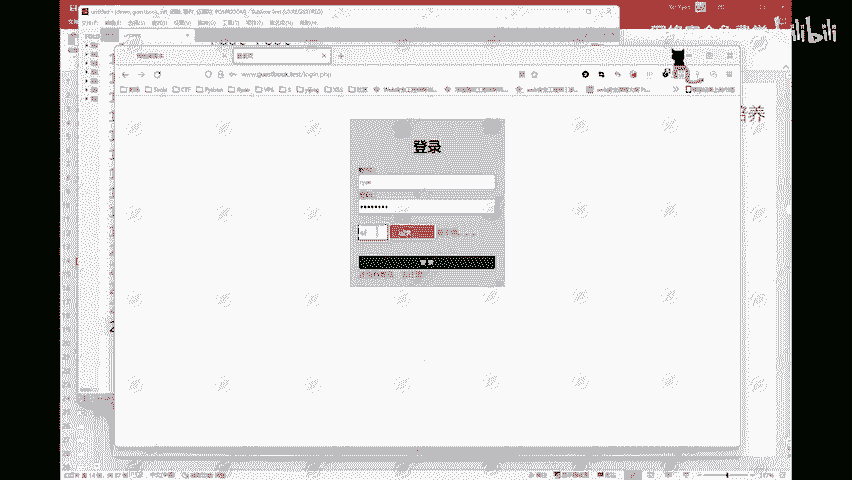
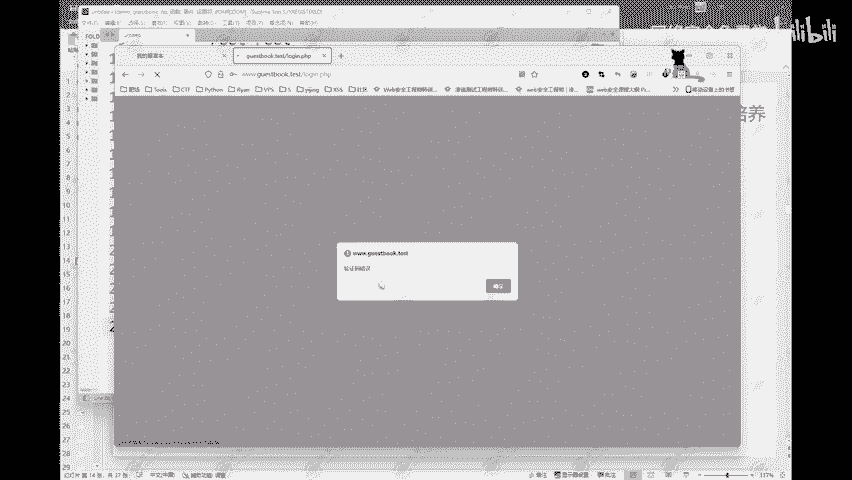
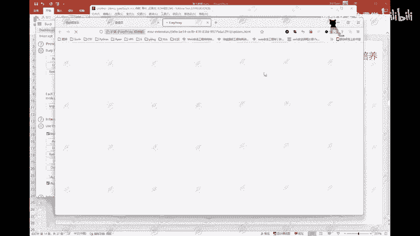
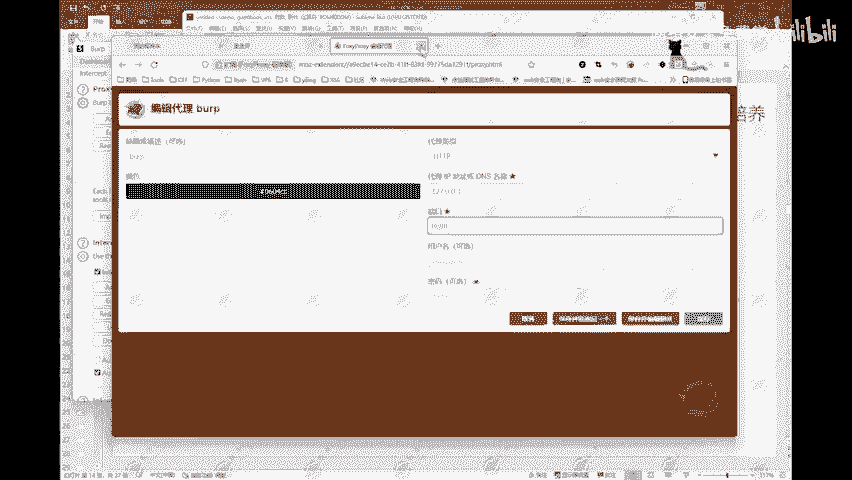
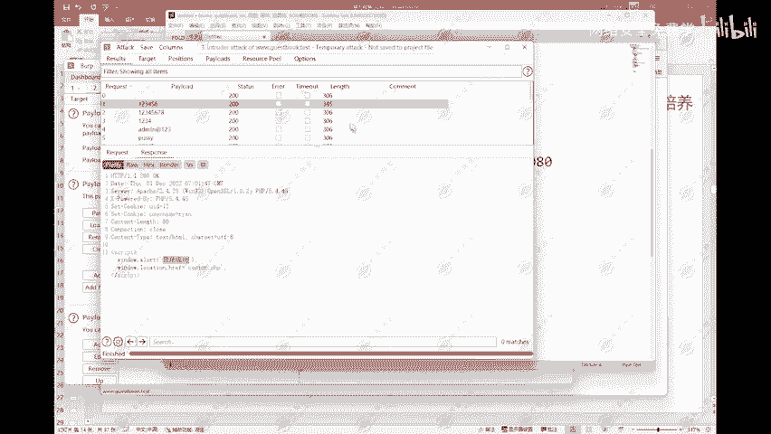

# 网络安全入门：P93：模式一：狙击手 🔫

在本节课中，我们将学习如何使用Burp Suite的“狙击手”模式进行暴力破解攻击。我们将从设置代理、抓取数据包开始，逐步讲解如何配置攻击字段、加载密码字典，并最终分析结果以找到正确的密码。

---

## 设置工作环境



上一节我们介绍了暴力破解的基本概念，本节中我们来看看如何搭建实战环境。



首先，需要启动渗透测试环境。打开Kali Linux中的DVWA靶场并确保其正常运行。

然后，访问靶场的留言本登录页面。该页面包含用户名、密码和图形验证码输入框，所有功能均正常。

同时，打开Burp Suite软件，准备进行抓包操作。

---

## 理解Burp Suite工作原理

在开始配置之前，理解Burp Suite如何工作至关重要。

正常情况下，用户浏览器直接与服务器通信。流程简化如下：
1.  客户端浏览器向服务器发送请求。
2.  服务器处理请求并返回响应。

当使用Burp Suite时，它作为代理介入通信流程：
1.  浏览器配置代理，将所有请求发送到Burp Suite。
2.  Burp Suite拦截请求，可以查看、修改或转发。
3.  修改后的请求被发送到服务器。
4.  服务器返回的响应也经过Burp Suite再传回浏览器。

这个过程类似于传纸条时经过一个中间人，他可以查看并修改纸条内容。

---

## 配置代理与抓包



理解了原理后，现在开始实战配置。以下是具体操作步骤：



第一步，设置浏览器代理。代理地址为 `127.0.0.1`，端口为 `8080`。此配置需与Burp Suite的监听设置一致。

第二步，在Burp Suite中确认代理监听已开启（状态为“on”）。

第三步，在登录页面输入测试账号（如 `admin`）、错误密码和验证码，点击登录。

此时，Burp Suite的“Proxy”模块会拦截到登录请求的数据包。

---

## 分析请求与绕过验证码

抓取到数据包后，我们需要分析其结构。

该请求是一个POST请求，主要参数包括 `username`、`password` 和 `code`（用户输入的验证码）。数据包Header中的Cookie包含一个 `code` 值，这是服务器生成的验证码。

以下是验证码校验的逻辑：
```python
if cookie_code == user_input_code:
    # 进行账号密码验证
else:
    return “验证码错误”
```

通过Burp Suite的“Repeater”模块，我们可以修改请求。将 `user_input_code` 的值改为与Cookie中的 `code` 一致，即可绕过验证码校验，直接测试账号密码。

---

## 使用狙击手模式进行爆破

绕过验证码后，我们进入核心环节——使用“Intruder”模块的“Sniper”模式进行密码爆破。

以下是配置爆破攻击的完整步骤：

**第一步，发送到爆破模块。** 在拦截的请求上右键，选择“Send to Intruder”。

**第二步，设置攻击位置。** 在“Positions”标签页，点击“Clear”清除所有默认标记。然后选中密码参数的值，点击“Add”将其设为攻击目标。

**第三步，选择攻击模式。** 在“Attack type”中选择“Sniper”（狙击手）模式。此模式适用于对单个字段（如密码）进行字典爆破。

**第四步，配置攻击载荷。** 切换到“Payloads”标签页。载荷类型选择“Simple list”。点击“Load”按钮，导入准备好的密码字典文件（如 `password.txt`）。

**第五步，开始攻击。** 点击“Start attack”按钮，Burp Suite将使用字典中的每个密码发起请求。

---

## 分析爆破结果

攻击完成后，我们需要在结果列表中找出成功的请求。

关键在于分析服务器的响应。通常，登录失败和成功的响应长度或内容会不同。在结果列表中，可以按“Length”或“Status”排序，寻找与众不同的条目。

对于本例，查看响应内容包含“登录成功”的请求，其对应的“Payload”列即为正确的密码。



“狙击手”模式不仅可用于破解密码，同样适用于破解图形验证码、短信验证码等单个未知字段。

---

## 总结

本节课中我们一起学习了Burp Suite“狙击手”攻击模式的全流程。我们从设置代理抓包开始，分析了HTTP请求结构并绕过客户端验证，最后配置并执行了针对密码字段的字典爆破攻击，并通过分析响应结果确定了有效密码。

“狙击手”模式是暴力破解中最基础、最常用的模式，掌握它是学习Web安全测试的重要一步。