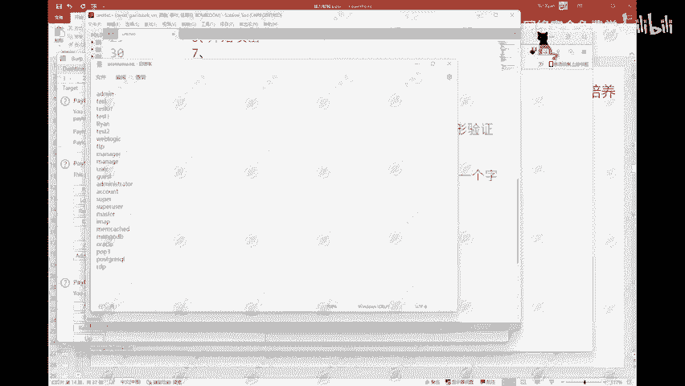
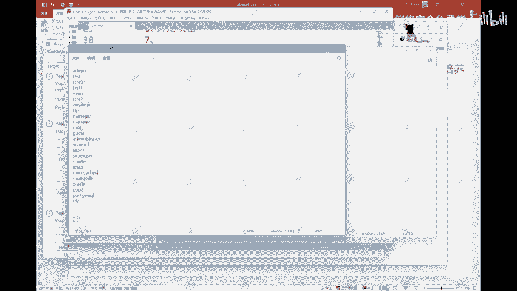

# 网络安全入门：P95：模式三：草叉

在本节课中，我们将要学习Burp Suite Intruder模块的第三种攻击模式——**草叉模式**。这种模式适用于需要同时为多个参数（例如用户名和密码）配对使用不同字典的场景。

## 🧩 模式原理与配置

上一节我们介绍了其他攻击模式，本节中我们来看看草叉模式的具体操作。

首先，在Intruder模块中，我们需要标记两个目标字段。在本例中，我们标记了`username`和`password`这两个参数。

标记完成后，切换到 **Payloads** 选项卡。此时，你会看到两个Payload集：**Payload set 1** 和 **Payload set 2**。它们分别对应我们标记的第一个字段（`username`）和第二个字段（`password`）。

接下来，我们需要为这两个Payload集分别加载对应的字典。

以下是配置步骤：
1.  选择 **Payload set 1**，点击“Load...”按钮，加载用户名字典文件（例如 `username.txt`）。
2.  选择 **Payload set 2**，点击“Load...”按钮，加载密码字典文件（例如 `password.txt`）。

## 🔢 请求次数计算

配置完成后，一个关键问题是：这次攻击总共会发起多少次HTTP请求？

这取决于草叉模式的核心工作逻辑：**它会按照顺序，将两个字典中的条目逐一配对使用**。

假设我们的用户名字典有24个条目，密码字典有20个条目。

那么，攻击引擎会进行如下配对：
*   用户名字典的第1项 配对 密码字典的第1项
*   用户名字典的第2项 配对 密码字典的第2项
*   ...
*   用户名字典的第20项 配对 密码字典的第20项

当较短的字典（此处是密码字典，共20项）用尽时，攻击即停止。用户名字典中多出的4个条目因为没有对应的密码条目与之配对，**会被直接丢弃**。

因此，**总请求次数等于较短字典的条目数**。在本例中，总共会发起 **20次** 请求。

## 🎯 模式特点与应用场景

这种模式的特点是**按顺序、成对地使用多个字典**。如果字典长度不一致，则以最短的字典为准，长字典中多余的部分将被忽略。

草叉模式的一个典型应用场景是**利用已知的账号密码对进行撞库测试**。

例如，历史上一些大型网站曾发生数据泄露事件，导致大量用户的账号和密码明文或哈希值被公开。安全研究人员或攻击者可能会获得这些“用户名:密码”对列表。

此时，就可以使用草叉模式，将用户名列表和密码列表分别载入，去测试目标系统上是否有用户仍未修改密码，从而发现可利用的账户。这强调了在多个平台使用相同密码的风险。

## 📝 本节总结

本节课中我们一起学习了Burp Suite Intruder的草叉攻击模式。
*   我们了解了其**按顺序配对使用多个字典**的核心机制。
*   掌握了其配置方法，即为每个标记的参数分别设置对应的Payload集。
*   理解了其**总请求数由最短字典决定**的计算逻辑。
*   认识了它在**利用已知凭证对进行撞库测试**中的实际应用。

理解不同攻击模式的适用场景，能帮助我们在渗透测试中更高效地完成各项任务。