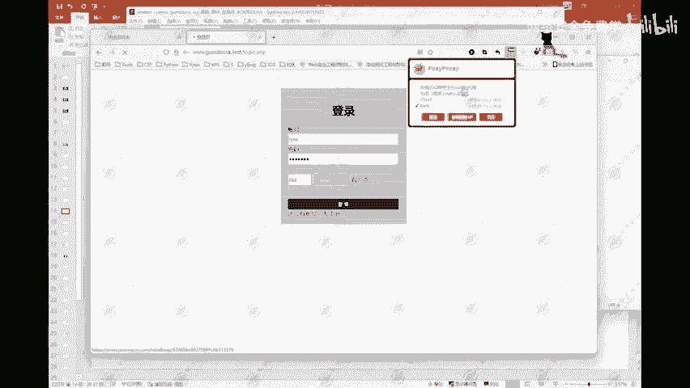
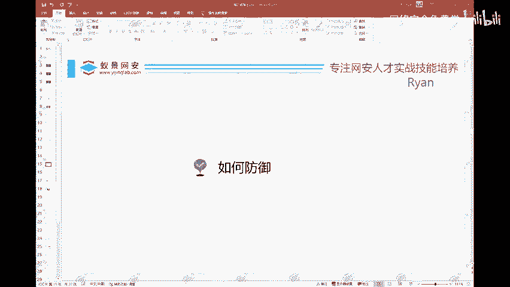

# 网络安全基础：P97：网站如何防御暴力破解




在本节课中，我们将要学习网站如何防御暴力破解攻击。上一节我们介绍了暴力破解的基本过程，本节中我们来看看从网站开发与运维的角度，可以采取哪些有效的防御措施。

## 🛡️ 防御策略概述

暴力破解攻击通过自动化工具尝试大量用户名和密码组合来入侵账户。为了抵御此类攻击，我们需要从多个层面构建防御体系。



以下是网站开发人员可以实施的核心防御措施。

## 🔐 核心防御措施

### 1. 密码密文传输与存储
当前绝大多数网站都会对用户密码进行加密处理。这包括在传输过程中使用HTTPS等加密协议，以及在服务器数据库中以密文形式存储密码。

一种常见且相对安全的做法是使用 **MD5加盐（MD5 with Salt）** 的加密方式。

**代码示例：**
```python
# 伪代码示例：MD5加盐过程
import hashlib
import os

def hash_password(password):
    # 生成一个随机盐值
    salt = os.urandom(16)
    # 将密码和盐值组合后进行MD5哈希
    hashed_password = hashlib.md5(password.encode() + salt).hexdigest()
    # 存储时，需要同时保存哈希值和盐值
    return hashed_password, salt
```
采用这种方式后，即使数据库泄露，攻击者看到的也是一串无法直接使用的哈希字符，增加了破解难度。但需注意，MD5本身存在碰撞漏洞，强密码哈希算法（如bcrypt、Argon2）是更佳选择。

### 2. 限制登录错误次数
这是防止自动化脚本尝试的有效方法。其原理是当同一账户或同一IP在短时间内连续登录失败达到设定阈值后，系统将采取限制措施。

**实现逻辑：**
- 用户登录失败。
- 系统记录失败次数和IP地址。
- 失败次数超过阈值（例如5次），则触发锁定。
- 锁定方式可以是：临时锁定账户、锁定IP地址一段时间（如15分钟）、或要求进行额外验证。

这类似于手机解锁密码输错多次后会锁定，或银行卡密码输错多次后被吞卡。

### 3. 引入二次验证
二次验证要求用户在输入密码后，完成额外的验证步骤，从而有效区分人类用户和机器程序。

以下是常见的二次验证方式：
- **图片验证码**：用户需要识别并输入扭曲的字符或完成拼图。
- **短信验证码**：系统向用户注册手机发送一次性验证码。
- **邮件验证码**：原理同短信验证码，通过邮箱发送。
- **生物识别**：如指纹识别、人脸识别（多用于移动端或高安全场景）。
- **动态令牌**：使用如Google Authenticator等应用生成随时间变化的验证码。

### 4. 锁定可疑IP地址
对于持续发起恶意登录请求的IP地址，可以直接在防火墙或Web应用防火墙（WAF）层面将其封禁，拒绝其所有访问请求。

**操作方式：**
- 通过服务器防火墙（如iptables）配置规则。
- 使用Web应用防火墙（WAF）或入侵检测系统（IDS）的自动封禁功能。
- 在应用层代码中记录异常IP并加入黑名单。

在网络攻防实战中，防守方（蓝队）经常采用此策略来快速阻断攻击源。

## 📝 总结

本节课中我们一起学习了网站防御暴力破解攻击的四种主要策略：
1.  **密码密文处理**：确保密码在传输和存储时均为加密状态，推荐使用加盐的强哈希算法。
2.  **限制错误次数**：通过设定失败阈值和锁定策略，减缓自动化攻击速度。
3.  **部署二次验证**：引入验证码、短信等多因素认证，增加攻击门槛。
4.  **封禁恶意IP**：在网络或应用层直接阻断攻击源的访问。

综合运用以上措施，可以显著提升网站对抗暴力破解攻击的安全能力。在实际开发中，应根据业务场景和安全等级，灵活组合使用这些方案。