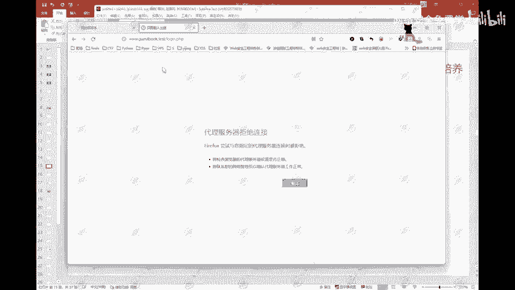
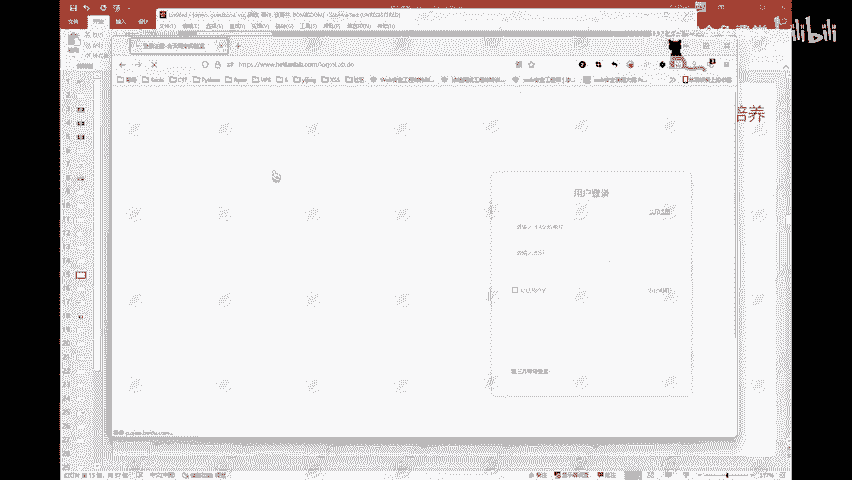

# 网络安全入门：P98：个人如何防御暴力破解 🔐

在本节课中，我们将学习个人用户如何有效防御暴力破解攻击，并了解相关的网络安全威胁，如钓鱼网站和勒索病毒。我们将从密码安全、网站使用习惯和日常上网注意事项等方面，提供简单实用的防护建议。

---



上一节我们介绍了从网站角度（如使用IPS设备）防御暴力破解。本节中，我们来看看从个人用户角度可以采取哪些具体措施。



以下是个人防御暴力破解的核心要点：

1.  **密码尽量复杂**
    密码应尽量复杂，避免使用简单的个人信息组合。例如，不要使用姓名拼音、拼音缩写、出生年月日，或简单添加`@`、`.`等符号的组合。这类密码极易被破解。

2.  **不同的网站使用不同的密码**
    据统计，约90%的用户在多个网站或社交账号上使用相同密码。这种做法非常危险。一旦某个平台的密码泄露，黑客可通过“撞库”攻击，尝试用此密码登录你的其他账户。因此，务必为不同网站设置不同密码。

3.  **定期修改密码**
    定期（例如每隔一两个月）修改密码是提升安全性的有效方法。

4.  **上网时检查域名，防止被钓鱼**
    这一点至关重要，但约99%的用户容易忽略。其原理在于：黑客可以制作出与真实网站外观**一模一样**的钓鱼页面，但**域名绝对无法相同**。

    例如，某实验室的真实域名是：
    ```
    www.hetianlab.com
    ```
    黑客可能伪造一个类似：
    ```
    www.hetianlab-login.com
    ```
    或
    ```
    www.hetian1ab.com
    ```
    的域名。如果你在钓鱼页面上输入账号密码，这些信息将直接发送给黑客，导致账户被盗。这在过去网络游戏盛行时期尤为常见，例如通过虚假的“刷枪网站”、“点卡充值”或“领奖页面”进行钓鱼。

---

除了防御暴力破解，了解常见的网络威胁也很有必要。例如，在参与CTF（夺旗赛）或遇到加密数据时，可以利用在线工具进行加解密尝试，如MD5加密、综合加密或凯撒密码加解密网站。

此外，网络安全事件频发，例如今年4月哥斯达黎加部分政府公共服务网络被迫关闭，以及微软Exchange邮件服务器遭勒索病毒攻击。

勒索病毒之所以常见，是因为其制作成本相对较低，但可能带来高额收益（赎金可达数百万甚至上亿美元）。虽然现代杀毒软件已能有效防御部分勒索病毒，但其危害依然巨大。例如，早期的“WannaCry”病毒和著名的“熊猫烧香”病毒，都能锁定或加密用户文件，导致系统无法正常使用，并索要赎金。

---

本节课中我们一起学习了个人防御暴力破解的四大要点：使用复杂密码、为不同网站设置不同密码、定期修改密码以及仔细检查域名防钓鱼。同时，我们也简要了解了勒索病毒等网络安全威胁的基本原理和危害。保持警惕并养成良好的安全习惯，是保护个人数字资产的关键。