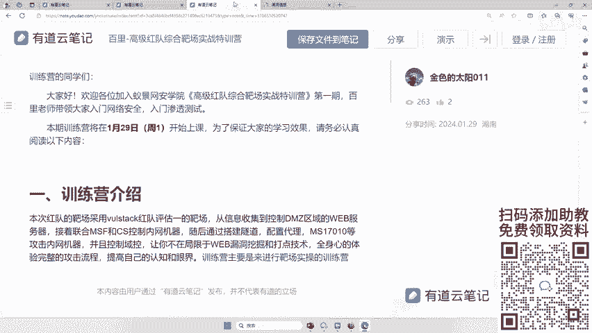
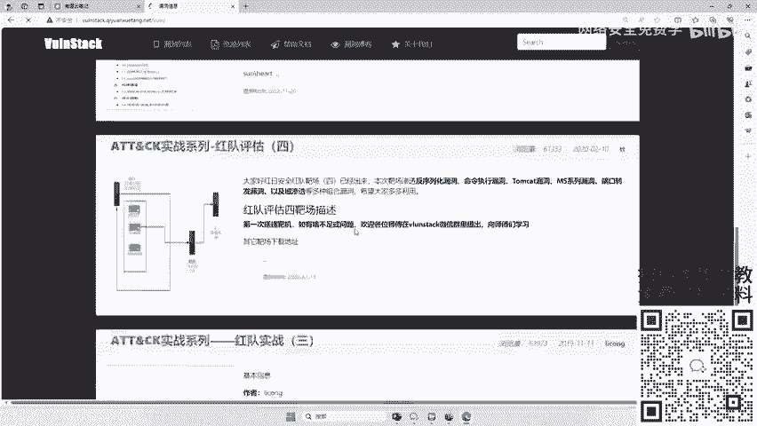
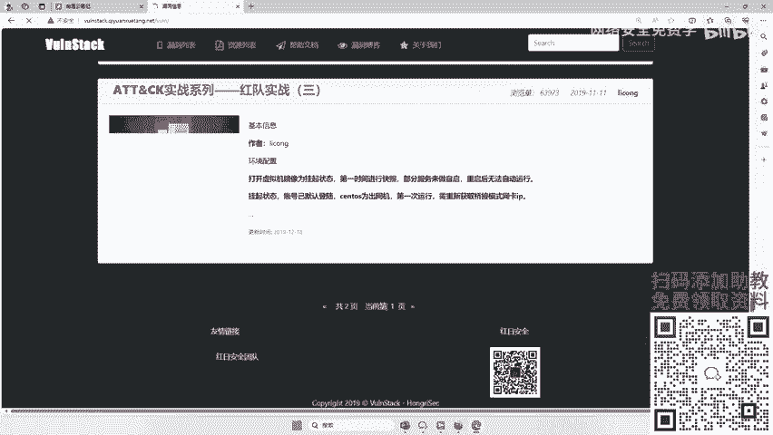
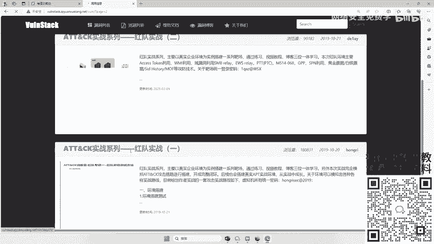
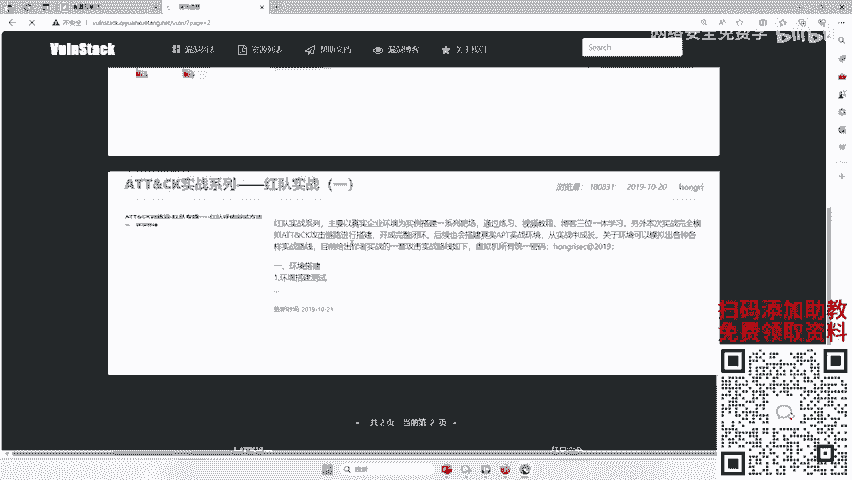
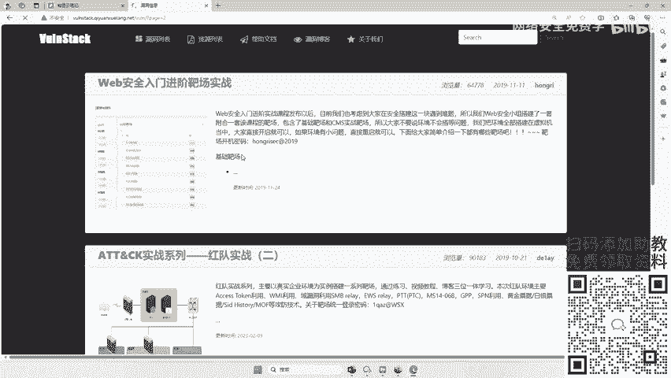
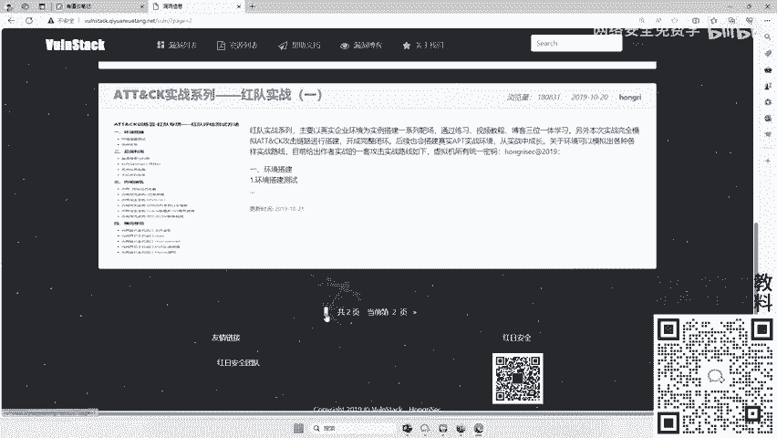
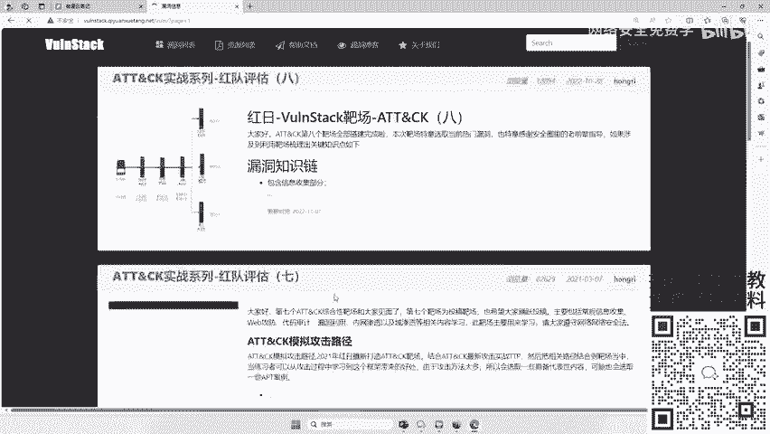
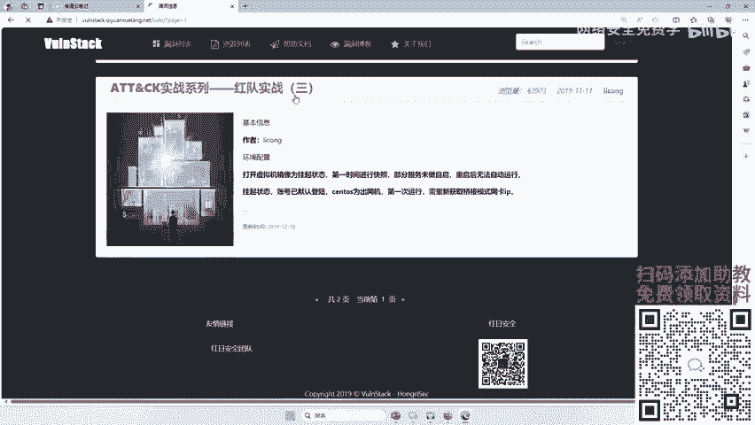
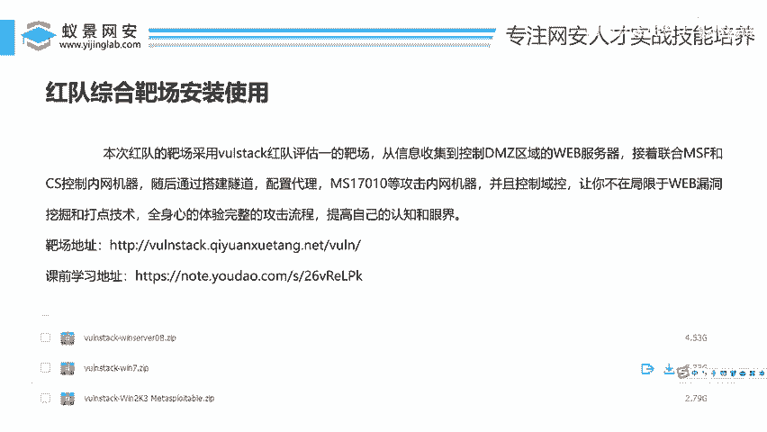

# 红队综合靶场安装使用：P99：红队综合靶场安装使用 🎯

在本节课中，我们将要学习红队综合靶场的安装与初步使用。我们将以“红日靶场”的VulnStack系列第一套环境为例，介绍其下载、部署以及基本结构，为后续的渗透测试实践打下基础。

## 靶场介绍与选择

上一节我们介绍了课程的整体安排，本节中我们来看看本次实践所使用的靶场。

本次红队靶场并非自行搭建，我们采用的是“红日安全”团队出品的VulnStack系列靶场，具体是**VulnStack-1**。这是一个综合性靶场，设计用于模拟真实的企业网络攻防环境。

该靶场涵盖从外围DMZ区到内部Web服务器，再到C2控制、隧道建立、代理转发等多个攻击阶段的知识点，能够全面考验我们的实际操作能力。相较于其他一些基础靶场，其复杂度和实战性更高。

以下是获取该靶场资源的途径：
*   **官方地址**：可以通过红日安全团队的官方渠道获取。
*   **备用下载**：也可以从讲师提供的学习笔记中下载，其中包含了VulnStack等多个靶场资源。

## 靶场系列概览

了解了VulnStack-1后，我们来看看整个系列的全貌。

VulnStack红队实战系列目前共有8套靶场环境。本次课程我们将重点讲解并使用**系列中的第一个靶场（VulnStack-1）**。

在后续的进阶训练营中，讲师会按顺序逐一讲解第2至第8套靶场。相关的教学视频也计划在互联网平台（如B站）发布，供大家持续学习。

因此，对于整个系列的学习，我们可以跟随课程计划，循序渐进地掌握。

## 靶场下载与部署

现在，我们开始进行靶场的具体下载与部署操作。

由于靶场通常以虚拟机镜像文件（如`.ova`或`.vmx`格式）提供，部署过程主要涉及导入到虚拟机软件中。以下是通用的部署步骤：

1.  **下载镜像**：从上述提供的地址下载VulnStack-1的虚拟机压缩包。
2.  **解压文件**：将下载的压缩包解压到本地目录。
3.  **导入虚拟机**：打开你的虚拟机软件（如VMware Workstation或VirtualBox）。
4.  **选择镜像**：在软件中选择“打开”或“导入”功能，定位并选择解压后得到的`.ova`或`.vmx`文件。
5.  **启动系统**：导入完成后，启动虚拟机。通常靶场会包含多个预配置好的系统（例如攻击机、靶机），需要逐一启动。

**关键点**：确保虚拟机网络模式设置正确（通常为NAT或仅主机模式），以保证攻击机与靶机之间能够正常通信。具体的IP地址信息通常会在靶场提供的`README`文档中说明。

## 总结

本节课中我们一起学习了红队综合靶场VulnStack的安装与使用入门。我们明确了本次实践将使用VulnStack-1靶场，了解了其综合性强的特点，并掌握了获取资源及部署虚拟机的基本流程。这个靶场是提升渗透测试实战能力的重要工具，建议大家在后续课程中积极动手操作。