# 网络安全入门：P9：Docker快速搭建漏洞靶场指南 🎯

在本节课中，我们将学习如何使用Docker技术快速搭建一个漏洞靶场环境。Docker是一种轻量级的容器技术，能够帮助我们快速部署和运行应用程序，非常适合用于搭建学习和测试用的漏洞靶场。

## 卡利（Kali）网络配置

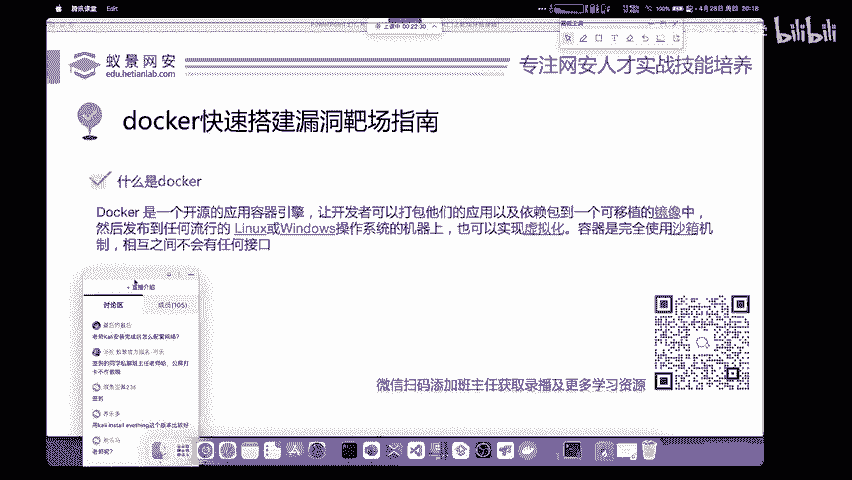

上一节我们介绍了卡利（Kali Linux）的安装。本节中，我们来看看如何配置卡利的网络。

如果你按照教程下载了免安装版本的卡利VMware镜像，其网络默认已经配置好。如果你是自己安装的卡利系统，则需要手动配置网络。

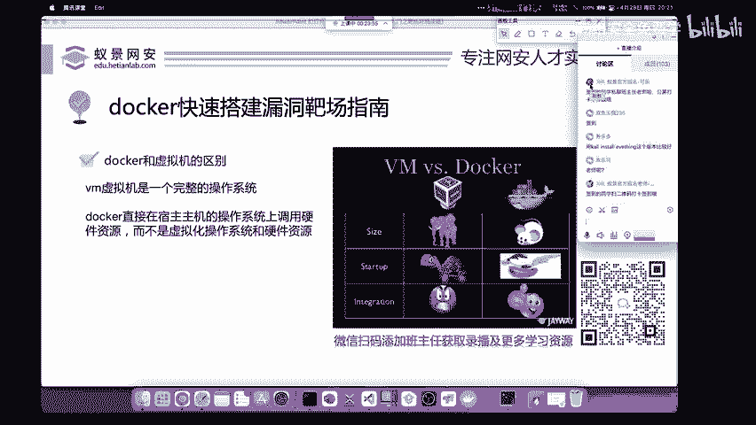

你需要访问卡利的网络配置文件地址 `/etc/network/interfaces`，根据需求配置为自动获取IP地址或使用静态固定IP地址。

## 什么是漏洞靶场？🎯

在搭建靶场之前，我们先来理解什么是漏洞靶场。就像士兵训练需要靶场一样，我们在学习攻击网站时，也需要一个安全的平台进行训练和学习。漏洞靶场就是这样一个用于模拟真实漏洞环境，供安全人员学习和测试的平台。

## Docker简介 🐳

在搭建漏洞靶场时，有多种方法。本节我们将重点介绍使用Docker的方法。Docker是当前安全面试和技术中经常提及的一项技术。

Docker是一个虚拟化容器技术。它类似于虚拟机，但有本质区别。Docker是一种较新的技术，它基于容器，将应用程序代码及其运行环境打包成一个镜像，然后运行在宿主机操作系统（如Linux或Windows）上，从而实现虚拟化。

### Docker与虚拟机的区别

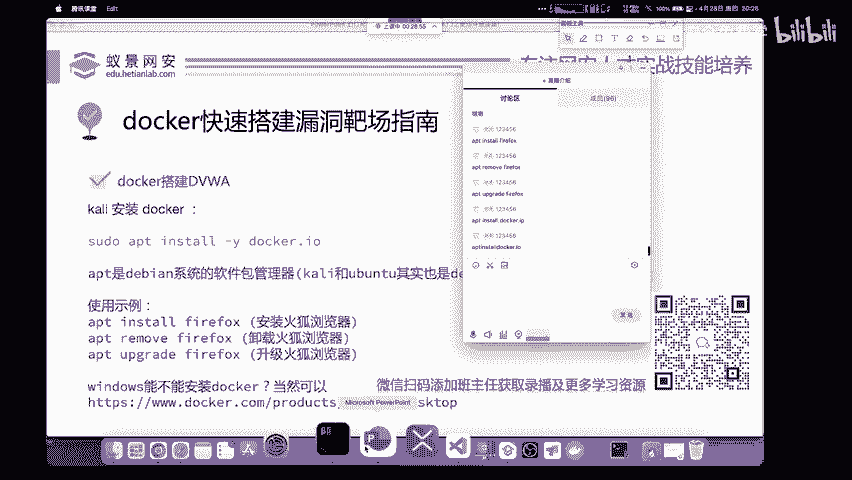

理解Docker时，必须清楚它与虚拟机的区别。

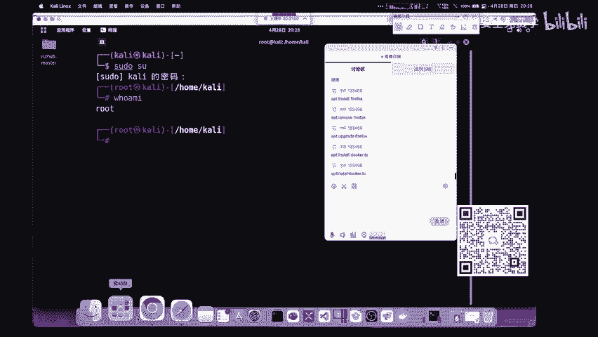

从架构图可以看出，VMware等虚拟机是一个完整的操作系统。如果你正确配置了虚拟机，甚至可以在里面玩游戏，因为它虚拟了完整的硬件驱动。而Docker只是一个轻量级的容器，它不是一个完整的操作系统，内部只包含应用程序运行所需的代码和环境。你无法在Docker容器内安装驱动或其他应用程序。

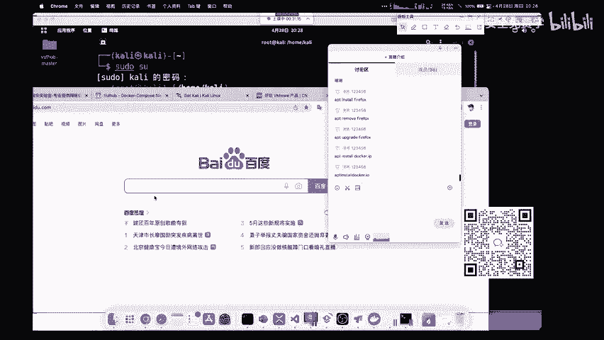

Docker相对于虚拟机的优势在于其轻量化。它的启动速度非常快，虚拟机启动可能需要几分钟，而Docker容器通常只需一两秒即可启动。

## 实战：使用Docker搭建DVWA靶场 🛠️

下面我们将进行实际操作，使用Docker搭建一个漏洞靶场。我们选择在安全领域广为人知且必须掌握的DVWA（Damn Vulnerable Web Application）作为演示。

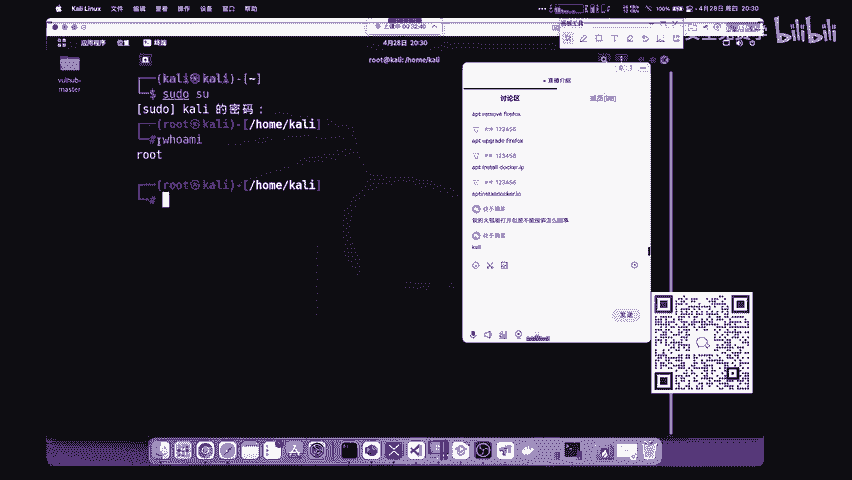

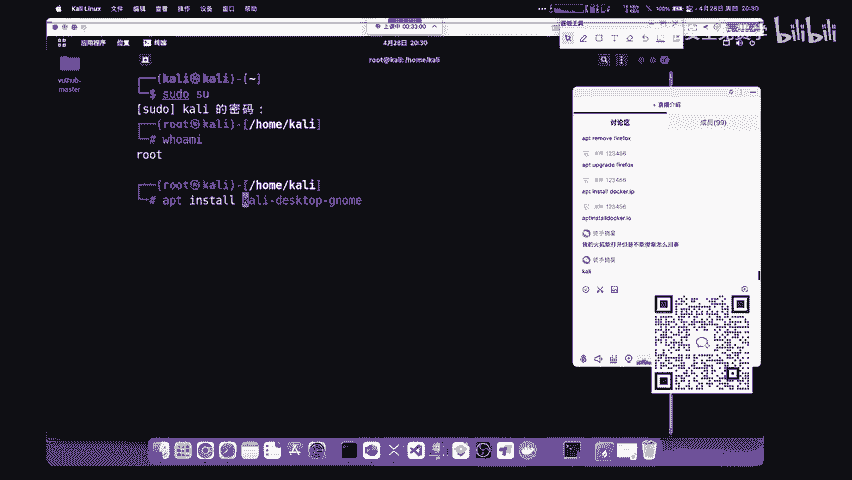

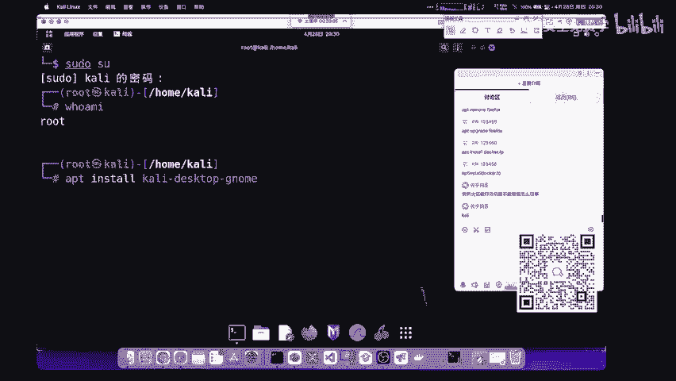

### 第一步：安装Docker

首先，你需要在你的电脑上安装Docker。

**安装位置**：你可以选择将Docker安装在卡利虚拟机内，也可以直接安装在你的宿主机（Windows/Mac）上。

**在卡利中安装Docker**：
卡利系统使用 `apt` 作为软件包管理器，它类似于手机的应用商店，可以方便地下载、安装和管理软件。

以下是 `apt` 的常用命令：
*   `apt install [软件名]`：安装软件。
*   `apt remove [软件名]`：卸载软件。
*   `apt upgrade [软件名]`：升级软件。

在卡利中安装Docker，需要使用管理员权限。以下是具体步骤：

1.  切换到root用户：执行命令 `sudo su`，然后输入卡利默认密码 `kali`。
2.  使用 `apt` 安装Docker：执行命令 `apt install -y docker.io`。参数 `-y` 表示自动确认安装提示。
3.  验证安装：安装完成后，输入 `docker` 命令。如果显示Docker的帮助文档，则证明安装成功。

**在其他系统安装Docker**：
对于Windows、Mac或其他Linux发行版，你可以访问Docker官方网站，下载对应的桌面版或社区版进行安装。

**关于Docker与VMware的兼容性**：
有同学提到Docker和VMware不能同时安装的问题。这在VMware Workstation 16及以上版本中已经得到解决。只要使用最新版本的软件，通常不会有此问题。

### 第二步：配置Docker镜像加速器

Docker默认从国外网站拉取镜像，速度可能较慢。我们可以配置镜像加速器来提升下载速度。

国内许多云服务商（如阿里云、腾讯云）都提供免费的Docker镜像加速服务。配置方法很简单：只需在搜索引擎中搜索“Docker镜像加速器”，就能找到许多解决方案和配置教程。

### 第三步：拉取并运行DVWA镜像

Docker的核心操作并不复杂，对于网络安全学习而言，掌握基本操作以满足搭建靶场需求即可。

以下是搭建DVWA靶场的步骤：

1.  **启动Docker服务**（如果在卡利中）：执行命令 `systemctl start docker`。
2.  **拉取DVWA镜像**：执行命令 `docker pull vulnerables/web-dvwa`。这条命令会从Docker仓库下载DVWA镜像。
3.  **运行DVWA容器**：执行命令 `docker run --rm -it -p 80:80 vulnerables/web-dvwa`。这条命令会启动一个DVWA容器，并将容器的80端口映射到本机的80端口。

**注意**：如果本机的80端口被占用（例如，Apache服务正在运行），需要先停止占用端口的服务。在卡利中，可以执行 `systemctl stop apache2` 来停止Apache。

### 第四步：访问并配置DVWA

容器运行成功后，即可通过浏览器访问靶场。

1.  打开浏览器，访问 `http://127.0.0.1`。
2.  使用默认用户名 `admin` 和密码 `password` 登录。
3.  首次登录会进入安装页面，滚动到页面底部，点击 **Create / Reset Database** 按钮，完成数据库初始化。
4.  再次使用 `admin` / `password` 登录，即可进入DVWA主界面。

### 第五步：DVWA基本使用

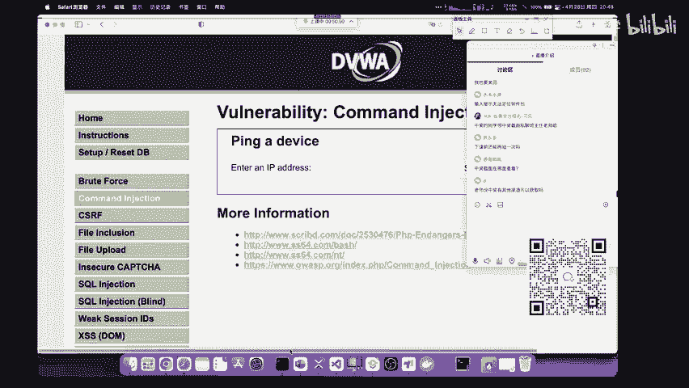

在DVWA主界面左侧是漏洞列表，涵盖了常见的Web漏洞类型，如：
*   Brute Force（暴力破解）
*   Command Injection（命令注入）
*   CSRF（跨站请求伪造）
*   File Inclusion（文件包含）
*   File Upload（文件上传）
*   SQL Injection（SQL注入）
*   XSS（跨站脚本攻击）

在页面底部，可以点击 **DVWA Security** 来调整安全等级（Low, Medium, High, Impossible）。建议从 **Low** 级别开始学习，逐步提升难度，并最终通过 **Impossible** 级别学习漏洞的防御方法。

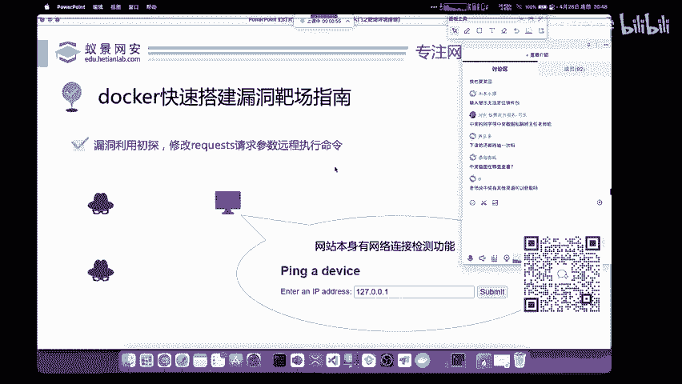

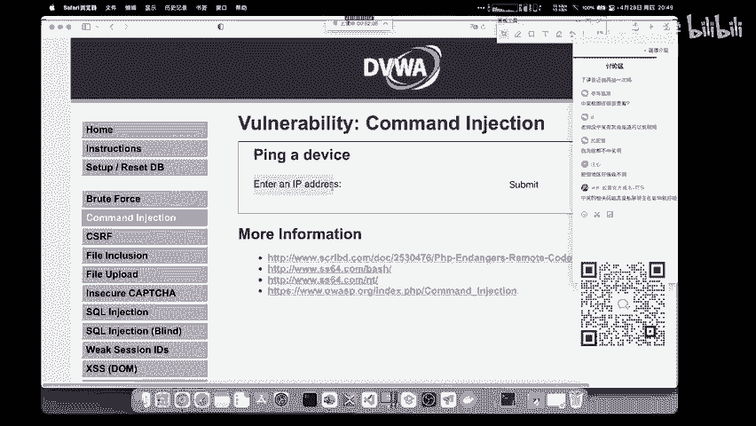

## 漏洞原理浅析：以命令注入为例 🔍

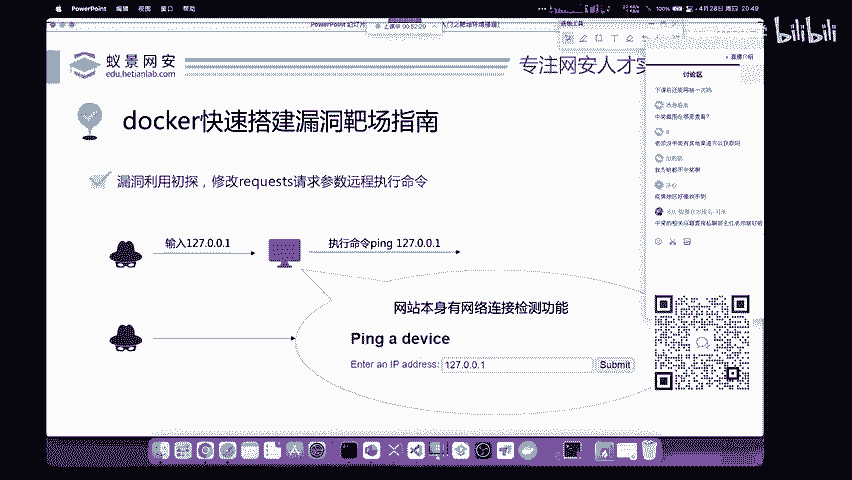

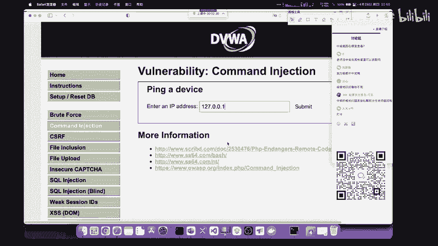

为了帮助理解，我们以DVWA中的“Command Injection”（命令注入）漏洞为例，简单分析其原理。

该页面的正常功能是让用户输入一个IP地址，然后测试本机与该IP的网络连通性（即执行 `ping` 命令）。

**正常操作**：输入 `127.0.0.1`，网站后台执行 `ping 127.0.0.1`。

**攻击思路**：黑客试图改变程序原有的执行逻辑。利用命令连接符（如 `&&`、`&`、`|` 等），可以在原有命令后拼接额外的恶意命令。

**攻击演示**：
1.  在输入框中输入：`127.0.0.1 && whoami`
2.  网站后台实际执行的命令变为：`ping 127.0.0.1 && whoami`
3.  结果不仅显示了ping的结果，还执行了 `whoami` 命令，并返回了当前系统用户信息。

**潜在危害**：如果攻击者拥有足够权限，可以拼接更具破坏性的命令，例如删除文件、下载木马、反弹Shell等，从而完全控制服务器。

**漏洞本质**：所有漏洞几乎都源于同一原理——**攻击者能够改变程序原有的、预期的执行逻辑**。理解这一点，对学习任何类型的漏洞都有极大帮助。

## 更多学习资源：Vulhub 🚀

除了DVWA，还有一个强大的漏洞靶场环境集合推荐给大家——**Vulhub**。

Vulhub是由国内知名安全研究员（P牛）维护的项目，它提供了大量常见漏洞环境的Docker一键搭建脚本和详细复现教程。通过复现历史上真实的漏洞，你可以站在巨人的肩膀上，快速积累实战经验。

## 总结 📚

本节课中我们一起学习了：
1.  **Docker的基本概念**：它是一种轻量级容器技术，用于快速部署应用环境。
2.  **使用Docker搭建DVWA漏洞靶场**：包括安装Docker、配置加速器、拉取镜像、运行容器及初始配置。
3.  **漏洞原理初探**：以命令注入为例，理解了漏洞源于“改变程序原有执行逻辑”这一核心思想。
4.  **拓展资源**：介绍了Vulhub项目，作为后续深入学习漏洞复现的优秀平台。

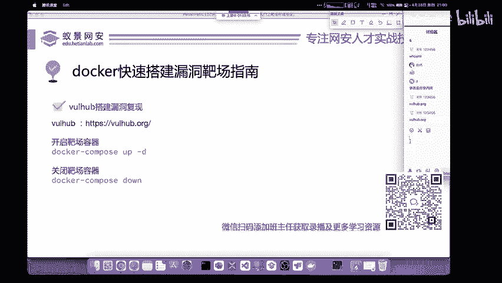

通过本课的学习，你已经掌握了快速搭建个人渗透测试实验环境的方法，这是迈向网络安全实践的重要一步。接下来，就可以在安全的靶场环境中尽情练习各种安全技术了。