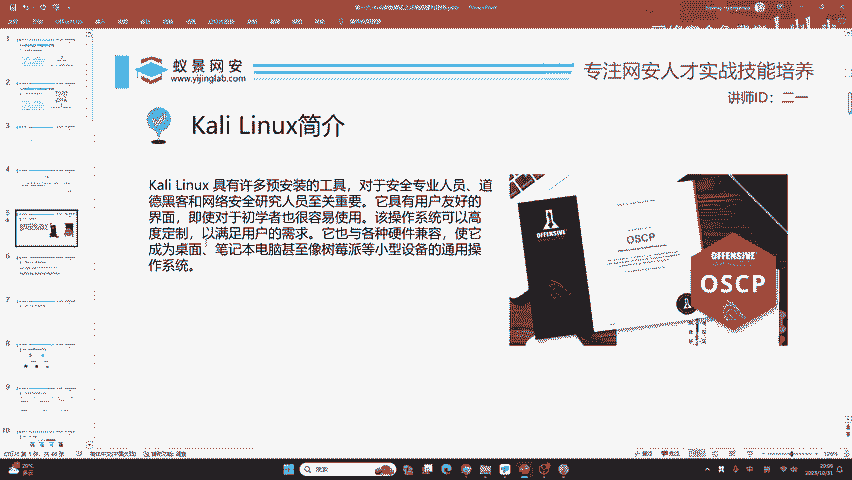
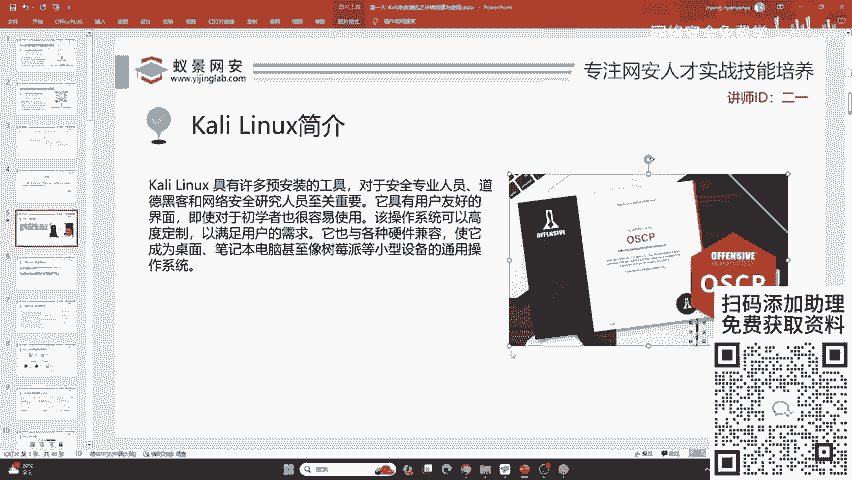
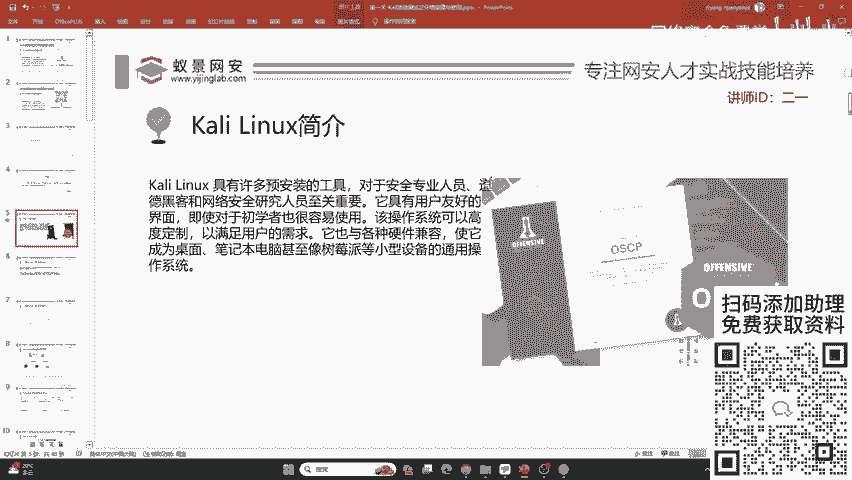
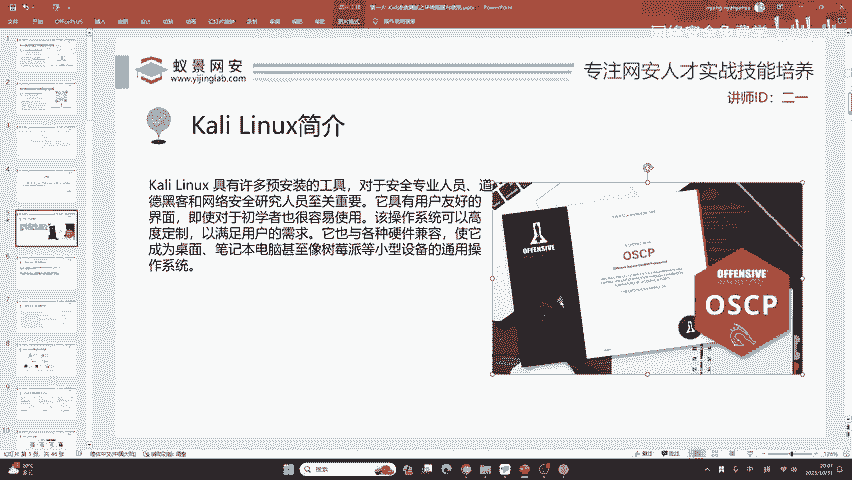
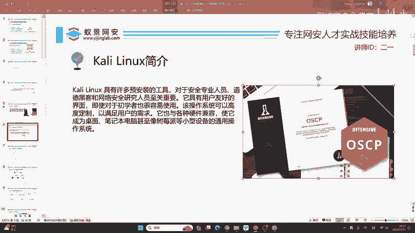

# 2024B站最值得看的黑客教程 ｜ 网络安全／渗透测试／内网渗透／漏洞挖掘／web安全／kali linux／红队靶场／CTF／信息安全 - P14：Kali Linux介绍 - 网络安全免费学 - BV1uBsTetEow

首先呢先以一句话概括一下卡里琳琳克斯。卡里利尼克斯呢它对我们的帮助非常大。首先呢它里面预安装了非常多的工具，这些工具啊说实话基本上都没有用。

没有用，我们为什么还要学习它呢？第一个它是网络安全的大门，我们需要打开它。其次呢这些工具都是开源的非常著名的工具。我们所使用的比较新颖的技术，包括比较高端的技术。

都是借鉴于它在它的基础上进行丰富和拓展的同时呢这个卡lylinux它是有一定的技术底蕴的。它是由世界顶级的网络安全公司，这个叫做off save所开发的一个linux操作系统。

那这个off save呢它也有一个国际认证证书，叫做OSCP如果你已经工作了有工作经验，那获取一个OSCP的证书。对于实现自己的安全高级岗位，包括对找一些境外的工作是非常有帮助的。啊。

所以说呢这个咖lylinux是值得一学。

下面我们继续来看。

