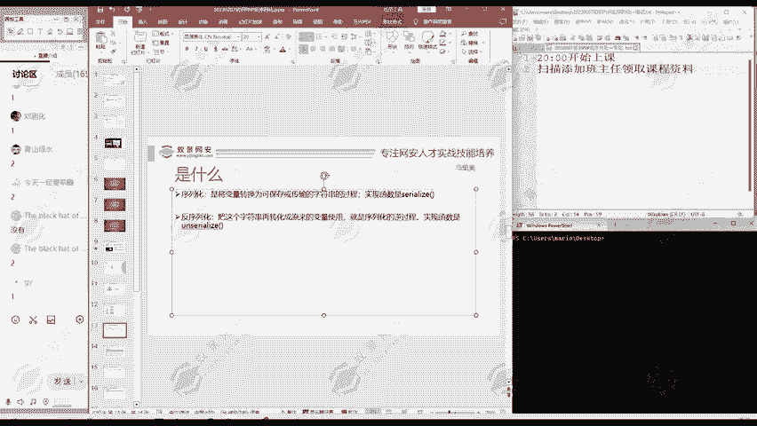
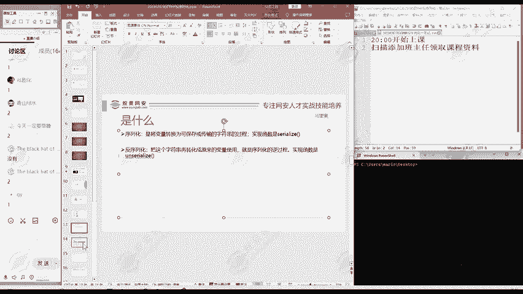

# 2024B站最值得看的黑客教程 ｜ 网络安全／渗透测试／内网渗透／漏洞挖掘／web安全／kali linux／红队靶场／CTF／信息安全 - P163：序列化和反序列化是什么意思？ - 网络安全免费学 - BV1uBsTetEow

这个序拟化和反序化是什么意思？

首先看一下序列化。序拟化呢就是将变量转换为可以保存或者是方便传输的字符串的一个过程。

说白了就是把变量转化成一个字符串。

那反序列话呢，它就反过来就把这个字符串再转化成原来的变量。😊。

它就是一个虚拟化的例过程。

那么我们知道概念之后。

怎样进行这个序拟化和反序拟化呢？我们这里啊进行一个演示。😊。

