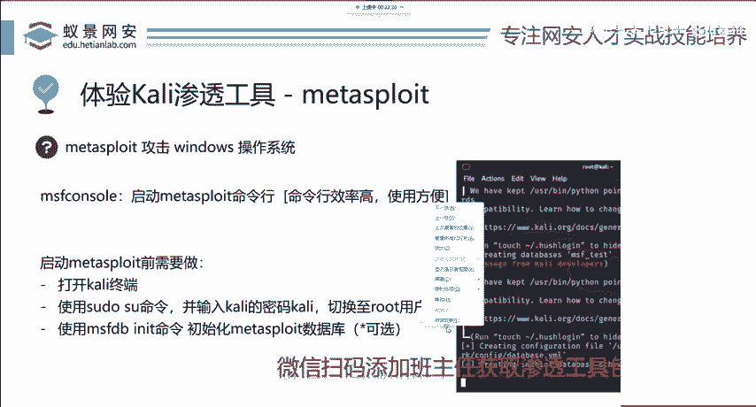

# 2024B站最值得看的黑客教程 ｜ 网络安全／渗透测试／内网渗透／漏洞挖掘／web安全／kali linux／红队靶场／CTF／信息安全 - P87：kali最强渗透工具--Metasploit - 网络安全免费学 - BV1uBsTetEow

那这个工具是干啥的？它其实就是涵盖了渗透测试的每一个功能，就包括对目标系统的信息收集。对目标可能存在安全隐患漏洞的扫描检测。对漏洞的攻击，以及对漏洞攻击之后深入的利用扩大化内网渗透预渗透的一些操作。

一些利用脚本都集成在了MSF这个工具中。那MSF在它的初衷就是让复杂的漏洞攻击流程变得非常简单。那一个电脑小白经过不说几个小时啊，就是就说半个小时的学习，你就能够去攻击一些操作系统或者是网站的。

并且你拿下来的网站在互联网中是不计其数的就是非常多。请大家注意啊，不要攻击国内，尤其是政府和事业单位的网站。即使他没有漏洞，你也不要。去测试OK那下面呢我们就给大家讲MSF应该如何使用。

这个使用方法是非常简。简单的。首先呢我们可以打开卡里的终端，也就是terminal啊，打开这个终端。

打开终端的方法，刚刚已经讲过了，打开之后你发现啊它字符比较小，那这时候你可以按住键盘上面的三个按键，分别是conttrol shift，还有加号键。这三个键盘，你同时按下去就可以把它放大了。

缩小的话是两个键是controrl，加上减号键，这两个按键按下去就可以把它缩小是非常方便的。这个功能同样适用于其他的linux操作系统以及部分的。编程语言开发IDE组件。大家呢在一些呃开发界面。

你也可以尝试这些按件，也可以将它放大。那在这个地方呢，我们首先第一步就是将卡的用户切换至超级管理员root用户。在这个地方我们输入s度U然后回车。

它会让跳出一个选项叫做让你输入pasword for卡里就是卡里用户的密码，默认还是卡利那在这个时候我们输入完成，然后回车就行。因为linux的保护机制，我们在输入用户密码的时候。

linux上面是不会出现任何的显示的，它不显示不代表你不能输入，就像你去ITM取钱的时候，银行卡插进去，你输入的密码会立即变为新号。虽然它是新号，但是呢这是IM后端程序的对密码的保护linux也是如此。

我们切换至root用户之后就能够使用今天的工具了。在使用时候呢就能够避免一些由于公积机权限不足而。造成的一些报错以及无法执行的情况。在这里我们只需要输入一个指令，打开 meta split。

叫做MSF consolel。cso的意思呢，我们在学习路由器路由器交换机的同学应该都知道conl口是什么，其实就是一个管理接口。那MSF呢就是mattapir framework的简称。

我们只需要输入这个简单的命令，就可以打开MSF66代表它的大版本。如果你是MSF5的话，可能和今天的这个讲课课程内容有一点不一样。但是大差不差，你可以选择更新为最新版本。

有同学知道的话，你就知道不知道的同学，我现在给你讲你红之蓝是啥。永恒之蓝是在2017年windows一个默认的服务应用程序叫做SMB服务。中文意思叫windows默认文件共享和打印机文件共享服务。

默认开启在TCP逻辑端口445，所有的微软操作系统都有这个服务。那这个服务呢在2017年的时候爆出了一个远程命令执行漏洞。也就是说呢，黑客不需要任何的这个权限，只需要对相应的漏洞进行攻击。

即可获取目标机器的最高权限，造成一个啊不可挽回的危害。那这个永恒之蓝呢最后在5月份的时候，被一些非法的IP组织制作了镇静世界的勒索病毒。那右边这个图片，我相信每一个同学都应该见过啊，都应该见过。

这是永恒之然漏洞。那永恒之然漏洞呢，它是属于windows应用服务的缓冲区溢出漏洞。如果你想分析或自己去写漏洞攻击脚本去攻击的话，是难上加难。对于我们渗透测试工程师来说，这一点工作你千万不要去做。

除非你之后想转岗转到漏洞的分析或者是安全研究方向的工作，你再去接触这个方向啊，我们先把渗透测试学好来解答。

