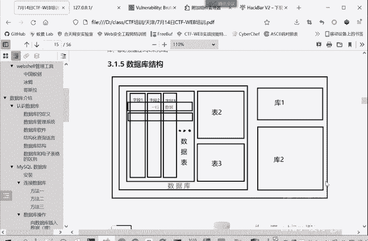
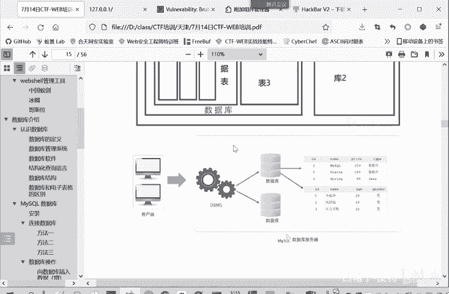
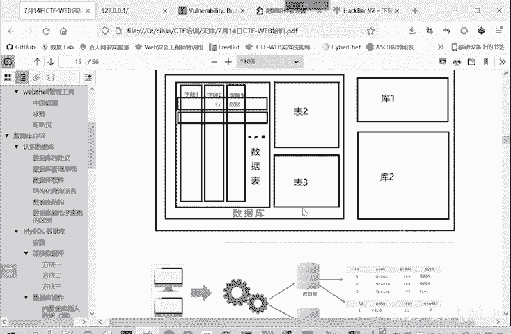
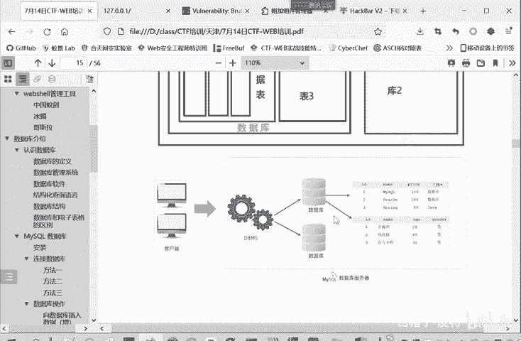
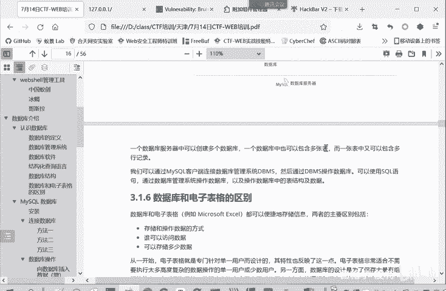

# CTF入门教程：P11：web-数据库结构 🗃️

在本节课中，我们将要学习数据库的基本结构。理解数据库的层次和组织方式是进行Web安全测试，尤其是SQL注入相关挑战的基础。

## 概述

数据库系统，或称数据库管理系统（DBMS），负责管理多个数据库。一个数据库服务器中可以包含多个数据库，每个数据库内部又包含许多数据表。

## 数据库的层次结构

上一节我们介绍了数据库系统的概念，本节中我们来看看一个数据库内部的具体构成。

一个数据库服务器包含多个数据库。这类似于在一台电脑上可以创建多个独立的文件夹来存放不同项目的数据。

每个数据库内部包含多张数据表。数据表是实际存储数据的基本单位。

每张数据表由行和列构成。你可以将其理解为一个Excel表格。列定义了数据的字段（如姓名、年龄），而行则存储了每条具体的记录。

以下是数据库核心结构的总结：
*   **数据库服务器**：运行数据库管理系统的物理或逻辑服务器。
*   **数据库**：一个逻辑上的数据集合，包含多张相关的表。
*   **数据表**：存储特定类型数据的结构化表格。
*   **字段（列）**：数据表中的每一列，代表一种属性（如 `id`, `name`, `age`）。
*   **记录（行）**：数据表中的每一行，代表一条完整的数据条目。




## 数据库的访问模型

理解了静态结构后，我们来看看动态的访问过程。这有助于我们明白应用程序是如何与数据库交互的。

客户端（如一个Web应用程序）通过数据库管理系统（例如 **MySQL**）来访问某个具体的数据库。

客户端可以指定要操作数据库中的哪一张表。

对于选定的表，客户端能够对其中的记录进行查看、修改、删除或新增等操作，即常说的“增删改查”（CRUD）。




## 结构总结

以上两种图示表达的内容是一致的，只是从不同角度（静态结构与动态访问）来呈现，以帮助大家更好地理解。




因此，我们可以将数据库的结构归纳为以下关系：
*   一个**数据库服务器**中有多个**数据库**。
*   一个**数据库**中有多张**表**。
*   一张**表**中有多个**字段**和多条**记录**。




## 核心概念公式

我们可以用以下伪代码来描述这个层次结构：
```
数据库服务器 {
    数据库1 {
        表1 {
            字段1， 字段2， ...
            记录1， 记录2， ...
        }
        表2 { ... }
    }
    数据库2 { ... }
}
```




## 本节课总结

本节课中我们一起学习了数据库的基本结构。我们了解了从数据库服务器到数据库、数据表、字段和记录的层次关系，也知道了客户端通过数据库管理系统访问数据的流程。掌握这些概念是后续学习SQL语言和SQL注入漏洞的坚实基础。