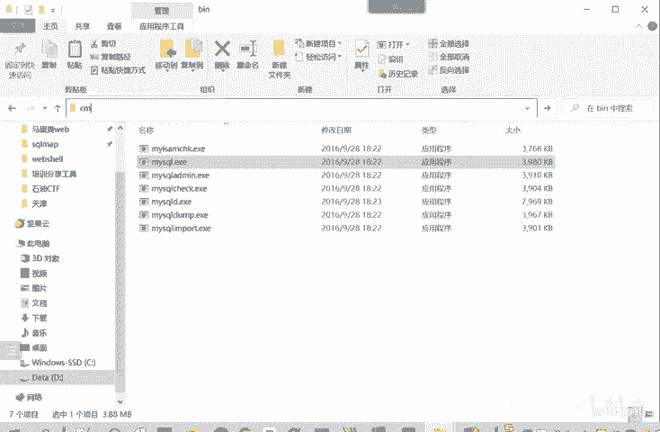
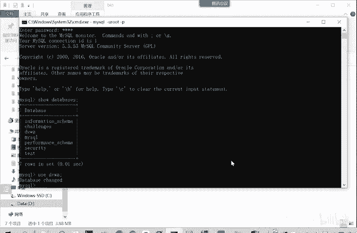
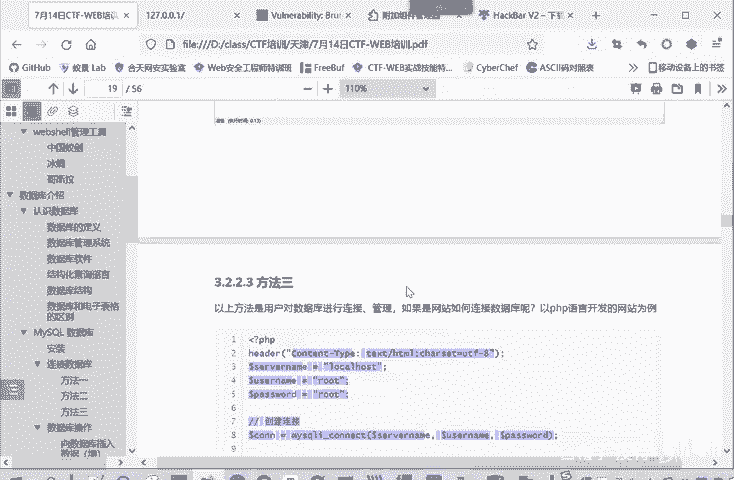

# CTF入门教程：P14：web-连接数据库 🗄️

在本节课中，我们将学习如何连接MySQL数据库。连接数据库是Web应用开发和安全测试中的基础操作，掌握多种连接方式对于后续的CTF-Web挑战至关重要。我们将介绍三种主要的连接方法：命令行工具、图形化软件以及通过PHP代码连接。

## 命令行工具连接

上一节我们介绍了如何启动数据库，本节中我们来看看如何使用命令行工具进行连接。

在PHPStudy的安装目录下，可以找到MySQL相关的工具。具体路径为 `PHPStudy\MySQL\bin`。其中包含一个名为 `mysql.exe` 的可执行文件，我们可以通过这个程序来连接MySQL数据库。

以下是使用命令行连接数据库的步骤：



1.  打开命令提示符或终端。
2.  导航到 `mysql.exe` 所在的目录。
3.  输入连接命令：`mysql -u 用户名 -p`。
4.  按回车后，系统会提示输入密码。
5.  输入正确的密码后，即可成功连接到数据库服务器。

连接成功后，会看到MySQL的命令行提示符 `mysql>`。此时，可以执行SQL命令来操作数据库。

例如，可以输入 `show databases;` 来查看服务器上有哪些数据库。接着，可以使用 `use 数据库名;` 命令来切换到特定的数据库（例如 `use dvwa;`）中进行操作。

这就是第一种连接方式：通过命令行工具进行连接和管理。

## 图形化软件连接



除了命令行，我们还可以使用图形化界面软件来连接和管理数据库，这种方式更为直观。

PHPStudy自带了一个名为 `MySQL-Front` 的数据库管理软件。启动该软件后，首次连接需要创建一个新的连接配置。

以下是创建新连接的步骤：

1.  输入一个任意的连接名称。
2.  连接地址填写本地地址：`localhost` 或 `127.0.0.1`。
3.  输入正确的数据库用户名和密码。
4.  保存配置。

之后每次连接时，只需选择已保存的配置即可快速登录。连接成功后，在软件界面中可以清晰地看到所有数据库。例如，`dvwa` 数据库包含 `guestbook` 和 `users` 两个表，可以方便地查看和编辑表中的数据。

当然，PHPStudy也提供了基于网页的数据库管理工具 `phpMyAdmin`，它同样可以用于连接和操作数据库。不过，对于日常管理和学习，图形化客户端软件通常更为方便。

## 通过PHP代码连接

以上两种方法都是开发者或管理员直接对数据库进行操作。那么，当一个网站需要为访问它的用户查询数据时，程序自身是如何连接数据库的呢？

这就涉及到在编程语言中连接数据库。我们以PHP语言为例，其他如JSP等语言原理类似。核心在于使用数据库连接函数。

在PHP中，可以使用 `mysqli_connect()` 函数来建立连接。你需要提供数据库服务器的地址、登录用户名和密码。

以下是一个基本的连接代码示例：

```php
<?php
$servername = "localhost";
$username = "your_username";
$password = "your_password";
$dbname = "your_database";

// 创建连接
$conn = mysqli_connect($servername, $username, $password, $dbname);

// 检查连接是否成功
if (!$conn) {
    die("连接失败: " . mysqli_connect_error());
}
echo "连接成功";
?>
```

这段代码定义了连接所需的参数，并尝试建立连接。如果连接失败，会输出错误信息；如果成功，则继续执行后续的数据库操作。这是网站开发中最常用的连接方式。

## 总结



本节课中我们一起学习了三种连接MySQL数据库的方法：
1.  **命令行连接**：使用 `mysql.exe` 工具，适合快速执行命令和脚本。
2.  **图形化软件连接**：使用如 `MySQL-Front` 或 `phpMyAdmin` 等工具，适合可视化的数据管理和查询。
3.  **代码连接**：在PHP等编程语言中使用特定函数（如 `mysqli_connect()`）建立连接，这是Web应用程序与数据库交互的基础。

理解并掌握这些连接方式，是进行CTF-Web安全测试和Web开发的重要第一步。在后续课程中，我们将基于数据库连接，学习如何执行SQL查询并分析可能存在的安全漏洞。