# CTF入门教程：P15：web-数据库操作（增、改、查、删）📊

在本节课中，我们将要学习数据库的基本操作，即“增、删、改、查”。这些操作是理解后续SQL注入攻击的基础。我们不会涉及复杂的数据库开发，而是聚焦于如何通过命令行获取和操作数据，这在CTF比赛和安全测试中至关重要。

## 概述与准备工作

我们操作数据库主要就是读取数据、修改数据、查看数据。可以用“增、删、改、查”四个字来概括。本节内容是为后续学习SQL注入做准备，而不是为了网站开发。网站开发需要维护数据库的稳定性、创建新数据库和新表等，这里我们不做这些。我们的重点是从数据库中获取特定数据，这是进行Web安全测试时的核心工作。

在进行数据库操作前，第一步是选中目标数据库。使用 `USE` 命令后接数据库名称，即可选中你需要操作的数据库。后续的所有查看、修改操作都将在该数据库内进行。

例如，我们选中了 `dvwa` 这个数据库。那么 `SHOW TABLES;` 命令显示的表，就都是 `dvwa` 数据库中的表，而不是其他数据库的。


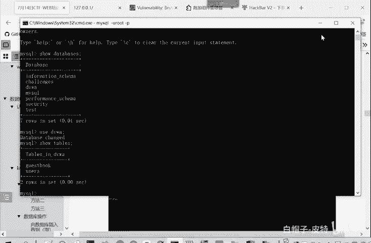


选中数据库通常有三种方法。


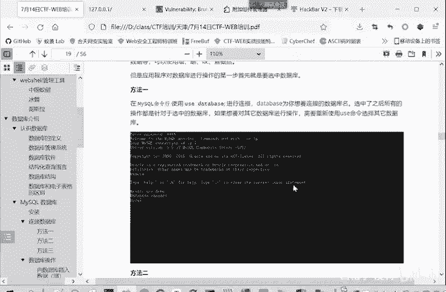


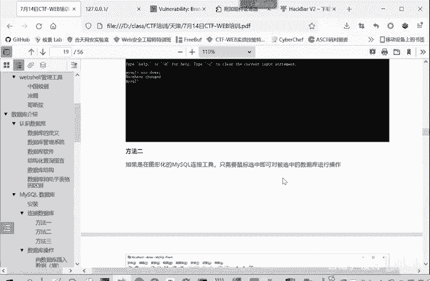

在命令行中，使用 `USE` 命令。


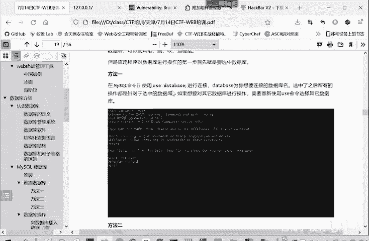


在图形化软件（如phpMyAdmin）里，直接用鼠标点击选择即可。在网站开发代码中，则使用类似 `mysqli_select_db()` 这样的函数来选择数据库。代码中通常先连接数据库，然后指定要选择的数据库名称。

连接好数据库后，就可以向里面进行增删改查数据了。下面我们重点看如何通过命令行操作，因为CTF比赛和解题主要依赖命令行。


命令行操作是CTF比赛中不可或缺的技能。我们主要看一下在命令行里如何进行增删改查操作。


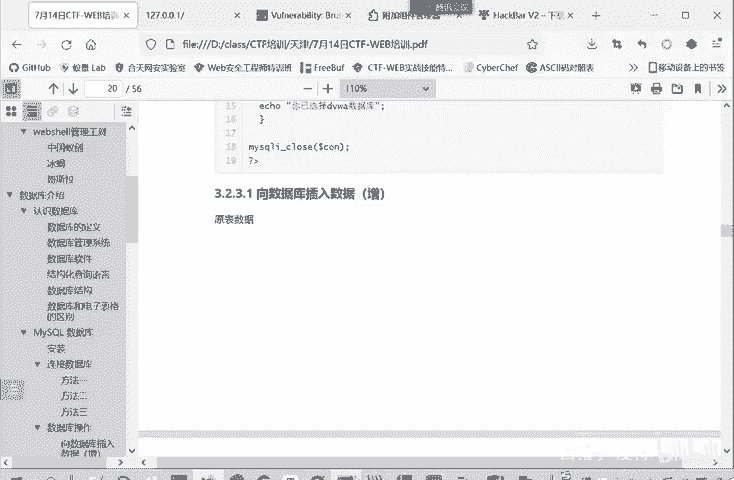


## 增加数据（INSERT）

首先，我们来看“增”，即增加数据，对应的命令是 `INSERT`。

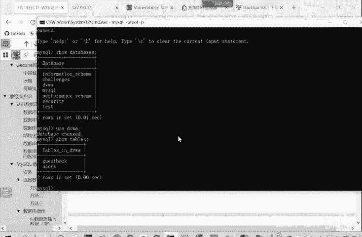

`INSERT` 命令后面要接 `INTO` 表名，然后指定要增加的值。例如，我们有一个 `guestbook` 表。


`guestbook` 表有三个字段：`comment_id`, `comment`, `name`。其中 `comment_id` 是自增长的，我们无需手动指定。如果我们需要向里面增加一条数据，命令如下：

以下是插入数据的SQL命令格式：
```sql
INSERT INTO 表名 (字段名1, 字段名2, ...) VALUES (‘值1‘, ‘值2‘, ...);
```

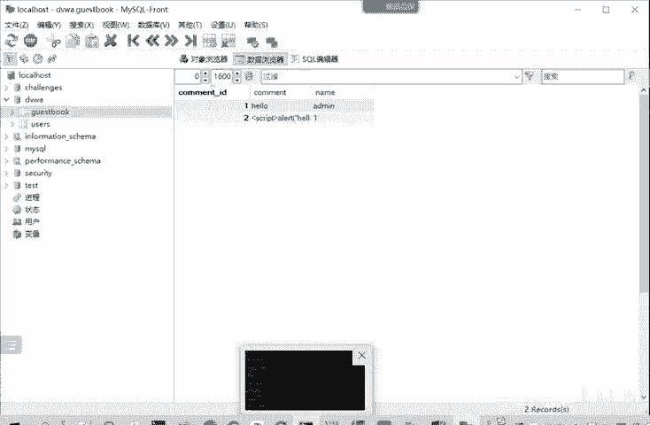

具体到本例，操作如下：


我们执行命令：
```sql
INSERT INTO guestbook (comment, name) VALUES (‘hello world‘, ‘admin‘);
```
命令显示“1行受到影响”。刷新表格后，可以看到我们刚才添加的信息已经显示出来。

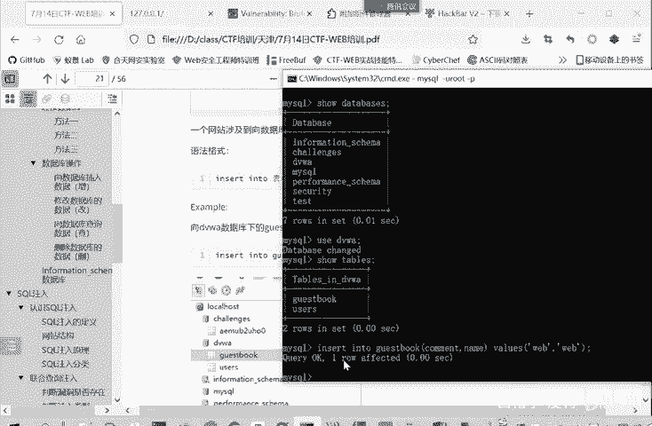

这就是“增”操作：`INSERT INTO` 后接表名和字段名，`VALUES` 后接对应字段的值。注意，数据库名、表名、字段名本身不用加引号，但你要输入的字符串值需要加引号。

## 修改数据（UPDATE）

上一节我们介绍了如何增加数据，本节中我们来看看如何修改数据。修改数据使用 `UPDATE` 命令。

`UPDATE` 后面接表名，然后使用 `SET` 关键字指定哪个字段等于什么值，最后可以用 `WHERE` 条件来限制修改范围。如果不加 `WHERE` 条件，则会修改表中所有记录。

我们先查看一下 `guestbook` 表的原始数据。


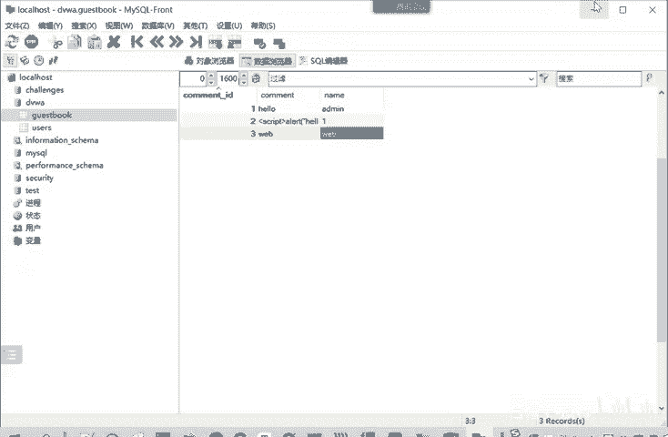

现在我们进行修改操作。


以下是修改数据的SQL命令格式：
```sql
UPDATE 表名 SET 字段名1=‘新值1‘, 字段名2=‘新值2‘ WHERE 条件;
```

我们执行命令，将 `name` 字段全部改为 `admin`：
```sql
UPDATE guestbook SET name=‘admin‘;
```
命令显示“3行受影响，2行被更改”。因为第一行原本就是 `admin`，无需修改。刷新后，可以看到所有用户名都变成了 `admin`。


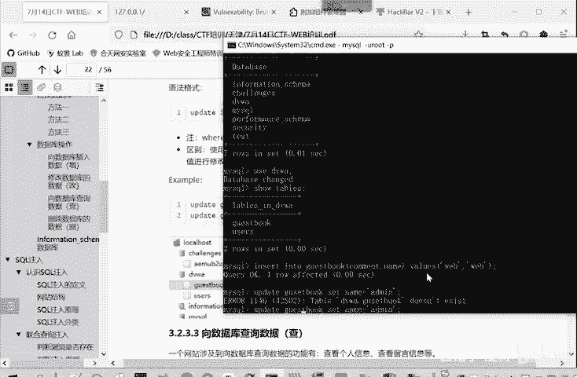


如果我们加上 `WHERE` 条件，例如只修改 `comment_id` 等于1的记录：
```sql
UPDATE guestbook SET name=‘where‘ WHERE comment_id=1;
```
命令显示“1行受影响”。刷新后，只有 `comment_id` 为1的行的名称被改为 `where`，其他行不变。

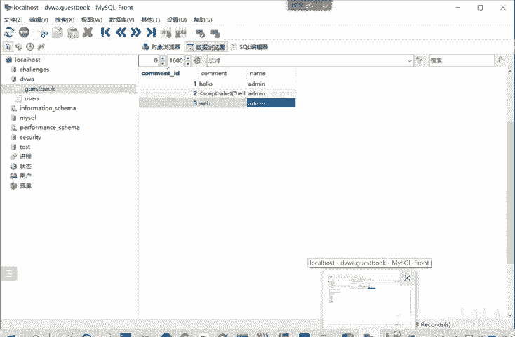

这就是修改操作。在CTF比赛中，有时需要修改数据库里存储的用户密码，就会用到 `UPDATE` 命令。

## 查询数据（SELECT）

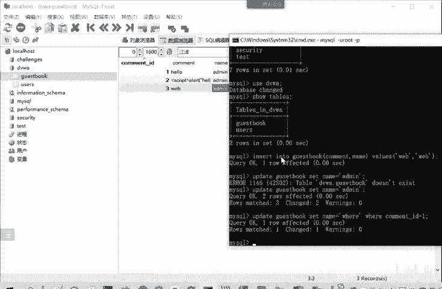

最常用的操作是查询，即获取信息而不改动信息。查询使用 `SELECT` 命令。

`SELECT` 后面指定要查找哪些字段，`FROM` 后面指定表名，同样可以带上 `WHERE` 条件。使用 `*` 代表查看所有字段的信息。


以下是查询数据的SQL命令格式：
```sql
SELECT 字段名1, 字段名2 FROM 表名 WHERE 条件;
```

我们执行命令，查看 `guestbook` 表的所有信息：
```sql
SELECT * FROM guestbook;
```
有时我们不想看所有信息，比如只看 `name` 和 `comment` 字段：
```sql
SELECT name, comment FROM guestbook;
```
这样就不会输出 `comment_id` 字段。

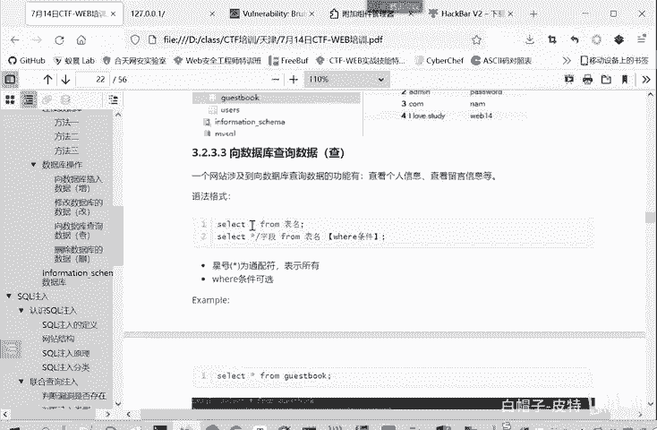

同样可以加上 `WHERE` 条件，例如只查看 `comment_id` 等于2的记录：
```sql
SELECT * FROM guestbook WHERE comment_id=2;
```
`WHERE` 用于增加限制条件。


## 删除数据（DELETE）

最后我们来看删除操作，使用 `DELETE` 命令。

从英文单词可知，删除是 `DELETE FROM` 表名，然后带上 `WHERE` 条件以删除特定记录。


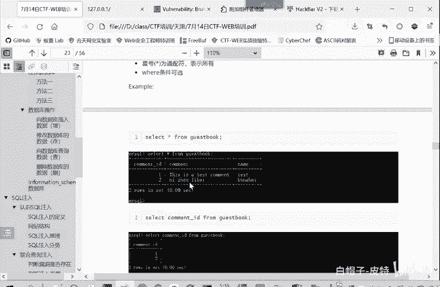


以下是删除数据的SQL命令格式：
```sql
DELETE FROM 表名 WHERE 条件;
```

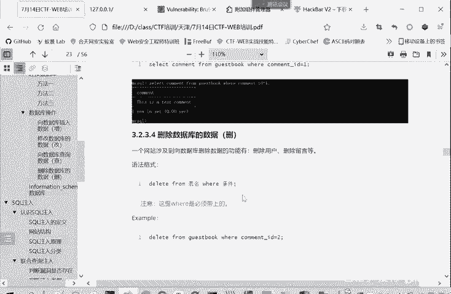

例如，我们想删除 `name` 为 `admin` 的记录：
```sql
DELETE FROM guestbook WHERE name=‘admin‘;
```
执行后，再刷新查看，刚才那条数据就被删除了。我们之前查询 `comment_id` 等于2的数据也不存在了，因为上一步的修改操作可能影响了它。


## 总结

本节课中我们一起学习了数据库的四种基本操作：
*   **增**：`INSERT`
*   **改**：`UPDATE`
*   **查**：`SELECT`
*   **删**：`DELETE`

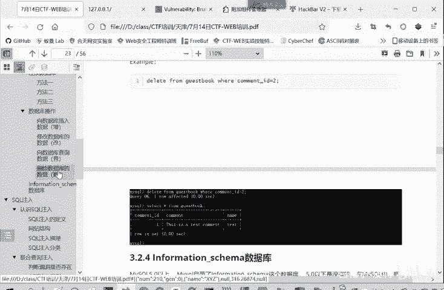

这是一个完整的增删改查工作流程。掌握这些命令是理解和使用SQL的基础。


在下一个板块，我们将介绍MySQL数据库系统中一个非常常用且重要的自带数据库：`information_schema` 数据库。