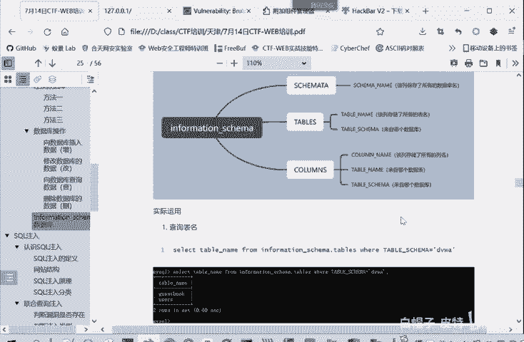
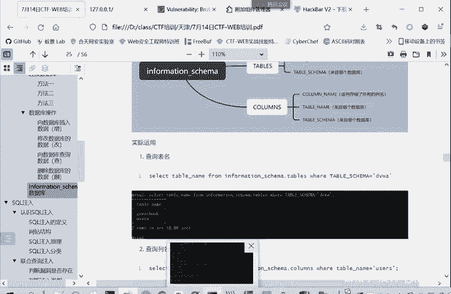
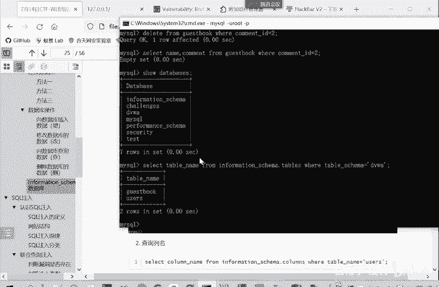
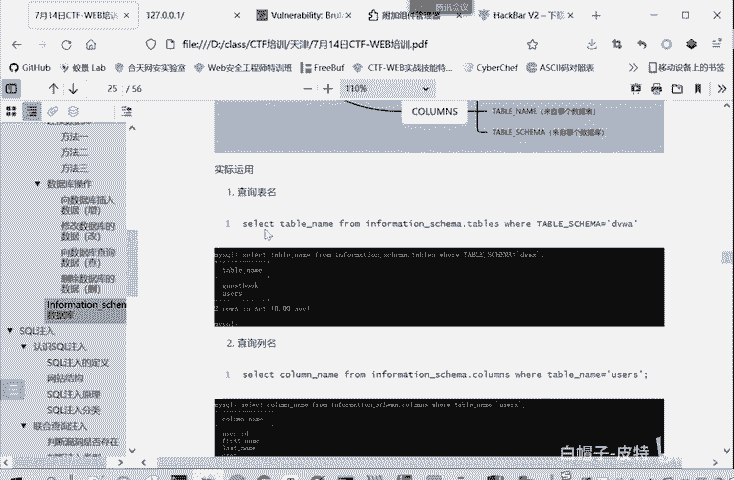
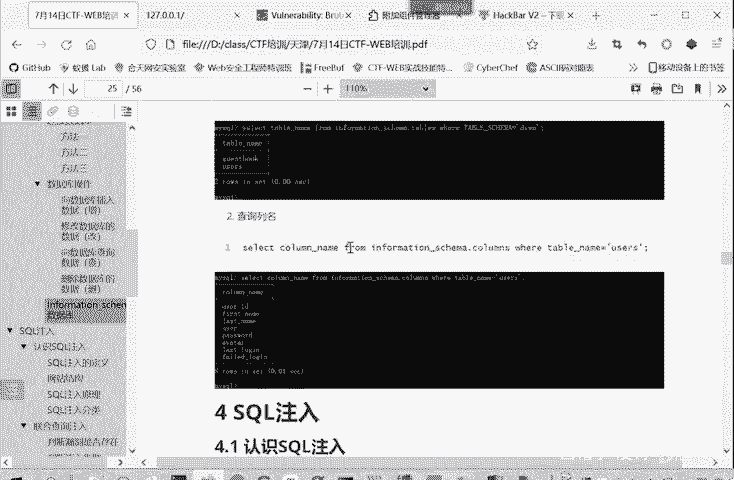
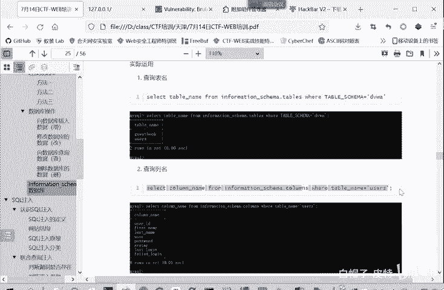
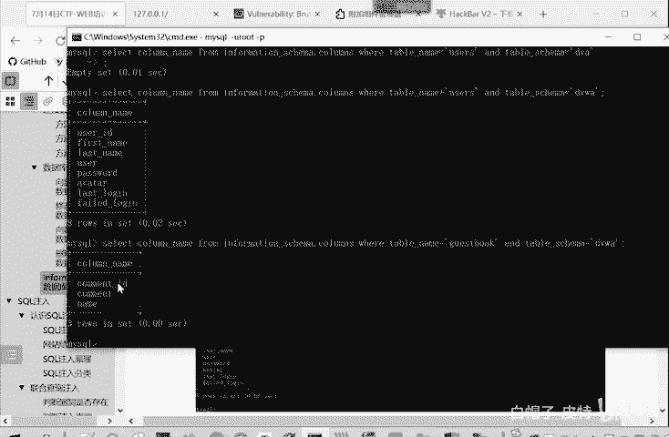
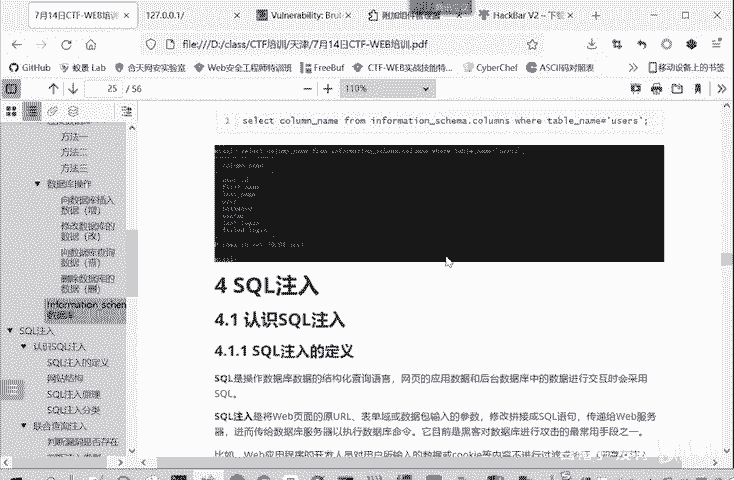

# CTF入门教程：P16：web-information-schema数据库 🗄️

在本节课中，我们将要学习MySQL数据库中的一个核心系统数据库——`information_schema`。这个数据库存储了关于MySQL服务器本身的所有元数据信息，例如有哪些数据库、每个数据库中有哪些表、每个表中有哪些字段等。理解并掌握如何查询`information_schema`，是进行SQL注入攻击和信息收集的关键基础。

## 什么是information_schema？ 🤔

我们直接打开数据库查看。MySQL数据库都自带了一个名为`information_schema`的数据库。这是一个MySQL 5.0及以上版本自带的系统数据库。

这个数据库保存着MySQL服务器的相关信息。例如，它记录了数据库管理系统所管理的所有数据库、表和字段的元数据。`information_schema`数据库本身包含多个表，每个表存储不同类型的信息。

## 核心信息表 📊

`information_schema`中有很多表，对于初学者和CTF中的SQL注入，我们重点掌握前三个表就足够了。以下是这三个核心表：

### 1. SCHEMATA表
`SCHEMATA`表保存了当前MySQL实例中所有数据库的信息。也就是说，整个数据库系统中存在的所有数据库名称都记录在这个表中。

**查询所有数据库的SQL语句：**
```sql
SELECT SCHEMA_NAME FROM information_schema.SCHEMATA;
```
这条命令会列出所有数据库的名称，其作用类似于`SHOW DATABASES;`命令。

### 2. TABLES表
顾名思义，`TABLES`表保存了所有数据库中所有表的信息。

**查询特定数据库（例如DVWA）中所有表的SQL语句：**
```sql
SELECT TABLE_NAME FROM information_schema.TABLES WHERE TABLE_SCHEMA='dvwa';
```
这条语句会返回`dvwa`数据库中的所有表名，例如`users`表和`guestbook`表。`TABLE_SCHEMA`字段指明了表所属的数据库。

### 3. COLUMNS表
`COLUMNS`表提供了表中所有列（即字段）的详细信息。字段可以理解为Excel表格中的列。

**查询特定表（例如users表）中所有字段的SQL语句：**
```sql
SELECT COLUMN_NAME FROM information_schema.COLUMNS WHERE TABLE_NAME='users' AND TABLE_SCHEMA='dvwa';
```
这条语句会列出`dvwa`数据库中`users`表的所有字段名。为了更精确，我们同时指定了表名(`TABLE_NAME`)和数据库名(`TABLE_SCHEMA`)。



上一节我们介绍了三个核心表各自的作用，本节中我们来看看如何在SQL注入中实际应用它们来获取信息。



## 实战应用：绕过限制获取信息 🛠️

在SQL注入中，有时`SHOW DATABASES;`等常规命令可能被禁用或过滤。这时，我们就可以利用`information_schema`数据库来达到同样的目的。

**场景：无法使用`SHOW DATABASES;`命令时，如何获取数据库名？**

我们可以直接查询`SCHEMATA`表：
```sql
SELECT SCHEMA_NAME FROM information_schema.SCHEMATA;
```



**场景：如何获取某个数据库（例如dvwa）中的所有表名？**





我们需要从`TABLES`表中查询，并指定数据库名作为条件：
```sql
SELECT TABLE_NAME FROM information_schema.TABLES WHERE TABLE_SCHEMA='dvwa';
```

**场景：如何获取某个表（例如users表）中的所有字段名？**



我们需要从`COLUMNS`表中查询，并同时指定表名和它所属的数据库名：
```sql
SELECT COLUMN_NAME FROM information_schema.COLUMNS WHERE TABLE_NAME='users' AND TABLE_SCHEMA='dvwa';
```
通过组合这些查询，即使在一些命令被限制的情况下，我们也能一步步摸清目标数据库的结构。

## 总结 📝



本节课中我们一起学习了MySQL的`information_schema`系统数据库。我们了解到：
1.  **`information_schema`** 是一个存储数据库元数据（如库、表、字段信息）的系统数据库。
2.  其中三个核心表是：
    *   **`SCHEMATA`**：存储所有数据库的名称。
    *   **`TABLES`**：存储所有表的信息，包括表名和所属数据库。
    *   **`COLUMNS`**：存储所有字段的信息，包括字段名、所属表和所属数据库。
3.  在CTF的SQL注入题目中，熟练查询`information_schema`是进行信息收集、绕过某些过滤的关键步骤。



掌握了这些基础知识后，从下一章开始，我们将正式进入SQL注入漏洞原理与利用的实战学习。