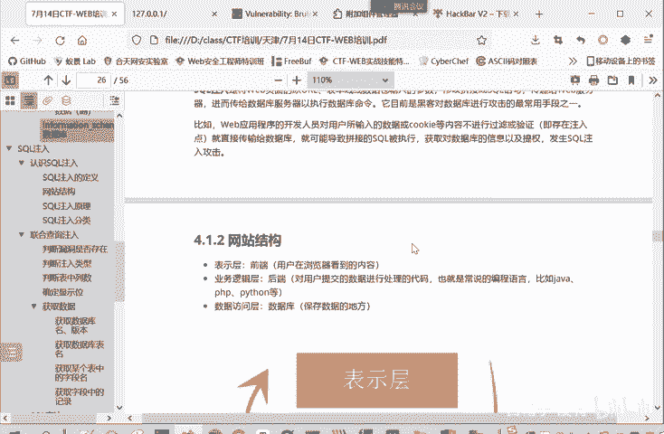
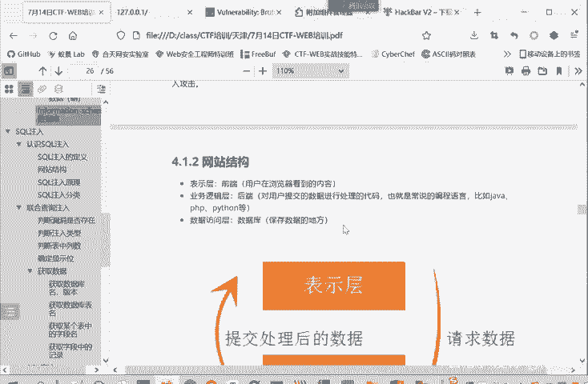
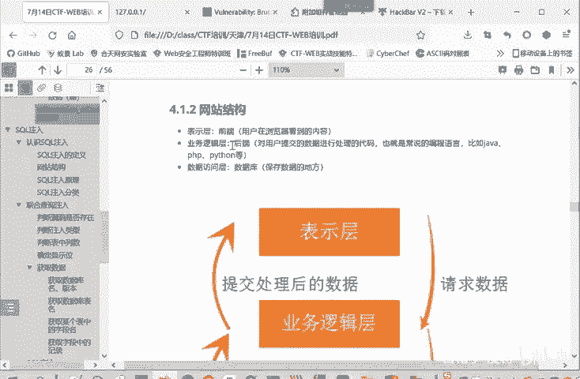
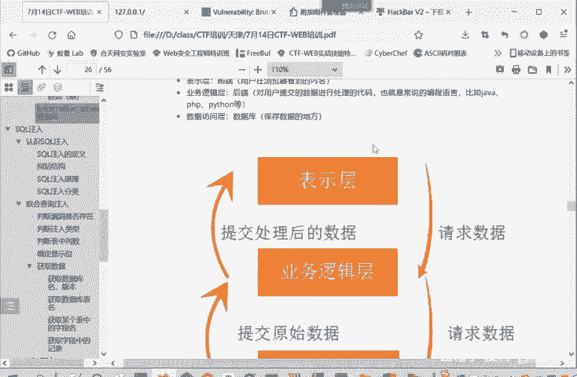
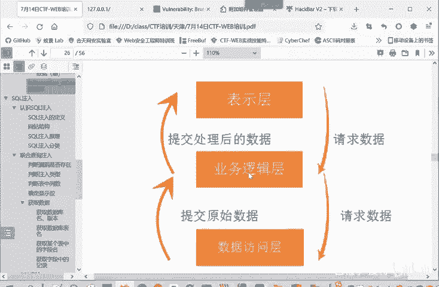
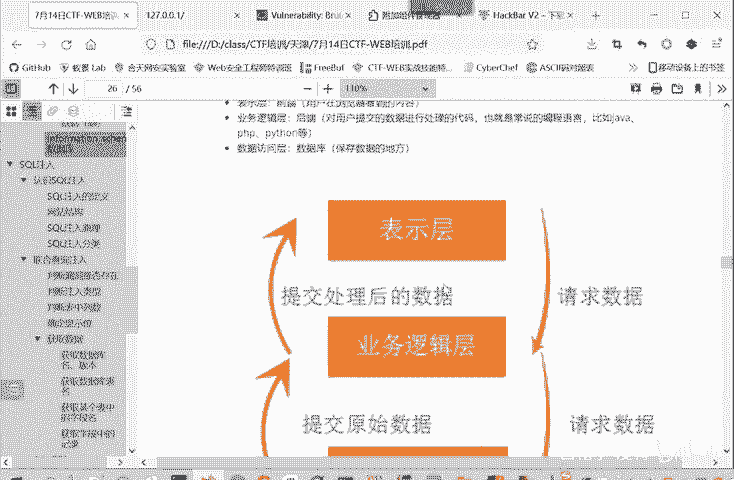
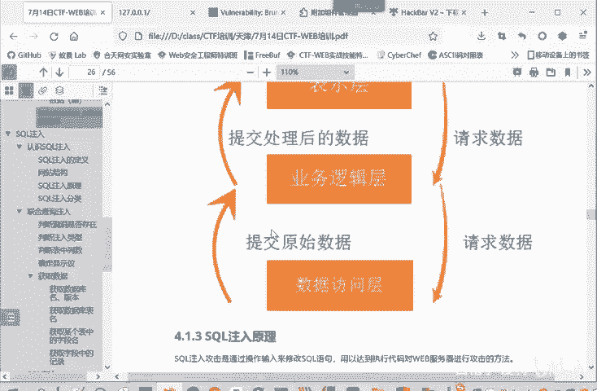
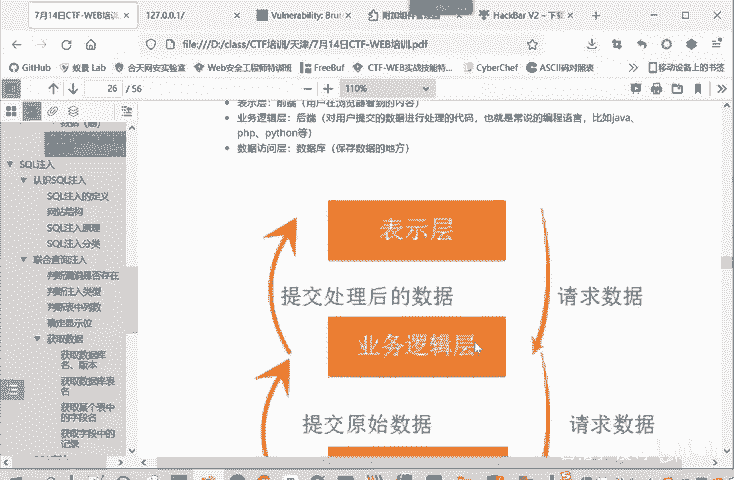
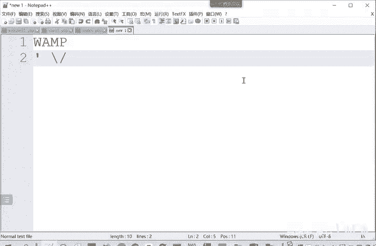

# CTF入门教程：P18：web-网站结构 🏗️

在本节课中，我们将要学习典型的网站三层结构。理解这个结构是分析Web安全漏洞，特别是SQL注入漏洞的基础。

## 概述

为了更清晰地理解SQL注入的逻辑，我们首先需要了解网站的基本结构。一个典型的网站结构可以分为三层：表示层、业务逻辑层和数据访问层。

## 网站的三层结构

上一节我们介绍了学习网站结构的重要性，本节中我们来看看具体的每一层。

### 表示层（前端）

我们这里看一下网站的结构。网站的结构可以分为三层，第一层是表示层。表示层就是我们常说的前端，也就是用户通过浏览器看到的部分。这个表示层负责展示信息和接收用户的输入。

### 业务逻辑层（后端）

前端把用户的请求发送给后端，也就是业务逻辑层。业务逻辑层对用户提交的数据进行处理。这一层通常由后端编程语言实现，例如Java、Python、PHP等。

### 数据访问层（数据库）

业务逻辑层进行业务逻辑处理时，并非能完成所有工作。当需要获取或存储数据时，它必须依赖数据访问层，也就是数据库。遇到需要获取数据的情况，业务逻辑层就对数据库发起查询请求。

## 数据流与潜在风险

理解了各层的职责后，我们来看看数据是如何在三层之间流动的，以及风险点在哪里。

数据库把查询结果返回给业务逻辑层。业务逻辑层再根据情况，决定是否将结果返回给表示层，也就是把响应发送回用户的浏览器。这是一个网站整体的数据交互逻辑。

正因为数据流经表示层（浏览器），而用户可以在此输入数据，所以这里就存在注入的风险。用户输入的数据，可能会被业务逻辑层用于构造查询数据库的语句。

如果用户输入的数据中包含了特殊的字符，例如：
以下是几种常见的危险字符：
*   单引号 **`‘`**
*   井号 **`#`**
*   反斜杠 **`\`**
*   双横杠 **`--`**

那么就有可能破坏数据访问层原本的查询语句结构，造成一个非预期的“闭合”。攻击者从而可能控制数据访问层实际执行的查询内容。这样就造成了一个**SQL注入**的漏洞。

## 总结

本节课中我们一起学习了典型的网站三层结构：表示层（前端）、业务逻辑层（后端）和数据访问层（数据库）。我们了解了数据是如何在三层之间流动的，并重点分析了由于用户输入可控，且数据被直接用于数据库查询，从而在表示层与业务逻辑层交界处产生SQL注入漏洞的根本原因。理解这一结构是后续深入学习Web安全攻防的基础。