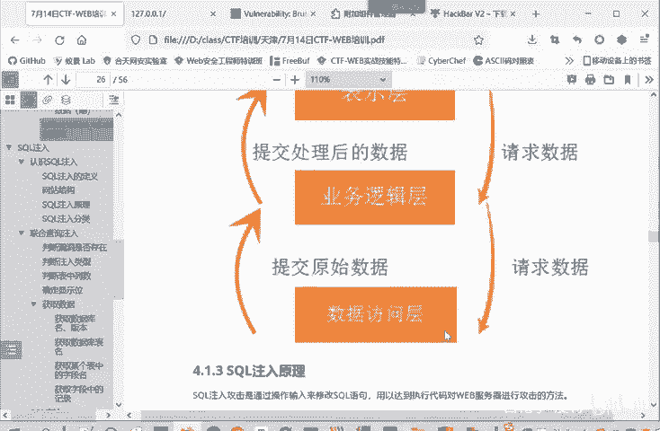

# CTF入门教程：P19：web-SQL注入原理

在本节课中，我们将要学习CTF-Web方向中一个非常核心且常见的漏洞类型：SQL注入。我们将深入探讨其基本原理，并通过简单的例子帮助你理解攻击是如何发生的。

## 概述

SQL注入是一种通过用户输入来修改后端SQL语句，从而达到执行恶意代码、攻击服务器或数据库的攻击方法。理解其原理是Web安全学习的基石。

## SQL注入原理详解

上一节我们介绍了Web安全的基本概念，本节中我们来看看SQL注入的具体原理。

SQL注入就是通过用户输入来修改SQL语句，以达到执行恶意代码、对服务器进行攻击的方法。

简单来说，攻击主要发生在通过POST或GET方式提交的表单中，有时也存在于Cookie里。攻击者将恶意构造的SQL语句插入到请求参数中。由于服务器没有对这些输入进行充分的恶意命令检查，导致插入的恶意SQL语句被送入服务器，并作为合法命令的一部分被执行。

造成SQL注入的根本原因在于，程序在执行过程中动态地构造了SQL语句。具体来说，是业务逻辑层向数据访问层请求数据时，并非请求固定的数据（例如“请求张三的数据”），而是根据用户的输入来动态决定请求什么数据。这种动态性容易引发SQL语句的闭合问题，从而改变业务逻辑层对程序原意的理解。

为了更直观地理解，请看以下示意图：




## 一个简单的例子


以下是理解SQL注入的一个典型场景。

假设我们访问一个示例网站，URL为：`example.com/page?id=123`。这里使用GET方式传递参数，变量`id`的值是`123`。

服务器后端处理这个请求的SQL语句可能如下所示：
```sql
SELECT * FROM users WHERE id = ‘$id’
```
在这个语句中，`$id`会被替换成我们传入的值`123`，因此实际执行的语句是：
```sql
SELECT * FROM users WHERE id = ‘123’
```

现在，思考一下：如果攻击者传入的`id`值本身包含一个单引号，例如`123‘`，会发生什么？

实际执行的SQL语句将变成：
```sql
SELECT * FROM users WHERE id = ‘123’’
```
传入值中的单引号`‘`会与SQL语句中原本用来包裹值的单引号提前闭合。这使得原本用于结束字符串的第二个单引号失去了作用，从而可能改变整个SQL语句的结构和意图。攻击者可以利用这种“闭合”现象，在中间插入额外的SQL命令。

因此，这类通过输入破坏SQL语句原有结构，并注入恶意命令的问题，就称为SQL注入。

## 总结

本节课中我们一起学习了SQL注入的基本原理。我们了解到，SQL注入是由于程序动态拼接用户输入来构造SQL语句，且未对输入进行充分过滤所导致的安全漏洞。攻击者通过精心构造的输入，破坏SQL语句的原有结构（特别是引号闭合），从而注入并执行恶意SQL命令。理解这一原理是后续学习各种SQL注入技巧和防御方法的基础。