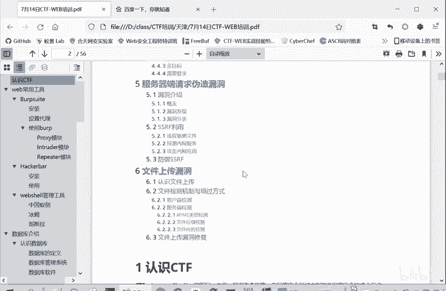
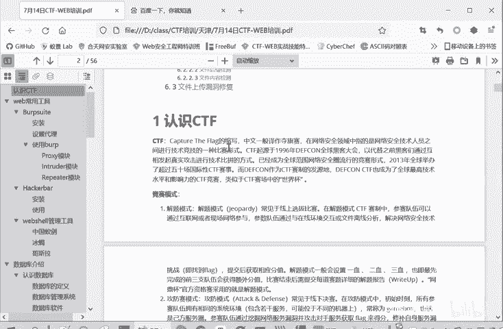

# CTF入门教程：1：认识CTF 🚩

在本节课中，我们将要学习CTF的基本概念，包括其定义、主要竞赛模式以及涵盖的核心技术领域。这将为你后续深入学习各个方向打下坚实的基础。

## 什么是CTF？

CTF是**Capture The Flag**的缩写，中文称为“夺旗赛”。这是一种网络安全竞赛形式。参赛者的核心目标是寻找一个被称为 **`flag`** 的特定字符串。在竞赛中，发现并利用目标系统（如网站服务、二进制程序）的漏洞，成功获取到`flag`，即代表挑战成功。参赛者需要提交获取到的`flag`以证明自己完成了题目。

## CTF的三种竞赛模式

CTF竞赛主要采用以下三种模式，每种模式都有其独特的特点和规则。

以下是三种主要的竞赛模式：

1.  **解题模式 (Jeopardy)**
    *   这是最常见的模式，尤其在线上选拔赛中。参赛者通过互联网或现场网络接入，解决一系列预设的网络安全技术挑战（题目）。每道题目都隐藏着一个`flag`，解题后提交`flag`即可获得相应分数。题目通常设有“一血”、“二血”奖励，越早解出分数越高。比赛后常需提交详细的解题报告（Writeup），以防止直接抄袭`flag`的行为。

2.  **攻防模式 (Attack-Defense)**
    *   这种模式常见于线下决赛。各参赛队伍同时扮演攻击方和防守方。攻击方需要攻击其他队伍的服务以获取`flag`；防守方则需要加固自己的服务，修复漏洞，并防御攻击。队伍需要兼顾攻击得分和防守失分，最终根据净得分进行排名。

3.  **混合模式 (King of the Hill / 分享赛)**
    *   这是一种较新颖的模式。比赛中，各队伍既需要解答其他队伍出的题目，也需要自己出题。得分来源于解题得分、出题得分以及赛后分享解题/出题思路的得分。这种模式综合考察了参赛者的技术深度、出题能力和知识分享能力。

上一节我们介绍了CTF的竞赛形式，本节中我们来看看CTF竞赛具体包含哪些技术内容。

## CTF竞赛的核心内容

CTF题目覆盖了网络安全的多个领域，主要分为以下几大板块。

以下是CTF竞赛涵盖的六大核心板块：

1.  **Web（网络攻防）**
    *   主要考察Web应用常见漏洞，例如：**SQL注入**、**XSS（跨站脚本）**、**CSRF（跨站请求伪造）**、文件包含、文件上传、代码审计、PHP特性等。解题思路围绕发现并利用这些漏洞来获取`flag`。

2.  **Reverse Engineering（逆向工程）**
    *   涉及软件逆向分析。常见题型包括分析二进制程序（如EXE文件）的逻辑，找到隐藏的`flag`。基础部分考察静态/动态分析工具的使用。进阶部分难度较大，会涉及软件保护技术，如**反编译**、**反调试**、加壳与脱壳等。

3.  **Pwn（二进制漏洞利用）**
    *   专注于二进制程序的漏洞挖掘与利用。主要考察栈溢出、堆溢出等内存漏洞的利用技术。目标是利用这些漏洞劫持程序控制流，从而获取`flag`或系统权限。核心是理解程序在内存中的运行机制。

4.  **Crypto（密码学）**
    *   包含古典密码和现代密码学两部分。题目可能涉及各种加密算法的分析、解密，或密码学协议的设计缺陷。解题需要一定的数学和密码学知识。

5.  **Mobile（移动安全）**
    *   随着移动设备普及而兴起的领域，主要针对Android和iOS系统。题目大多围绕Android应用，考察APK逆向、组件安全、数据存储安全等。iOS题目相对较少。

6.  **Misc（安全杂项）**
    *   范围非常广泛，内容比较杂。常见题型包括信息搜集、编码转换、数字取证、隐写术（在图片、音频、视频中隐藏信息）、数据分析等。考察参赛者的综合技能和知识广度。

本节课中我们一起学习了CTF夺旗赛的基本概念，了解了其三种主要的竞赛模式：解题模式、攻防模式和混合模式。同时，我们也梳理了CTF竞赛涵盖的六大技术方向：Web、逆向、Pwn、密码学、移动安全和杂项。这些知识将帮助你建立起对CTF世界的整体认知，为选择具体的学习方向做好准备。