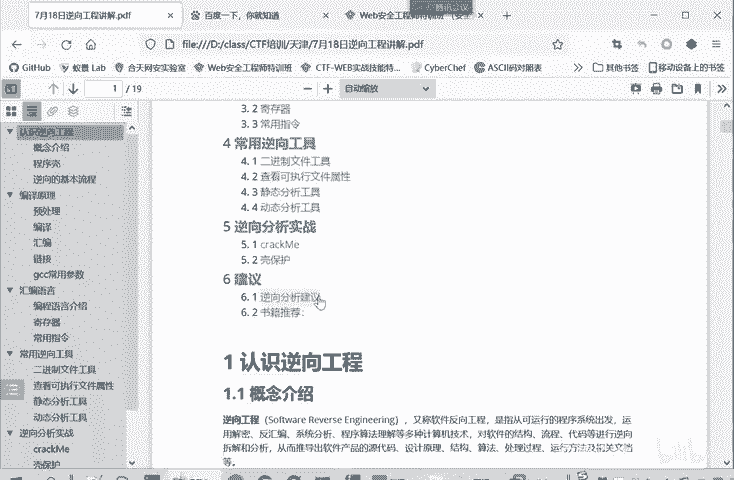
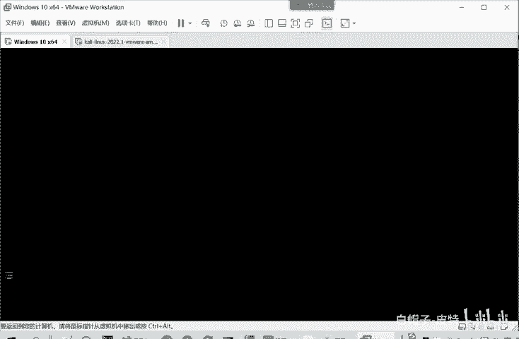
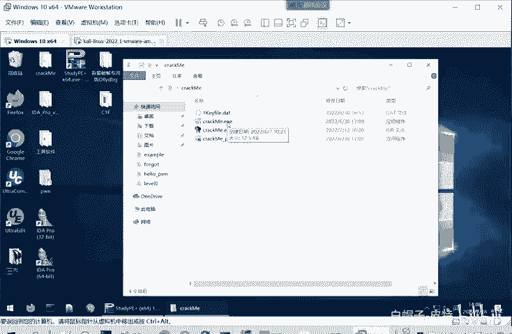
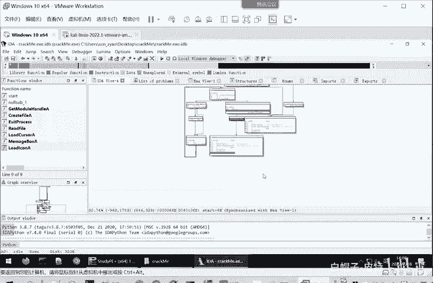

# CTF逆向工程入门：P23：逆向-什么是逆向工程 🧩

在本节课中，我们将要学习逆向工程的核心概念、基本方法及其在CTF比赛和实际安全领域中的应用。我们将从定义出发，逐步了解其原理、工具和分析技术。

---

## 逆向工程的概念

逆向工程，英文称为 **Software Reverse Engineering**，即软件逆向工程或软件反向工程。它是指从可运行的系统出发，运用解密、反汇编、系统分析、程序理解等多种计算机技术，对软件的结构、流程、代码等进行逆向拆解和分析。其目的是推导出软件产品的源代码、设计原理、结构、算法或处理过程。

例如，360杀毒软件能够检测病毒，正是因为它对病毒样本进行了逆向工程，提取了其特征码。当用户下载软件时，杀毒软件会检测这些特征，从而判断软件是否安全。

在CTF比赛中，逆向工程涉及Windows、Linux、安卓等多种平台的编程技术。参赛者需要利用常见工具对源代码及二进制文件进行逆向分析，掌握安卓APK文件逆向、加解密算法、内核编程、反调试及代码混淆等技术。

---

## 逆向工程的用途

以下是逆向工程的主要应用场景：

1.  **分析已编译的软件**：对二进制可执行文件进行分析，并使用高级语言重现其逻辑。这是一个与正常编译相反的过程。
2.  **分析病毒与开发杀毒软件**：通过逆向分析恶意软件，提取特征码，用于开发或更新杀毒软件的病毒库。
3.  **高级代码审计**：在无法获得源代码时，直接审计二进制可执行程序，在汇编层面发现程序漏洞或危险逻辑。
4.  **软件破解与外挂开发**：用于破解软件授权机制（如生成激活码、破解用户名口令），开发游戏外挂，或制作反外挂软件。
5.  **分析嵌入式设备漏洞**：随着物联网设备增多，逆向工程可用于分析嵌入式设备中固件或程序的安全漏洞。

---

## 如何进行逆向分析

逆向分析主要涉及两种技术：静态分析和动态分析。它们通常结合使用，以全面理解目标程序。

### 静态分析技术

静态分析指在不执行程序的情况下，对程序代码进行分析以发现缺陷。当无法获得源代码时，我们使用静态分析工具将二进制可执行文件反汇编成汇编代码或反编译成C语言伪代码。

**伪代码** 并非程序原始的源代码，而是分析工具（如IDA Pro）根据二进制文件逻辑生成的、功能等效的高级语言代码，便于人工阅读和分析。

静态分析的优点如下：

*   **直接面向代码**：可以分析源代码或反汇编/反编译后的代码。
*   **全局视野**：能够同时查看所有可能的执行路径，快速把握程序整体逻辑和分支结构。
*   **安全性高**：由于不实际执行程序，因此分析过程不会触发或遭受恶意代码的攻击。

通过静态分析工具（如IDA）打开一个程序，我们可以清晰地看到其函数调用图、控制流和分支判断条件，从而从整体上理解程序的运行框架。

### 动态调试技术

上一节我们介绍了不执行程序的静态分析，本节中我们来看看与之相对的动态调试技术。动态调试是指在程序实际运行的过程中，利用调试器跟踪其执行状态。

分析人员通过动态调试，可以观察程序运行时的各种状态，例如：
*   寄存器的值
*   函数的输入与输出参数
*   内存的分配与使用情况

动态调试的核心是关注 **代码流** 和 **数据流**：
*   **代码流**：确定程序在特定输入下实际执行了哪些代码分支。
*   **数据流**：跟踪用户输入（如密码、激活码）在程序中被如何处理、传递和验证的完整路径。

动态调试的优点如下：

*   **明确执行流程**：可以清晰地观察程序的实际执行路径，比静态分析更直观。
*   **跟踪数据流向**：能够实时监控数据在程序中的处理过程。
*   **查看运行时信息**：可以直接获取内存地址、寄存器内容、堆栈状态等运行时信息。
*   **交互与修改**：可以动态修改寄存器或内存中的值，从而改变程序的执行走向，用于测试或破解。

---

## 总结

本节课中我们一起学习了逆向工程的基本概念。我们了解到，逆向工程是从二进制程序反向推导其设计逻辑和代码的过程，在安全分析、病毒研究、软件破解等领域有广泛应用。其核心分析方法分为 **静态分析** 和 **动态调试**：静态分析用于在不运行程序的情况下把握整体结构；动态调试则用于在程序运行时深入跟踪其执行细节和数据变化。在实际逆向工作中，两者相辅相成，需要反复交叉使用才能彻底厘清一个程序的机制。