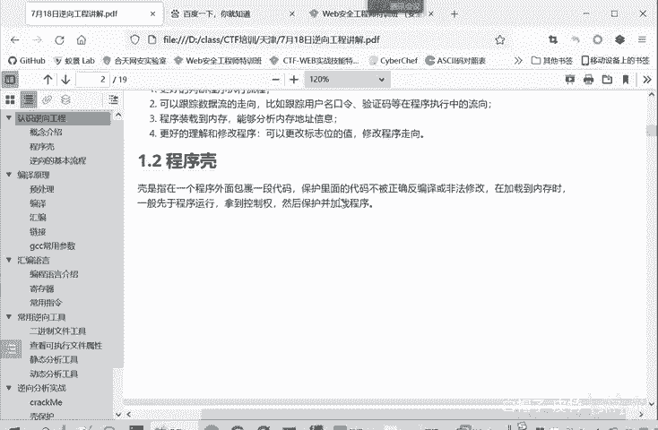
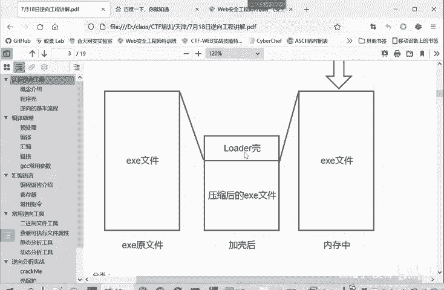
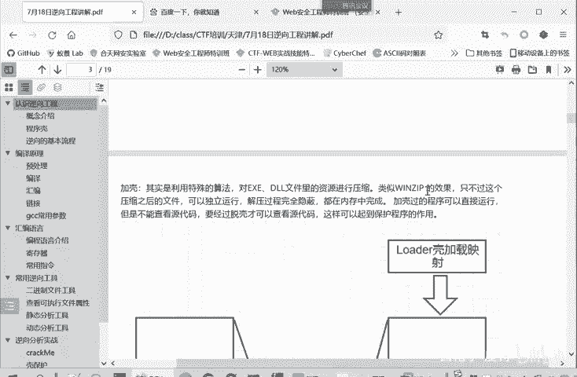
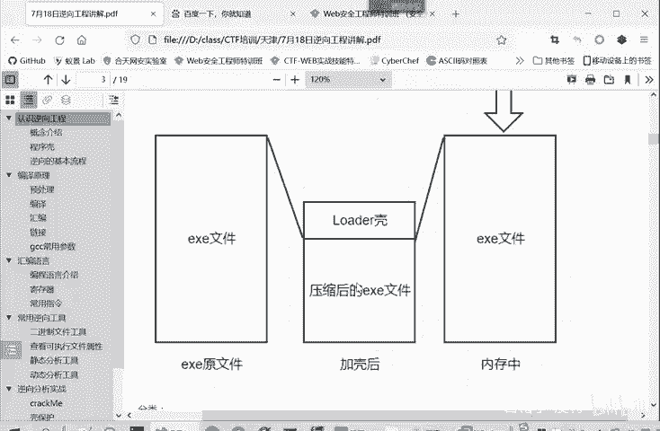
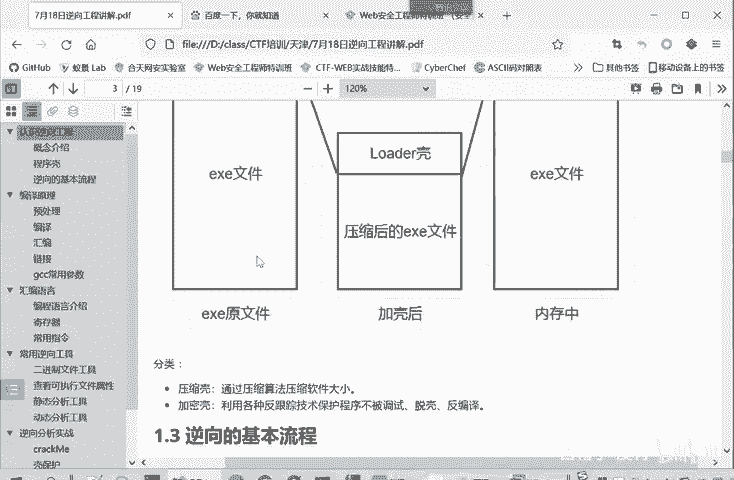
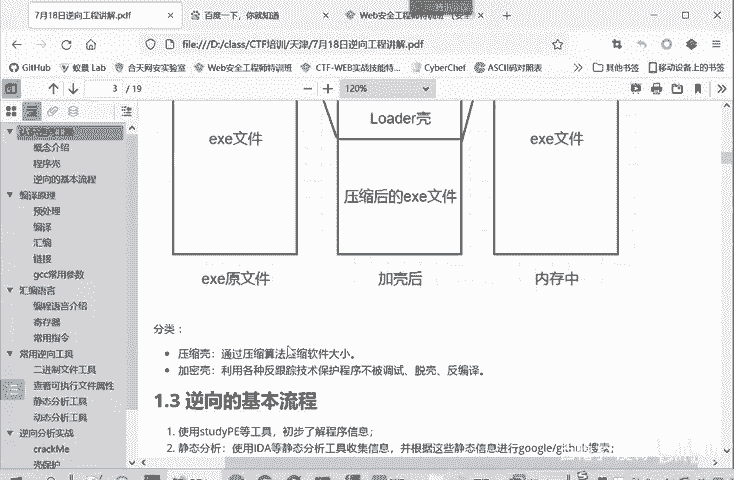
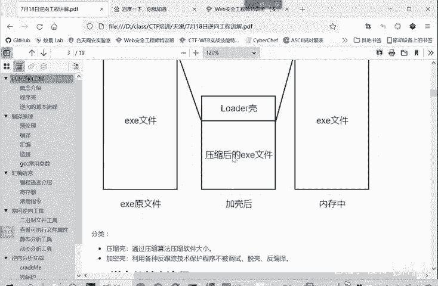

# CTF逆向工程入门：P24：程序壳 🐚

## 概述
在本节课中，我们将要学习逆向工程中的一个重要概念——**程序壳**。我们将了解什么是程序壳、它的作用、工作原理以及它如何为逆向分析增加难度。

## 什么是程序壳？
程序壳是包裹在程序外部的一层代码，其作用是保护内部的原始代码，使其难以被正确反编译或非法修改。

当加壳的程序被加载到内存中时，外壳代码会先于原始程序运行，取得控制权，然后再负责加载并执行真正的程序。

## 加壳与脱壳的工作原理
上一节我们介绍了程序壳的基本概念，本节中我们来看看它的具体工作流程。

一个正常的可执行文件（例如 `program.exe`）在未加壳时可以直接执行。加壳的过程如下：
1.  将原始的 `EXE` 文件进行压缩。
2.  在压缩后的文件外部，添加一层 `Loader`（引导区）。

这样就得到了一个新的、加壳后的可执行文件。

加壳后的文件执行流程如下：
1.  系统执行加壳文件时，首先运行外部的 `Loader`。
2.  `Loader` 的功能是在内存中将压缩的 `EXE` 文件解压，还原出原始程序。
3.  最后，`Loader` 将控制权交给解压后的原始程序并执行它。

对于普通用户而言，使用原始文件和加壳后的文件几乎没有差别。虽然加壳文件需要经历引导和解压步骤，但其运行时间的增加可以忽略不计，用户不会感到卡顿或运行缓慢。

## 壳对逆向分析的影响
然而，对于逆向工程的分析人员来说，情况就完全不同了。

调试原始文件时，无论是静态分析（直接查看代码）还是动态分析（运行调试），都相对容易。但分析加壳后的文件则会非常困难。

静态分析时，你看到的是 `Loader` 壳代码和压缩后的数据，而非最终要执行的逻辑，代码会显得混乱复杂。动态调试也会因为外壳的干扰而难以理清程序的真实机制。

因此，程序壳的核心目的就是**为调试和逆向工程增加难度**。遇到加壳的程序时，逆向分析人员的首要任务往往是**手动脱壳**，即去除外壳，得到原始的可执行文件，然后再进行静态或动态分析。

## 壳的本质与分类
所谓的“壳”，本质上是利用特殊算法（如压缩算法）对 `EXE` 可执行文件或 `DLL` 动态链接库等程序资源进行压缩或加密。

这与 `WinZip` 等压缩工具的效果类似，但关键区别在于：加壳后的程序可以独立运行，其解压过程完全在内存中隐秘进行，对用户透明。

正因如此，加壳可以保护程序，防止其被轻易调试和分析。当然，矛与盾是相对的，有加壳技术，就有相应的脱壳技术。

壳主要分为两大类：
以下是两种主要壳类型的介绍：

1.  **压缩壳**：这是最常见的一种。其原理就是我们前面示意图展示的，将原始文件压缩后包裹在壳内。它主要目的是减小程序体积，并增加一定的分析难度。
    

2.  **加密壳**：这种壳的难度更大，保护性更强。它综合运用各种加密算法以及反跟踪、反调试技术，更有效地保护程序不被调试和逆向。
    

在本入门课程中，我们将先掌握相对简单的**压缩壳**的分析与处理方法。加密壳更为复杂，我们将在后续的课程中进一步学习。

## 总结
本节课中我们一起学习了逆向工程中的**程序壳**。我们了解了它是程序外部的一层保护代码，通过压缩或加密原始程序来增加逆向分析的难度。我们掌握了其工作原理（加载→解压→执行），并区分了**压缩壳**和**加密壳**两种主要类型。理解程序壳是进行实际逆向分析的重要前提，在后续课程中，我们将通过实战例子来学习如何分析和处理加壳的程序。

