# CTF逆向工程：P26：编译原理 🧠

在本节课中，我们将要学习编译原理，了解一个用高级语言（如C语言）编写的程序是如何一步步转换为计算机可以直接执行的二进制文件的。理解这个正向过程，是进行逆向工程分析的基础。

---

## 从源代码到可执行文件：四个关键步骤

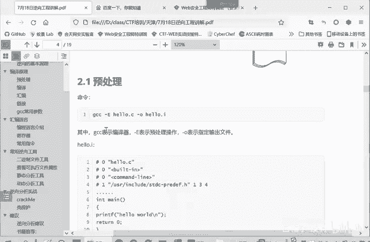

上一节我们介绍了逆向工程的基本概念，本节中我们来看看程序构建的正向过程。将C语言源代码编译成可执行程序，通常需要四个步骤。

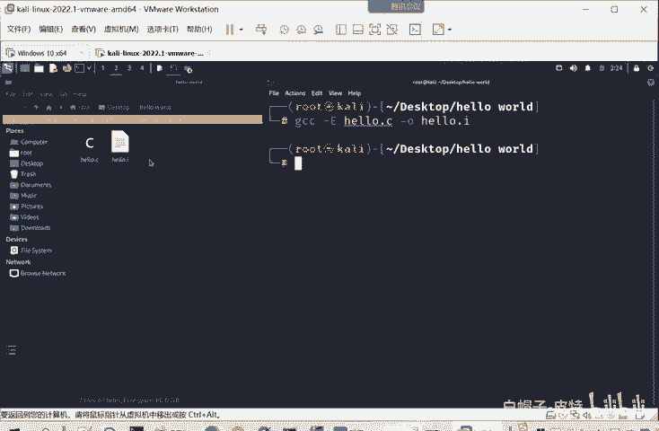

以下是这四个步骤的概述：
1.  **预处理**
2.  **编译**
3.  **汇编**
4.  **链接**

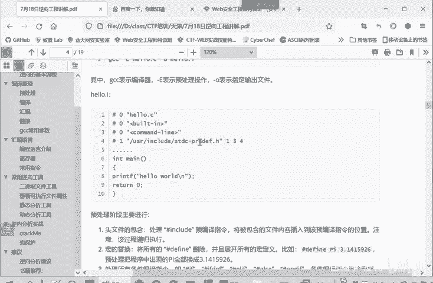

我们将以一个经典的“Hello, World!”程序为例，逐步分析每个阶段。

**示例源代码 (`hello.c`)**：
```c
#include <stdio.h>
int main() {
    printf("Hello, World!\n"); // 输出问候语
    return 0;
}
```

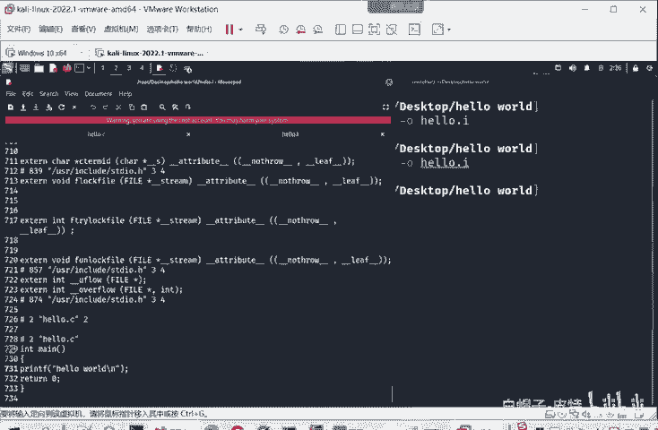

---

## 第一步：预处理

预处理是编译过程的第一步。它处理源代码中以 `#` 开头的指令，为后续的编译做准备。

以下是预处理阶段执行的主要操作：
*   **头文件包含**：处理 `#include` 指令，将被包含文件（如 `stdio.h`）的实际内容插入到源代码中。
*   **宏替换**：处理 `#define` 定义的宏，将所有出现宏名的地方替换为定义的值。
*   **条件编译**：处理 `#ifdef`、`#ifndef`、`#endif` 等指令，决定哪些代码块参与编译。
*   **删除注释**：移除所有注释，因为注释是给程序员看的，计算机不需要。
*   **保留 `#pragma` 指令**：保留编译器特定的指令，用于控制编译过程。

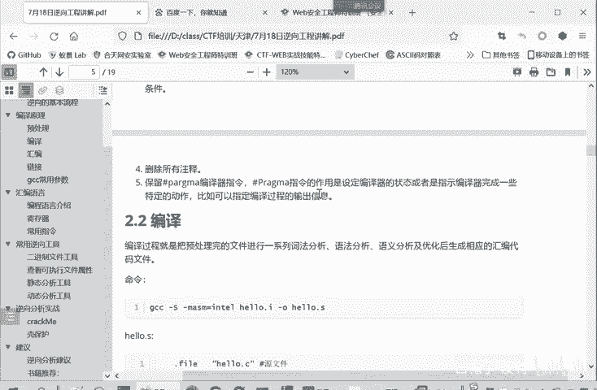

**预处理命令**：
```bash
gcc -E hello.c -o hello.i
```
*   `gcc`：GNU编译器套件。
*   `-E`：执行预处理操作。
*   `-o hello.i`：指定输出文件名为 `hello.i`。

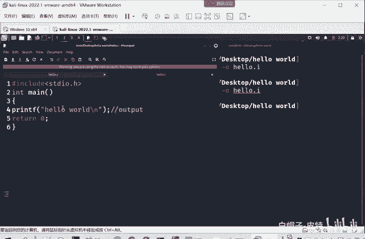

执行后，会生成 `hello.i` 文件。打开该文件，你会发现原本几行的代码变成了数百行，因为 `#include <stdio.h>` 被替换成了该头文件的实际内容，同时源代码中的注释也被删除了。

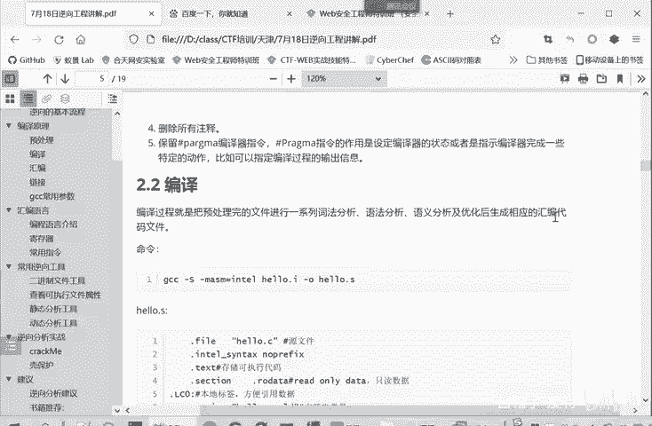

---

## 第二步：编译

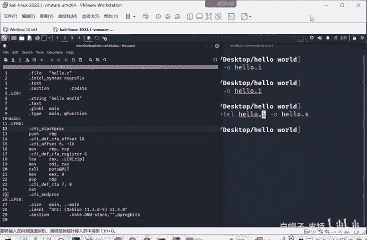

编译阶段将预处理后的文件（仍然是高级语言）转换为汇编代码。这个过程包括词法分析、语法分析、语义分析和代码优化。

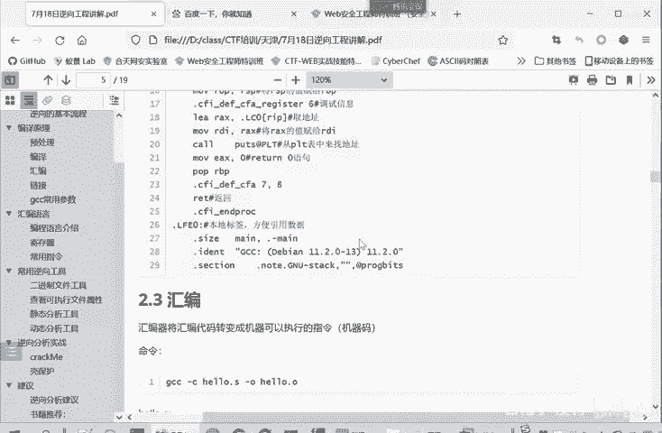

**编译命令**：
```bash
gcc -S hello.i -o hello.s
```
*   `-S`：执行编译操作，生成汇编代码文件。

执行后，会生成 `hello.s` 文件。这个文件的内容是汇编指令，与特定的CPU架构（如x86, ARM）相关。例如，你可能会看到 `push`, `mov`, `call` 这样的指令。

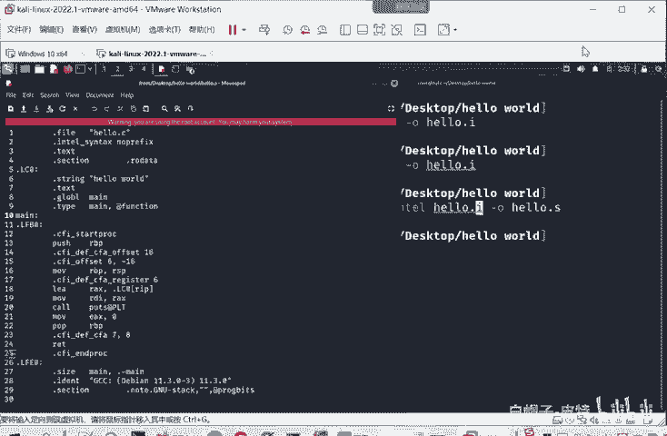

**汇编代码片段示例 (`hello.s`)**：
```assembly
    .file   "hello.c"          # 源文件名
    .text                       # 代码段开始
    .section    .rodata         # 只读数据段
.LC0:
    .string "Hello, World!"     # 定义的字符串常量
    .text
    .globl  main
    .type   main, @function
main:
    pushq   %rbp
    movq    %rsp, %rbp
    movl    $.LC0, %edi
    call    puts
    movl    $0, %eax
    popq    %rbp
    ret
```

---

## 第三步：汇编

汇编阶段将上一步生成的汇编代码（人类可读的符号指令）转换为机器码，即计算机能够直接理解的二进制指令。

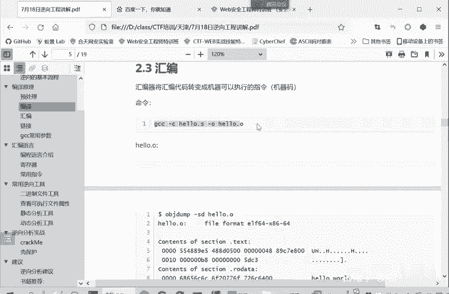

**汇编命令**：
```bash
gcc -c hello.s -o hello.o
```
*   `-c`：执行汇编操作，生成目标文件。

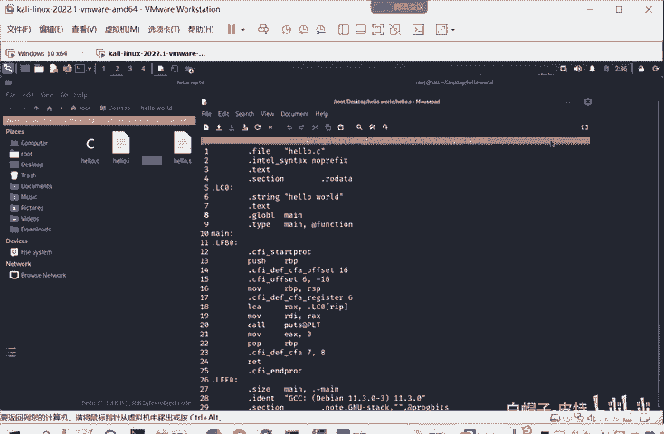

执行后，会生成 `hello.o` 文件（目标文件）。这是一个二进制文件，用文本编辑器打开会是乱码。我们可以使用 `objdump` 工具来查看其内容。

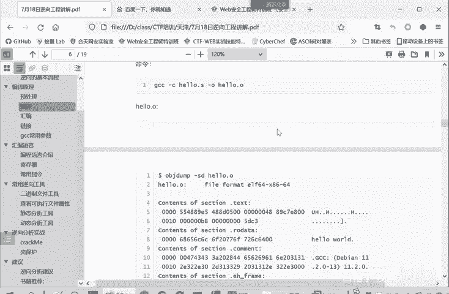

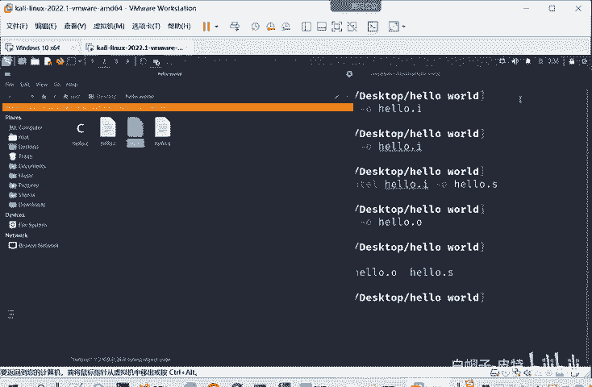

**查看目标文件命令**：
```bash
objdump -S hello.o
```
输出会显示文件的各个段（如代码段 `.text`、数据段 `.rodata`）的十六进制机器码，以及工具反汇编出来的对应汇编指令，帮助我们理解这些二进制码的含义。

---

## 第四步：链接

链接是最后一步。一个程序可能由多个源文件编译而成，或者需要调用系统库函数（如 `printf`）。链接器的作用就是将多个目标文件以及所需的库文件合并，解析它们之间的符号引用（例如，`hello.o` 中调用的 `printf` 函数在哪里），最终生成一个完整的、可独立执行的文件。

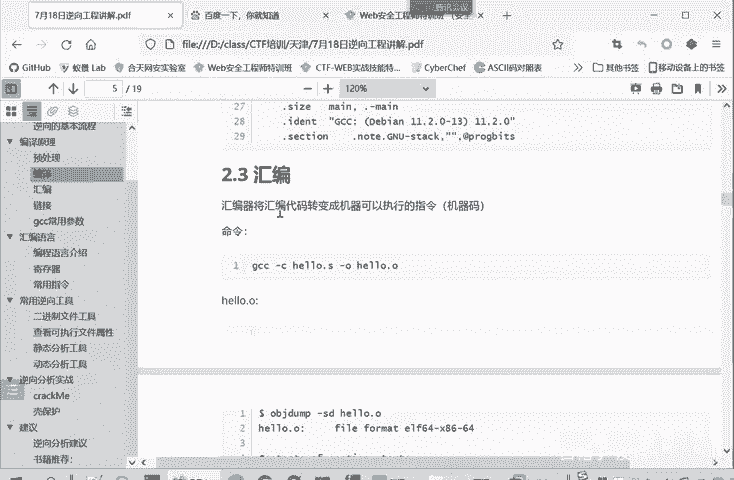

**链接命令（最简单形式）**：
```bash
gcc hello.o -o hello
```
或者直接从源代码一步完成所有步骤：
```bash
gcc hello.c -o hello
```

执行后，生成最终的可执行文件 `hello`。运行它，就会在终端输出 `Hello, World!`。

---

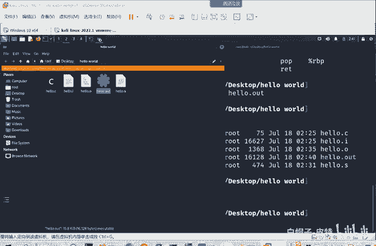

## 实用编译器参数

为了便于学习和分析编译过程，GCC 提供了有用的参数。

以下是两个常用参数：
*   **`-save-temps`**：在编译时保留所有中间文件（`.i`, `.s`, `.o`），方便我们查看每个阶段的输出。
    ```bash
    gcc -save-temps hello.c -o hello
    ```
*   **`-v`**：显示编译的详细流程，输出编译器每一步调用的工具和参数。
    ```bash
    gcc -v hello.c -o hello
    ```

---

## 总结与展望

本节课中我们一起学习了程序编译的四个核心步骤：**预处理**、**编译**、**汇编**和**链接**。我们看到了一个简单的C程序是如何从人类可读的源代码，逐步转化为机器可执行的二进制文件的。

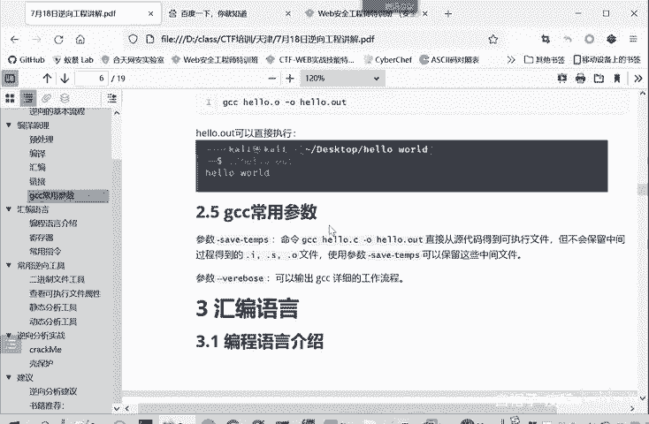

理解这个正向的“构建”过程至关重要。在逆向工程中，我们面对的正是一个已经完成链接的二进制可执行文件。我们的目标，就是像倒放电影一样，通过分析机器码和汇编指令，结合对编译原理的理解，来推测出程序原本的功能和逻辑，甚至近似还原出高级语言代码。下一节，我们将开始学习逆向工程的基石——汇编语言。