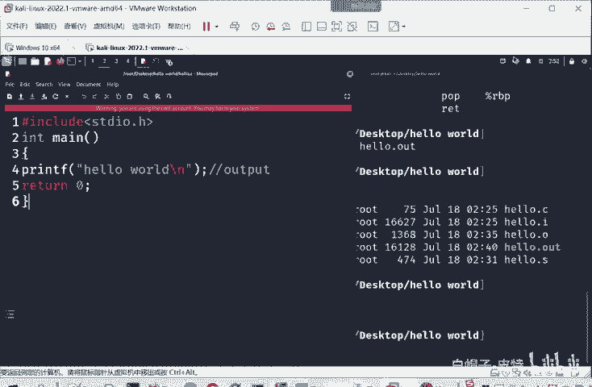
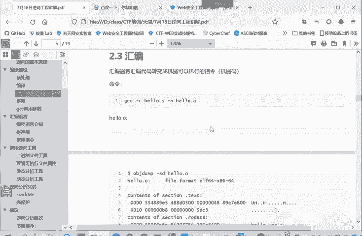

# CTF逆向入门：P27：逆向-汇编语言介绍 🧠

在本节课中，我们将要学习编程语言的发展历程，特别是汇编语言的核心概念、特点及其在计算机体系中的位置。理解这些基础知识是学习CTF逆向工程的关键第一步。

## 编程语言的发展与关系 🔄

上一节我们提到了编程语言，本节中我们来看看三种主要的编程语言类型及其关系。

计算机硬件是电子元件，它只识别两种状态：有电（高电平）或没电（低电平）。因此，CPU只能处理二进制内容。任何操作，包括十进制的加减乘除，都必须转换成二进制才能被CPU理解。所以，二进制语言是计算机语言的本质。

计算机发明之初，编程就是通过输入`0`和`1`这样的二进制数字来控制电脑完成任务。早期的编程方式甚至使用打孔纸带，有孔代表`1`，无孔代表`0`。这种直接由`0`和`1`组成的语言被称为**机器语言**。

对于开发者而言，只使用`0`和`1`编程非常麻烦且受限，只有专业人士才能操作。于是，**汇编语言**应运而生。

## 什么是汇编语言？ 🤔

汇编语言是一种低级语言（相对于高级语言而言），也称为符号语言。它用助记符（英文字母）代替机器指令的操作码，用地址符号或标号代替指令或操作数的地址。简单来说，就是用符号来代替`0`和`1`的序列。

例如，下面是一串机器指令（机器语言）：
```
10111000 00000001 00000000
```
我们可以规定这串序列用助记符 `MOV AX, 1` 来替代。这样，当需要执行将数据`1`移动到寄存器AX的操作时，就不必输入复杂的二进制序列，只需输入 `MOV AX, 1` 即可。这使得编程和理解变得容易得多。

汇编指令与机器指令是一一对应的关系，因此它几乎不影响程序的执行效率。但需要注意的是，汇编语言与CPU平台架构紧密相关。

## 汇编语言与平台架构 🖥️

在不同的硬件平台（架构）上，汇编语言对应着不同的机器指令集。常见的架构有：
*   **x86**：英特尔和AMD处理器使用的架构，常见于Windows个人电脑。
*   **ARM**：广泛应用于苹果手机、安卓手机等移动设备处理器。
*   **PowerPC**：历史上苹果电脑曾使用的架构。

不同架构的汇编指令其逻辑基本相似，但具体格式和指令不尽相同。只要掌握其中一种，理解其他架构就会容易很多。这类似于学习编程语言，学会C语言后，再学Java或Python的难度会大大降低。

## 高级语言的诞生 🚀

在机器语言和汇编语言之后，人们发现限制程序推广的关键因素是**程序编写的难度**和**程序的可移植性**。

计算机专家希望创造一种不依赖于特定计算机硬件、能在不同机器上运行的程序语言，从而避免为不同平台重复编写程序，提高开发效率。这就是**高级语言**。

高级语言（如C、Python）更符合人类的思维习惯。例如，打印“Hello World”的代码看起来就像一篇简短的英文说明，远比汇编或机器指令容易理解。

高级语言通过编译器或解释器转换成底层机器指令。开发者只需编写一份源代码，就可以在不同平台上编译执行，实现了跨平台。但高级语言离CPU“较远”，中间转换过程更多，因此其运行效率通常低于汇编语言和机器语言。



编程语言的发展趋势是：运行效率逐渐降低（因为CPU性能越来越强），但编写和理解难度越来越低，更易于上手。例如，Python比C语言效率低，但更好理解、更容易上手。

## 汇编语言的特点总结 📝

以下是汇编语言的核心特点：

1.  **代码简短，占用内存少，执行速度快**：这是相对于高级语言而言的优势。
2.  **便于记忆和书写**：相对于机器语言，使用助记符大大提升了可读性和可写性。
3.  **与CPU架构相关**：汇编语言的具体格式和指令集依赖于特定的CPU架构。



本节课中我们主要介绍**x86平台**的汇编语言，因为这是目前最普遍的架构。Windows系统和大多数使用英特尔或AMD芯片的电脑都基于x86架构。

最后，我们回顾一下开头的例子：机器指令 `10111000 00000001 00000000` 与汇编指令 `MOV AX, 1` 是相对应的，它们的含义完全相同。这条指令的作用是：将数值`1`传送到（赋值给）寄存器AX中。用类似高级语言的伪代码表示就是：**`AX = 1`**。

寄存器是CPU内部的小型存储单元，我们将在后续课程中详细讲解。

---

本节课中我们一起学习了编程语言从机器语言、汇编语言到高级语言的发展脉络，重点理解了汇编语言作为低级符号语言的核心概念、与硬件平台的关联性以及其高效但依赖架构的特点。掌握这些是步入CTF逆向世界的重要基石。