# CTF逆向工程：P28：寄存器与常用指令 🧠

在本节课中，我们将学习逆向工程中的核心硬件基础：CPU寄存器及其常用汇编指令。理解这些概念是分析程序执行流程、进行漏洞挖掘和CTF逆向挑战的关键第一步。

## 概述

寄存器是CPU内部的高速存储单元，其访问速度远快于内存。在逆向分析中，理解各类寄存器的作用以及它们如何通过汇编指令被操作，是读懂程序逻辑的基础。本节将系统介绍寄存器的分类、功能以及最常见的汇编指令。

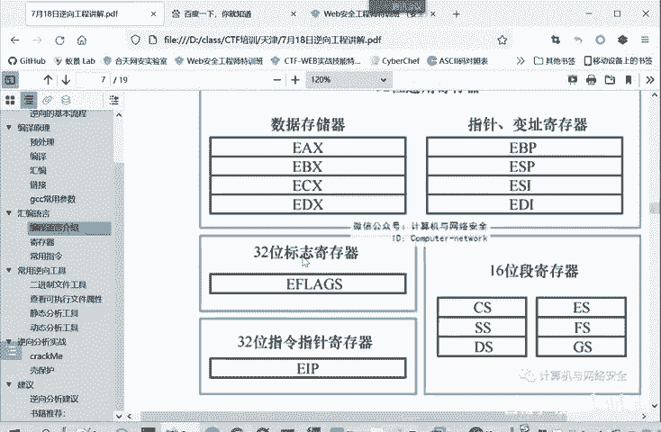

---

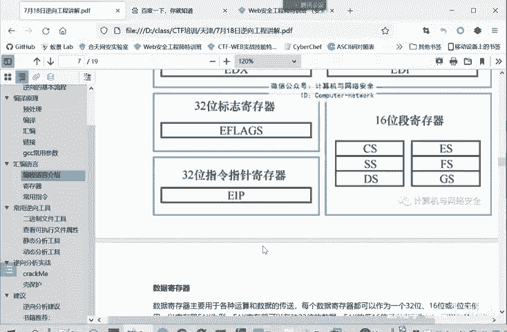

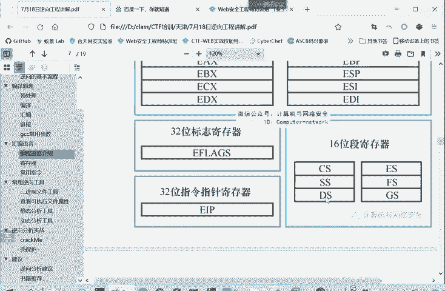

## 寄存器：CPU的高速存储单元

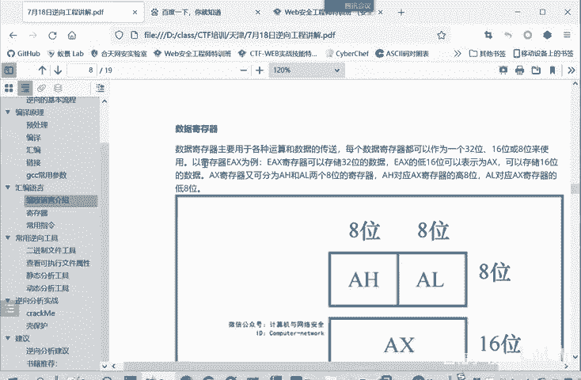

上一节我们讨论了软件工具的合法使用问题。本节中，我们来看看程序执行的核心硬件——寄存器。

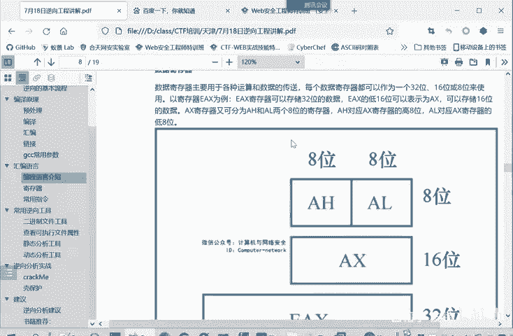

寄存器是集成在CPU内部的高速存储单元。它的访问速度比内存快得多，但单位存储空间的价格也更高。

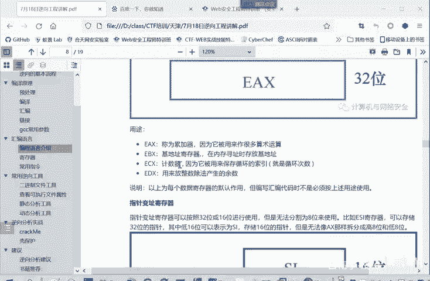

我们可以做一个简单的比较：
*   **寄存器**：速度最快，价格最高。
*   **运行内存（RAM）**：速度中等，价格中等。
*   **硬盘/存储空间**：速度最慢，价格最低。

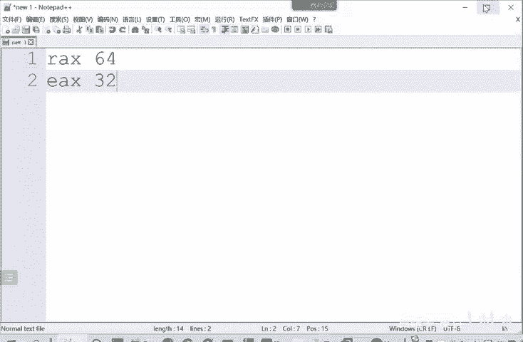

因为寄存器集成在CPU内部，所以它必须拥有极高的速度，才能匹配CPU的高速运行。

常用的寄存器主要可以分为以下四类：
1.  **通用寄存器**
2.  **段寄存器**
3.  **标志寄存器**
4.  **指令指针寄存器**

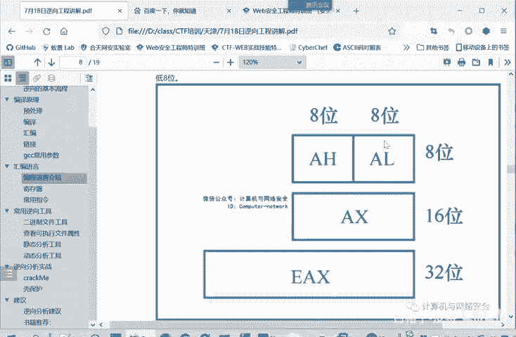

我们现在来具体看一下。

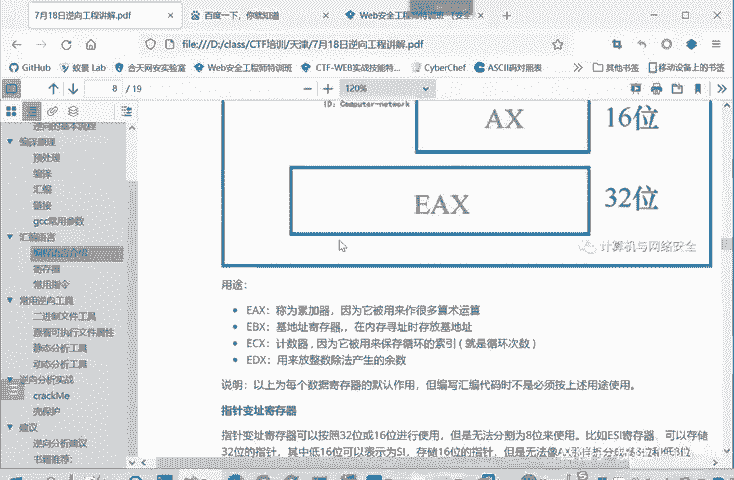

---

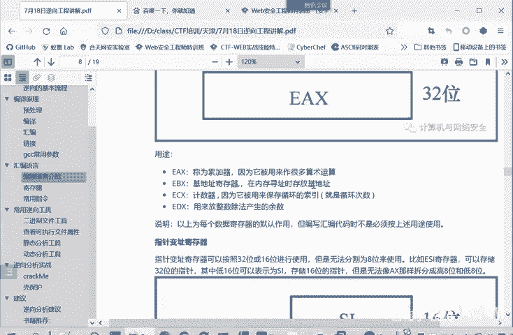

## 通用寄存器

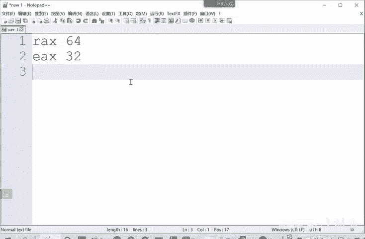

通用寄存器是程序中最常操作的一类寄存器，主要用于计算和数据传输。它们又可以分为**数据寄存器**和**指针变址寄存器**。

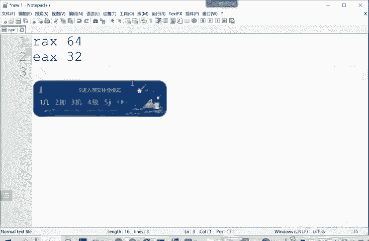

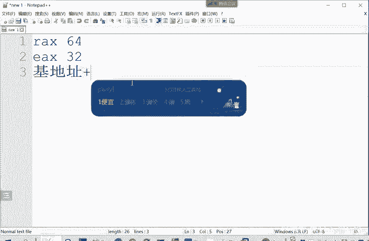

### 数据寄存器

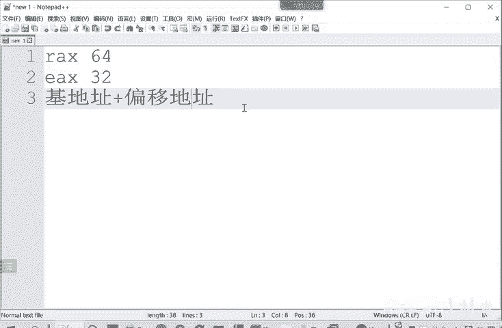

数据寄存器主要用于各种算术运算和数据的传输。随着CPU架构从16位扩展到32位、64位，它们的名称也发生了变化，但功能一脉相承。

以下是数据寄存器的位宽演变：
*   **16位CPU**：`AX`, `BX`, `CX`, `DX`
*   **32位CPU**：`EAX`, `EBX`, `ECX`, `EDX`
*   **64位CPU**：`RAX`, `RBX`, `RCX`, `RDX`

为了兼容早期的CPU，寄存器可以进行细分。例如，32位的`EAX`寄存器：
*   其低16位称为`AX`（兼容16位程序）。
*   `AX`又可以划分为高8位`AH`和低8位`AL`（兼容8位程序）。

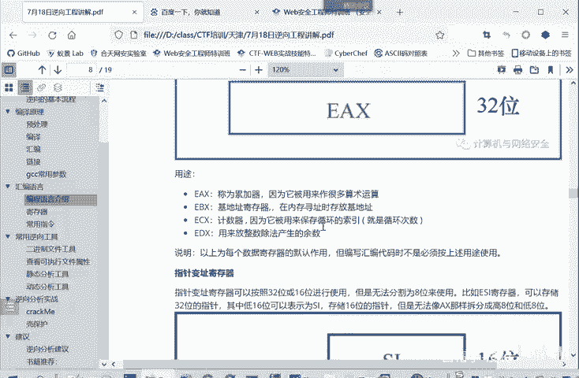

数据寄存器主要有四个，它们在编译生成的代码中通常有默认的用途：

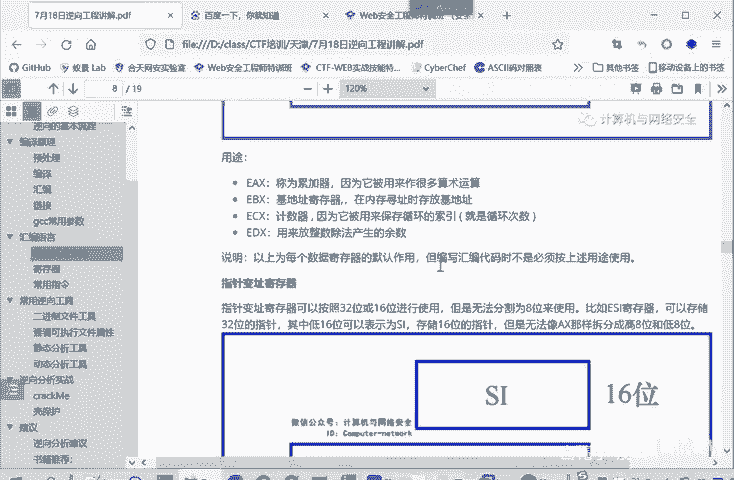

以下是四个主要数据寄存器的常见用途：
*   **`EAX` (累加器)**：通常用于算术运算，也常用来保存函数的返回值。公式可表示为：`函数返回值 → EAX`
*   **`EBX` (基址寄存器)**：常在内存寻址时存放基地址。内存地址通常由 **基址 + 偏移量** 确定。
*   **`ECX` (计数器)**：通常用来保存循环的次数。例如在 `for (i=0; i<100; i++)` 中，`100`这个次数就可能保存在`ECX`里。
*   **`EDX` (数据寄存器)**：常用来存放整数除法产生的余数。

> **注意**：以上是编译器遵循的常见约定。如果是人工直接编写汇编代码，可以不按此规则使用寄存器。但我们分析的大多数软件都是由编译器生成的，因此了解这些默认用途至关重要。

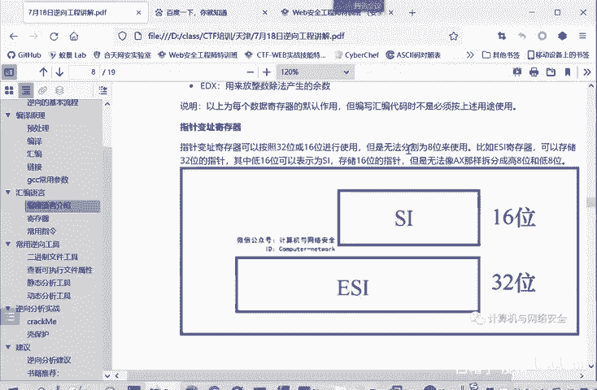

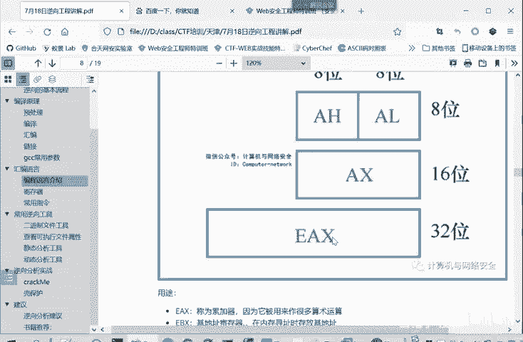

### 指针变址寄存器

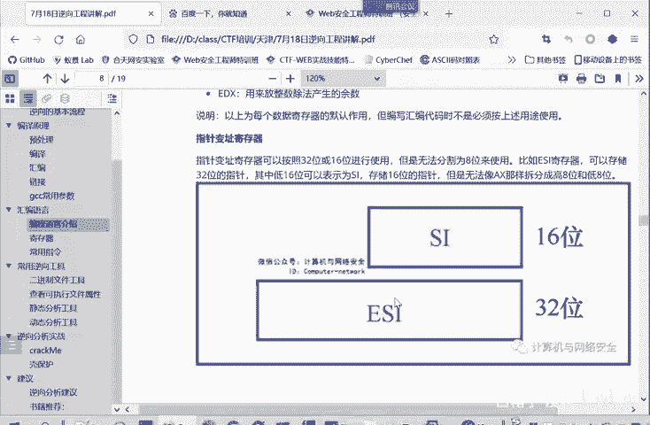

指针变址寄存器主要用于内存寻址和栈操作。它们同样支持16位(`SI`, `DI`, `BP`, `SP`)、32位(`ESI`, `EDI`, `EBP`, `ESP`)和64位(`RSI`, `RDI`, `RBP`, `RSP`)的访问，但不能像数据寄存器那样再细分为8位。

以下是四个指针变址寄存器的用途：
*   **`EBP` (基址指针)**：存放当前栈帧的基地址，可理解为“栈底”。
*   **`ESP` (栈指针)**：存放当前栈顶的地址，始终指向栈的顶部。
*   **`ESI` (源变址寄存器)**：在内存数据传送指令中，常存放**源数据串**的偏移地址。
*   **`EDI` (目的变址寄存器)**：在内存数据传送指令中，常存放**目的数据串**的偏移地址。

内存中一个数据的完整地址由 **段地址:偏移地址** 构成。例如，源数据的地址可能是 `DS:ESI`，目的地址可能是 `ES:EDI`。

---

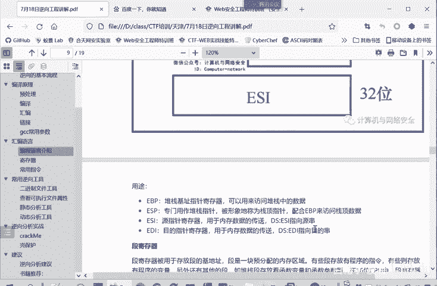

## 段寄存器、指令指针与标志寄存器

上一节我们介绍了通用寄存器，本节我们来看看其他几类重要的寄存器。

### 段寄存器

段寄存器用来存放内存段的基地址。内存被划分为不同的段，例如代码段存放指令，数据段存放变量，堆栈段存放栈数据。

在16位CPU中，主要有4个段寄存器：
*   `CS`：代码段寄存器
*   `DS`：数据段寄存器
*   `SS`：堆栈段寄存器
*   `ES`：附加段寄存器

32位CPU在此基础上扩展了`FS`和`GS`，也属于附加段寄存器，供程序特定情况下使用。

### 指令指针寄存器 (`EIP`/`RIP`)

这是一个极其关键的寄存器。`EIP`（32位）或`RIP`（64位）中保存着**下一条将要执行的指令的地址**。

其完整地址为 `CS:EIP`。
*   当程序顺序执行时，CPU会自动将当前指令的长度加到`EIP`上，使其指向下一条指令。
*   当执行`call`（调用）、`jmp`（跳转）等指令时，实质上是修改了`EIP`的值，从而改变了程序的执行流程。

### 标志寄存器 (`EFLAGS`)

标志寄存器用来记录CPU上一次运算结果的状态。它是一个多位寄存器，每位代表一个特定的标志。

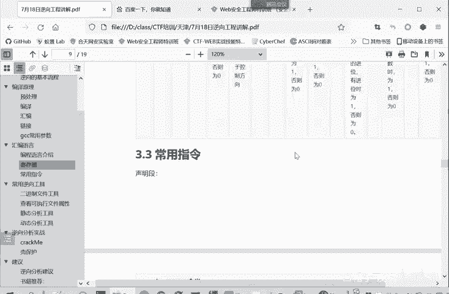

最常用的标志位包括：
*   **`ZF` (零标志位)**：如果上一次运算结果为0，则`ZF=1`；否则`ZF=0`。代码判断常为：`if (ZF == 1) { ... }`
*   **`CF` (进位标志位)**：记录无符号数运算的进位或借位。
*   **`OF` (溢出标志位)**：记录有符号数运算的溢出。

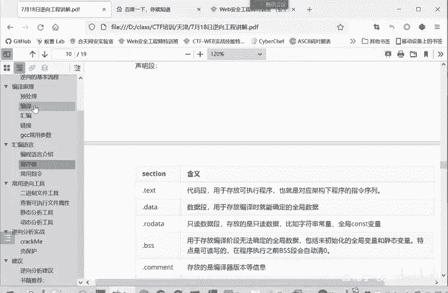

这些标志位直接影响`JE`（相等则跳转）、`JNE`（不相等则跳转）等条件跳转指令的执行。初学者无需死记，可在后续实战分析中结合具体指令加深理解。

---

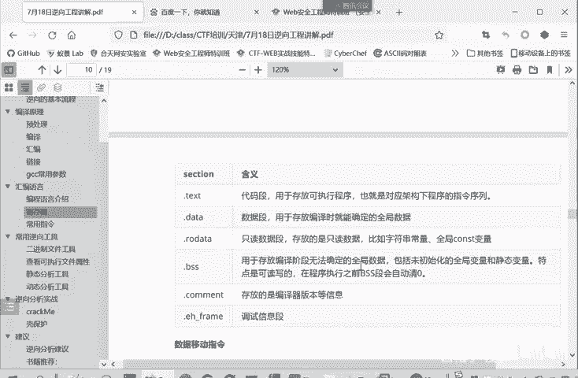

## 常用汇编指令

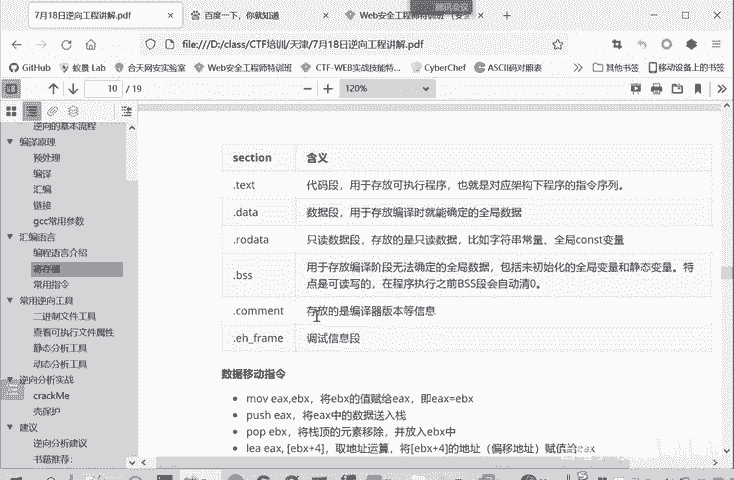

理解了寄存器的作用后，我们来看看如何通过汇编指令来操作它们。以下是一些最常用的汇编指令分类。

### 1. 段声明指令

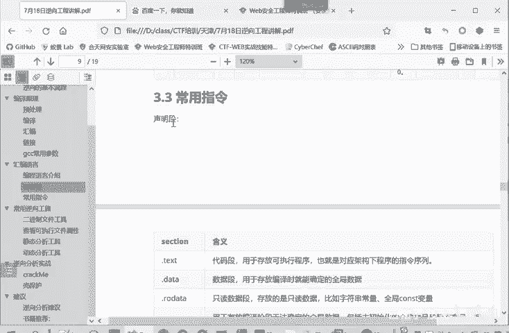

这些指令出现在汇编源码开头，用于声明不同的内存段。
```
.text          ; 声明代码段，存放程序指令
.data          ; 声明数据段，存放已初始化的全局/静态变量
.rodata        ; 声明只读数据段，存放常量
.bss           ; 声明未初始化数据段，程序加载时内容清零
.comment       ; 存放注释或编译器信息
```

### 2. 数据传送指令

这些指令用于在寄存器、内存和栈之间移动数据。
```
mov eax, ebx   ; 将ebx的值传送（赋值）给eax。相当于高级语言的 eax = ebx
push eax       ; 将eax的值压入栈顶，同时esp减小
pop ebx        ; 将栈顶元素弹出，并存入ebx，同时esp增大
lea eax, [ebx+4] ; 将“ebx的值加4”这个地址（而非该地址的内容）加载到eax
```

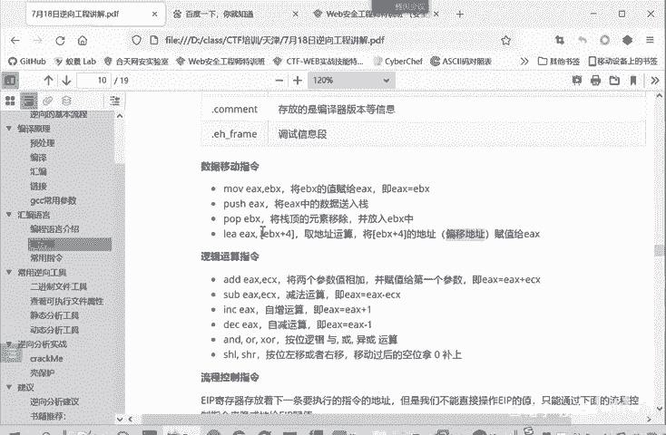

### 3. 算术与逻辑运算指令

这些指令用于执行基本的数学和位运算。
```
add eax, ecx   ; eax = eax + ecx
sub eax, ecx   ; eax = eax - ecx
inc eax        ; eax = eax + 1 （自增）
dec eax        ; eax = eax - 1 （自减）
and eax, ebx   ; eax = eax & ebx （按位与）
or  eax, ebx   ; eax = eax | ebx （按位或）
xor eax, eax   ; eax = eax ^ eax （按位异或，常用作 eax = 0）
shl eax, 1     ; 将eax的二进制位左移1位，相当于乘以2
shr eax, 1     ; 将eax的二进制位右移1位，相当于除以2（丢弃余数）
```

### 4. 流程控制指令

这些指令通过修改`EIP`的值来控制程序执行流程。
```
jmp label      ; 无条件跳转到标签label处执行
call function  ; 调用函数function。会将下一条指令地址压栈，然后跳转
ret            ; 从当前函数返回。从栈中弹出返回地址，并跳转回去
je  label      ; 如果ZF=1（上次比较结果相等），则跳转到label
jne label      ; 如果ZF=0（上次比较结果不相等），则跳转到label
cmp eax, ebx   ; 比较eax和ebx，设置标志寄存器（常与je/jne等联用）
```

---

## 总结

本节课中，我们一起学习了逆向工程的底层硬件基础。
1.  **寄存器**是CPU内部的高速存储单元，我们重点学习了**通用寄存器**（`EAX`, `EBX`, `ECX`, `EDX`, `ESI`, `EDI`, `EBP`, `ESP`）、**指令指针寄存器**（`EIP`）和**标志寄存器**（`EFLAGS`）的作用。
2.  程序通过**汇编指令**来操作寄存器和内存，我们介绍了**数据传送**、**算术逻辑运算**和**流程控制**三大类常用指令。
3.  理解`EIP`和标志寄存器如何被`jmp`、`call`、`je`等指令修改，是分析程序分支、循环和函数调用的关键。

掌握这些基础知识，就如同获得了阅读程序“机器语言”的字典，为我们后续进行动态调试、静态分析和CTF赛题实战打下了坚实的根基。