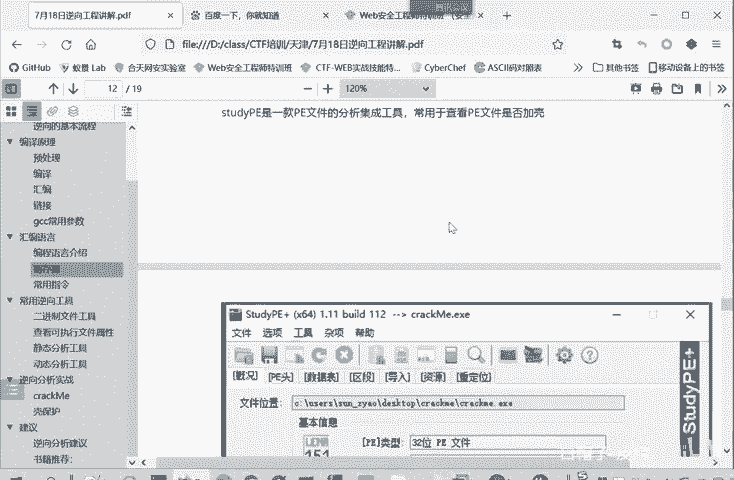
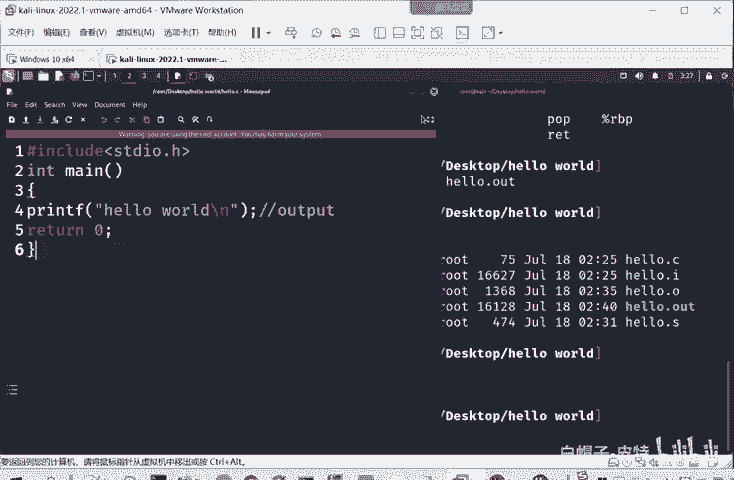
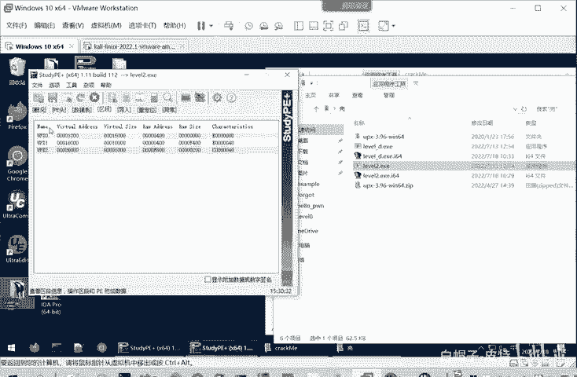
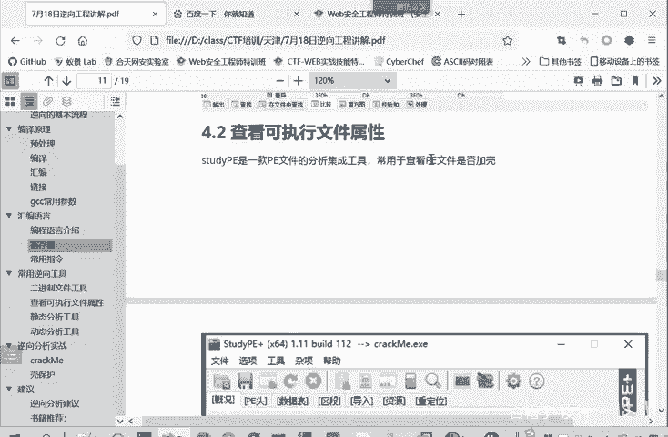

# CTF逆向工程入门：P29：常用逆向二进制文件工具

在本节课中，我们将学习逆向工程中用于查看和分析二进制文件的常用工具。掌握这些工具是进行静态分析的基础。

上一节我们介绍了汇编语言的基础知识，本节中我们来看看在实际操作中，如何利用工具来查看和解析二进制文件。

## 二进制文件查看工具

我们可以使用专门的工具来查看、修改和比较二进制文件。以下是几种常用的工具：

以下是常用的二进制文件查看工具列表：
*   **010 Editor**：适合打开大型文件，例如分析数GB大小的操作系统文件。
*   **UltraEdit (UE)**：功能全面，使用广泛。它可以用来打开和修改二进制文件。例如，可以将文件开头的 `7F` 修改为 `00` 或 `12`。
*   **二进制比较功能**：用于比较两个相关的文件。通常需要安装插件，如 `UltraCompare`。选择两个文件进行比较，工具会高亮显示相同和不同的部分。例如，灰色部分表示相同，而一处显示 `02`，另一处显示 `03` 则表示不同。通过比较，可以发现因个别字节的改变而导致程序执行逻辑完全不同的情况。
*   **Beyond Compare**：功能与 `UltraCompare` 类似。进行比对后，它会用不同颜色标记匹配的部分和差异的部分。这里比较的是两个文件的二进制内容是否相同。它同样以十六进制形式显示文件内容，其中每两个十六进制数（如 `CF`）代表一个字节（8个比特）。

## 查看可执行文件属性的工具

了解可执行文件的基本属性是逆向分析的第一步。

### Stud_PE (用于Windows PE文件)

`Stud_PE` 是一个用于查看Windows可执行文件（PE文件）属性的工具。

例如，分析一个名为 `crackme` 的程序。将文件拖入 `Stud_PE`，可以发现它是32位的PE文件，这意味着我们需要使用 `IDA 32` 来打开它进行分析。如果检测为64位PE文件，则应使用 `IDA 64`。

该工具还可以显示文件的哈希值（如MD5）。文件名可以任意修改而不影响程序功能，真正标识文件身份的是其哈希值。即使只修改程序的一个字节，其MD5值也会发生改变。

对于文件类型，如果不清楚，可以将结果在搜索引擎中查询。例如，可能显示为未加壳的汇编语言文件。

**识别加壳文件**：以一个名为 `level2.exe` 的文件为例。用 `Stud_PE` 查看，显示为64位PE文件，但文件类型显示为未知。查看其区段信息，会发现名为 `UPX0`、`UPX1`、`UPX2` 的区段。`UPX` 是一个常用的加壳工具，因此基本可以认定该程序已被加壳。

`Stud_PE` 可以全面查看PE文件的属性，包括位数、哈希值以及PE文件头的详细结构。

**PE文件**：即可移植可执行文件，是Windows操作系统下的可执行文件格式。

### readelf (用于Linux ELF文件)

在Linux系统中，我们使用 `readelf` 工具来查看可执行文件的属性。

例如，在终端中查看一个名为 `hello.out` 的可执行文件，使用命令 `readelf -a hello.out`。参数 `-a` 表示查看所有信息，输出内容会非常多。

输出信息开头通常包含一个 **magic number**（文件幻数），用于标识文件类型。无论是分析二进制文件还是其他类型文件（如PNG图片），只要属于同一种格式，其文件头部的幻数都是相同的。这在之前文件上传漏洞的课程中也提到过。

接着会显示文件类型，例如 `ELF 64-bit`，表明这是一个64位的ELF可执行文件。

通过 `Stud_PE` 或 `readelf` 了解了文件的总体情况后，我们就可以进入下一步——静态分析。

本节课中我们一起学习了逆向工程中查看二进制文件的常用工具，包括用于查看和编辑的二进制编辑器，以及用于识别文件属性的 `Stud_PE` 和 `readelf` 工具。这些是进行后续静态分析的重要基础。