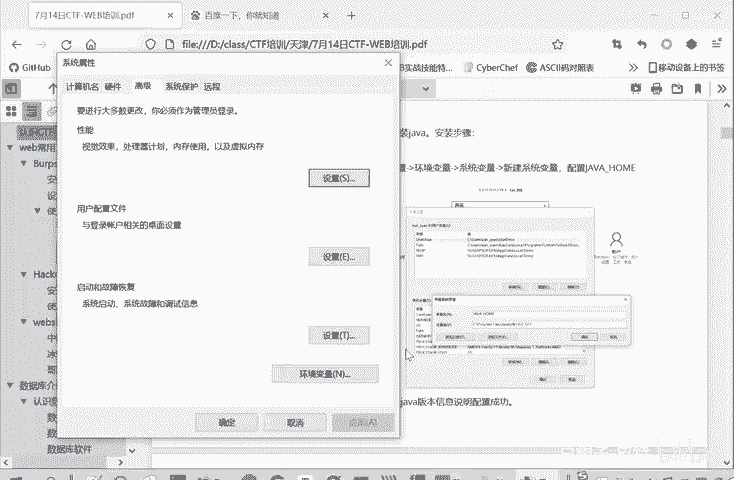
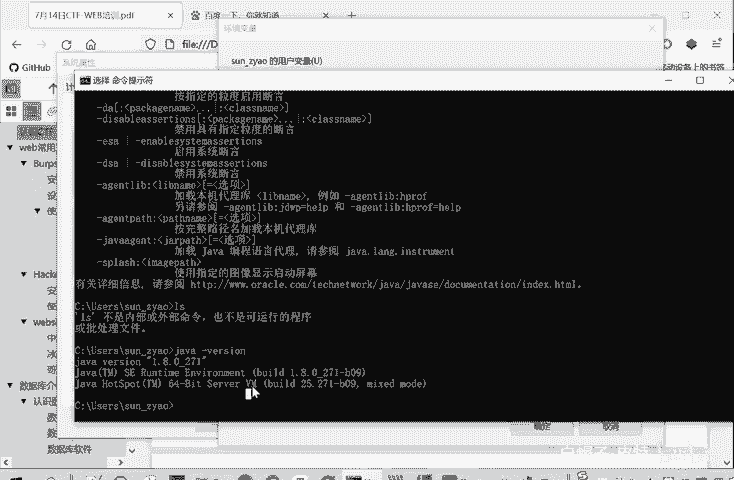
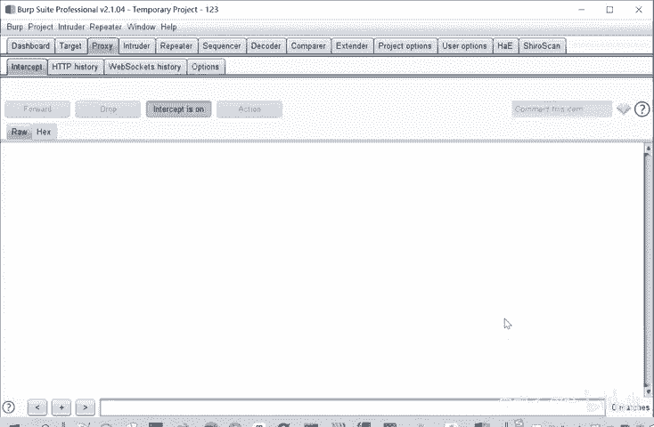

# CTF入门教程：P2：web-web常用工具-burpsuite安装 🛠️

在本节课中，我们将要学习CTF-Web方向一个至关重要的工具——Burp Suite的安装与配置。Burp Suite是进行Web安全测试、抓包和改包的必备工具。我们将从Java环境的安装开始，一步步完成Burp Suite的安装与激活。

## 安装Java环境

Burp Suite的运行依赖于Java环境，因此我们首先需要安装Java开发工具包（JDK）。

以下是安装Java的步骤：

1.  **获取安装程序**：JDK安装程序（例如 `jdk-8u121-windows-x64.exe`）通常包含在课程提供的工具包中。
2.  **运行安装程序**：双击安装程序，按照向导提示进行安装。你可以选择默认安装路径，也可以自定义路径。
3.  **配置环境变量**：安装完成后，需要配置系统环境变量，以便在任何命令行路径下都能使用Java命令。

### 配置Java环境变量

上一节我们介绍了Java的安装，本节中我们来看看如何配置环境变量，这是确保Java命令全局可用的关键步骤。

1.  打开“系统属性”设置。你可以在Windows设置中搜索“高级系统设置”来找到它。
2.  点击“环境变量”按钮。
3.  在“系统变量”区域（因其优先级高于用户变量），点击“新建”。
4.  新建一个变量，变量名设置为 **`JAVA_HOME`**。
5.  变量值设置为你的JDK安装路径（例如 `C:\Program Files\Java\jdk1.8.0_121`）。
6.  点击“确定”保存所有设置。

配置成功的标志是：在任意路径的命令行窗口中输入 `java -version` 命令，能够正确显示Java的版本信息，而不是报错“不是内部或外部命令”。

## 安装与激活Burp Suite

在成功配置Java环境后，我们就可以开始安装和激活Burp Suite了。

以下是安装与激活Burp Suite的步骤：

1.  **解压文件**：将提供的Burp Suite压缩包解压，你会得到 `burp-loader-keygen.jar` 和 `burpsuite_pro_vX.X.X.jar` 等文件。
2.  **运行加载器**：直接运行 `burpsuite_pro_vX.X.X.jar` 需要激活。为了学习目的，我们通过加载器启动。**首先确保Java已正确安装**，然后双击运行 `burp-loader-keygen.jar` 文件。
3.  **激活流程**：初次启动Burp Suite时会进入激活界面。
    *   将 `license` 文件中的全部内容复制，粘贴到激活界面的“License Key”框中，点击“Next”。
    *   选择“Manual activation”（手动激活）。
    *   在手动激活界面，将 `Activation Request` 框中的全部内容复制。
    *   回到 `burp-loader-keygen.jar` 窗口，将复制的内容粘贴到 `Activation Request` 框中，下方的 `Activation Response` 框会自动生成内容。
    *   将 `Activation Response` 框中的全部内容复制，粘贴回Burp Suite激活界面的 `Activation Response` 框中，点击“Next”即可完成激活。
4.  **后续使用**：激活只需进行一次。之后每次使用Burp Suite时，都需通过运行 `burp-loader-keygen.jar`，然后点击其中的 **`Run`** 按钮来启动。启动后可以选择创建临时项目或新项目，即可正常使用。

本节课中我们一起学习了Burp Suite的完整安装与配置流程，包括Java环境的安装、环境变量的配置以及Burp Suite本身的激活。掌握这个工具是进行Web安全测试的第一步，在后续的课程中我们将深入探索它的各项功能。