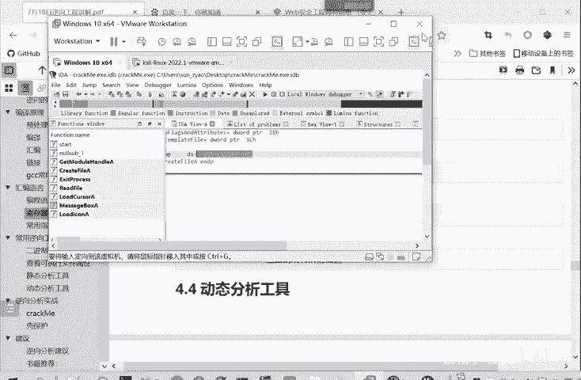
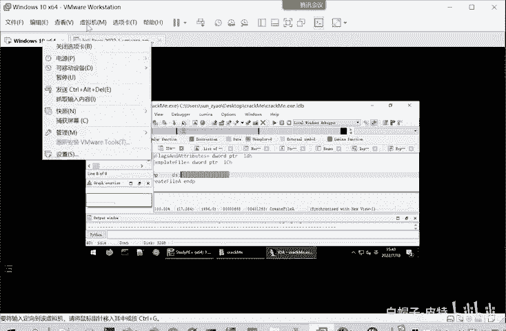
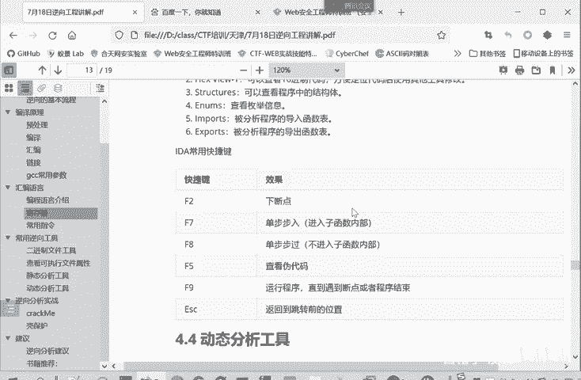

# CTF逆向入门：P30：静态分析工具 IDA Pro 🛠️

在本节课中，我们将要学习CTF逆向工程中一个至关重要的工具——IDA Pro。我们将了解它的基本概念、主要功能窗口以及一些核心的快捷键操作，为后续的实战分析打下基础。

## 什么是IDA Pro？

上一节我们介绍了逆向工程的基本概念，本节中我们来看看最核心的静态分析工具。

IDA Pro是“交互式反汇编器专业版”的缩写，通常简称为IDA。它是目前功能最强大的静态反汇编软件，可以说是进行逆向分析，或是在CTF比赛中进行Pwn（二进制漏洞利用）分析的必备工具。

IDA Pro是一款交互式、可编程、可扩展、支持多处理器架构与多平台的静态分析软件。虽然它是一款需要付费的商业软件，但其功能非常强大，已成为事实上分析恶意代码和二进制程序的标准工具。

## IDA Pro的主要窗口

当我们使用IDA打开一个程序时，IDA会自动对文件进行分析，识别程序中所有的函数以及可能用到的库函数和数据结构。分析完成后，IDA会显示其主界面，主要由以下几个窗口构成：

以下是IDA Pro启动后常见的几个主要窗口及其功能：

1.  **反汇编窗口（代码块视图）**：这是窗口的第一部分，以不同颜色区分不同的代码块（如代码段、数据段）。我们可以直接点击相应颜色的代码块来快速定位到程序的不同部分。
2.  **函数列表窗口**：此窗口罗列了IDA分析出的程序中所有函数，包括用户函数和库函数，方便我们快速导航。
3.  **主窗口（反汇编/图表视图）**：这是IDA的核心区域，默认显示当前函数的控制流图（CFG），也可以切换显示汇编代码、伪代码（C语言形式）或程序的其他结构化视图。
4.  **缩略图窗口**：显示整个控制流程图的缩略视图，可以通过拖动来快速浏览大型函数。
5.  **脚本输出窗口/终端**：可以在此处执行Python脚本，脚本的运行输出也会显示在这里。这极大地扩展了IDA的自动化分析能力。

## 主窗口中的子视图

在主窗口（反汇编/图表视图）中，还包含多个子视图标签页，用于展示程序的不同信息维度。

以下是主窗口内常见的几个子视图：

*   **IDA View**：默认视图，显示当前函数的控制流图或反汇编代码。
*   **Hex View**：以十六进制形式显示程序的原始字节内容，功能类似于专门的十六进制编辑器（如UltraEdit）。
*   **Structures**：查看程序中定义的结构体信息。
*   **Enums**：查看程序中定义的枚举类型信息。
*   **Imports**：查看程序导入的函数（通常是来自系统DLL的库函数），会列出函数名、地址及来源库。
*   **Exports**：查看程序导出的函数（通常是供其他模块调用的接口函数）。

> IDA Pro本质上是一个静态分析软件，但它的功能在不断集成和扩展。例如，它包含了类似十六进制编辑器的功能。实际上，后续课程中会讲到的动态调试功能，IDA Pro也具备，并且相当强大。它正朝着一个集成化、全方位的逆向分析平台方向发展。

## 核心快捷键操作

了解界面后，高效使用IDA离不开快捷键。这些快捷键在静态查看和动态调试中都至关重要。

以下是IDA中一些最常用和核心的快捷键及其功能：

*   **F2**：**设置或取消断点**。在动态调试时，程序运行到断点处会暂停，便于我们观察寄存器、内存状态。
*   **F7 (Step into)**：**单步步入**。在动态调试时，如果当前指令是一个函数调用（`call`），按下F7会进入该函数内部继续单步执行。
*   **F8 (Step over)**：**单步步过**。在动态调试时，即使当前指令是函数调用，按下F8也会将该函数视为一条完整指令执行完毕，而不会进入其内部。`F7`进入函数，`F8`跳过函数。
*   **F5**：**生成伪代码**。这是IDA的“魔法键”，可以将当前函数的汇编代码反编译成更易读的C语言风格伪代码。公式表示为：`汇编代码 --(F5)--> C伪代码`。但并非所有函数都能成功反编译。
*   **F9**：**运行程序**。在调试模式下，让程序开始运行，直到遇到断点或程序自然结束。
*   **ESC**：**后退**。在图形视图或反汇编窗口中，退回到上一个查看的位置。

## 总结

本节课中我们一起学习了CTF逆向工程的利器——IDA Pro。我们了解了它作为静态反汇编器的核心地位，熟悉了其主要的用户界面窗口，并掌握了`F2`（下断点）、`F7/F8`（单步调试）、`F5`（反编译）等关键快捷键的操作。这些基础知识是我们后续进行实际程序逆向分析的起点。在接下来的实战环节中，我们将打开具体的程序，进一步深入体验IDA Pro的强大功能。