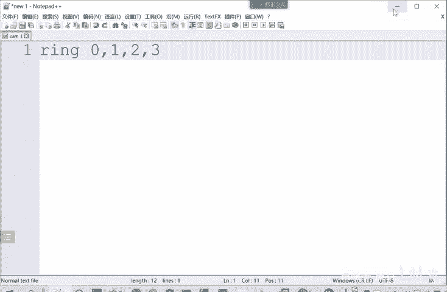
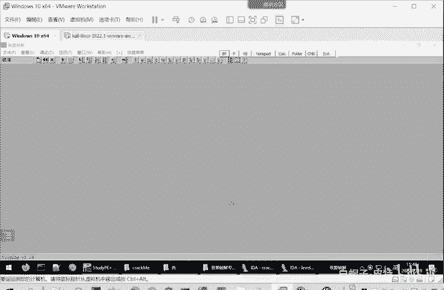
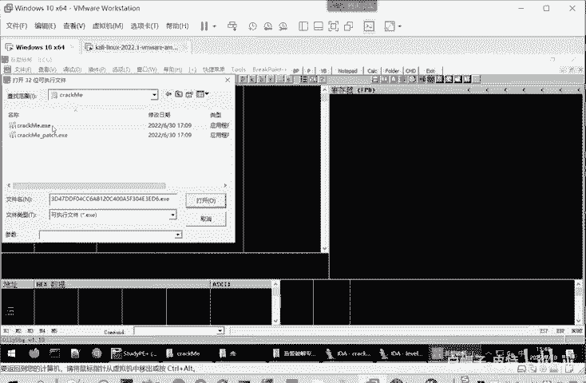
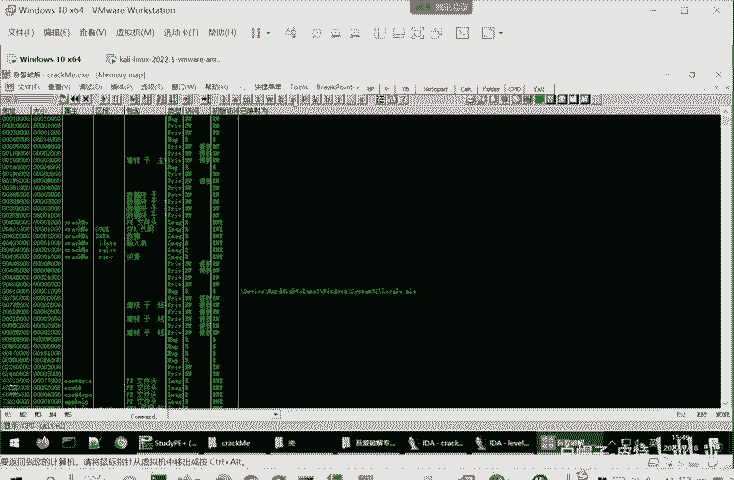
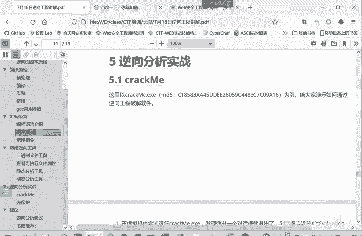

# CTF逆向入门教程：P31：动态分析工具 🛠️

在本节课中，我们将要学习CTF逆向工程中的动态分析工具，特别是OllyDbg（简称OD）的使用。动态调试是在程序运行过程中查找和修正语法与逻辑错误的关键技术。我们将详细介绍OD的界面、核心窗口功能，并通过一个简单的程序演示其基本操作。

## 动态调试与OllyDbg简介

上一节我们介绍了静态分析工具，本节中我们来看看动态分析工具。动态调试是在可执行程序的运行过程中，查找和修正程序中的语法错误和逻辑错误。本节将介绍OllyDbg。

其他工具如x64dbg、x32dbg等原理类似。我们以OllyDbg为例进行介绍，它简称OD，是一个Windows下Ring 3级的程序调试利器，主要用于动态调试。

Ring级别分为0、1、2、3。Ring 0是内核权限，Ring 3是用户权限，Ring 1和2是预留的，没有实际使用。

OD用于调试用户态程序。例如，我们现在使用的就是用户态程序。内核态程序OD无法调试。它主要调试Ring 3级别的程序，即我们用户运行的所有软件都能调试。

如果要分析操作系统的运行逻辑，OD可能会遇到问题。

## OllyDbg界面详解

下面我们继续介绍OD。OD打开一个可执行程序后，会显示其加载界面。默认主界面是CPU窗口。

CPU窗口由5个子窗口组成：
*   **反汇编窗口**：显示汇编指令及其对应的机器码。
*   **寄存器窗口**：显示当前寄存器的值。
*   **信息窗口**：显示输入输出信息。
*   **数据窗口**：以十六进制形式查看内存中的数据。
*   **堆栈窗口**：显示当前线程的堆栈状态。

我们打开一个程序来查看。

未打开程序时，界面如上图所示。

打开一个可执行程序（如`crackme`）后，当前显示的就是CPU窗口。它包含地址、机器码、汇编代码，你可以自行添加注释。旁边是寄存器窗口，显示EAX、ECX、EDX、EBX等寄存器的值。下方是堆栈窗口、信息窗口和数据窗口。

这是最主要的窗口。你也可以点击其他标签切换窗口，例如`Memory`查看内存窗口，`CPU`返回CPU窗口。

点击这里也可以切换窗口。但我们最常用的仍是CPU窗口。

## CPU窗口子窗口功能详述

下面详细介绍CPU窗口中的各个子窗口。

**反汇编窗口**
它分为地址栏、十六进制数据栏、反汇编代码栏和注释栏。地址栏显示指令的地址（通常是相对地址）。十六进制数据栏显示机器码。反汇编代码栏显示对应的汇编指令。注释栏用于添加调试备注。

**信息窗口**
用于解码反汇编窗口中选中指令的第一个参数，并将信息显示在此处。

**数据窗口**
主要用于查看内存中的数据。例如，当某些操作数据的地址存储在寄存器中时，你可以查看该寄存器的值，然后在数据窗口中跳转到该地址，查看具体的数据内容。

**寄存器窗口**
用于显示当前所选线程CPU寄存器的内容。这个窗口也允许我们修改寄存器的值，可以通过递增、递减或直接输入数值来修改。但EIP寄存器的值不能通过这种方式修改，必须使用跳转命令来改变。

**堆栈窗口**
用于显示当前线程的堆栈。当被调试程序暂停运行时，堆栈窗口通常会**自动滚动**，将当前ESP寄存器指向的地址放在窗口的第一行，以显示堆栈的实时信息。

这是堆栈窗口的示例。

## 逆向工具实战预览

这些窗口工具介绍完毕后，我们将在后续课程中看一下逆向工具的实际操作案例。

---

本节课中我们一起学习了动态分析工具OllyDbg的基础知识。我们了解了动态调试的概念，熟悉了OD的界面布局及其核心的CPU窗口、寄存器窗口、数据窗口和堆栈窗口的功能。掌握这些工具是进行有效动态逆向分析的第一步。