# CTF逆向工程：P32：逆向分析实战（上）🔍

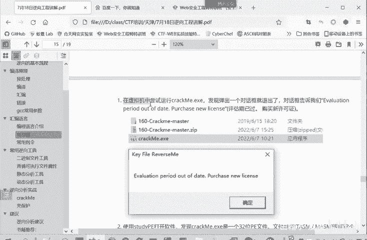

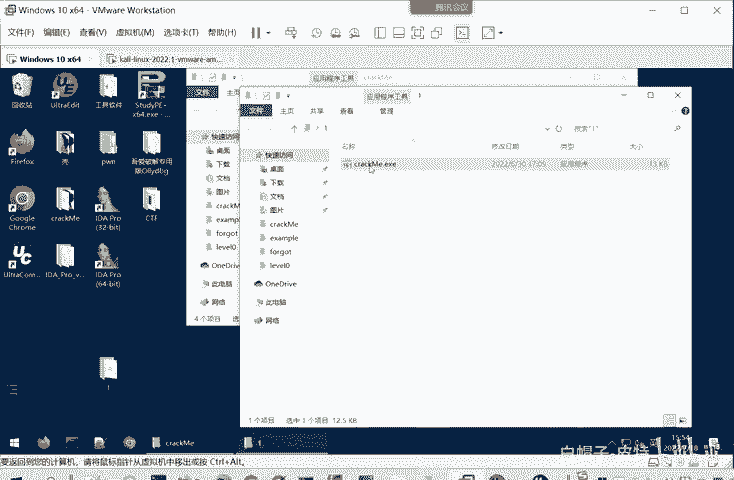

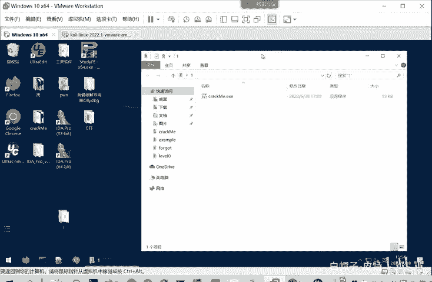

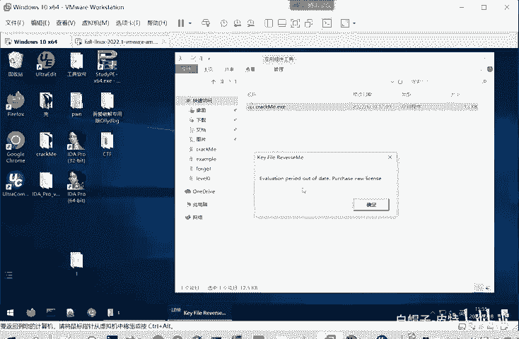

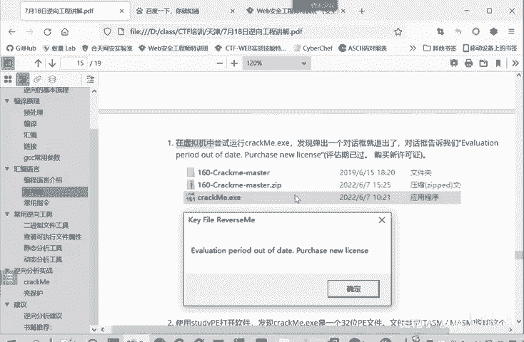

在本节课中，我们将通过一个具体的程序实例，学习逆向分析的基本流程。我们将从运行程序开始，逐步使用静态分析工具（如IDA）和动态调试技术，来理解程序的功能并找到破解它的关键点。整个过程将遵循“先整体后局部”的原则，避免陷入代码细节的泥潭。

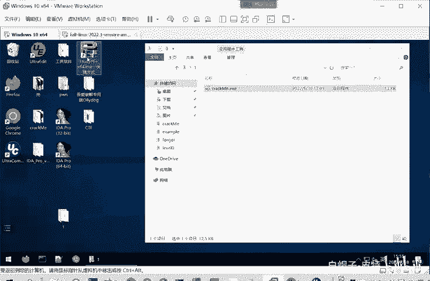

## 运行目标程序

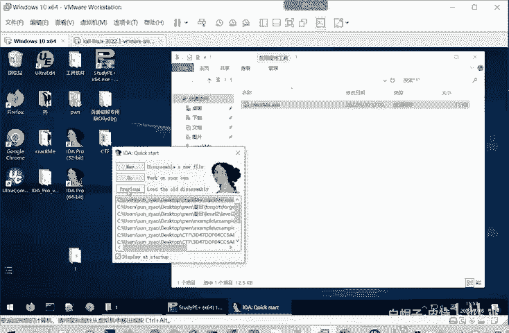

首先，我们需要在虚拟机环境中运行目标程序 `correct me`。在虚拟机中进行分析是安全的最佳实践，可以有效防止恶意程序感染主机或导致系统崩溃。如果出现问题，只需将虚拟机恢复到之前的快照即可。

运行程序后，它会弹出一个对话框，提示“有效期已过，请重新购买license”。这表明程序存在某种验证机制，我们的目标就是绕过这个验证。

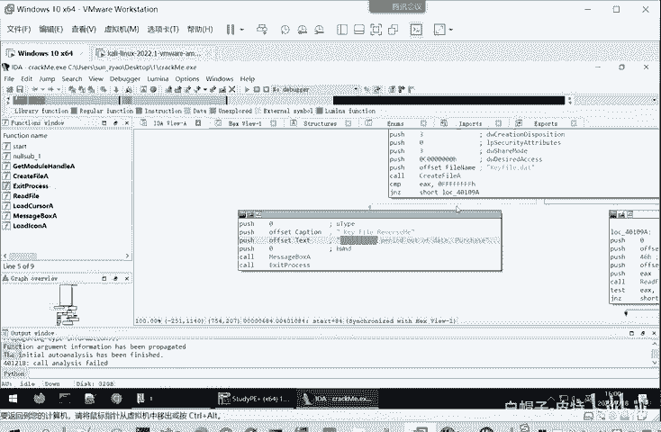

## 静态分析：使用IDA打开程序

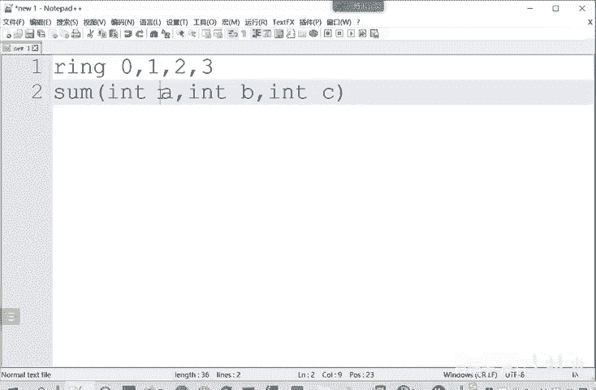

上一节我们运行了程序，了解了其表面行为。本节中，我们来看看如何通过静态分析工具来窥探其内部逻辑。

我们使用 `StudyPE` 工具检查程序，发现它是一个32位、未加壳的PE文件。这意味着我们可以直接使用反汇编工具进行分析。

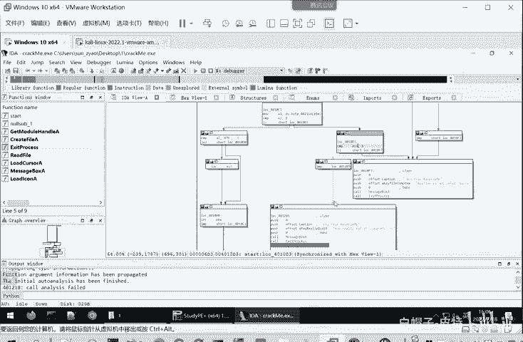

接下来，我们使用 **IDA 32位版本** 打开程序。IDA会自动分析二进制文件，并生成程序流程图、函数列表和交叉引用等信息。

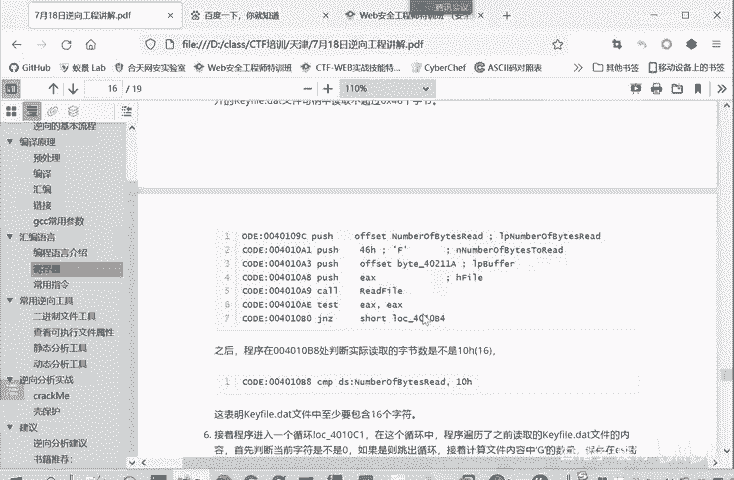

以下是使用IDA进行初步静态分析的步骤：
1.  在IDA中打开目标程序。
2.  查看“Exports”（导出）窗口，找到程序的入口点，通常是 `start` 函数。
3.  双击进入 `start` 函数，查看其汇编代码。由于该程序由汇编语言编写，IDA无法将其反编译为C语言伪代码，因此我们需要直接阅读汇编指令。
4.  观察程序流程图，重点关注关键的分支跳转点。例如，在入口函数中，我们很快发现一个根据 `EAX` 寄存器值（是否为 `-1`）进行跳转的关键判断。
5.  利用IDA的字符串识别功能，我们发现错误提示字符串 “Evaluation period out of date” 的引用位置，这对应了程序运行失败时弹出的对话框。

通过静态分析，我们初步推测：程序会尝试打开一个名为 `keyfile.dat` 的文件。如果文件打开失败（`EAX = -1`），则跳转到错误分支；如果成功，则进入后续的验证逻辑。我们的破解思路是确保程序能成功打开 `keyfile.dat` 文件，并且文件内容能通过后续的验证检查。

## 动态调试：验证猜想并定位关键代码

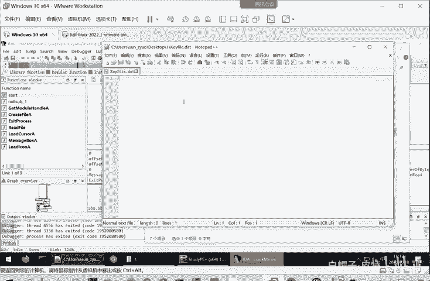

静态分析为我们提供了方向，但猜想需要验证。本节我们将使用IDA自带的调试器进行动态分析，一步步验证我们的推测并找到精确的破解条件。

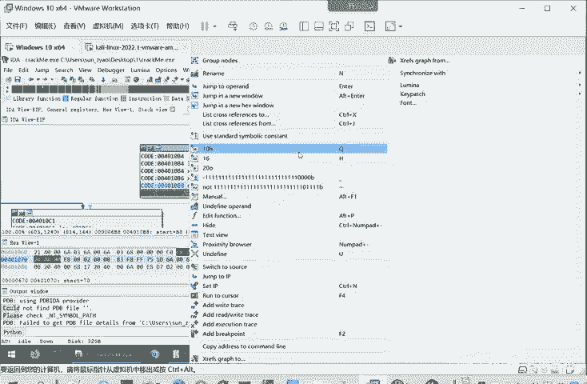

首先，我们在第一个关键跳转指令前设置断点（按 `F2`），然后启动调试（按 `F9`）。

1.  **第一次调试（无keyfile.dat）**：程序停在断点处，观察 `EAX` 寄存器的值为 `0xFFFFFFFF`（即 `-1`）。程序流果然跳向了显示错误提示的分支。这证实了文件打开失败的猜想。
2.  **创建keyfile.dat**：在程序目录下创建一个空的 `keyfile.dat` 文件。
3.  **第二次调试（有空文件）**：重新调试，`EAX` 的值不再是 `-1`，程序流跳向了另一个分支。这说明文件存在性检查已通过。
4.  **定位下一处验证**：程序随后进入另一段代码，其中包含一个读取文件内容并检查字节数的循环。我们在读取操作后的关键比较指令处下断点。
5.  **分析字节数检查**：继续运行，程序在比较读取的字节数（`NumberOfBytesRead`）和 `0x10`（十进制16）时，由于空文件读取字节数为0，条件“小于”成立，程序再次跳向失败分支。我们得出结论：**`keyfile.dat` 文件的内容必须不少于16个字节**。
6.  **填充文件内容**：在 `keyfile.dat` 中随意填入超过16个字节的文本（例如一串字母）。
7.  **第三次调试（有内容文件）**：重新调试，字节数检查通过。程序进入一个核心的循环结构。
8.  **分析核心验证循环**：我们在循环结束后的关键跳转处下断点。运行后发现，程序依然走向了失败分支。这说明文件内容不仅仅是“有数据”就行，还需要满足特定的格式或值。
9.  **深入分析循环体**：现在，我们必须仔细查看这个决定成败的循环。循环体汇编代码如下：
    ```
    cmp     al, 47h
    jnz     short loc_4010D0
    inc     esi
    loc_4010D0:
    inc     ebx
    jmp     short loc_4010C6
    ```
    这段代码的逻辑是：
    *   比较 `AL`（当前读取的字节）的值是否等于 `0x47`（即大写字母 **‘G’** 的ASCII码）。
    *   如果相等，则 `ESI` 寄存器加1。
    *   无论是否相等，`EBX`（可能作为索引）都加1，然后跳回循环开始，处理下一个字节。
    *   循环的退出条件由读取的字节总数控制。

因此，这个循环的**核心功能**是：扫描 `keyfile.dat` 文件的内容，统计其中字符 **‘G’** 出现的次数，并将次数记录在 `ESI` 寄存器中。

## 总结与破解条件推导

本节课中我们一起学习了逆向分析一个简单验证程序的全过程。我们结合静态分析与动态调试，由表及里地揭示了程序的运行逻辑。

通过分析，我们最终推导出成功破解（使程序显示“注册成功”类提示）需要满足的条件：

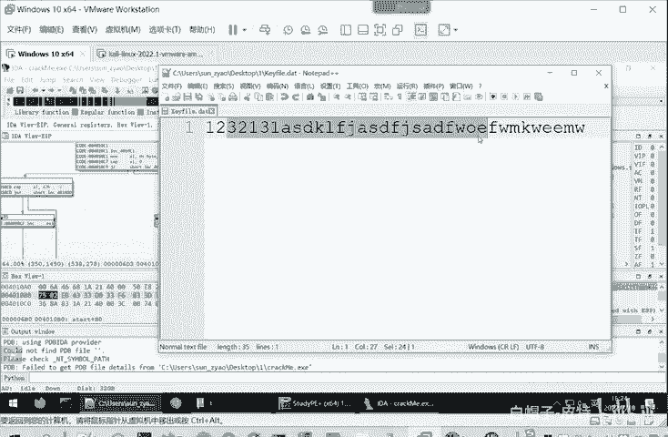

1.  **必要条件**：在程序同级目录下，必须存在一个名为 **`keyfile.dat`** 的文件。
2.  **内容长度**：该文件的内容长度**不能少于16字节**。
3.  **内容要求**：文件内容中，大写字母 **‘G’** 出现的次数**必须大于或等于8次**（因为后续代码会判断 `ESI >= 8` 才走向成功分支）。

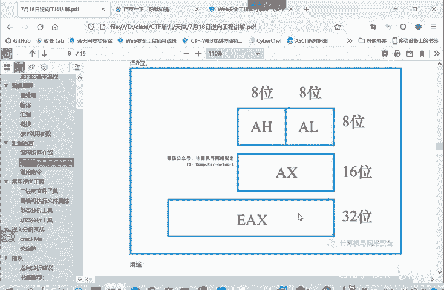

**核心逻辑公式化表示**：
*   文件检查：`if ( fopen(“keyfile.dat”) == FAIL ) then goto ERROR`
*   长度检查：`if ( bytes_read < 16 ) then goto ERROR`
*   内容验证：`success_count = count( file_content, ‘G’ )`
*   最终判决：`if ( success_count >= 8 ) then goto SUCCESS else goto ERROR`

根据以上条件，我们可以构造一个有效的 `keyfile.dat` 文件，例如内容为 `“GGGGGGGGxxxxxxxx”`（8个‘G’加上8个任意字符，总长度16字节），即可使程序验证通过。这个过程清晰地展示了如何通过逆向工程定位软件的保护机制并找到破解方法。