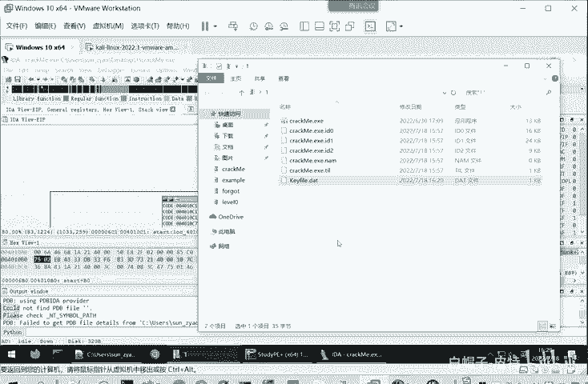
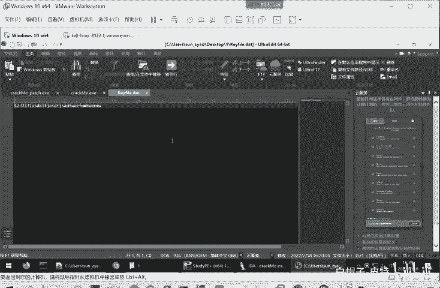
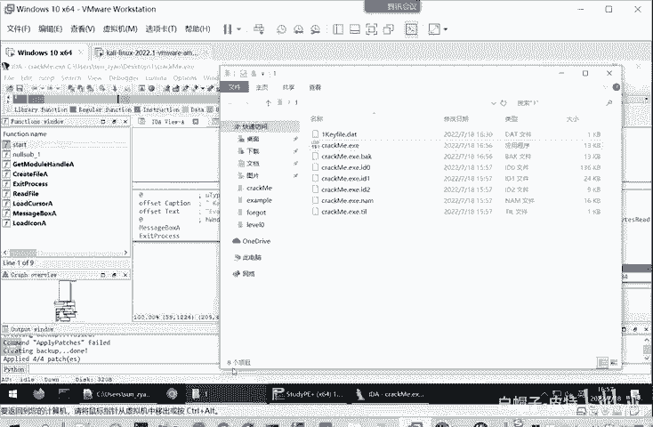
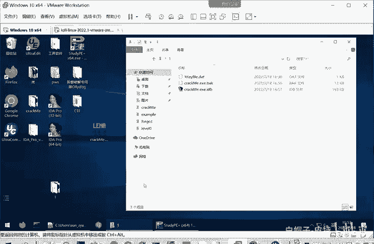
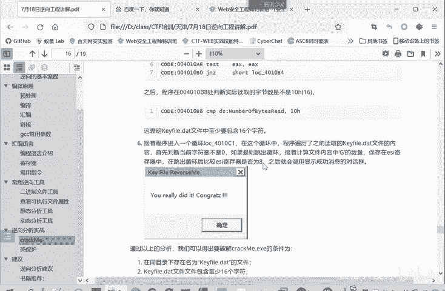

# CTF逆向工程：P33：逆向分析实战（下） 🧩

在本节课中，我们将继续深入逆向分析实战，学习如何通过动态调试和修改程序逻辑来破解一个简单的CrackMe程序。我们将重点关注如何分析程序流程、理解关键判定条件，并掌握两种不同的破解方法。

---

## 分析程序流程与关键判定 🔍

我们前面已经读入了程序中的字符串。例如，用十六进制编辑器打开查看时，我们看到类似`31 32 33`（对应ASCII字符“123”）以及后续的`64 66 6A 73`等数据。

程序将这些读取的字节值与`0x47`（即大写字母‘G’的ASCII码）进行比较。如果相等，则计数器`ESI`的值会增加。最后，程序会判断`ESI`是否大于或等于8。这意味着我们输入的字符串中必须至少包含8个字符‘G’。

基于此分析，我们可以对输入文件进行修改。既然程序需要读取‘G’，我们就可以多输入几个。为了演示，我们在中间插入字符“3123456789”。由于程序正在调试中并占用着文件，我们无法直接保存修改。需要先终止程序运行。

你可以点击“运行”让程序执行完毕，也可以直接点击“停止”按钮。现在，我们修改`keyfile.dat`的内容，例如输入三个‘G’，再输入三个‘G’，然后再输入三个‘G`。修改完成后，重新启动调试。

程序会停在断点处。此时，我们可以按`F8`键进行单步执行，仔细观察每一步的运行情况，以验证其是否与我们静态分析汇编代码的结果一致。

执行后，程序将`0x40211`地址处的数组元素（即我们输入的第一个‘G’，ASCII码为`0x47`）加载到寄存器`AL`中。由于`AL`不为零，程序跳转到比较环节，与`0x47`进行比对。如果相等，则跳转到`ESI`自增的代码块，`ESI`从0变为1。接着，`EBX`加1，指向数组的下一个元素，并跳转回循环开始处。

前三个字符都是‘G’，因此`ESI`会依次增加到3。当读取到第四个字符‘1’（十六进制`0x33`）时，由于它不等于`0x47`，程序不会跳转到`ESI`自增的代码块，而是继续执行后续逻辑。这与我们之前的分析完全一致：这个循环就是在计算输入字符串中大写字母‘G’的数量。

我们可以直接运行到下一个断点。此时，`ESI`的值是14（十六进制`0xE`），大于8。因此，程序会跳转到正确的分支（左边），并成功执行，弹出破解成功的提示框。至此，我们找到了软件的破解条件。

关闭调试器，直接运行修改后的`crackme.exe`程序，它会成功执行，因为它读取到了符合要求的`keyfile.dat`文件。如果我们重命名或删除该文件，程序则会像最初一样提示失败。

---

## 破解方法一：满足程序条件 ✅

通过上一节的分析，我们可以总结出破解此程序的条件：

以下是破解此程序必须满足的三个条件：
1.  同目录下必须存在一个名为 `keyfile.dat` 的文件（文件名固定）。
2.  `keyfile.dat` 文件的内容必须至少包含16个字符（由读取文件长度的检查决定）。
3.  `keyfile.dat` 文件内容中，大写字母 `G` 的数量必须大于或等于8个（由计数器 `ESI` 的最终值决定）。

只要创建一个满足以上条件的 `keyfile.dat` 文件，即可完成破解。

---

## 破解方法二：修改程序逻辑 ⚙️

有些情况下，携带额外的数据文件可能不方便。接下来，我们介绍第二种破解方法：直接修改程序本身的判定逻辑，使其无需 `keyfile.dat` 文件也能运行。

我们使用IDA Pro的`Keypatch`插件功能来修改汇编指令。首先，在没有`keyfile.dat`文件的情况下运行程序，它会在第一个分支处跳转到失败路径。

此时，我们可以修改此处的跳转指令。右键点击目标汇编指令，选择 `Keypatch` -> `Patch`。例如，程序原指令为`JNZ`（结果不为零时跳转），我们可以将其修改为`JZ`（结果为零时跳转），从而使程序走向相反的路径。

点击应用补丁（`Patch`）后，继续按`F8`单步执行。程序将不再跳转到失败分支。接着，我们运行到下一个关键判定点（例如检查文件是否成功打开、读取长度是否足够、‘G’的计数是否达标），并重复上述修改操作，将所有的失败跳转（如`JNZ`, `JL`）改为对应的成功跳转（如`JZ`, `JNL`）。

经过一系列修改后，即使不存在`keyfile.dat`文件，程序也能按照我们期望的路径执行到最后，显示成功提示。

需要注意的是，在IDA中进行的修改仅保存在其数据库项目中，并未影响原始可执行文件。为了生成修改后的可执行文件，我们需要导出补丁。

以下是应用补丁到可执行文件的步骤：
1.  点击菜单栏的 `Edit` -> `Patch program` -> `Apply patches to input file...`。
2.  在弹出的对话框中，建议勾选“创建备份”（`Create backup`）选项，这样会保留原始文件。
3.  点击`OK`，IDA会生成一个修改后的新可执行文件（例如`crackme_patched.exe`）。

运行这个新生成的程序，它将不再依赖`keyfile.dat`文件，实现“绿色”破解。

---

## 总结与回顾 📚

本节课我们一起学习了逆向分析实战的完整流程。

首先，我们从整体上把握程序流程，定位关键的分支跳转点，并分析其判定条件。通过动态调试，我们验证了静态分析的结果，明确了程序破解需要满足的三个具体条件，并通过创建符合要求的输入文件完成了第一种破解。

接着，我们学习了更进阶的第二种方法：直接修改程序的二进制指令，改变其判定逻辑。我们利用IDA Pro的`Keypatch`插件，将导致失败的跳转指令改为成功的跳转，最终生成了一个无需外部依赖即可运行的程序版本。

核心的逆向思路在于：**先理解程序的整体框架和关键判定，再深入分析关键代码（如循环、比较），从而弄清其运行机制**。切记不要一开始就逐行阅读所有汇编代码，那样很容易陷入细节而迷失方向。

第一个例题的破解过程就讲解到这里，接下来我们将继续分析第二个题目。