# CTF逆向入门：P34：逆向-壳保护 🛡️

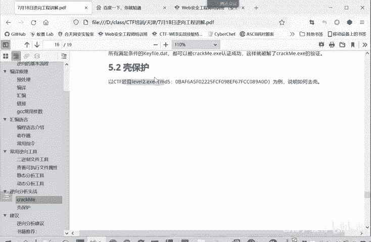

在本节课中，我们将学习如何分析和处理带有“壳”保护的程序。壳是一种用于保护软件不被轻易分析和逆向工程的工具，它会将原始程序代码进行压缩或加密。我们将通过一个实际案例，学习如何识别程序是否加壳，并使用工具进行脱壳，最终找到隐藏的Flag。

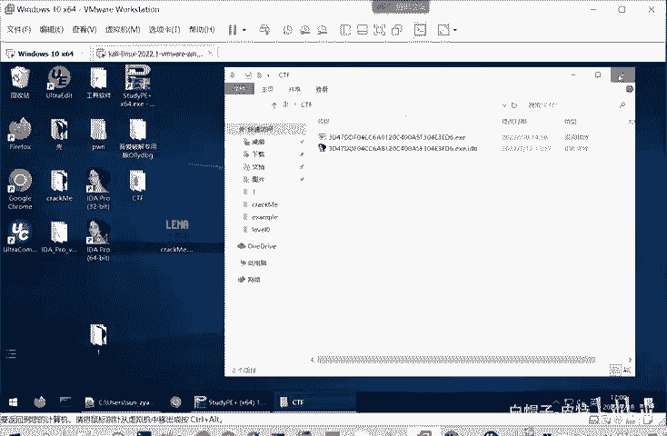

---

## 识别加壳程序

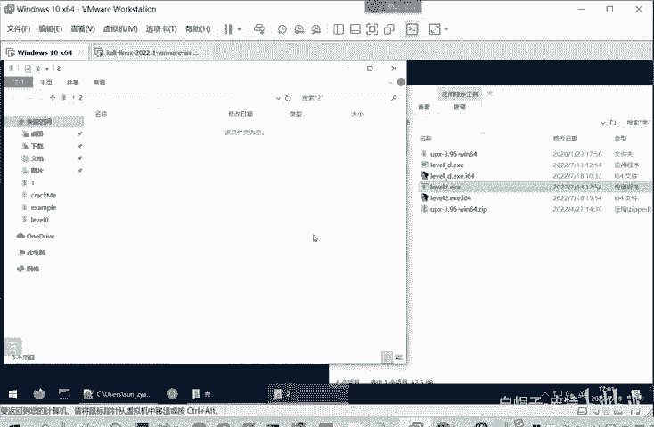

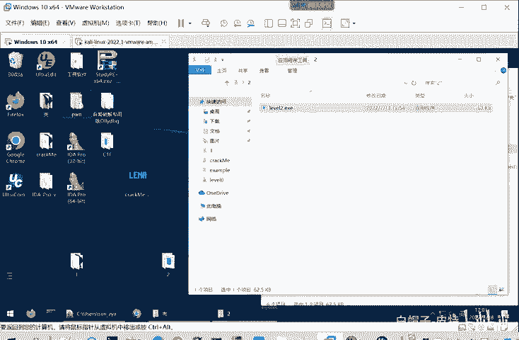

上一节我们介绍了逆向工程的基础，本节中我们来看看如何处理被加壳的程序。

首先，我们拿到一个名为 `level2` 的程序。直接运行它，会发现程序窗口一闪而过，没有任何输出。这是一个典型的加壳程序特征。

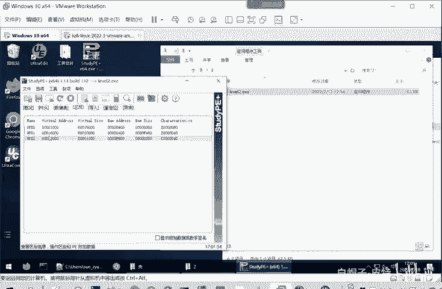

使用 `StudyPE` 工具查看程序信息，可以观察到以下关键点：
*   程序是一个64位的PE文件。
*   在区段信息中，可以看到名为 `UPX` 的区段。`UPX` 是一个常见的加壳工具，这强烈暗示程序被加壳了。

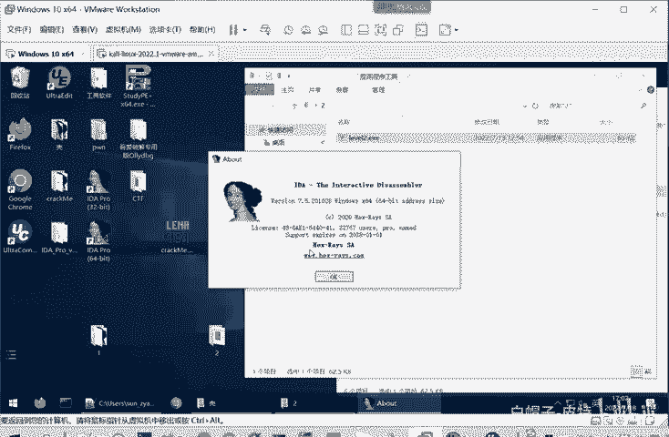


## 尝试分析加壳程序

为了理解加壳对分析的影响，我们可以尝试用逆向工具IDA直接打开加壳的程序。

以下是分析加壳程序时遇到的典型问题：
1.  IDA可以识别出程序结构，但反编译出的伪代码非常混乱且难以理解。
2.  核心逻辑被隐藏在复杂的、无意义的指令循环中。
3.  在字符串窗口 (`Strings window`) 中，只能看到一些库函数名称，找不到任何与程序业务逻辑相关的字符串（如提示信息、Flag等）。

这是因为我们分析的实际上是“壳”的加载器代码，它负责在内存中解密或解压原始程序并运行它，而不是程序本身的逻辑。因此，直接分析加壳程序效率极低，几乎无法找到关键信息。


## 使用工具进行脱壳

既然直接分析行不通，我们必须先对程序进行“脱壳”操作。对于使用 `UPX` 加壳的程序，我们可以使用 `UPX` 工具本身来脱壳。

`UPX` 工具既可以为程序加壳，也可以为程序脱壳。其核心命令如下：
*   **加壳命令**：`upx [选项] 文件名`
*   **脱壳命令**：`upx -d 文件名`

为了更方便地使用，建议将 `UPX` 工具所在目录添加到系统的环境变量 `PATH` 中。这样可以在任何命令行路径下直接使用 `upx` 命令。

添加环境变量的步骤简述如下：
1.  右键点击“此电脑”，选择“属性”。
2.  点击“高级系统设置”。
3.  在“高级”选项卡中，点击“环境变量”。
4.  在“系统变量”中找到并选中 `Path`，点击“编辑”。
5.  点击“新建”，将 `UPX` 可执行文件 (`upx.exe`) 所在的目录路径添加进去。

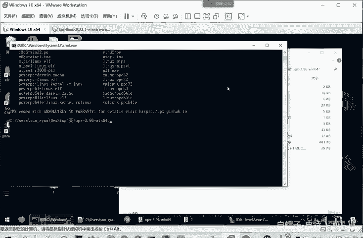

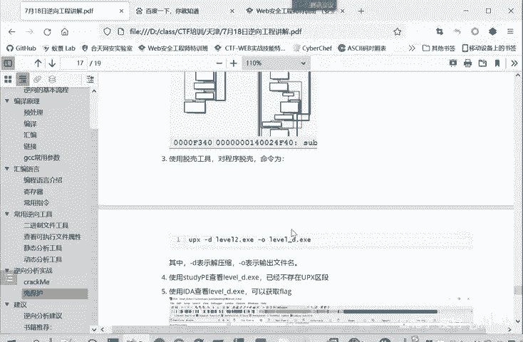

环境变量配置完成后，即可进行脱壳操作。

## 执行脱壳操作

打开命令行，导航到 `level2` 程序所在的目录，执行以下脱壳命令：

```bash
upx -d level2.exe -o level2_unpacked.exe
```


命令参数解释：
*   `-d`：表示解压缩（脱壳）。
*   `level2.exe`：是输入的加壳文件名。
*   `-o level2_unpacked.exe`：指定脱壳后的输出文件名。

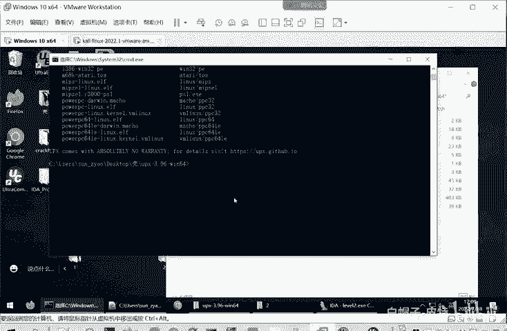

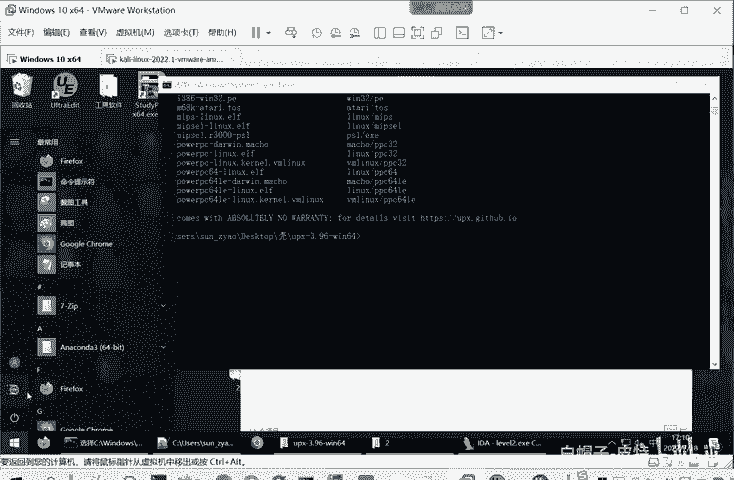

执行成功后，会显示文件体积的变化信息，这表明脱壳已完成。

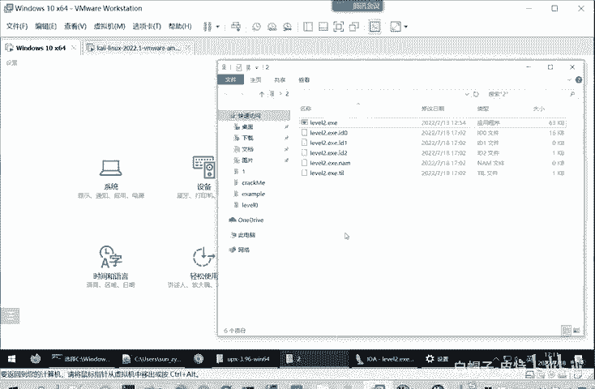


## 分析脱壳后的程序

现在，我们可以分析脱壳后的新程序 `level2_unpacked.exe` 了。

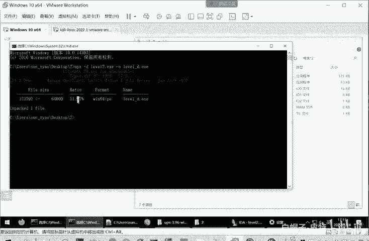

首先，再次使用 `StudyPE` 查看，会发现程序类型已从 `Unknown` 变为正常的 `Microsoft Visual C++`，并且区段中不再有 `UPX` 字样，确认脱壳成功。

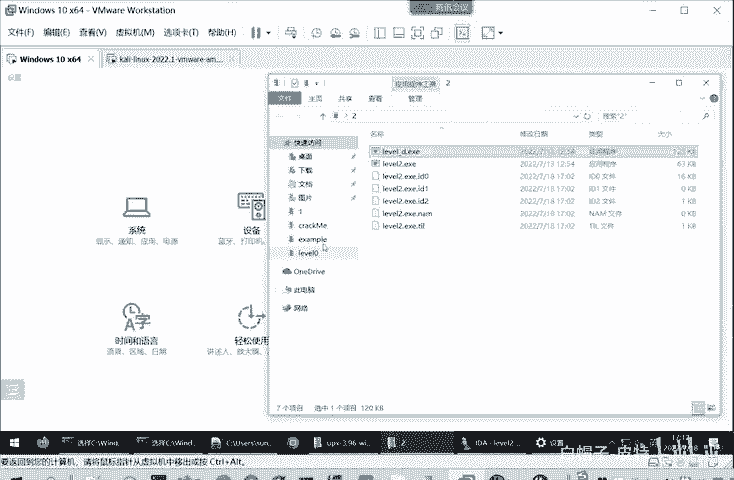

接着，使用 IDA 打开脱壳后的程序。这次的分析过程将变得清晰明了。

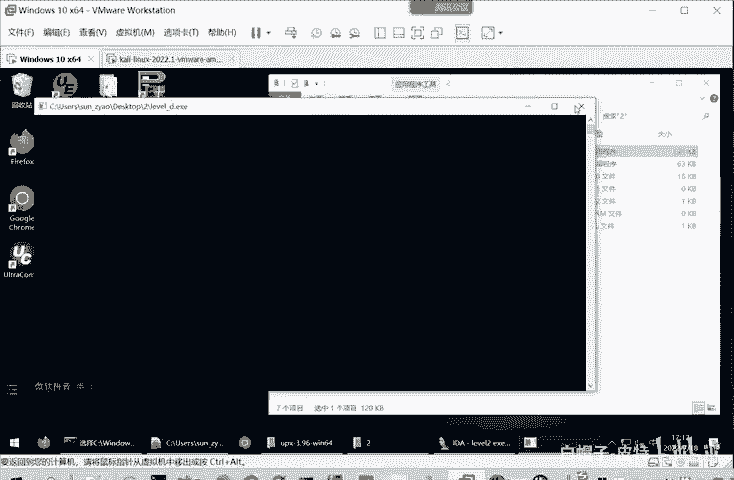

1.  IDA 能正确识别程序结构。
2.  进入主函数后，按 `F5` 键生成伪代码，逻辑非常简单直观。
3.  在伪代码或字符串窗口中，可以立即发现关键信息。


在字符串窗口中，我们直接看到了本题的Flag：**`WCTF2020{Just_UPX_-d}`**。

在某些CTF比赛中，Flag可能被直接硬编码在程序字符串中。找到这个字符串，即成功解题。

---

## 总结

本节课中我们一起学习了逆向工程中处理壳保护的基本流程：
1.  **识别壳**：通过工具查看区段、导入表等信息，判断程序是否被加壳（如发现UPX区段）。
2.  **脱壳**：针对已知的壳类型（如UPX），使用对应的工具（如 `upx -d`）进行脱壳，得到原始程序。
3.  **分析**：对脱壳后的程序进行静态或动态分析，从而定位关键逻辑并获取Flag。

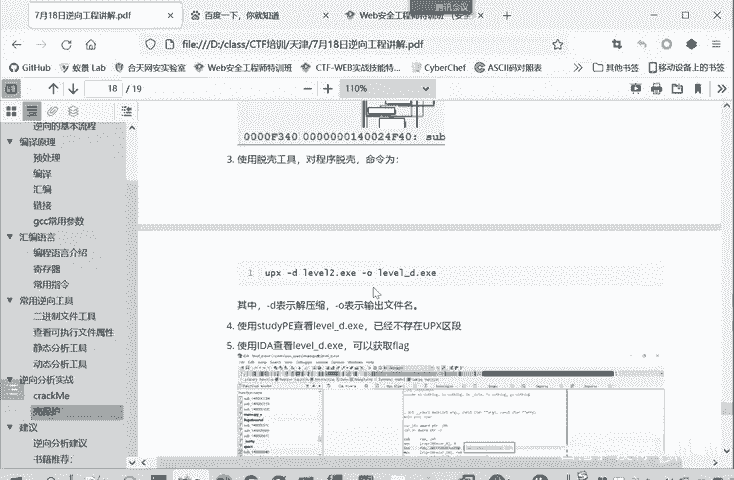

掌握脱壳是CTF逆向工程中的一项重要技能，它让我们能够绕过第一层保护，接触到程序真实的代码逻辑。