# CTF逆向入门教程：P36：逆向-书籍推荐与答疑 🧠

在本节课中，我们将回顾并整理逆向工程相关的推荐书籍，并解答一些常见的疑问。课程内容主要分为两部分：一是介绍几本对学习逆向工程至关重要的书籍，二是针对同学们提出的问题进行集中解答。

## 书籍推荐 📚

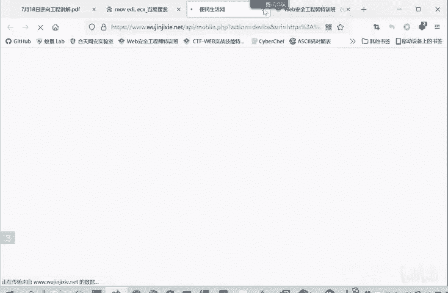

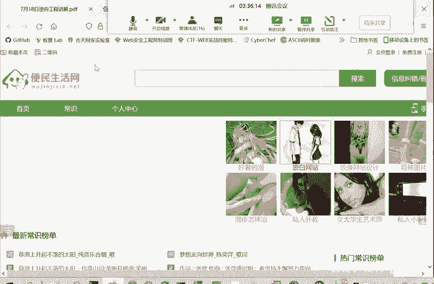

上一节我们介绍了逆向工程的基础工具，本节中我们来看看有哪些书籍可以帮助我们系统地构建知识体系。以下是几本核心的推荐书籍：

*   **《C和指针》**：这本书深入讲解了C语言的核心——指针。理解指针对于理解汇编语言中操作地址的概念至关重要，因为汇编层面的操作本质上也是地址操作。
*   **《汇编语言（第3版）》**（王爽著，清华大学出版社）：这是一本非常适合初学者的汇编语言教材。学习逆向工程，主要目标并非用汇编语言编写程序，而是能够**读懂**汇编代码。这本书能帮助你打下坚实的基础。
*   **《恶意代码分析实战》**：这本书在逆向分析领域被誉为“圣经”，内容非常全面，涵盖了恶意软件分析的各个方面，是深入学习逆向的必读书籍。

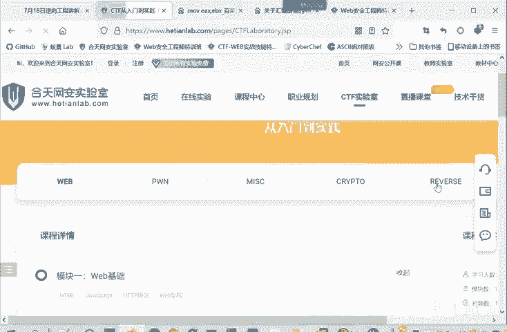

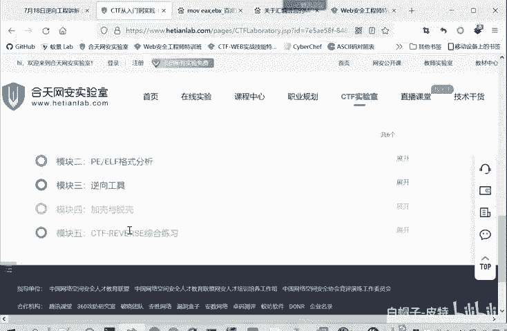

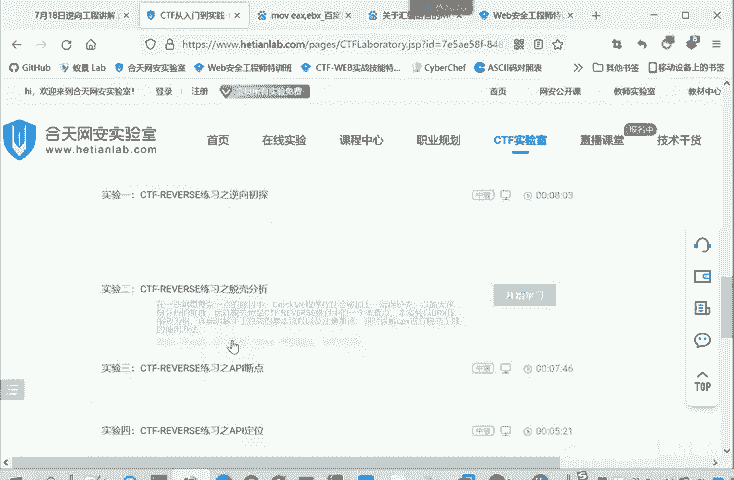

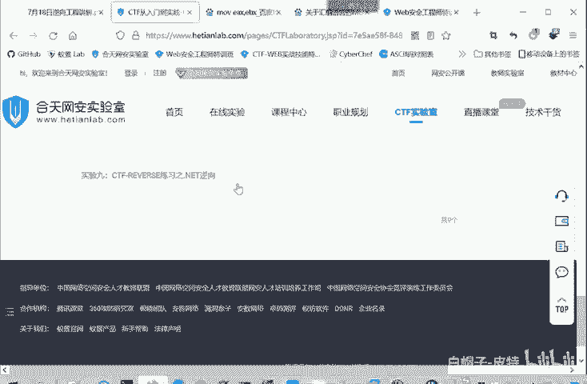

除了以上三本需要优先阅读的书籍外，以下书籍也值得参考：
*   《深入理解计算机系统》
*   《逆向工程核心原理》
*   《加密与解密》
*   安卓软件安全相关的书籍

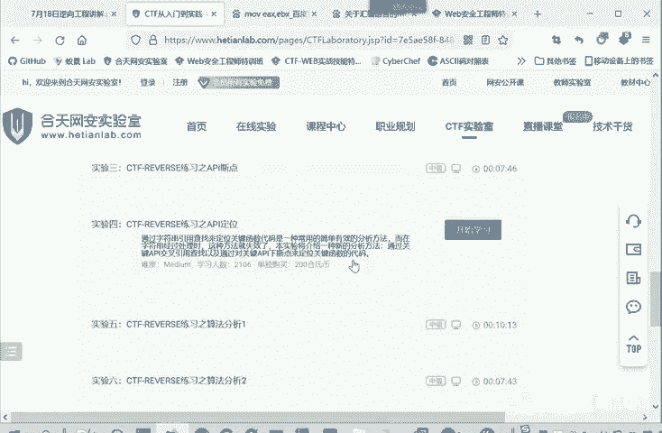

## 常见问题解答 ❓

在介绍了核心书籍之后，我们来看看同学们在学习过程中遇到的一些具体问题。

### 关于工具与资源

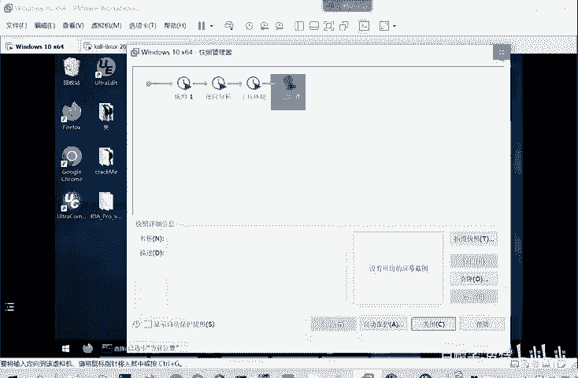

*   **逆向工具包中没有IDA？**
    是的，初始提供的工具包中没有包含IDA。因为IDA是商业软件，传播其破解版本需要谨慎。后续会将IDA的压缩包分享到网盘，供大家学习使用。
*   **StudyPE和IDA有什么区别？**
    这是两个不同层面的工具：
    *   **StudyPE** 是一个**PE文件结构分析工具**。它根据PE文件的格式规范，解析并展示文件的各个部分，例如：判断是32位还是64位程序、计算哈希值、指出代码段和数据段的位置、程序入口点等。它不涉及具体的汇编指令分析。
    *   **IDA** 是一个**交互式反汇编器**。它直接读取二进制文件，将机器码根据指令集对应关系反汇编成**汇编代码**，并利用内置算法尝试将汇编代码**反编译**成更易读的C语言伪代码。它专注于代码逻辑的分析。
*   **逆向分析应该在什么环境下进行？**
    建议在**虚拟机**（如VMware或VirtualBox）中的Windows系统（Win7或Win10）中进行。这样做的好处是：
    1.  安全性高：分析可能带有风险的程序时，不会影响宿主机。
    2.  可回溯：可以利用虚拟机的快照功能，随时恢复到干净状态。
*   **IDA的插件如何安装？**
    以Keypatch插件为例，通常只需将插件文件（如`.py`文件）放入IDA安装目录的 `plugins` 文件夹中，然后重启IDA即可。分享的破解版IDA通常会集成一些常用插件。

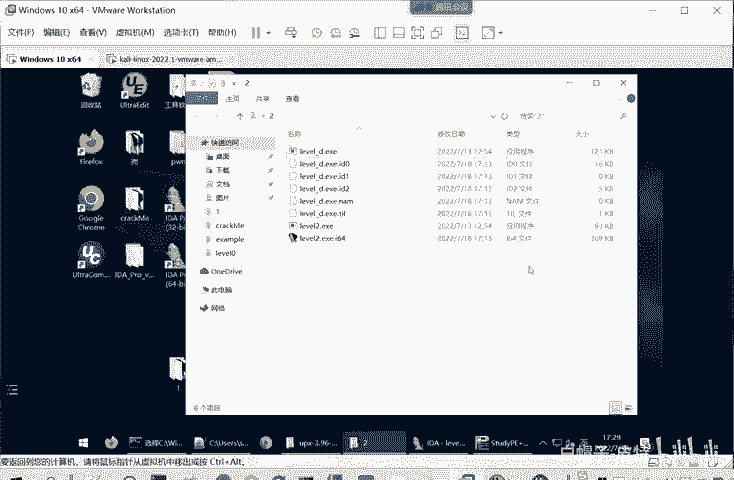

### 关于学习路径与难点

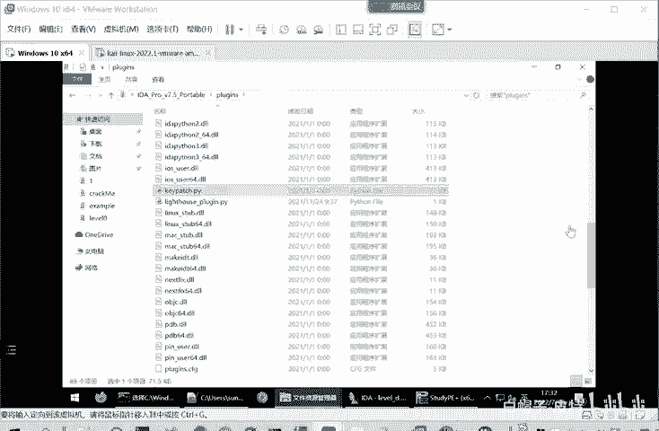

*   **没有汇编语言基础，学习逆向是否非常困难？**
    可以这么说。逆向工程通常是CTF比赛中难度最高的方向之一。因为其直接处理二进制程序，理解和分析过程都比较复杂。**汇编语言是逆向工程的基石**。虽然IDA等工具能反编译出C伪代码，但并非所有代码都能完美反编译，且反编译结果可能存在误差。因此，直接阅读和分析准确的汇编代码是必备技能。
*   **汇编语言难学吗？**
    汇编语言本身并不复杂。其指令（如 `MOV EAX, EBX`，类似于高级语言的赋值 `a = b`）大多简单明了。学习的重点在于理解CPU如何**寻址**，即如何访问和操作内存中的数据。推荐阅读《汇编语言（第3版）》，掌握基础指令和寻址方式即可入门。遇到不认识的指令，随时使用搜索引擎查询即可。
*   **如何查找汇编指令的含义？**
    遇到不理解的汇编指令（例如 `MOV EDX, EDI`），最直接的方法就是使用搜索引擎（如百度）进行查询。通常都能找到详细的解释和示例。
*   **有哪些练习平台？**
    可以访问像“合天网安实验室”这样的平台，里面包含许多CTF题目和实验环境，特别是“逆向游乐园”等板块，提供了从基础到实战的题目，部分还配有解答，非常适合练习。

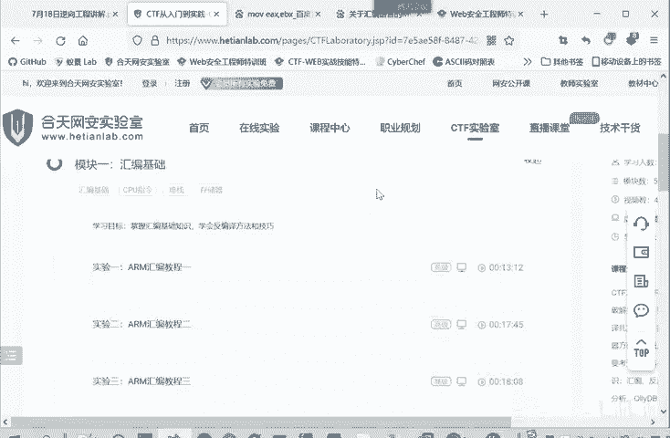

## 总结与展望 🎯

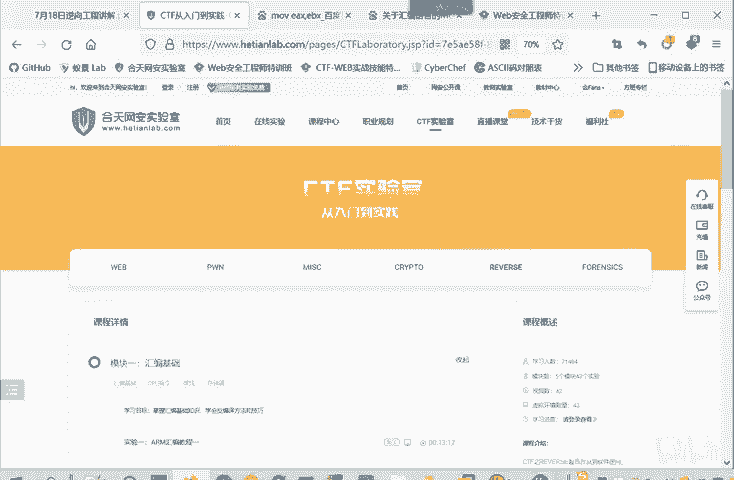

本节课中我们一起学习了逆向工程学习的核心书籍，并解答了关于工具使用、学习难点和实践环境的常见问题。

总结要点如下：
1.  **书籍是理论的基石**：推荐从《C和指针》、《汇编语言》和《恶意代码分析实战》三本书开始，系统构建知识体系。
2.  **工具是实践的利器**：分清StudyPE（文件结构分析）和IDA（代码逻辑分析）的不同用途，并在虚拟机环境中安全地进行练习。
3.  **汇编是必备的技能**：它是理解程序底层逻辑的关键，需要重点掌握其寻址方式。
4.  **实践是进步的阶梯**：积极利用在线实验平台和CTF题目进行练习，遇到问题善于搜索和提问。

逆向工程的学习曲线虽然陡峭，但通过扎实的基础学习、不断的动手实践和积极的交流探讨，一定能够逐步掌握。后续课程资料（如IDA工具）会分享到网盘，学习中遇到任何问题，欢迎随时在交流群中提出。

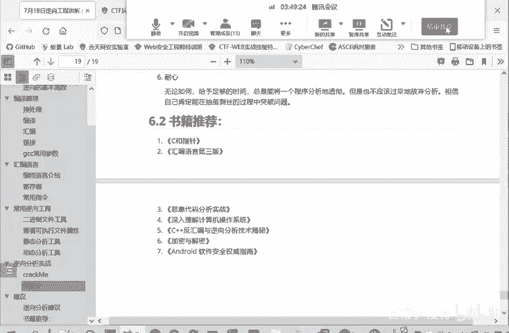

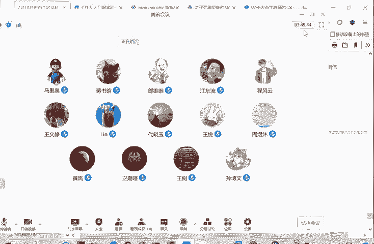

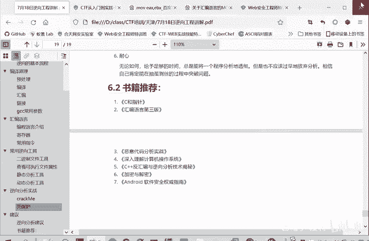

今天的课程到此结束，谢谢大家！