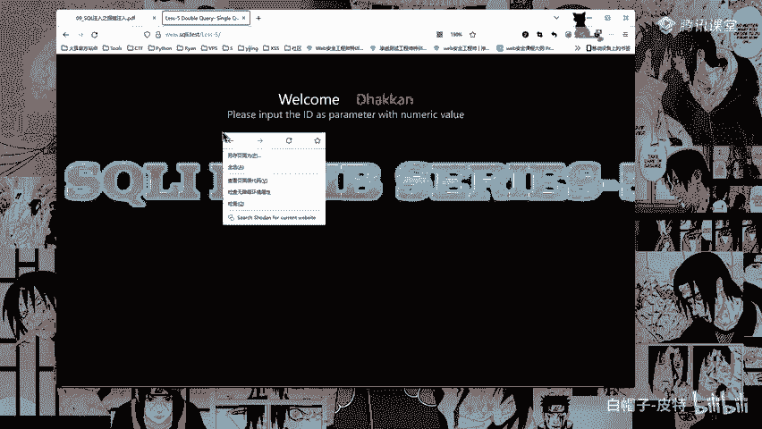

# CTF入门教程：P37：认识报错注入 💥

在本节课中，我们将要学习CTF-Web方向中一种重要的SQL注入技术——报错注入。我们将了解其基本概念、适用场景、核心原理，并通过一个具体的函数来学习如何构造利用载荷。

## 概述

报错注入是SQL注入的一种。当目标页面没有显示查询结果的位置（即没有回显位），但会输出SQL语句执行的错误信息时，就可以利用报错注入技术。它通过人为制造数据库错误，使得我们想要查询的数据（例如数据库名、表名）能够随着错误信息一起被“报”出来。

上一节我们介绍了联合查询注入，本节中我们来看看当联合查询受限时的另一种选择。

## 报错注入概念

报错注入是SQL注入的一种。页面上没有显示位，但是会输出SQL语句执行错误信息。例如MySQL `ERROR` 函数的报错信息。这其实也类似于盲注。

为什么这么说呢？因为它没有回显位，但是它会有报错。所以又叫做报错注入。

盲注就是在SQL注入当中，SQL语句执行后查询到的数据不能够回显到前端页面。此时我们需要利用一些方式来进行判断或尝试，这个过程称之为盲注。


SQL报错注入就是利用数据库的某些机制，人为地制造错误条件，使得查询结果能够出现在错误信息中。这种手段在联合查询受限，且能够返回错误信息的情况下比较好用。



所以这就是报错注入的使用场景：在联合查询受限，而且能返回错误信息的情况下。

## 报错注入示例

例如SQLi-Labs的第五关。该关卡页面只有一个“You are in...”的提示，没有用户名、密码等具体的回显位。

当我们输入正常参数 `?id=1` 时，页面正常显示。

当我们输入带有单引号的参数 `?id=1'` 时，页面会输出SQL语法错误的详细信息。

这就是典型的报错注入场景：页面本身不显示数据，但会将数据库的错误信息打印出来。

## 报错注入的分类

MySQL报错注入主要是利用MySQL的一些逻辑漏洞。根据逻辑原因的不同，可以将MySQL报错注入分为以下几类：

以下是主要的报错注入类型：

*   **BigInt等数据类型溢出**
*   **Xpath语法错误**
*   **count() + rand() + group by** 导致主键重复
*   **空间数据类型函数错误**

其中，**Xpath语法错误** 是实际应用中使用较多的一种。

## 核心原理：`updatexml()`函数

从MySQL 5.1.5开始，提供了两个XML查询和修改的函数：`updatexml()` 和 `extractvalue()`。

*   `updatexml()` 函数适用于 **5.1.5到5.5.49** 的版本。
*   `extractvalue()` 函数适用于 **5.1.5以上** 的版本。

可以通过这些XML函数的报错来显示注入命令执行的结果。

`updatexml()` 函数的结构是：
```sql
UPDATEXML(XML_document, XPath_string, new_value)
```
*   第一个参数 `XML_document` 是XML文档的名称。
*   第二个参数 `XPath_string` 是XPath格式的字符串。
*   第三个参数 `new_value` 是替换查找到的符合条件的数据。

`extractvalue()` 函数只有两个参数，与 `updatexml()` 函数原理完全一样。所以后面只讲 `updatexml()` 函数的使用。

简而言之，`updatexml()` 函数的功能是查找一个字符串并进行替换。而我们在 `XPath_string`（也就是第二个参数）传入不符合XPath格式的特殊字符，并拼接上一些查询语句，那么MySQL就会把错误和查询语句的结果，一起在报错信息中显现出来。

这就是XPath报错注入的原理。

## 利用方式与注意事项

所以我们构造Payload的时候，你的查询语句要写在第二个参数这里。

注意事项：
1.  必须在XPath处（也就是第二个参数的位置）传入特殊字符，MySQL才会报错。
2.  同时还需要加上我们需要注入的命令。如果参数位置不够，就使用到 `concat()` 函数进行拼接。
3.  XPath只会对特殊字符进行报错。这里我们可以使用16进制的 `0x7e`（即波浪线 `~`）来进行利用。这个波浪线相当于一个错误触发器。
4.  `updatexml()` 报错信息长度有限，最多显示32个字符。对于输出结果大于32个字符的命令，就要使用 `substring()` 函数截取后分段输出。

## 相关函数说明

以下是构造Payload时常用的两个函数：

*   **`concat(s1, s2,...sn)`**
    将字符串s1, s2, ... sn合并为一个字符串。
    公式：`CONCAT(str1, str2, ...)`

*   **`substring(s, start, length)`**
    从字符串 `s` 的 `start` 位置开始，截取长度为 `length` 的字符串。
    **注意**：在MySQL的 `substring()` 函数中，`start` 下标从 **1** 开始。
    公式：`SUBSTRING(string, start, length)`

## 总结

本节课中我们一起学习了报错注入技术。我们了解到报错注入适用于无回显位但有错误信息输出的场景。其核心是故意制造数据库错误，将查询数据“夹带”在报错信息中返回。我们重点讲解了利用 `updatexml()` 函数进行XPath报错注入的原理、利用方法以及相关的 `concat()` 和 `substring()` 函数。掌握这些知识，是进行CTF-Web题目中SQL注入挑战的重要一步。