# CTF入门教程：P3：Web-设置代理 🛠️

在本节课中，我们将要学习如何为Burp Suite设置代理。代理是Burp Suite实现抓包和改包功能的核心，正确的配置能帮助我们高效地分析网络流量，避免无关信息的干扰。

## 代理与监听的概念

上一节我们介绍了Burp Suite的基本功能，本节中我们来看看如何配置代理以实现抓包。代理配置包含两个部分。

第一部分是客户端（如浏览器或操作系统）需要配置代理。第二部分是Burp Suite需要监听代理服务器。这意味着浏览器将网络流量发送到代理服务器，而Burp Suite则负责接收并处理这些流量。

## 为何在浏览器中设置代理

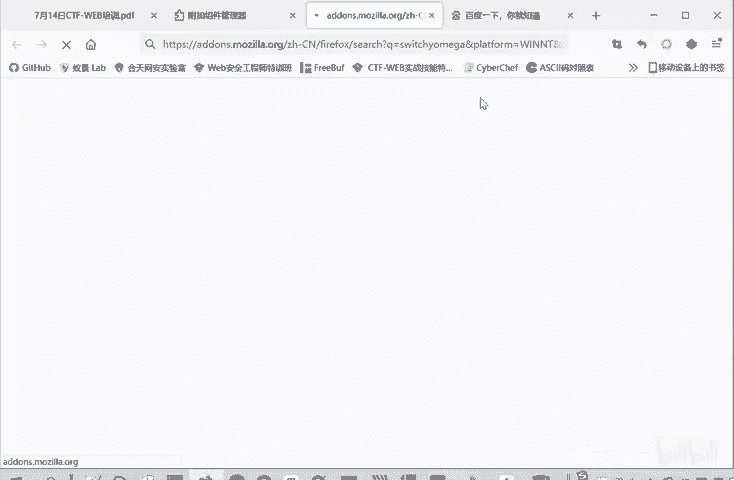

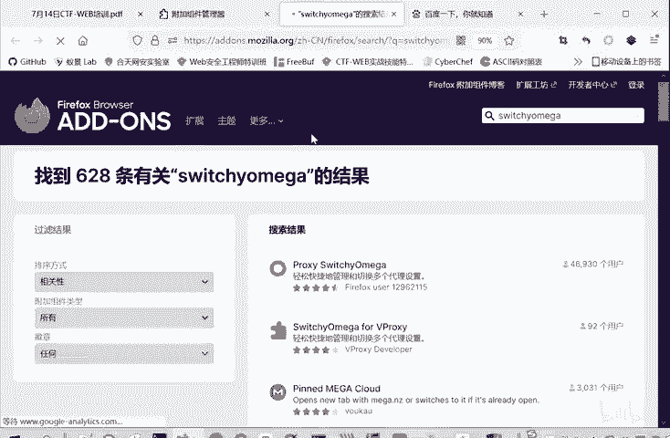

虽然可以在Windows操作系统中设置全局代理，但不推荐这样做。因为在抓包过程中，操作系统本身（如系统更新）以及其他所有应用程序（如多个浏览器）的流量都会被捕获。这会导致抓取的流量包数量庞大，对我们分析目标流量造成严重干扰。

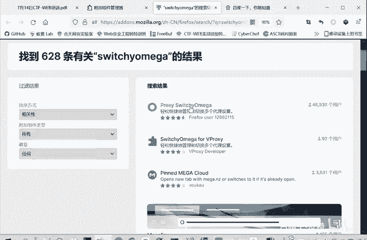

因此，推荐在单个浏览器中设置代理。这样，只有该浏览器的流量会经过Burp Suite，从而有效避免无关流量的干扰。

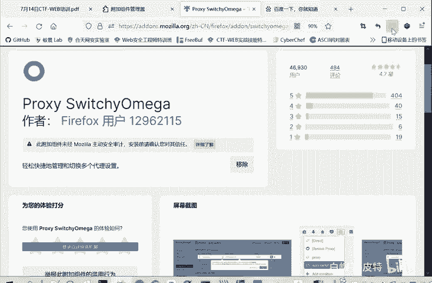

## 配置浏览器代理：SwitchyOmega插件

以下是配置浏览器代理的步骤，推荐使用SwitchyOmega插件来完成。

1.  **安装SwitchyOmega插件**
    在火狐浏览器（Firefox）的扩展商店中搜索“SwitchyOmega”并安装。其他浏览器（如Chrome）的安装方式类似，但可能受网络限制。

2.  **配置代理情景模式**
    安装后，浏览器右上角会出现SwitchyOmega的图标。点击图标，进入“选项”进行设置。
    点击“新建情景模式”，为其命名（例如“bp”）。
    在代理设置中，协议选择“HTTP”，代理服务器填写`127.0.0.1`，代理端口填写`8080`（Burp Suite默认监听端口）。
    **重要**：将“不代理的地址列表”中的`127.0.0.1`删除，以确保能捕获本地靶场环境的流量。

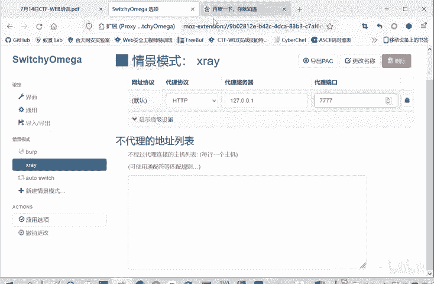

3.  **使用与切换代理**
    配置完成后，可以通过点击SwitchyOmega图标快速切换不同的代理情景模式，或选择“直接连接”来禁用代理。这为不同场景下的测试提供了极大便利。

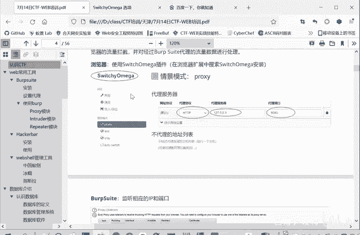

## 配置Burp Suite监听器

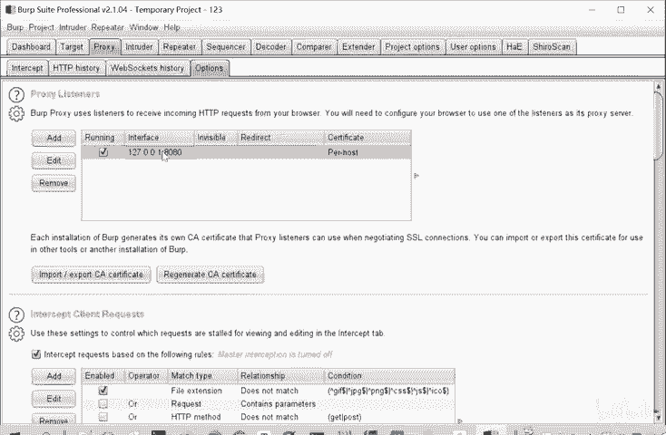

在浏览器端设置好代理后，需要在Burp Suite中配置对应的监听器来接收流量。

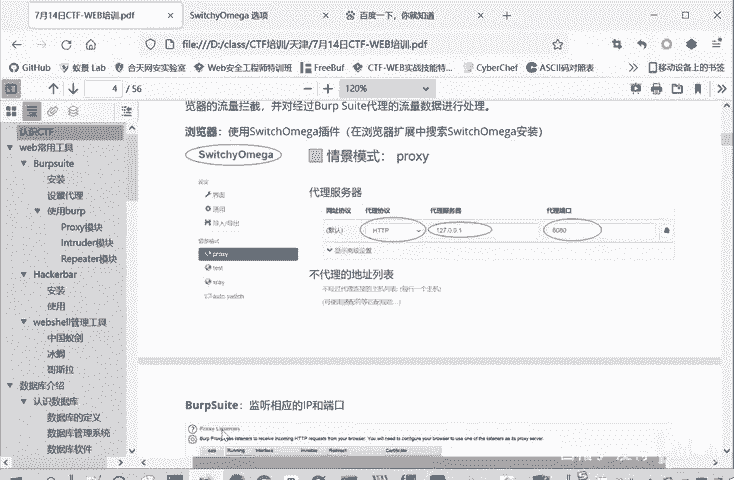

1.  打开Burp Suite，进入 **Proxy** -> **Options** 选项卡。
2.  在 **Proxy Listeners** 部分，确保已添加并勾选一个监听器。
3.  该监听器的 **Bind to port** 端口号（例如`8080`）必须与浏览器中SwitchyOmega配置的代理端口保持一致。
4.  监听器的 **Bind to address** 可以选择“All interfaces”或“Loopback only”。

经过以上设置，Burp Suite就能成功捕获并分析HTTP流量了。

## 捕获HTTPS流量：安装CA证书

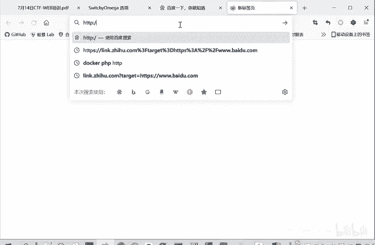

现在，Burp Suite可以抓取HTTP包了。但如今HTTPS协议应用广泛，仅进行上述设置无法解密HTTPS流量，因为缺少安全证书。

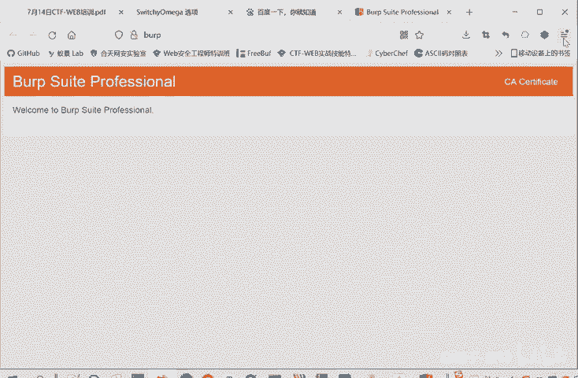

HTTPS增强了安全性，需要证书才能进行中间人抓包。Burp Suite本身不是合法的证书颁发机构（CA），因此需要安装其提供的伪造CA证书来获得客户端的信任。

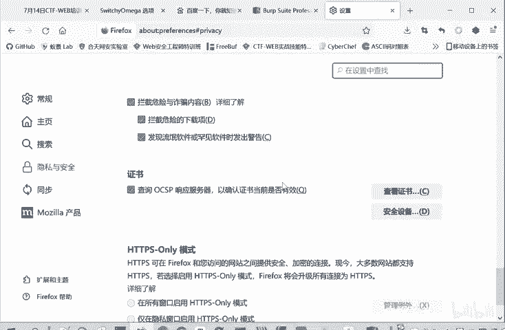

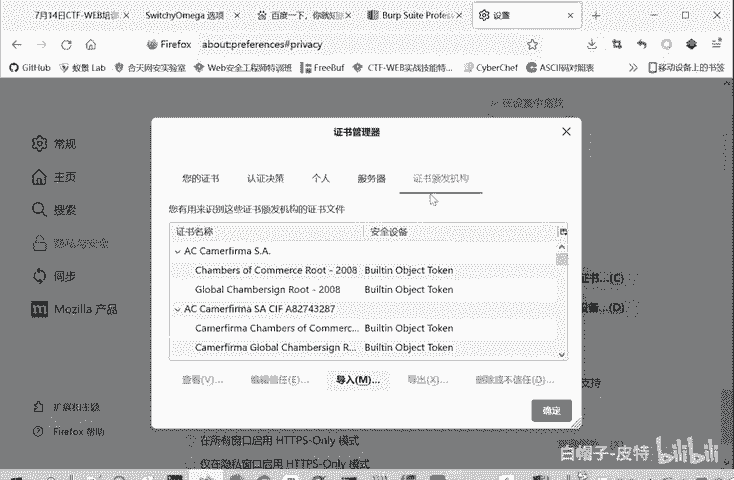

以下是安装证书的两种方法：

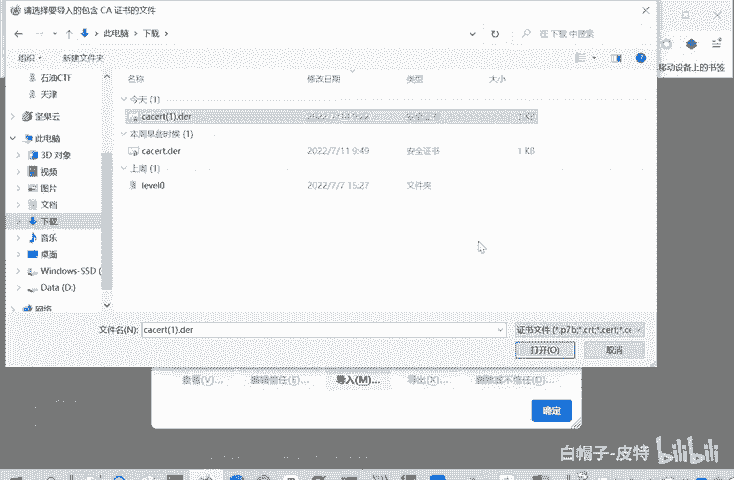

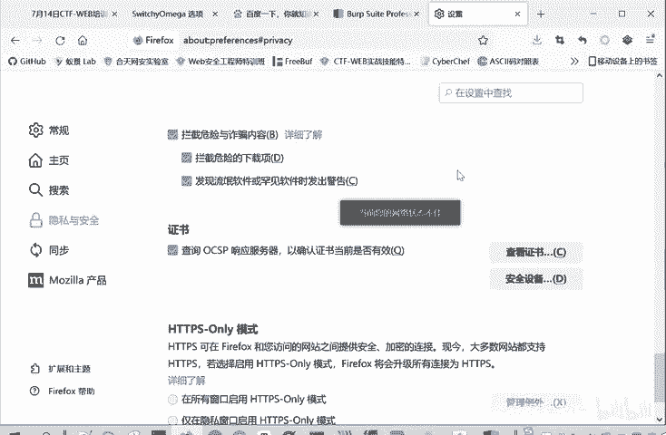

**方法一：在操作系统中安装证书（推荐）**
此方法使证书对所有浏览器生效，切换测试环境更方便。
1.  确保Burp Suite代理已开启，在浏览器中访问 `http://burp`。
2.  点击页面上的 **CA Certificate** 按钮下载证书文件（如`cacert.der`）。
3.  双击下载的证书文件，在打开的证书安装向导中，选择“将所有的证书都放入下列存储”，并点击“浏览”。
4.  选择“受信任的根证书颁发机构”，然后点击“确定”并完成安装。

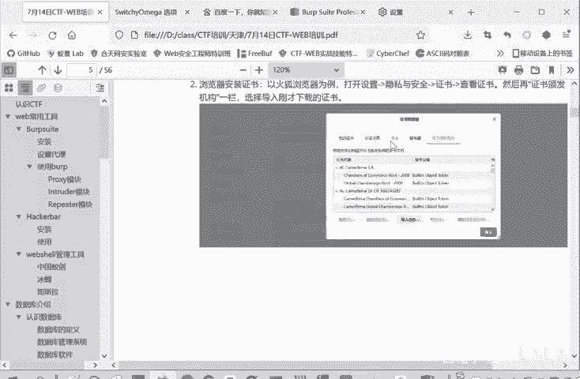

**方法二：在单个浏览器中导入证书**
此方法仅对当前浏览器生效。
1.  同样从 `http://burp` 页面下载CA证书。
2.  在浏览器设置中（如火狐的“选项”->“隐私与安全”->“证书”->“查看证书”），找到“证书颁发机构”选项卡。
3.  点击“导入”，选择下载的证书文件并导入。

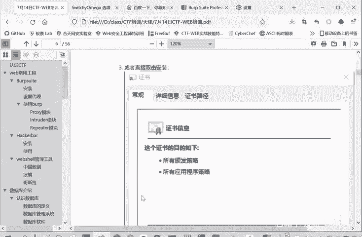

安装证书后，Burp Suite即可成功拦截和解密HTTPS流量，进行全面的抓包与改包分析。

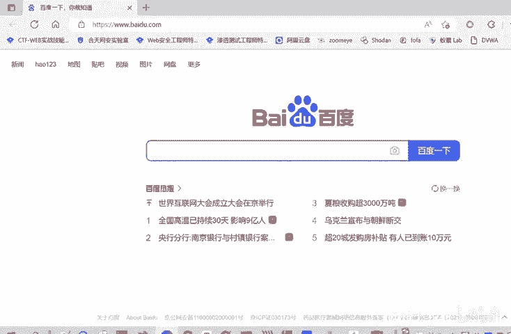

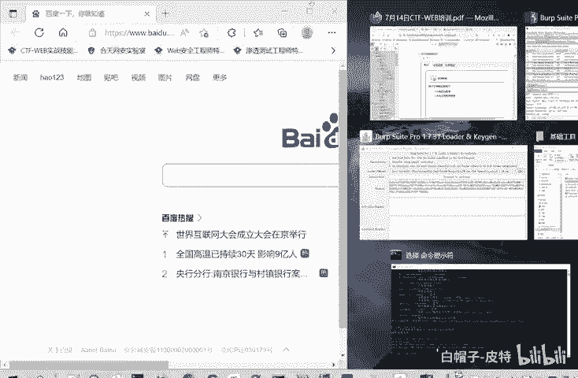

## 总结

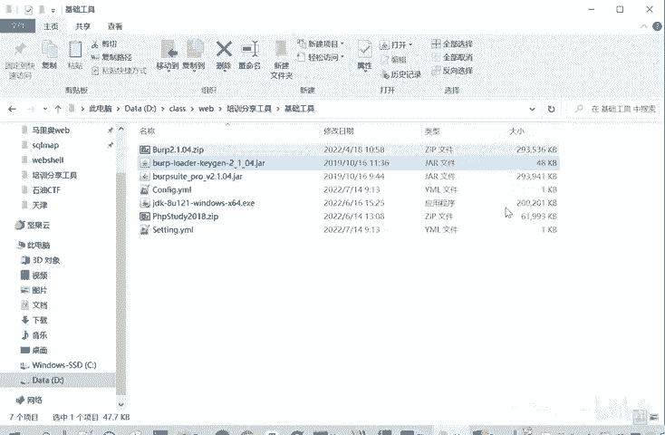

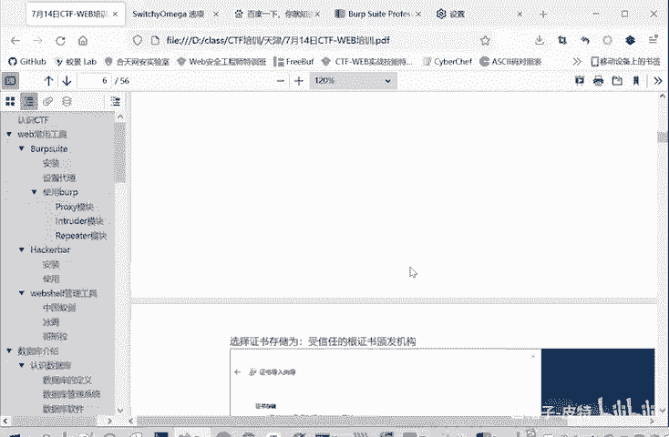

本节课中我们一起学习了为Burp Suite设置代理的完整流程。我们首先理解了代理与监听的基本概念，然后通过配置SwitchyOmega插件在浏览器端设置代理，接着在Burp Suite中配置对应的监听器。最后，为了捕获HTTPS流量，我们学习了安装Burp Suite的CA证书的两种方法。正确的代理配置是进行Web安全测试和CTF解题的重要基础。