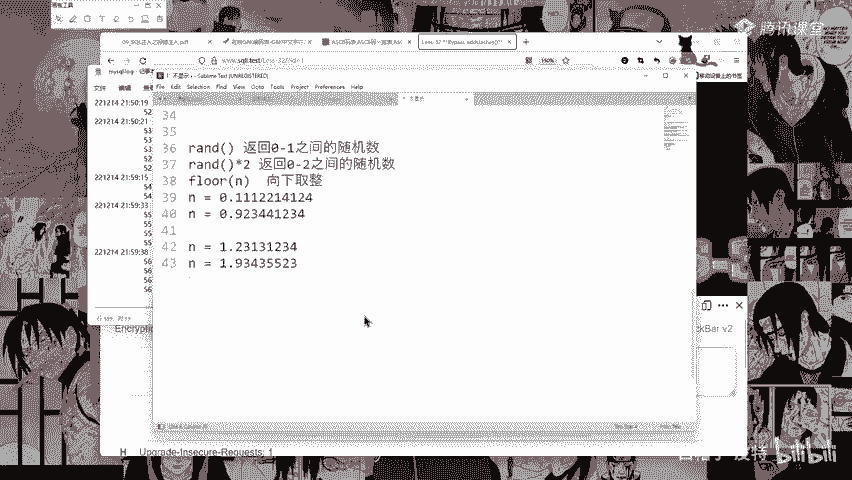
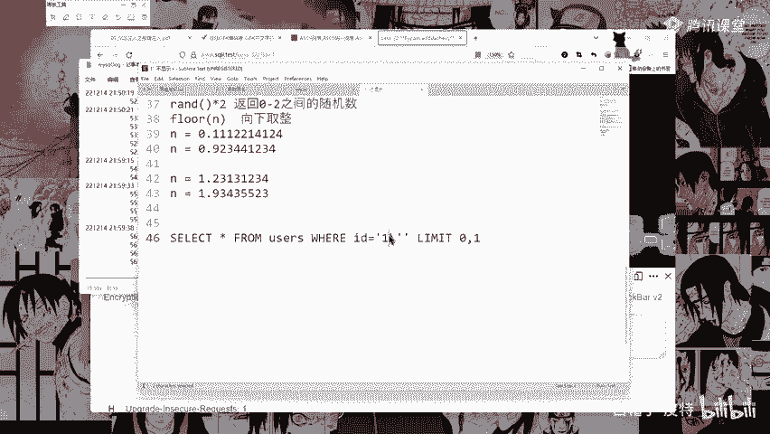

# CTF入门教程：P40：宽字节注入方法 🛡️

在本节课中，我们将要学习一种特殊的SQL注入技术——宽字节注入。这种漏洞源于数据库与应用程序编码不一致，理解其原理对于Web安全至关重要。

## 漏洞原理

上一节我们介绍了SQL注入的基本概念，本节中我们来看看宽字节注入的成因。

宽字节注入主要源于程序员使用的数据库编码与PHP编码设置不同。如果PHP编码为UTF-8，而MySQL的编码设置为了GBK，就会引发编码转换，从而导致注入漏洞。

后端代码中，MySQL设置GBK编码，而SQL语句尝试进行普通注入时，用户输入的单引号会被转义。转义之后，单引号前会添加一个反斜杠（`\`），使其变成一个普通字符，从而无法闭合原SQL语句中的引号。

实际的SQL语句会变成：
```sql
SELECT * FROM users WHERE id='1\''
```
此时，用户输入的单引号无法起作用。

## 绕过机制

以下是宽字节注入的核心绕过步骤。

当使用宽字节字符时，例如输入`%DF'`。这里的反斜杠字符的编码是`5C`。在GBK编码中，`%DF`与`5C`组合会形成一个合法的GBK汉字（例如“運”字）。

具体过程如下：
1.  用户输入：`%DF'`
2.  系统转义：`%DF\'` （反斜杠`\`的编码为`5C`）
3.  编码转换：`%DF` + `5C` = `運` （一个GBK汉字）
4.  最终效果：单引号`'`前的反斜杠被“吃掉”，单引号成功逃逸，可以闭合原SQL语句。



## 实战演示



接下来，我们通过一个实际关卡（第32关）来演示宽字节注入的过程。

首先，尝试普通注入，输入参数`id=1'`。查看日志可以发现，单引号被转义为`\'`，注入失败。

然后，尝试宽字节注入，输入参数`id=%DF'`。此时程序报错，说明单引号成功逃逸并破坏了SQL语句结构。查看日志，可以看到`%DF`和`5C`确实组合成了“運”字。

确认注入点后，即可构造完整的注入语句。例如：
```
id=%DF' and 1=2 union select 1,2,3 --+
```
通过不断尝试，可以最终获取数据库名、表名等敏感信息。

本节课中我们一起学习了宽字节注入的原理与利用方法。其核心在于利用GBK等宽字节编码与转义机制的结合，使转义符被“吞并”，从而绕过过滤。理解这种编码差异是防御此类漏洞的关键。