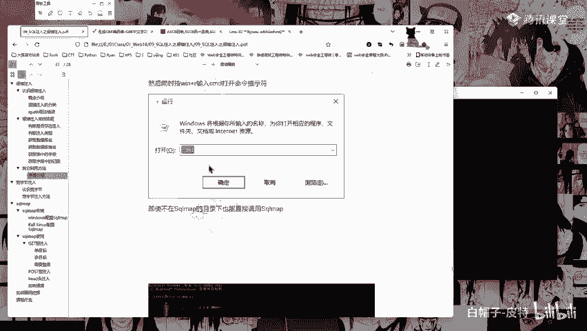
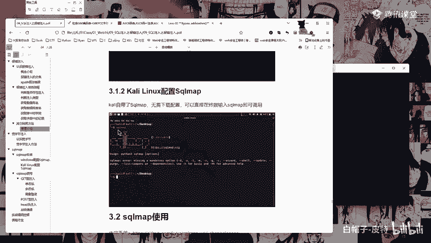

# CTF入门教程：P41：sqlmap的安装 🛠️

在本节课中，我们将学习自动化SQL注入工具sqlmap的安装与基本配置。sqlmap是一个用Python编写的强大工具，能帮助我们发现并利用SQL注入漏洞。

## 概述

sqlmap是一个由Python开发的自动化SQL注入工具。我们将介绍如何获取、安装并验证sqlmap的运行环境。

## 获取sqlmap

sqlmap的获取非常简单。我已经将文件上传至我们的微盘。在我的电脑上，sqlmap位于`D:\tools\sqlmap`目录下。

## 理解回显位的重要性

上一节我们介绍了SQL注入的基本原理，本节中我们来看看为什么需要判断“回显位”。回显位指的是我们注入的SQL语句执行后，其结果能在网页上显示出来的位置。

例如，在一个页面上，我们可能发现位置2和3有回显，但位置1没有。如果我们向位置1注入语句（如`database()`），执行后页面上仍然只显示2和3的内容。虽然语句实际已执行，但由于结果没有显示出来，我们就无法获取信息。因此，判断回显位是为了确定在哪个位置注入，我们能在页面上看到返回结果。

以下是判断回显位的核心原因：
*   我们需要在页面上能看到注入结果的位置进行操作。
*   回显位可能不止一个，有时甚至多达20多个字段，我们需要通过类似`union select 1,2,3...`的语句逐一测试，找到哪些位置的内容会显示在页面上。

## 关于编码绕过的补充说明

关于编码绕过，有同学问到`%df%5c`中的`%df`是否是强制的。这是一个很好的问题。`%5c`代表反斜杠“\”。我们可以尝试将其改为`%de%5c`测试一下。

测试发现，使用`%de`也可以成功。这说明`%df`并非强制，关键在于找到一个能与`%5c`组合成有效宽字节的字符编码。只要你知道反斜杠的编码是`%5c`，就可以寻找能与`%5c`搭配形成新字符的编码进行尝试。

## 安装与运行sqlmap

现在，让我们回到sqlmap的安装主题。

### 在Windows中运行

首先，你可以直接在sqlmap的目录下打开命令行（CMD）。
然后，使用Python来运行它。

**代码示例：运行帮助文档**
```bash
python sqlmap.py -h
```
或者使用Python3：
```bash
python3 sqlmap.py -h
```
执行上述命令后，如果能显示出sqlmap的帮助文档，则说明运行成功。

### 配置环境变量（可选）

如果你觉得每次都需要进入sqlmap目录很麻烦，可以将其路径添加到系统的环境变量中。但配置时需要注意两个前提条件：

以下是配置环境变量的两个必要条件：
1.  `.py`文件必须默认使用Python解释器打开，而不是文本编辑器（如PyCharm）。你可以通过查看文件图标来判断：如果图标是Python的，则符合条件；如果是编辑器图标，则配置无效。
2.  Python解释器本身不能改名。在配置Python环境变量时，有些人会将`python.exe`改名为`python2.exe`或`python3.exe`以便区分版本。如果改名，可能会导致通过环境变量调用sqlmap时失败。

如果满足以上条件，你可以将sqlmap的安装目录添加到系统环境变量的`Path`中。

添加完成后，需要关闭并重新打开一个新的CMD窗口进行测试。如果配置成功，你应该可以在任意路径下直接输入`python sqlmap.py`来运行工具。

**注意**：如果遇到问题，可能是因为Python解释器改名或路径问题。此时，最稳妥的方式仍然是直接进入sqlmap目录再运行。

### 在Kali Linux中运行


对于使用Kali Linux的同学，过程更为简单，因为Kali系统自带了sqlmap。
你只需要在终端中直接输入以下命令即可：

**代码示例：在Kali中运行**
```bash
sqlmap
```

## 总结





本节课中我们一起学习了sqlmap工具的安装与基本运行方法。我们了解了回显位的概念及其重要性，补充了关于宽字节编码绕过的知识，并掌握了在Windows和Kali Linux两种系统中启动sqlmap的具体步骤。正确配置环境是使用任何工具的第一步，接下来我们就可以利用sqlmap进行自动化的SQL注入测试了。