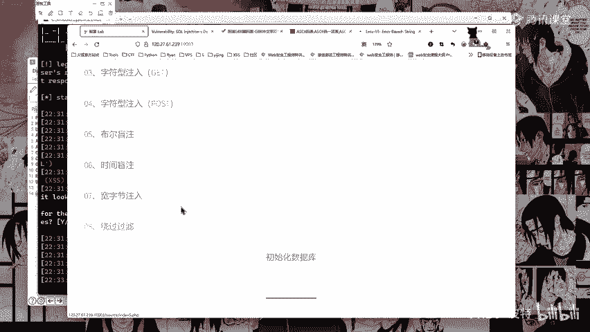
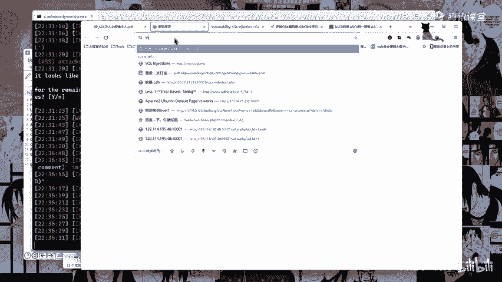

# CTF入门教程：P43：课后作业

在本节课中，我们将回顾并整理第43课的课后作业要求，涵盖宽字节注入、搜索技巧以及预习内容。

## 作业内容概述

本次课后作业包含两道题目，主题是宽字节注入与过滤绕过。

以下是作业的具体要求：
*   第7至8题，内容为宽字节注入和绕过过滤。
*   提交SRRC时，通常只需提交数据库名，有数据库名即可。

## 工具使用建议

上一节我们介绍了作业内容，本节中我们来看看完成作业可能需要用到的工具。作者推荐使用谷歌进行搜索，因为其高级搜索功能在国内环境下可能更有效。如果无法访问谷歌，使用百度亦可，但其过滤机制可能不如谷歌严格。

以下是使用搜索引擎进行漏洞查找的示例语法：
*   `inurl:.php?id=1`

此语法用于在URL中搜索包含特定参数（如`id=1`）的页面。

关于谷歌高级搜索的链接，作者会在课后分享至群内。

## 课程总结与预习安排

本节课内容较多，主要深入讲解了SQL注入的原理。课程即将结束。

以下是给初学者的核心建议：
*   务必多加练习。
*   多使用DVWA和SQLi-Labs等靶场进行实战。
*   通过反复练习来真正理解SQL注入。

下节课我们将学习跨站脚本攻击基础。请大家及时完成HTML基础知识的预习。

课程到此结束。如有任何问题，请在群内及时提问。