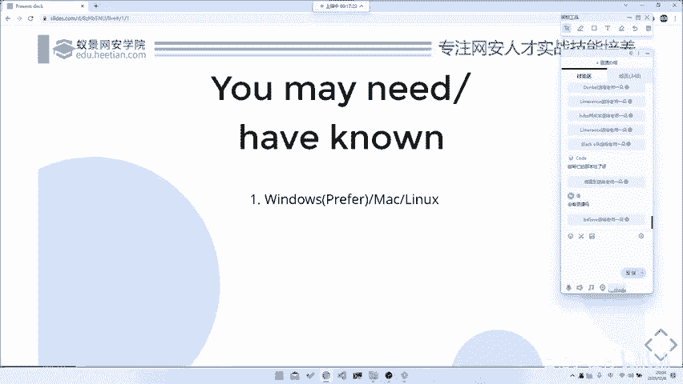
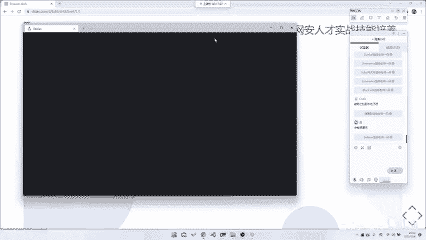
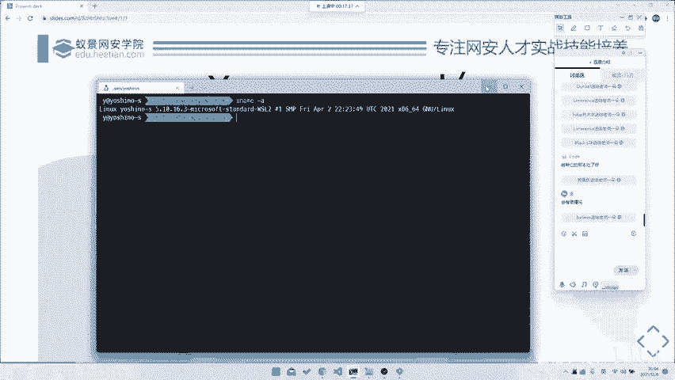
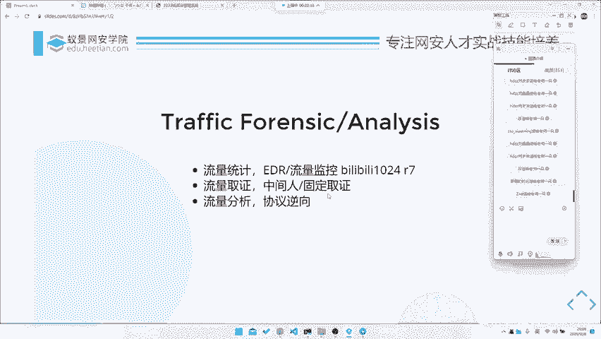

# CTF系列教程：P44：Misc 流量分析基础认识 🧠

在本节课中，我们将要学习CTF杂项（Misc）中流量分析的基础知识。课程将分为三个部分：工具介绍、流量种类辨析以及基础知识解析。通过本节的学习，你将了解流量分析的基本概念、常用工具以及其在网络安全领域的应用方向。

## 课程结构概述 📋

本次流量分析专题课程主要分为三节课。

第一节课是今天的基础部分。我们将介绍常用工具，并辨析不同种类的流量。

上一节我们介绍了课程的整体结构，本节中我们来看看学习本课程需要做的准备工作。

## 课前准备 💻

以下是学习本课程需要准备的环境和工具。

*   流量分析对平台依赖不高。最主要的工具如Wireshark或脚本工具Tshark在各大平台通用。
*   建议配置一个Windows加WSL（Windows Subsystem for Linux）的环境。使用虚拟机（如Linux虚拟机）或Mac系统安装虚拟机也可以。

## 流量分析的应用与发展 🚀

流量分析在CTF Misc中是一个重要部分，但其最终会上升到网络安全实践层面。

上一节我们了解了学习准备，本节中我们来探讨流量分析的现实意义与发展方向。

国内的Misc分类很杂，很多种类都会放在里面。但在国外，流量分析一般归属于两个方向：取证或流量分析本身。

未来的进阶发展方向主要有以下几个：

1.  **大规模流量分析与异常检测**：例如，从海量数据中（如几万条）找出异常请求。这在工作中可用于检测攻击流量或爬虫行为，即大规模流量日志分析。
2.  **数字取证**：例如，协助调查中间人攻击或协助警方办案，通过分析网络访问记录来推断行为。
3.  **协议逆向辅助**：通过抓取和分析网络数据包，来辅助逆向工程中对通信协议的分析。

现阶段我们专注于对特定流量文件包的分析。但最终目标可能是处理大规模甚至实时流量。这种批量处理技巧在一些CTF赛题中也有体现，例如需要从大量流量中批量提取并执行代码的题目。

本节课中我们一起学习了流量分析的基础定位、所需准备环境以及其在CTF和实际安全领域中的重要意义与发展方向。下一节课，我们将开始具体介绍流量分析的常用工具。