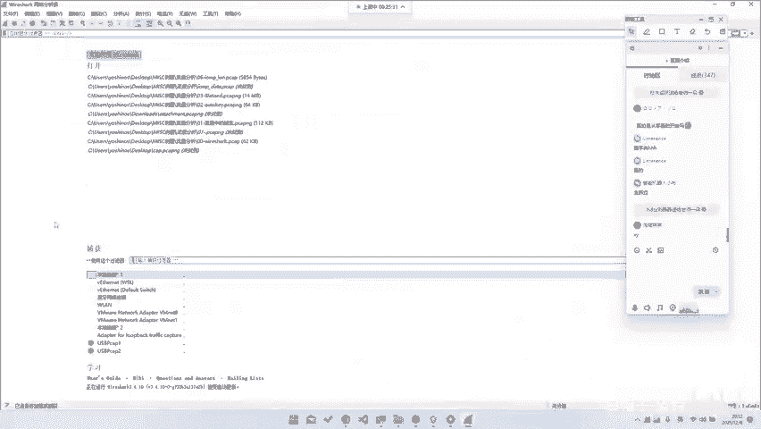
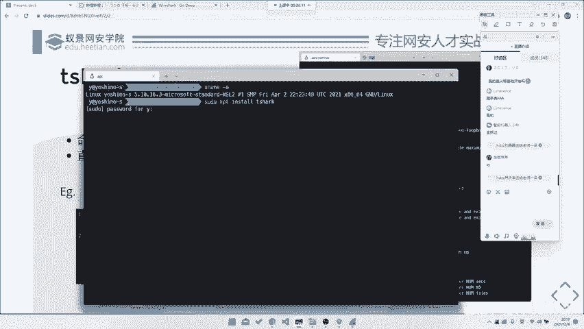
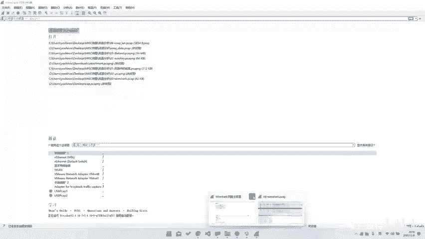
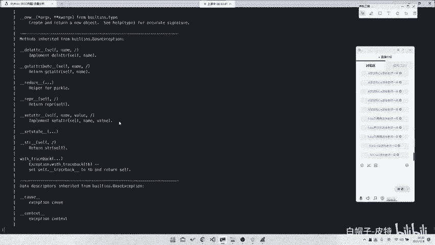
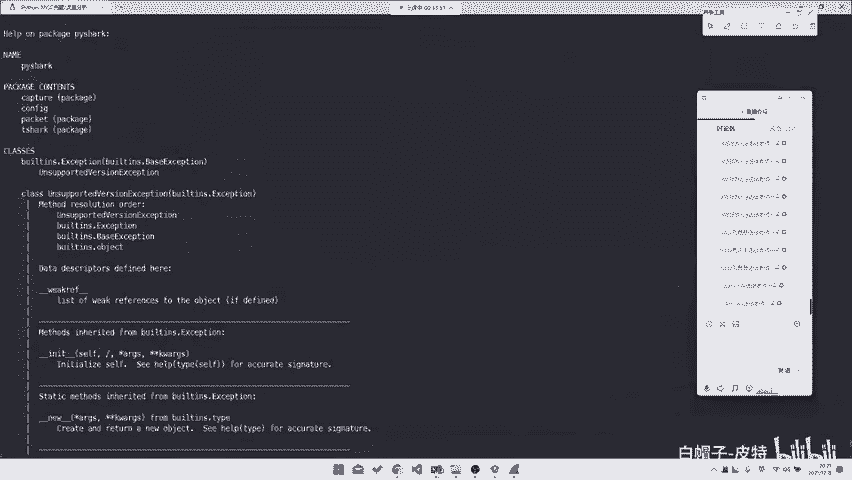
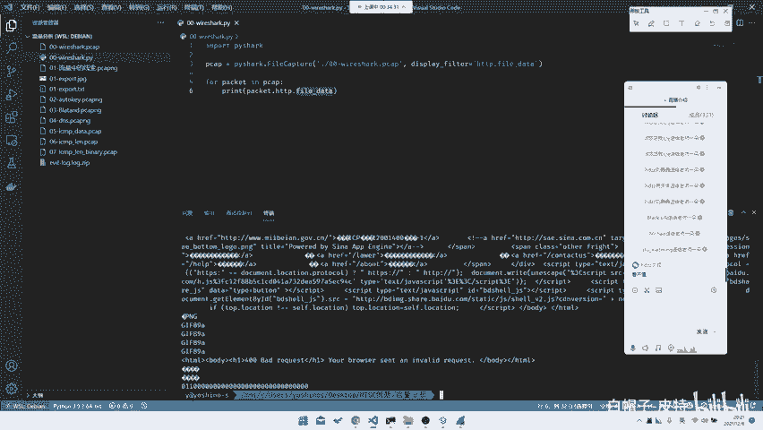
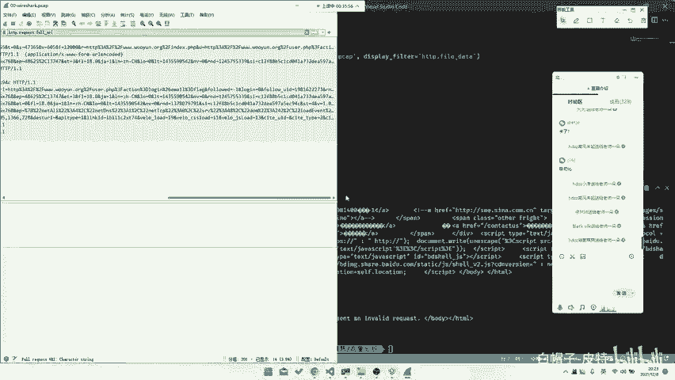
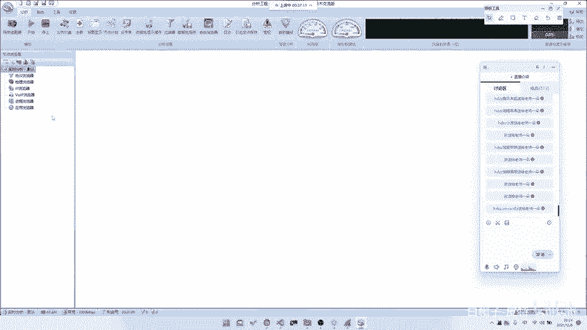

# CTF入门教程：P45：Misc流量分析工具篇 🛠️

在本节课中，我们将要学习CTF比赛中Misc（杂项）方向的一个重要技能：流量分析。我们将重点介绍核心工具Wireshark及其相关生态，包括图形界面、命令行工具以及Python库的使用方法，并通过一个简单实例演示如何从网络数据包中提取关键信息。

## Wireshark：流量分析神器 🌐

上一节我们介绍了Misc方向的概况，本节中我们来看看流量分析的核心工具。首先需要介绍的是流量分析神器Wireshark。大部分流量分析题目都可以使用Wireshark来解决。

Wireshark的介绍是：“The world‘s foremost and widely used network protocol analyzer”。它功能非常强大，可以分析多种网络协议。

以下是Wireshark支持分析的部分协议类型：
*   常规协议：例如HTTP、TCP/IP、OSI网络模型中的协议。
*   工业与专用协议：例如Modbus、S7comm，甚至I2C通信协议。
*   无线与硬件协议：例如蓝牙、802.11（Wi-Fi）协议。安装相应插件后，还可以分析USB协议。

因此，Wireshark是一个非常全面的网络分析工具。

## Wireshark的安装与应用 💻



Wireshark可以用来动态抓包。工具的下载和安装过程很简单。



以下是获取与安装Wireshark的步骤：
1.  **下载**：通过百度或谷歌搜索“Wireshark”进入官网。
2.  **安装**：在官网找到所需系统版本（如Windows、macOS、Linux）进行安装。

安装部分不赘述，我们直接讲解其应用。Wireshark既可以分析已有的流量包文件（`.pcap`），也可以进行实时抓包。

例如，连接Wi-Fi后直接抓包，可以捕获到几乎所有协议的数据。例如，可以抓到OICQ协议（QQ）、TCP协议、DNS协议等，覆盖范围非常全面。

如果使用支持监控模式的无线网卡，甚至可以捕获空中的无线数据包（如WPA2握手包），用于后续的密码破解分析。这在无线网络安全课程中是基础操作。

## 命令行工具：Tshark ⚙️

Wireshark图形界面对于初学者友好，易于上手。但如果需要进行后续自动化分析，或与Python等脚本结合，图形界面导出数据可能不够方便。

因此，我们可能会用到Tshark。Tshark是Wireshark的命令行版本。



在Debian或Ubuntu等Linux系统上，可以使用 `apt install tshark` 命令安装。它同样可以在命令行中抓包，并通过过滤条件控制抓取的内容。

## 实战演练：从流量包中查找Flag 🚩

前面我们介绍了工具，现在通过一个简单例题来实践。这个例题的目标是找到一个登录数据包，其中的密码就是Flag。

我们首先演示使用Wireshark图形界面（GUI）的方法。

以下是使用Wireshark GUI解题的关键操作：
1.  **打开文件**：在Wireshark中打开提供的 `.pcap` 流量包文件。
2.  **查找登录请求**：在数据包列表中寻找包含“login”关键词的HTTP请求。
3.  **追踪流**：在目标数据包上右键，选择“追踪流” -> “HTTP流”。
4.  **提取Flag**：在弹出的流内容窗口中，查找类似 `password=xxxxxx` 的字段，其中的“xxxxxx”即为Flag。

此外，也可以通过“文件” -> “导出对象” -> “HTTP”来批量导出所有HTTP传输的文件，从中寻找包含密码的文件。

接下来，我们演示使用Tshark命令行完成同样的任务。首先切换到流量包文件所在目录。

**方法一：使用过滤和字段提取**
```bash
tshark -r example.pcap -Y "http.request.uri" -T fields -e http.file_data
```
*   `-r example.pcap`：指定要读取的流量包文件。
*   `-Y "http.request.uri"`：应用显示过滤器，只显示包含HTTP请求URI的数据包。
*   `-T fields`：指定输出格式为字段。
*   `-e http.file_data`：指定要提取的字段为HTTP文件数据（对于POST请求，即为请求体）。

这条命令会输出所有HTTP请求的正文，从中可以找到包含密码的那一行。

**方法二：追踪特定流**
```bash
tshark -r example.pcap -q -z "follow,http,ascii,0"
```
*   `-q`：减少常规输出信息。
*   `-z "follow,http,ascii,0"`：使用`follow`统计功能，以ASCII格式输出HTTP流，`0`代表第一个流。可以依次查看不同流（`0,1,2...`）的内容，直到找到登录请求。

无论使用GUI还是命令行，核心思路都是定位到登录操作的HTTP流，并从中提取出密码字段。

## Python集成：Pyshark 🐍





对于Misc选手，通常需要一定的Python基础来进行更灵活的分析。Pyshark是一个Python封装库，允许在Python脚本中处理数据包。

Pyshark的API设计可能不如前两者直观，有时仍需配合Tshark。以下是一个使用Pyshark的示例脚本，用于完成上述例题：



```python
import pyshark

# 打开流量包文件
cap = pyshark.FileCapture('example.pcap', display_filter='http')

# 遍历数据包并提取HTTP文件数据字段
for pkt in cap:
    try:
        if hasattr(pkt.http, 'file_data'):
            print(pkt.http.file_data)
    except AttributeError:
        pass
```
运行此脚本，它会输出所有HTTP数据包中的`file_data`字段内容，从中即可找到Flag。

在后续更复杂的题目中，可能需要在此基础上进行数据解码、模式匹配等进一步处理。Python在Misc领域应用广泛，包括图片分析、编码转换等，建议加强Python编程能力。



## 其他辅助工具 🔧

除了Wireshark系列，还有其他流量分析工具，例如国产的科来网络分析系统。它更侧重于流量统计和可视化分析。

例如，有些题目要求找出访问次数最多的IP地址或异常流量，科来系统可以一键生成相关统计图表，比手动过滤更高效。但在大部分CTF流量分析题中，Wireshark仍是主要工具。



---

本节课中我们一起学习了CTF-Misc中流量分析的基础工具。我们从最强大的图形化工具Wireshark入手，学习了其基本抓包与分析功能。接着，我们探讨了其命令行版本Tshark，它更适合自动化与脚本处理。然后，我们通过一个实战例子，演示了如何用这两种工具从网络流量中提取Flag。最后，我们介绍了Python库Pyshark，为后续复杂分析打下基础。掌握这些工具是解开CTF流量分析题目的第一步。