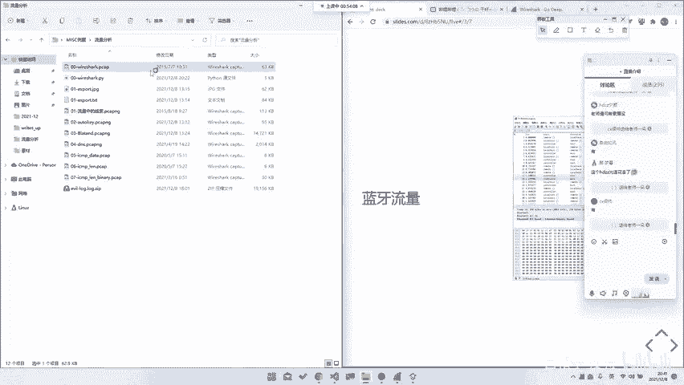
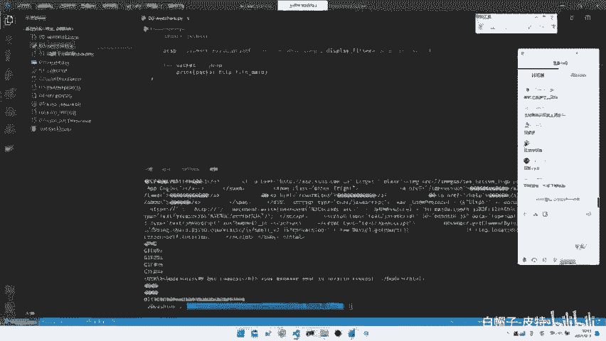
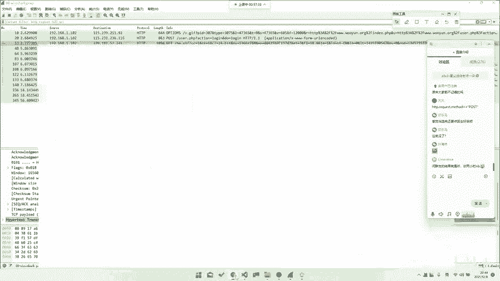
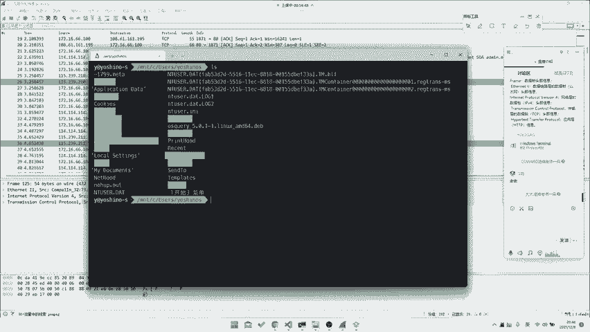
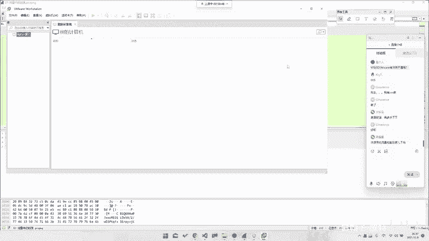

# CTF系列教程：P46：流量分析流量种类 🕵️♂️

在本节课中，我们将要学习CTF比赛中Misc方向的一个重要分支——流量分析。我们将系统地了解流量分析中可能遇到的各种流量类型，从常见的网络协议到一些特殊的通信协议，帮助你建立一个清晰的认知框架。

## 概述 📋

流量分析是CTF比赛Misc类别中的常见题型，它要求选手分析捕获到的网络或设备通信数据包，从中发现隐藏的信息或异常行为。理解流量的种类是进行有效分析的第一步。

## OSI七层模型与流量种类

上一节我们概述了流量分析的重要性，本节中我们来看看流量具体有哪些种类。流量分析通常基于OSI七层模型或TCP/IP四层模型来理解。

### 网络流量

最常见的流量类型是网络流量。网络流量本身也有很多细分种类。

以下是基于OSI模型各层可能出现的考题类型：

*   **物理层**：通常不考虑物理层协议。但极端情况下，可能涉及通信基础知识，如曼彻斯特编码、码分多址（CDMA）或时分多址（TDMA）的解析，甚至是ALOHA协议。
*   **数据链路层**：考察不多。在TCP/IP四层模型中，数据链路层（如以太网）基本被忽略，但未来不排除出现相关题目。
*   **网络层**：这是可能考察到的最底层之一。例如，可能涉及ICMP协议的分析、ARP协议上的手脚，或统计IP地址等信息。
*   **传输层**：考察非常多。主要关注TCP和UDP协议。例如，分析TCP三次握手、序列号、确认号，或基于TCP/UDP自定义的应用层协议。核心概念包括：
    *   **TCP**：面向连接、可靠传输。`TCP连接建立：SYN -> SYN-ACK -> ACK`
    *   **UDP**：无连接、不可靠传输。`UDP数据报格式简单，头部开销小。`
*   **会话层/表示层/应用层**：
    *   会话层和表示层直接考察不多（如SMB、TLS可算作表示层）。
    *   **应用层**：考察最多，且花样繁多。主要包括：
        1.  **公共协议**：如HTTP、FTP、SMTP、DNS等。其中HTTP协议考法极多，例如分析SQL注入、文件上传、目录遍历等攻击流量。
        2.  **加密协议**：如TLS/SSL，可能涉及中间人攻击或证书分析。
        3.  **自定义/未公开协议**：这是最大的难点。需要选手“手撕”协议，分析其字段和格式。例如，一些物联网设备、游戏或未开源软件的通信协议。

Misc方向要求知识面广，你可能需要懂点开发、网络、操作系统、数据库等，这些在流量分析中都会用到。正所谓“一入CTF深似海”，你可能需要同时了解Web、Pwn、逆向等多个方向的知识。

### 其他设备流量

除了网络流量，CTF中还会出现其他设备的通信流量分析。

以下是其他常见的流量类型：

*   **USB流量**：USB设备通信的捕获数据。USB设备主要分为三类：
    1.  **USB UART**：仅用于数据传输。
    2.  **USB HID**：人体输入设备，如键盘、鼠标、手柄。这是CTF中最常考的USB流量类型。
    3.  **USB Mass Storage**：大容量存储设备，如U盘、移动硬盘。
*   **蓝牙流量**：蓝牙设备的通信数据，协议栈分层较多（如Bluetooth HCI, L2CAP等）。
*   **其他协议**：如ZigBee、I2C、SPI等通信协议，有时也会封装在TCP流或其他形式中出现。

**核心特点**：你身边任何有通信的地方都可能产生流量，也都可以成为CTF的题目来源。

## 流量包结构示例

为了更直观地理解，我们来看看Wireshark中流量包的具体结构。

一个数据包（Frame）是分层解析的。例如，一个HTTP数据包可能包含以下层次：

1.  **Frame**：物理帧概览。
2.  **Ethernet II**：数据链路层，包含源和目的MAC地址。
3.  **Internet Protocol Version 4**：网络层，包含源和目的IP地址。
4.  **Transmission Control Protocol**：传输层，包含源/目的端口、序列号、确认号等。`TCP头部：Source Port: 80, Destination Port: 54321, Seq: 1000, Ack: 2000`
5.  **Hypertext Transfer Protocol**：应用层，包含HTTP请求/响应的完整信息。

通常，我们直接分析最顶层的应用层协议（如HTTP）。但有时也需要深入下层协议寻找线索。

## 工具使用提示：过滤器

有同学问到过滤器的用法。在Wireshark中，过滤器是筛选关键数据的利器。

使用过滤器的关键在于理解协议字段。例如：
*   `http.request` 过滤所有HTTP请求。
*   `ip.src == 192.168.1.1` 过滤源IP为192.168.1.1的包。

**学习建议**：无需死记硬背所有过滤语法。常用的可以通过练习记住，不常用的可以随时查阅[Wireshark官方显示过滤器参考](https://www.wireshark.org/docs/dfref/)。善用搜索引擎是CTF选手（尤其是Misc方向）的核心能力之一。

## 下节预告与总结

本节课我们一起学习了流量分析中可能遇到的各种流量种类，从OSI模型各层到USB、蓝牙等特殊流量，并了解了流量包的基本结构和工具使用的初步概念。

在明天的课程中，我们将进行更详细的流量分析实战。我们会：
*   深入解析流量包中的字段含义，学习如何从中提取有效信息。
*   通过具体例题，详细讲解过滤器的进阶用法。
*   分析更多有趣的实战题目，帮助大家巩固所学知识。

希望大家课后可以积极寻找相关题目进行练习，我们也会提供一些“课前小练习”供大家实践。我们下节课再见！