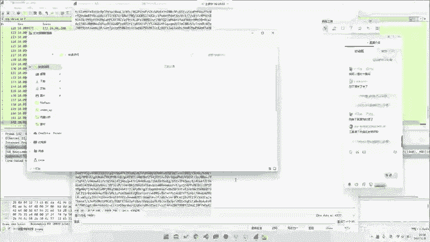
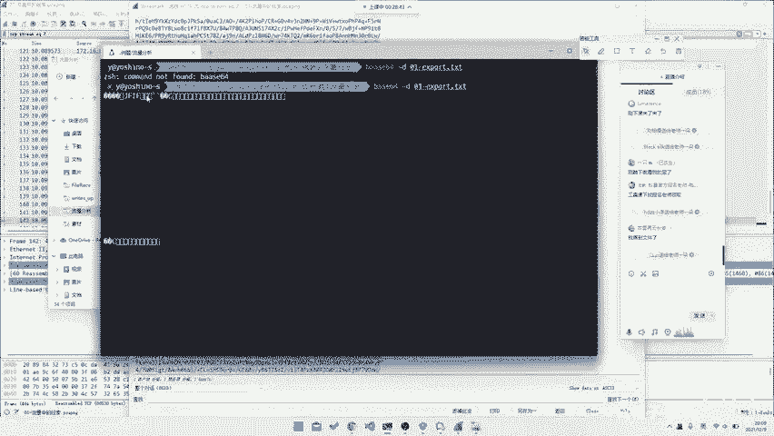

# CTF入门教程：P47：Misc之HTTP流量分析

在本节课中，我们将学习CTF比赛中Misc（杂项）类别中一个常见题型——HTTP流量分析。我们将从一个非常基础的例子入手，学习如何从捕获的网络流量数据包中，直接提取出隐藏在HTTP请求体中的关键信息或文件。

## 流量分析的主要方向

网络流量分析题目主要考察几个方向。我们根据这些类型去解题。

以下是常见的考察类型：

*   **请求体中直接包含信息**：这是最基础的一种，可以直接从HTTP请求的内容中提取出Flag或文件。
*   **DNS协议中的信息**：Flag可能隐藏在DNS查询或响应数据中。
*   **TLS/SSL加密流量**：这类题目通常需要解密或从加密流中找到线索，但本身如果没有密钥则无法直接解密。

上一节我们介绍了流量分析的几个主要方向，本节中我们来看看最常见和基础的一种情况：请求体中直接包含信息。

## 实战：从HTTP请求体提取文件

这种类型的题目，解题思路非常直接：从大量的HTTP请求中，找到那个包含关键信息的请求，并将其内容提取出来。

以下是解题步骤：

1.  **加载流量文件**：使用Wireshark等工具打开题目提供的`.pcap`或`.pcapng`流量包文件。
2.  **过滤与搜索**：在Wireshark中，可以应用过滤器（如`http`）来只显示HTTP协议流量，方便查看。也可以直接搜索特征字符串（如`flag`、`base64`、特定文件名等）。
3.  **定位关键请求**：逐个检查HTTP请求，寻找异常或包含编码数据（如Base64）的请求。在本例中，我们找到了一个请求路径为`/fenxi.php`的HTTP包。
4.  **识别编码**：在`fenxi.php`的请求或响应体中，发现了一串Base64编码的数据。作为Misc选手，识别常见编码（如Base64、Hex、URL编码）是一种基本直觉。
5.  **提取数据**：选中这串Base64数据，可以直接复制出来。在Wireshark中，也可以右键选择“导出分组字节流”来保存原始数据。
6.  **解码与还原**：将Base64字符串解码。可以使用在线工具、CyberChef，或者在命令行中使用`base64`命令。解码后可能得到乱码，但观察文件头（如`JFIF`）可以判断出这是一个JPG图片文件。
7.  **保存文件**：将解码后的二进制数据保存为正确的文件格式（如`.jpg`）。
8.  **获取Flag**：打开生成的图片文件，即可找到Flag。



我们通过一个具体操作来演示如何解码和保存文件。假设我们已经将Base64数据保存到了文件`data.txt`中。

```bash
# 使用base64命令解码并输出为二进制文件
base64 -d data.txt > 01_export.jpg
```



解码并重定向输出后，我们打开`01_export.jpg`图片，就能在其中发现Flag。

这种题目非常简单，是典型的“有手就行”入门题。它考察的是选手对HTTP协议的基本了解、对常见编码的识别能力以及基础的数据提取操作。

本节课中我们一起学习了CTF-Misc中HTTP流量分析的基础题型。我们了解了流量分析的几个可能方向，并重点实战演练了如何从HTTP请求体中直接提取Base64编码的文件数据，最终成功获取Flag。这是后续处理更复杂流量分析题目的重要基础。