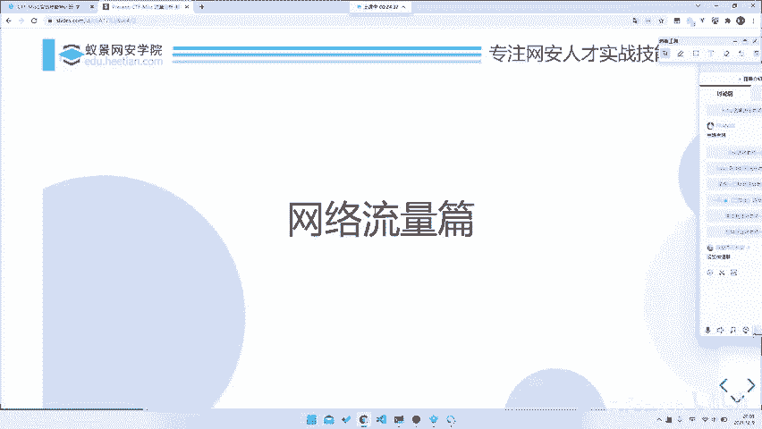

# CTF系列教程：P48：misc流量分析回顾及准备 📚

在本节课中，我们将回顾上一节关于流量分析的基础知识，并为接下来的协议分析学习做好准备。我们将介绍今天课程的核心内容、所需工具以及学习方法。

上一节我们介绍了流量分析的基础，包括工具介绍和流量种类辨析。我们提到了网络流量、USB流量等类型，并简要介绍了Wireshark工具。

## 课程回顾 📖

我们昨天讲解了流量分析的基础知识，主要包括工具介绍。我们还进行了流量种类的辨析。我们昨天只是概述了主要的流量类型，例如网络流量、USB流量，并且简单提到了Wireshark工具。我相信大家应该已经下载了Wireshark。我们今天上课也会用到它。

## 今日课程安排与资源 📂

今天有几个例题。我会同步将资料发布在我们的企业微信群里。大家如果感兴趣，可以直接跟着做一做，这些例题都比较简单。可以说听完我的课，完成这些练习是很容易的。因此，接下来希望大家能一起动手实践。

我们不再多说，直接开始讲解今天的内容。

## 本节核心：协议分析与要点提取 🔍

今天，我们主要讲解协议分析和要点提取。我们今天重点放在协议本身，即这几种协议本身是如何解析的，或者我们如何查看协议的内容。我们的重点不是解题技巧。我们明天会详细讲解针对不同题目如何入手，或者如何分析解题思路。解题技巧的分析将放在明天。今天，我们只关注题目涉及的知识点本身。

当然，我们关注知识点本身，并不意味着以后一定会考这几个点，或者只有这几个知识点。都不是。我们看知识点，也只是带大家了解如何发现这些点，或者如何搜索相关资料。因为正如我们昨天所说，在Misc题目中，最重要的固然是积累，但在积累不足的情况下，你依然可以解题。怎么做呢？你需要具备良好的信息搜集能力。因此，我们今天就来讲解协议分析，看看分析的步骤是哪几个，最后再讲几个要点。

没有加入微信群的同学，可以找报名老师索取加群方式。

## 课前准备 🛠️

今天我们需要做一些准备。

以下是今天课程需要准备的软件和环境：

*   **Wireshark**：我们昨天已经发布了下载地址，大家安装即可。如果还没安装，现在安装也来得及。
*   **Python**：因为我们近期解题可能会用到一点Python，所以你需要准备Python环境。
*   **Linux环境**：最好准备一个Linux环境。因为有一些脚本或者工具，在Linux下运行会更方便。

以上就是我们今天需要准备的三个东西。

## 进入知识点分析 📝

接下来，我们将进入实质性的知识点分析环节。

本节课中，我们一起回顾了流量分析的基础，明确了今天的学习重点是协议本身的分析与要点提取，并准备好了必要的工具和环境。下一节，我们将开始深入具体的协议分析步骤。