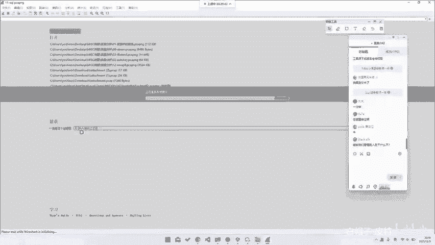
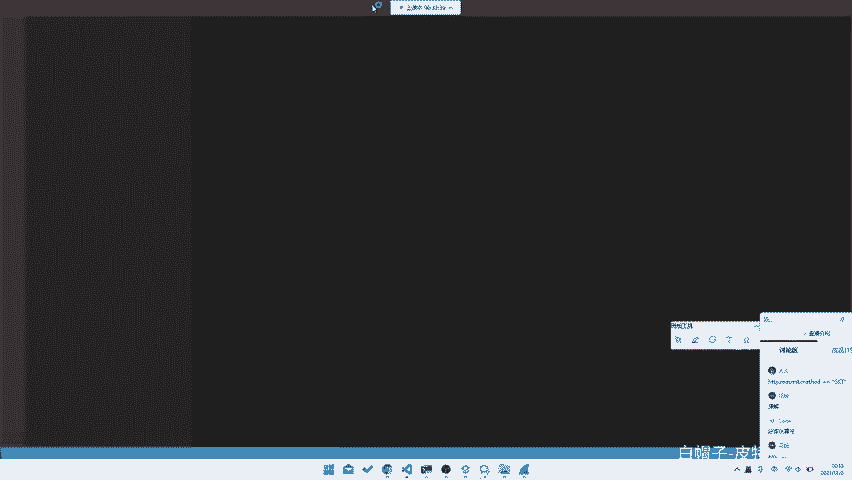
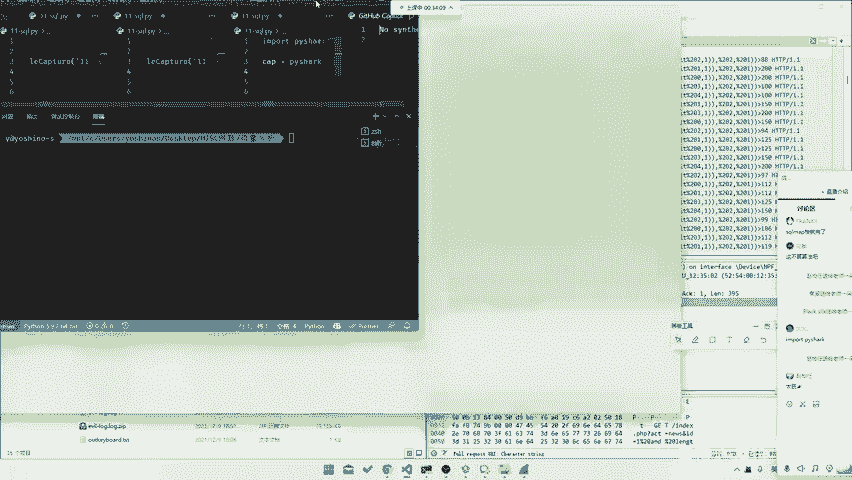
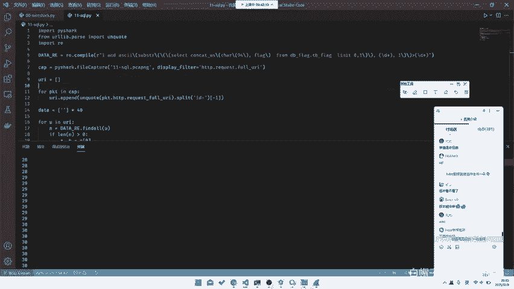

# CTF系列教程：P49：misc流量分析之SQL注入攻击流量分析 🔍



在本节课中，我们将学习如何从网络流量数据包中分析并提取出SQL注入攻击的痕迹，最终还原出攻击者试图获取的敏感信息（如flag）。我们将使用Wireshark和Python脚本进行实战分析。

---

## 概述与背景

上一节我们介绍了基础的流量分析技巧。本节中，我们来看看一种更进阶的攻击流量分析场景：**SQL注入**。

我们手头有一个包含SQL注入攻击流量的数据包文件。这个数据包非常大，包含许多条记录。我们的目标是过滤出攻击流量，分析其攻击模式，并编写脚本自动化提取出被窃取的数据。


## 数据包过滤与初步观察

首先，我们需要在大量的数据包中过滤出与攻击相关的HTTP请求。在Wireshark中，我们可以使用显示过滤器。

以下是过滤HTTP请求URL的步骤：



1.  打开数据包文件后，在过滤器栏输入：`http.request.uri`
2.  应用此过滤器，Wireshark将只显示所有包含HTTP请求URI的数据包。

通过观察过滤后的数据，我们可以发现一些异常的请求。例如，一条请求可能形如：
`index.php?act=news&id=...`，并且在`id`参数后面跟随了一长串看似SQL代码的字符串，这强烈暗示了SQL注入攻击的存在。


## 理解攻击模式：基于布尔的盲注



我们不对SQL注入的原理做深入讲解，但需要理解本例中的攻击模式：**基于布尔的盲注**。

攻击者通过构造SQL语句，根据页面返回结果的真假（True/False）来逐位推断数据库中的数据。在本例的流量中，攻击者使用了**二分查找法**来高效地猜测每一位字符的ASCII码值。

其Payload的核心逻辑通常如下：
```sql
... AND ascii(substr((select ...), {位置}, 1)) > {猜测值} ...
```
*   `{位置}`：代表要猜测的字符串的第几位。
*   `{猜测值}`：代表猜测的ASCII码值（例如，先猜128，再根据结果猜64或192）。

通过分析流量，我们发现攻击者按顺序对目标数据的每一位进行猜测（第一位，第二位...）。对于每一位，攻击流量中会包含一系列请求，直到最后一个请求成功猜中该位的正确值，然后攻击者就会转向下一位。


## 编写Python脚本提取数据

面对有规律的大量数据，编写脚本进行自动化分析是最高效的方法。我们将使用Python的`pyshark`库来读取数据包。

以下是提取并解码SQL注入流量的步骤：

1.  **导入数据包并过滤HTTP请求**
    我们首先读取数据包文件，并应用与Wireshark中相同的过滤器，获取所有HTTP请求的URI。

    ```python
    import pyshark
    cap = pyshark.FileCapture('sql.pcapng', display_filter='http.request.uri')
    uris = [pkt.http.request_uri for pkt in cap]
    cap.close()
    ```

2.  **提取并解码Payload**
    每个URI中的攻击Payload位于`id=`参数之后，并且是URL编码的。我们需要将其解码并提取出来。

    ```python
    from urllib.parse import unquote
    payloads = []
    for uri in uris:
        # 找到'id='之后的部分，并进行URL解码
        if 'id=' in uri:
            payload = uri.split('id=')[1]
            decoded_payload = unquote(payload)
            payloads.append(decoded_payload)
    ```

3.  **使用正则表达式匹配关键信息**
    我们需要从每个Payload中提取出两个关键数字：**字符位置**和**猜测的ASCII码值**。

    ```python
    import re
    pattern = re.compile(r'substr.*?(\d+).*?>\s*(\d+)')
    data = []
    for p in payloads:
        match = pattern.search(p)
        if match:
            # match.group(1)是位置，match.group(2)是猜测值
            data.append((int(match.group(1)), int(match.group(2))))
    ```

4.  **重组并解码Flag**
    根据观察，每一位字符的最后一条成功请求的“猜测值”就是该字符正确的ASCII码。我们需要按“位置”顺序整理这些值，并将其转换为字符。

    ```python
    # 初始化一个足够长的列表来存放每位字符的ASCII码
    flag_ascii = [0] * 40  # 假设flag长度不超过40
    for pos, val in data:
        # 确保我们只保留每位最后出现的值（即成功的猜测）
        if pos > 0 and val > flag_ascii[pos]:
            flag_ascii[pos] = val
    # 将ASCII码列表转换为字符串
    flag = ''.join(chr(c) for c in flag_ascii if c != 0)
    print(flag)
    ```

运行完整的脚本后，我们就能得到攻击者通过SQL注入从数据库中提取出的最终Flag字符串。


## 总结

本节课中我们一起学习了如何分析包含SQL注入攻击的网络流量。我们首先使用Wireshark过滤器定位攻击请求，然后理解了基于布尔盲注的攻击原理，最后通过编写Python脚本，自动化地提取并解码了隐藏在大量请求中的Flag信息。



这项技能结合了流量分析、对Web攻击的理解以及基本的编程能力，是CTF比赛中Misc类题目的常见考点。