# CTF入门教程：P4：Web安全工具Burp Suite使用指南 🛠️

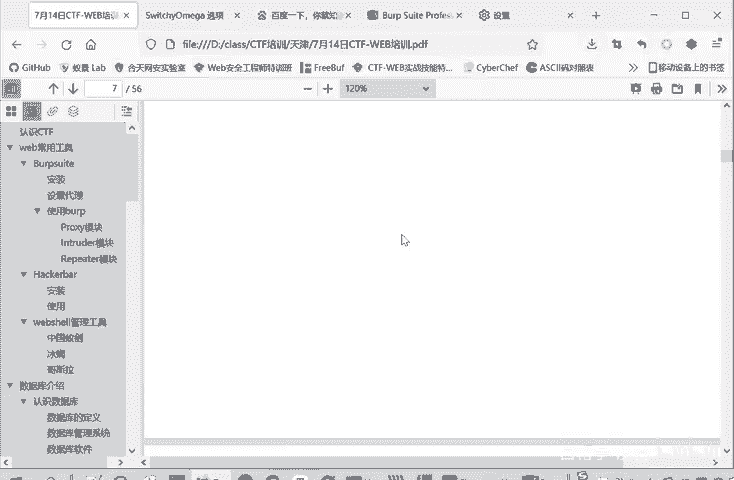

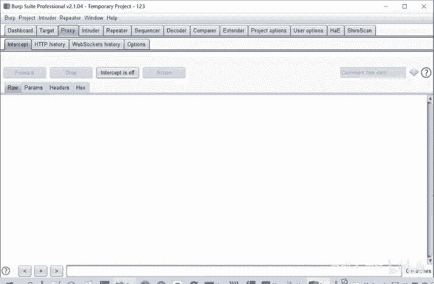

在本节课中，我们将学习网络安全测试中一个至关重要的工具——Burp Suite。我们将重点了解其核心模块的功能与使用方法，特别是如何利用它拦截、修改和重放HTTP请求，以及进行暴力破解攻击。

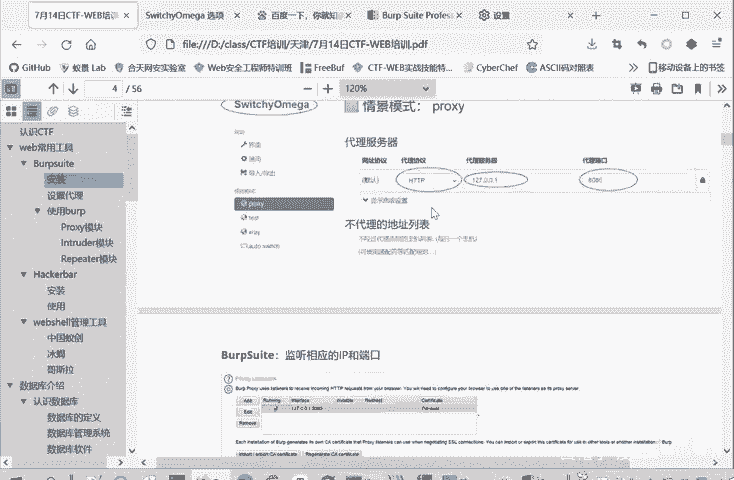

## 代理模块：拦截与查看流量 🔍

上一节我们介绍了Burp Suite的安装与基本配置，本节中我们来看看其核心功能模块。Burp Suite的核心工作原理是作为浏览器和服务器之间的“中间人”。这意味着，当浏览器配置了Burp代理后，所有发送到服务器的请求和接收到的响应都会经过Burp Suite。

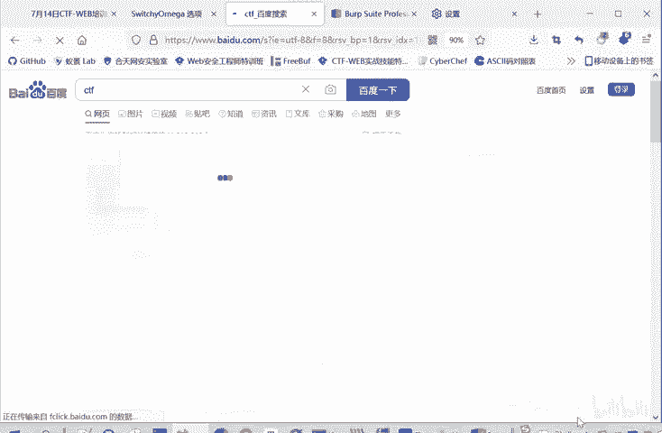

### 代理模块详解

以下是代理模块的主要组成部分及其功能：

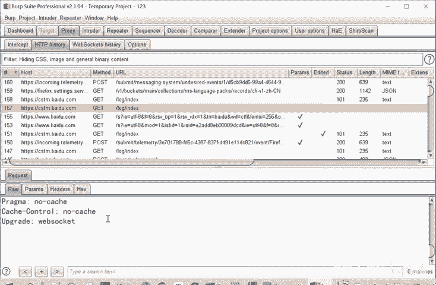

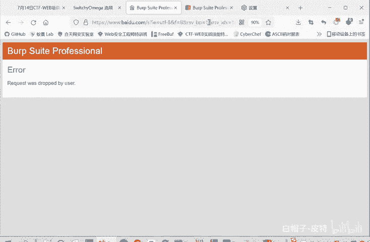

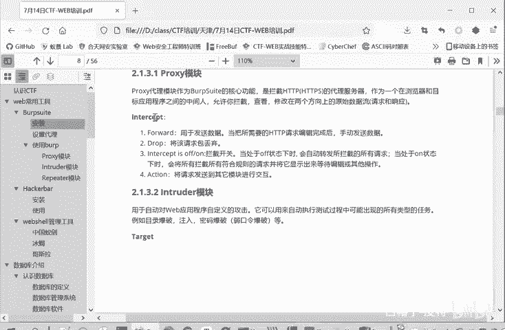

1.  **拦截控制**：通过“Intercept is on/off”开关控制是否拦截请求。当开启拦截时，请求会在Burp处暂停，允许用户查看和修改。
2.  **流量记录**：无论拦截是否开启，所有经过Burp的HTTP/HTTPS流量都会被记录在“HTTP history”和“WebSockets history”中，供后续分析。
3.  **请求操作**：在拦截状态下，可以对暂停的请求包执行以下操作：
    *   **Forward**：将修改后的请求发送给服务器。
    *   **Drop**：丢弃当前请求，不发送给服务器。
    *   **Action**：将请求发送到其他模块，如Intruder或Repeater。
4.  **选项设置**：在“Options”标签页中，可以配置代理监听地址、端口等参数。

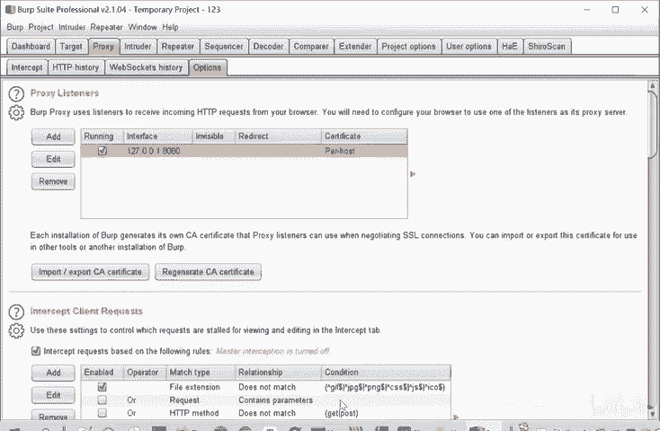

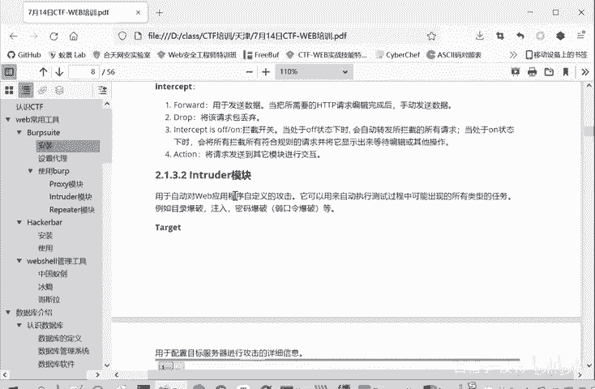

## 爆破模块：自动化攻击测试 💣

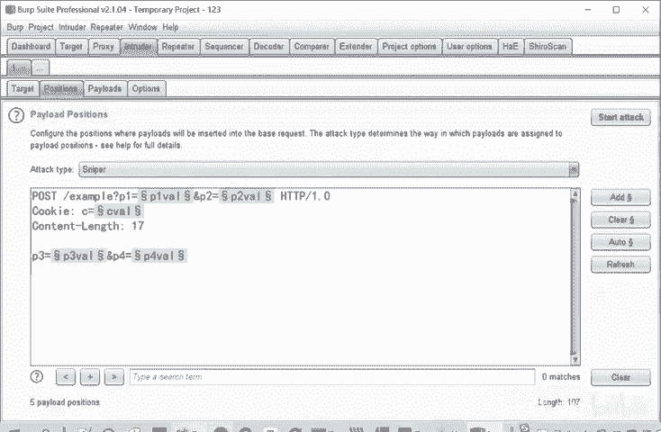

了解了如何捕获流量后，我们来看看如何利用Burp Suite进行自动化测试，例如暴力破解登录口令。

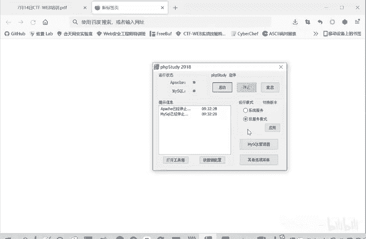

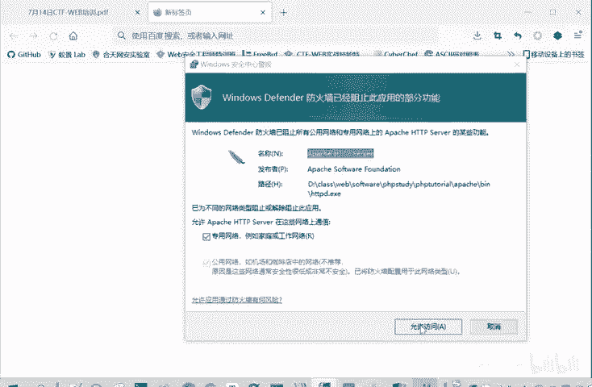

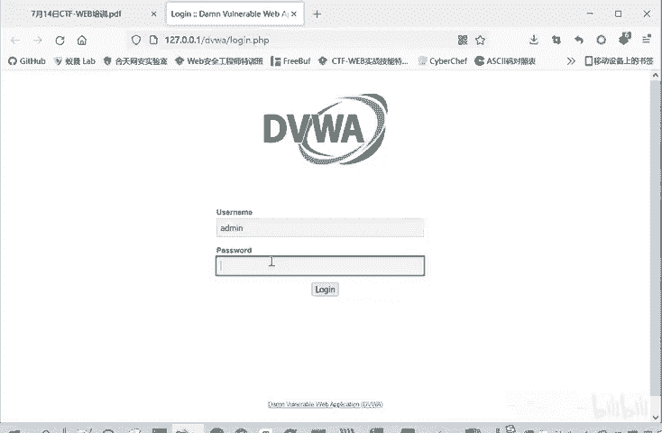

### 爆破流程演示

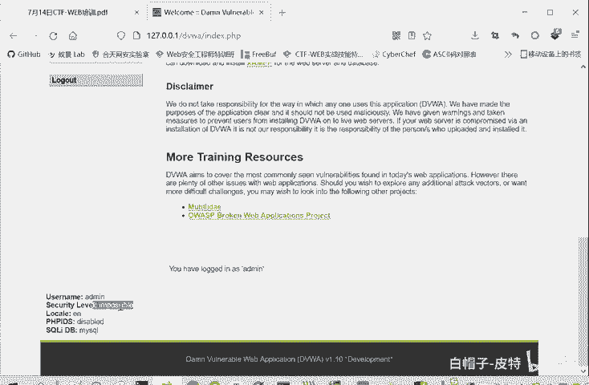

我们以DVWA靶场中的暴力破解漏洞为例，演示Intruder模块的使用。

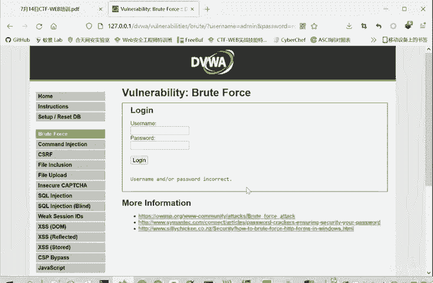

1.  **捕获请求**：首先，在代理模块中捕获一次登录尝试的HTTP请求包。
2.  **发送至Intruder**：右键点击捕获到的请求包，选择“Send to Intruder”。
3.  **设置攻击目标与位置**：在Intruder模块的“Target”和“Positions”标签页，Burp会自动填充目标服务器信息。我们需要在请求包中标记出要爆破的变量位置（例如密码字段），并清除其他无关标记。
    *   代码示例：将 `password=root` 中的 `root` 标记为变量 `§root§`。
4.  **选择攻击模式**：在“Positions”标签页选择攻击类型。主要有四种：
    *   **Sniper**：对单个位置使用一个字典进行遍历。
    *   **Battering ram**：对多个位置使用同一个字典。
    *   **Pitchfork**：每个位置使用一个独立的字典，按顺序配对测试。
    *   **Cluster bomb**：每个位置使用一个独立的字典，进行交叉组合测试（笛卡尔积）。
5.  **配置载荷**：在“Payloads”标签页，导入或手动添加用于爆破的字典列表（如常用密码列表）。
6.  **开始攻击**：点击“Start attack”按钮，Burp会开始自动发送携带不同载荷的请求。
7.  **分析结果**：攻击完成后，通过比较响应包的长度（Length）、状态码（Status）或内容差异，来识别哪个载荷可能是正确的。例如，响应长度与众不同的那个请求，其使用的密码很可能就是正确的。

## 重放模块：手动测试与调试 🔄

除了自动化爆破，手动修改和重复发送单个请求进行测试也是常见需求，这就要用到Repeater模块。

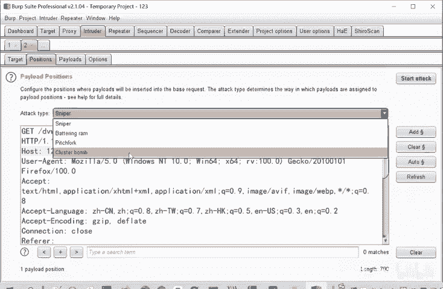

### Repeater模块功能

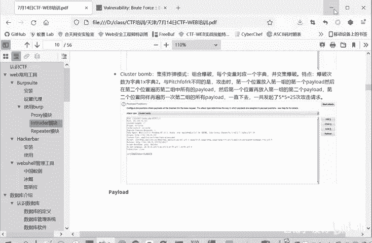

1.  **发送请求**：从代理历史记录或Intruder中，将请求包发送到Repeater模块。
2.  **灵活修改**：在Repeater界面中，可以方便地修改请求的任何部分，包括URL、参数、请求头（如User-Agent、Host）、Cookie等。
3.  **发送与查看**：点击“Send”按钮，即可将修改后的请求发送出去，并在右侧面板立即查看服务器的响应结果。
4.  **迭代测试**：基于上一次的响应，可以继续修改请求并再次发送，非常适合用于手动测试漏洞（如SQL注入、XSS）或调试Web应用程序逻辑。

## 其他实用模块

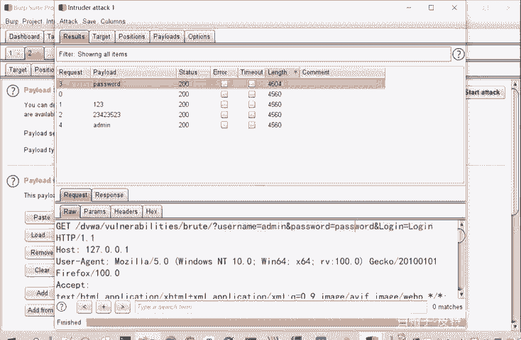

Burp Suite还包含其他有用的模块，例如：
*   **Decoder**：一个强大的编码解码工具，支持Base64、URL、HTML、Hex等多种编码的转换与散列计算。
*   **Comparer**：用于比较两次请求或响应之间的差异。
*   **Sequencer**：用于分析会话令牌等随机数据的随机性。

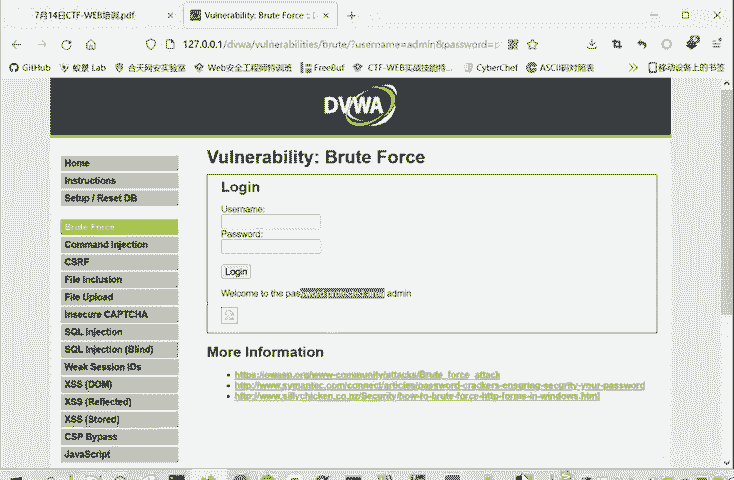

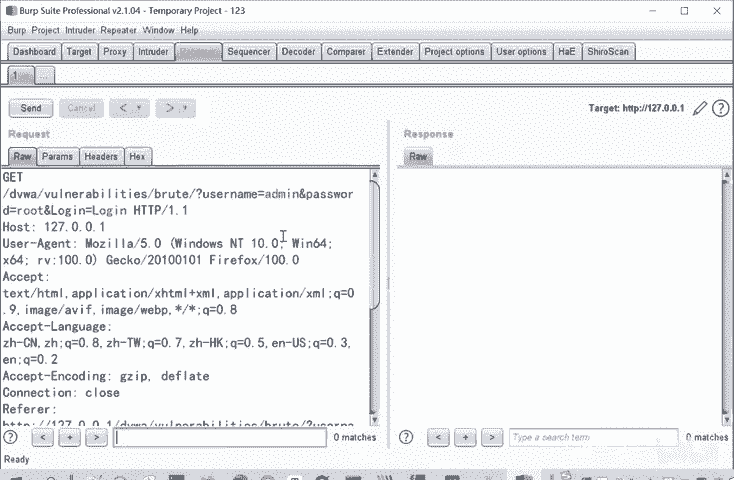

## 总结 📝

本节课中我们一起学习了Burp Suite的三个核心模块：
1.  **Proxy**：作为中间人拦截、查看和修改HTTP/HTTPS流量，是安全测试的基石。
2.  **Intruder**：用于自动化攻击测试，如暴力破解、模糊测试，通过配置攻击位置、模式和载荷来实现。
3.  **Repeater**：用于手动重放和修改单个HTTP请求，是进行精细漏洞测试和调试的利器。

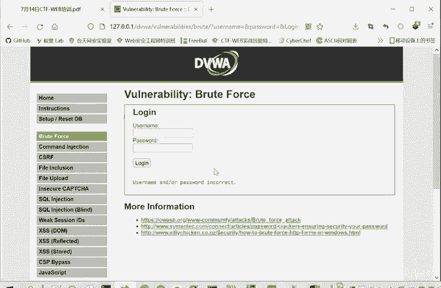

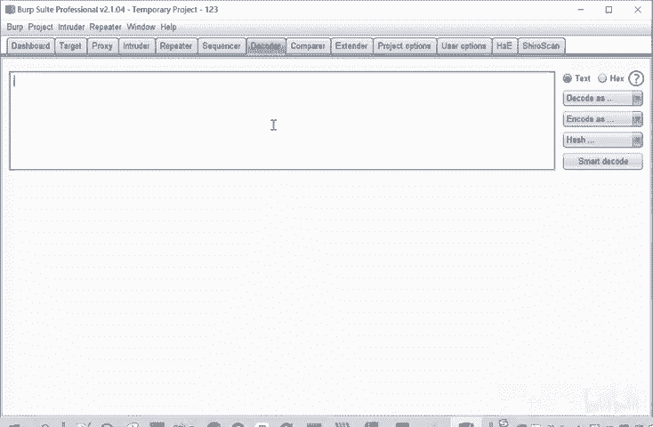

掌握这三个模块的使用，是进行Web安全测试和CTF Web题目解题的关键技能。请务必在本地靶场（如DVWA）中多加练习，熟悉整个工作流程。