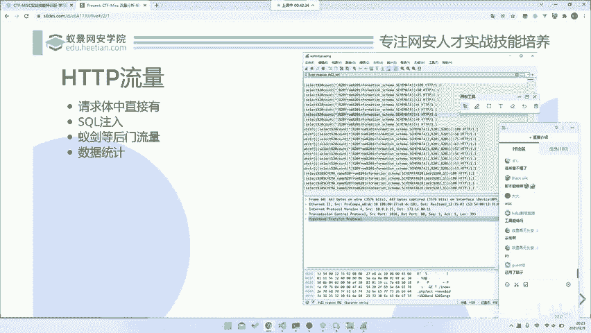
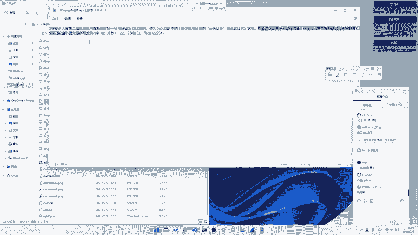
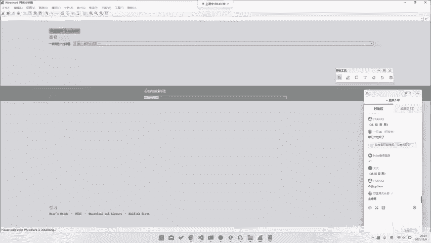
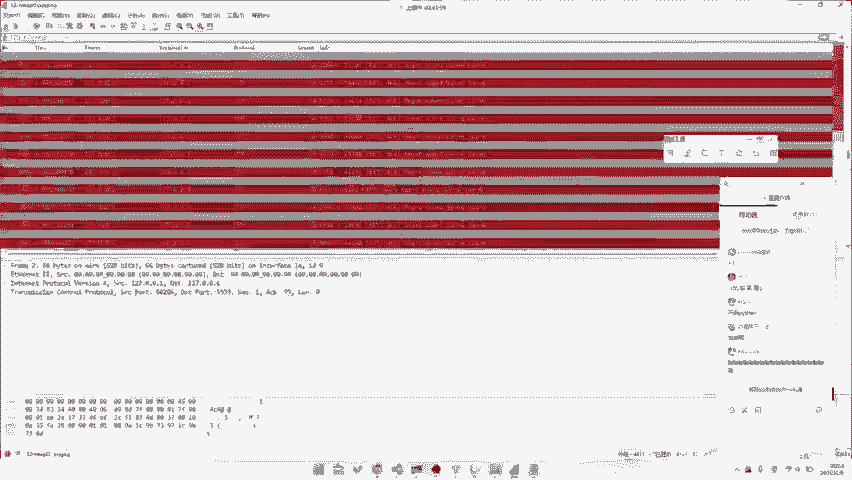
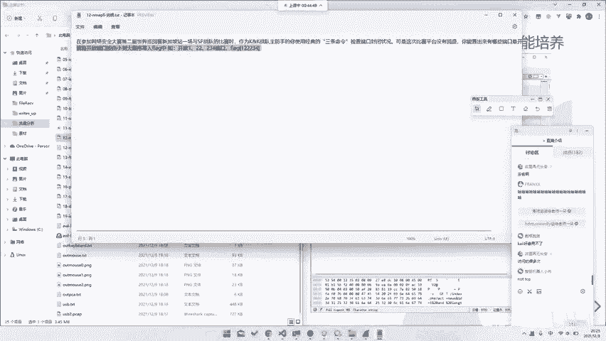

# CTF系列教程：P50：Misc流量分析 - 后门流量与数据分析

在本节课中，我们将学习如何分析CTF比赛中常见的后门流量，并掌握从流量数据包中提取关键信息的基本方法。我们将通过一道具体的赛题，讲解如何识别和分析如“菜刀”、“蚁剑”等后门工具产生的流量，以及如何利用过滤技巧高效地处理数据。

## 已建后门流量分析

上一节我们介绍了基础的HTTP流量分析，本节中我们来看看如何分析“蚁剑”这类后门工具产生的流量。我们会在课程中留一道相关的小作业。

*   作业将在明天上课前发布在微信群中。
*   建议大家在明天课前尝试完成。
*   我们将在明天的课程中对作业进行讲解。

## 数据统计与Nmap流量分析

数据统计的方法与我们昨天所讲的内容原理相同。接下来，我们通过一道赛题来实践。

这道题目来源于第二届世界网络安全大赛新加坡站与SP战队的比赛。题目描述是：作为KK战队的防守方，使用经典的3条命令检查端口状态。

我们都很熟悉，这通常指的是使用 **`nmap`** 命令进行端口扫描。

题目暗示平台没有回显，但目标端口是开放的。解题思路很简单：分析提供的流量包，找出针对 `127.0.0.1` 的扫描中有哪些端口是开放的。

**核心任务**：在流量中找出所有成功的端口扫描响应。

*   原理是分析发送到 `127.0.0.1` 的扫描请求及其响应。
*   你可以手动翻阅所有流量记录。
*   更高效的方法是使用我们之前提到的过滤器（Filter）功能。

这段流量实际上就是一次 **`nmap`** 扫描的记录。你需要找到所有能得到响应的记录。例如，下图中响应了端口 **`631`** 的信息就是有效的。

因此，解题的关键是找出所有类似的成功响应流量。你可以手动查找，也可以编写过滤器来实现。

以下是留给你的课后思考题：如果要为这道题目编写一个过滤器，你应该如何编写？

过滤器的具体语法和文档可以在网上或Wireshark官网找到。我们鼓励大家自行研究和尝试，这是学习过程中非常重要的一环。例如，你可以从 **`TCP`** 协议相关的过滤条件开始思考。

## 总结

本节课我们一起学习了后门流量的初步分析方法，并通过一道Nmap流量分析赛题进行了实践。即使是看似简单的纯HTTP/HTTPS流量，也能衍生出丰富的分析技巧和解题思路。当然，我们今天所涉及的只是流量分析领域中很小的一部分。在后续的课程中，我们还将接触到更多复杂和有趣的流量分析场景。