# CTF入门教程：P51：Misc流量分析之FTP与ICMP协议

在本节课中，我们将学习如何分析CTF比赛中常见的两种网络协议流量：FTP和ICMP。我们将通过具体的赛题实例，学习如何从流量包中提取隐藏的数据，并最终获得Flag。课程将涵盖使用命令行工具和Python脚本进行数据分析的方法。

## 协议层次与区别

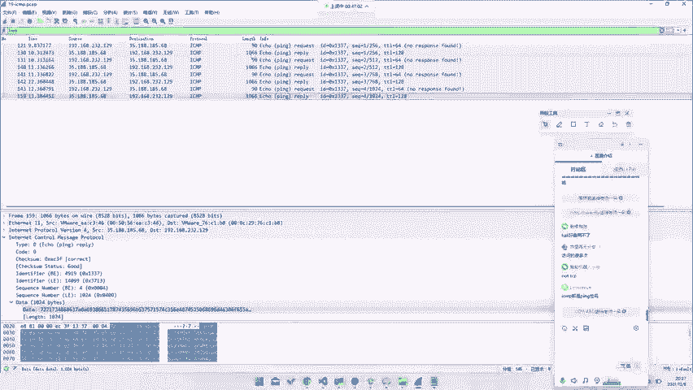

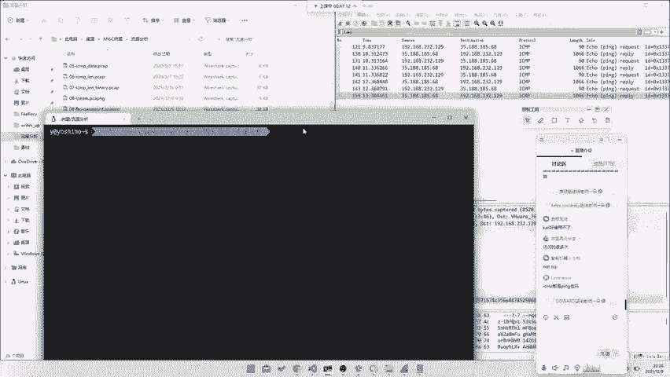

上一节我们介绍了网络流量的基础概念，本节中我们来看看FTP和ICMP协议在协议栈中的位置。

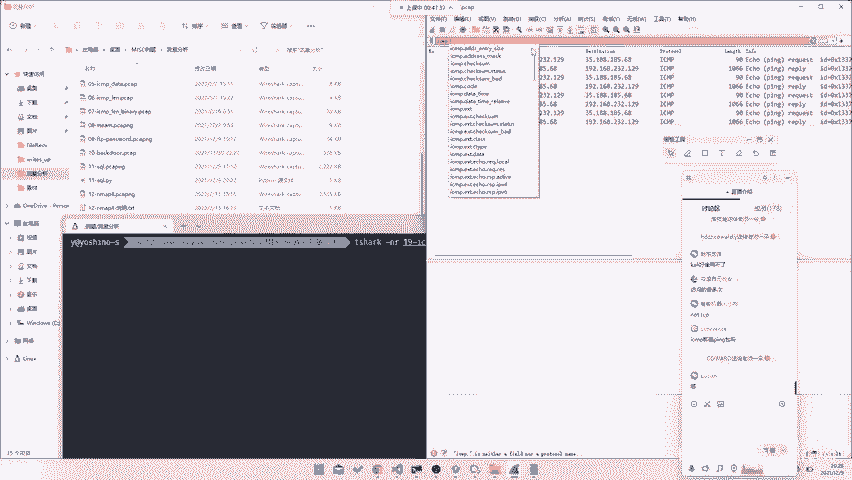

FTP协议运行在TCP协议之上，用于文件传输。而ICMP协议与TCP协议处于同一层，用于传递控制消息。例如，我们常使用的`ping`命令就是基于ICMP协议的。

## ICMP流量分析实战

接下来，我们通过一道具体的CTF题目，学习如何分析ICMP流量并提取Flag。

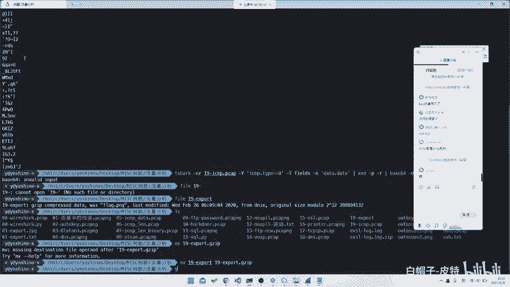

题目提示流量包中包含ICMP协议数据。我们的第一步是使用Wireshark的显示过滤器，过滤出所有ICMP协议的数据包。

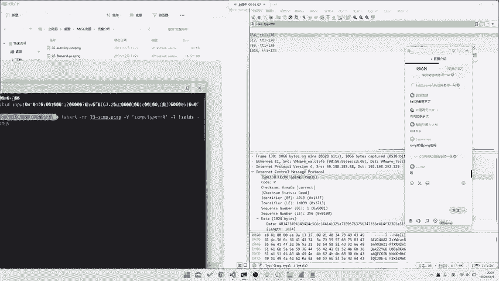

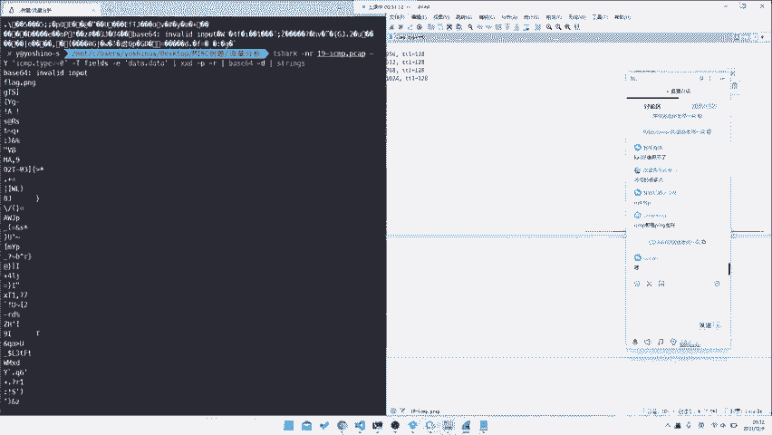

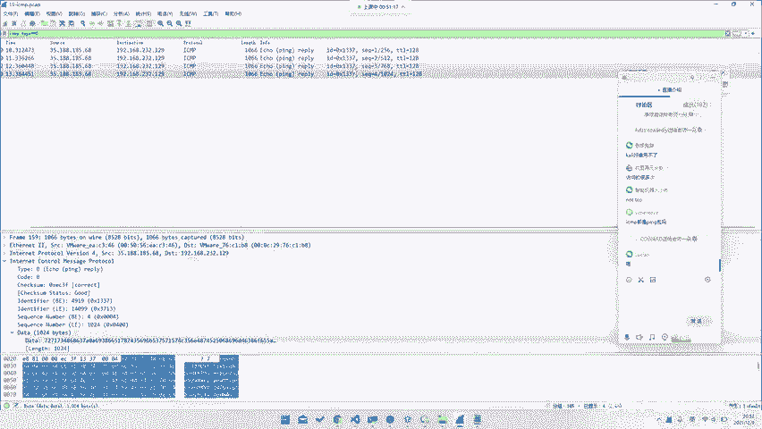

**过滤命令示例：**
```
icmp
```

观察过滤后的数据包，我们发现并非所有ICMP包都携带有效数据。例如，`no response found`的包其数据区（Data）全为0。我们需要寻找那些在Data字段携带了Base64编码数据的ICMP响应包（Reply）。

ICMP响应包的`type`字段值为0。因此，我们可以进一步过滤。

**过滤ICMP响应包命令：**
```
icmp.type == 0
```

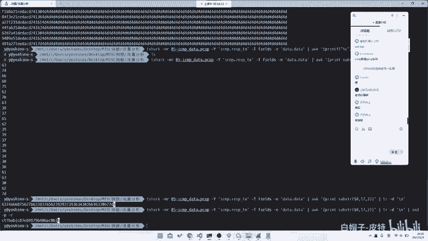

以下是提取和分析数据的关键步骤：

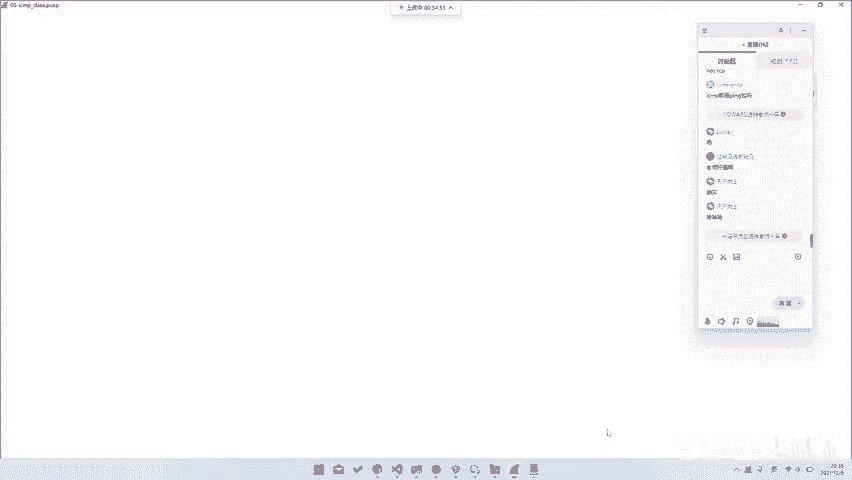

1.  **提取Base64数据**：使用`tshark`命令行工具，从过滤出的ICMP响应包中提取Data字段。
2.  **解码数据**：将提取出的Base64字符串进行解码。
3.  **处理文件**：解码后的数据可能是一个经过压缩（如gzip）的文件，需要进一步解压才能得到最终的文件（例如flag.png）。

**使用tshark提取数据的命令示例：**
```bash
tshark -r 流量包文件.pcap -Y "icmp.type == 0" -T fields -e data.data
```

**使用Python脚本处理的思路：**
如果对命令行工具不熟悉，也可以编写Python脚本完成上述步骤。基本流程是：读取pcap文件、过滤ICMP响应包、提取并拼接Data字段、进行Base64解码、最后解压并保存文件。

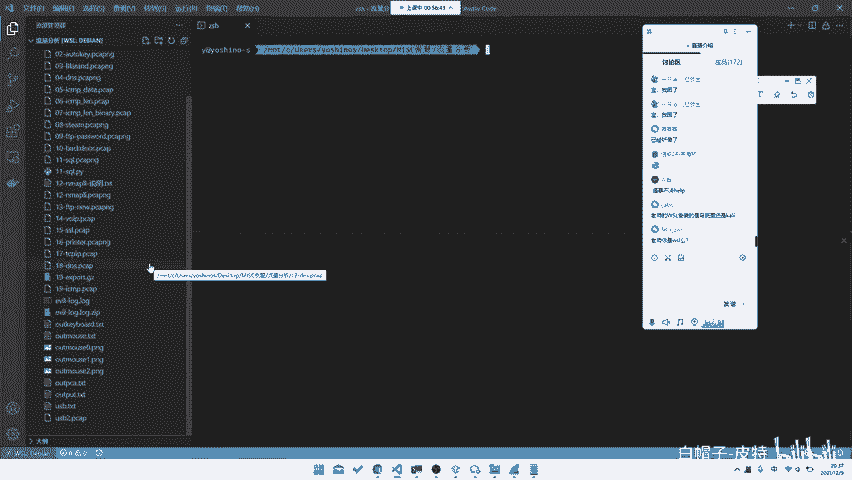

## 深入ICMP数据隐藏点

ICMP协议中不止Data字段可以隐藏信息。我们来看另一道题目，它利用了ICMP包的其他字段。

在这道题中，Flag被隐藏在ICMP包的`length`（长度）字段中。我们需要过滤出ICMP请求（Request）或响应（Reply）包，然后提取其`data.len`字段的值。

**提取length字段的命令示例：**
```bash
tshark -r 流量包文件.pcap -Y "icmp" -T fields -e data.len
```

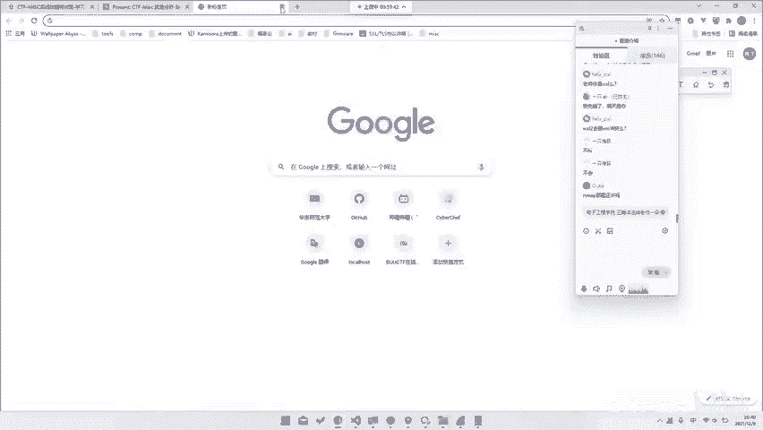

提取出的是一串数字，每个数字对应一个ASCII字符码。将其转换为字符后，即可拼接出Flag。

**使用AWK命令转换的示例：**
```bash
tshark ...（提取命令）... | awk '{printf "%c", $1}'
```

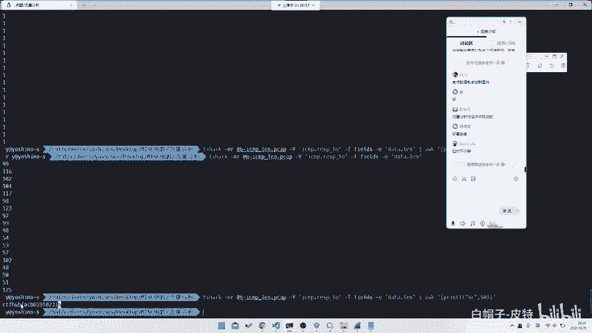

## 其他协议与总结

网络流量分析不仅限于FTP和ICMP。CTF比赛中还可能遇到基于UDP的协议（如承载语音的RTP/VoIP），或者需要分析TCP/IP头部信息（如源IP地址的变化）来获取Flag。

本节课中我们一起学习了：
1.  FTP与ICMP协议的基本层次。
2.  如何过滤并分析ICMP流量包，从Data字段提取隐藏的Base64编码数据。
3.  如何发现并利用ICMP协议中其他字段（如length）隐藏的信息。
4.  介绍了使用`tshark`、`awk`等命令行工具以及Python脚本进行流量分析的基本方法。

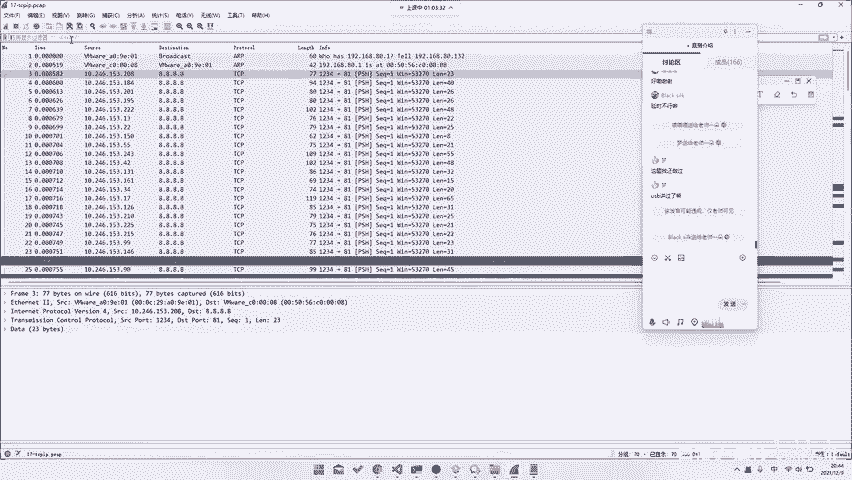

掌握这些基础方法后，面对各种网络协议流量分析题时，你便能清晰地知道从何入手：先识别协议，再过滤关键数据包，最后从特定字段中提取并解码出Flag。