# CTF系列教程：P52：Misc流量分析之USB流量

在本节课中，我们将学习CTF比赛中Misc类题目中USB流量的分析与处理方法。USB流量不仅限于常见的键盘和鼠标数据，还可能涉及游戏手柄、打印机等多种设备。我们将从基础工具使用讲起，逐步深入到如何分析未知协议的流量数据。

## USB流量概述

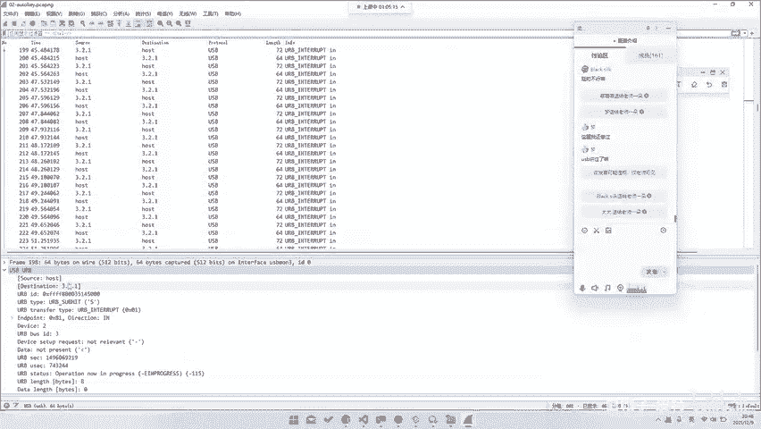

上一节我们介绍了网络流量分析，本节中我们来看看USB流量。USB流量是CTF Misc题目中常见的一类，通常以数据包捕获文件（如pcap）的形式出现。网络流量只是流量分析的一部分，USB流量同样重要。

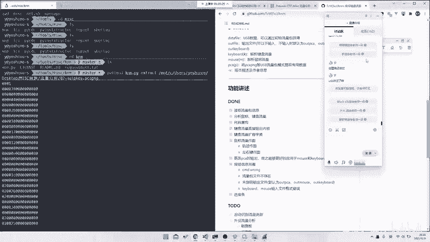

USB流量类型多样，最常见的是键盘和鼠标流量。当然，也会出现其他类型的设备流量。

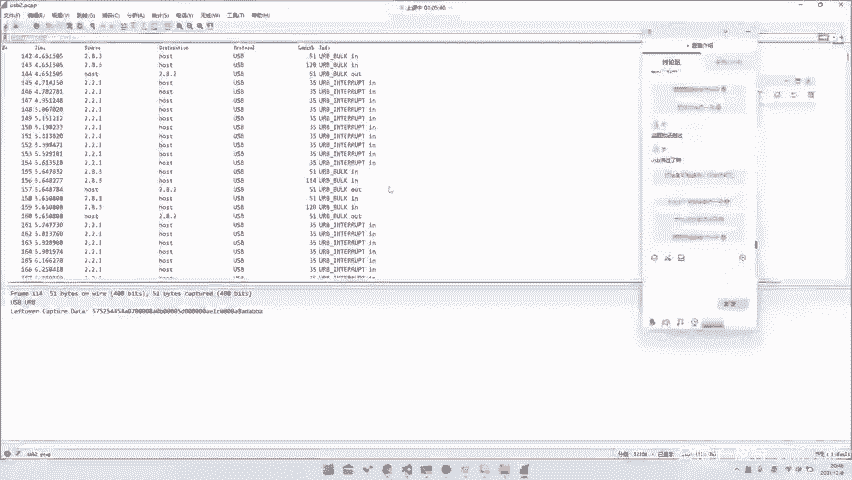

## 键盘与鼠标流量分析

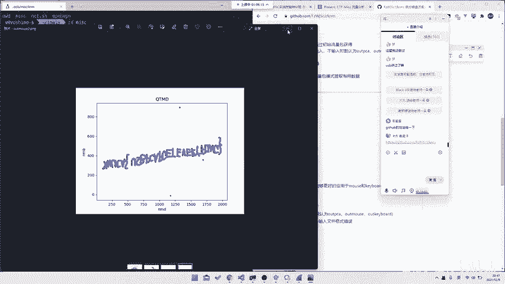

对于最常见的键盘和鼠标流量，已有成熟的工具可以辅助分析。

以下是分析键盘流量的基本方法：
*   USB键盘流量数据包通常具有固定的长度。
*   关键击键信息往往存放在数据包的特定字节位置（例如第三位）。
*   使用专用工具可以一键提取出击键序列。

例如，可以使用工具 `UsbPcapKeyExtract` 来导出流量中的键盘数据。该工具由社区开发者编写，能够自动处理数据包并提取击键信息。

鼠标流量的分析与键盘类似，但也有其特点。

以下是鼠标流量分析的关键点：
*   鼠标流量数据也遵循特定的格式。
*   通过解析数据包，可以重建鼠标的移动轨迹、点击事件（左键、右键）。
*   同样存在现成的脚本或工具，可以将原始流量数据转换为可视化的移动轨迹图。

例如，在一些CTF题目中，提供鼠标流量包，选手的目标就是通过脚本解析，画出一张隐藏了flag信息的图片轨迹。

## 其他USB设备流量分析

USB流量并不仅限于鼠标和键盘，近年来CTF题目中出现了更多类型的设备流量，这要求我们具备分析未知协议的能力。

### 游戏手柄流量

例如，在“西湖论剑2020”的初赛题中，出现了索尼PS4手柄（DualShock 4）的流量。对于这类不常见的设备，解题思路可能包括：
*   查阅该设备的官方通信协议文档。
*   如果无法找到协议，可以尝试观察数据的时间间隔、数值变化规律等特征来寻找突破口。

### 打印机流量

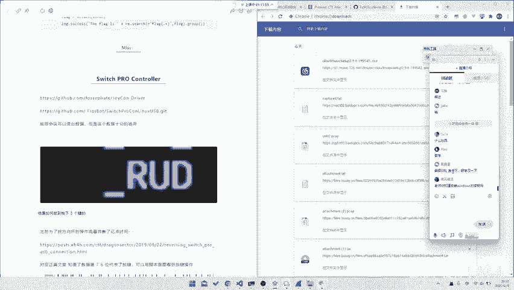

也存在关于USB打印机的题目。这类题目通常属于“文档题”，解题关键在于：
*   识别流量来自打印机（有时题目名会直接提示，如`printer`）。
*   在USB协议协商阶段，可以通过`Vendor ID`和`Product ID`来查询设备类型。
*   学习并理解打印机相关的通信协议（如USB打印类协议），才能正确解析数据。

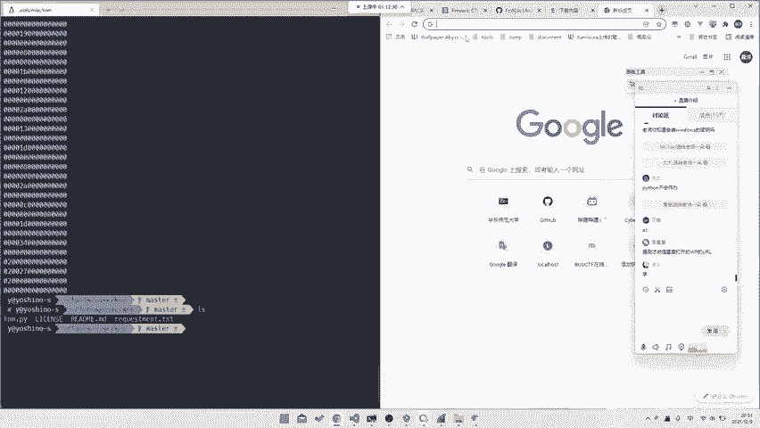

### 新兴与特殊设备流量

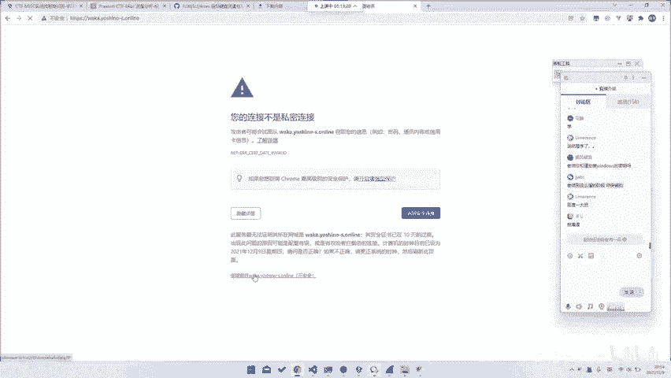

随着比赛发展，出现了更多新颖的USB流量题目。

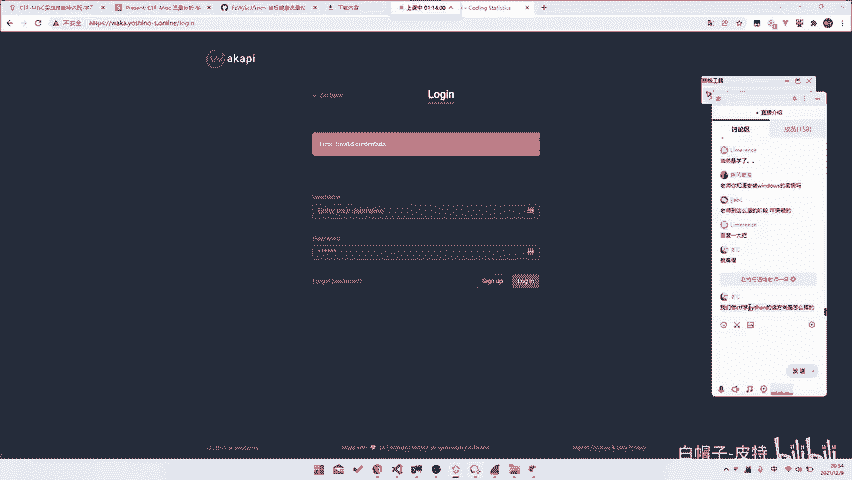

以下是一些近年出现的例子：
*   **公共终端机流量**：流量数据格式未知，需要通过观察数据中的关键词（如`up`, `down`, `逗号分隔`）来推测其含义和结构。
*   **安卓调试流量**：例如通过`scrcpy`工具产生的控制安卓设备的ADB协议流量。识别这类流量需要寻找其特征码，并利用搜索引擎进行查询。
*   **任天堂Switch手柄流量**：需要自行寻找并分析其通信协议，确定数据包中哪些字节代表按键状态，进而还原操作序列。

面对这些未知协议，通用的解题方法是：**观察数据特征 -> 猜测协议类型 -> 搜索相关文档 -> 编写解析脚本**。

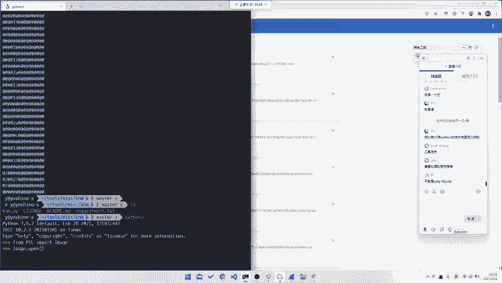

## 实战技能与学习建议

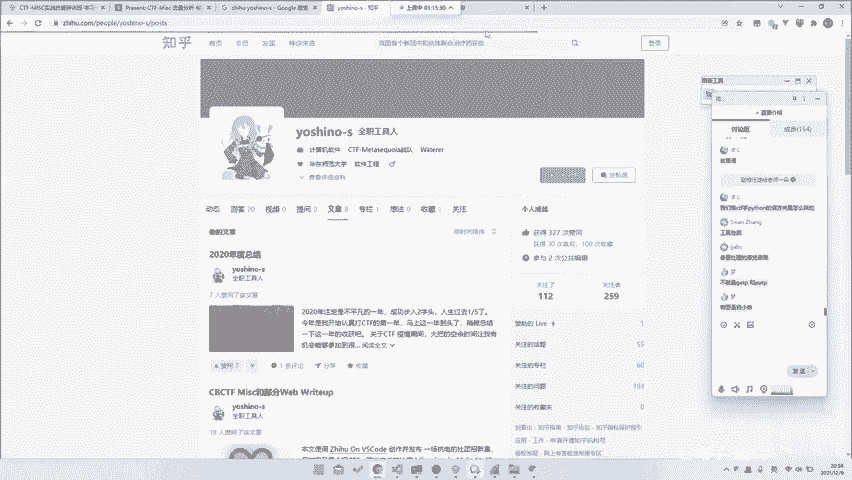

在CTF中，无论分析哪种流量，编写脚本（常用Python）自动化处理数据都是核心技能。

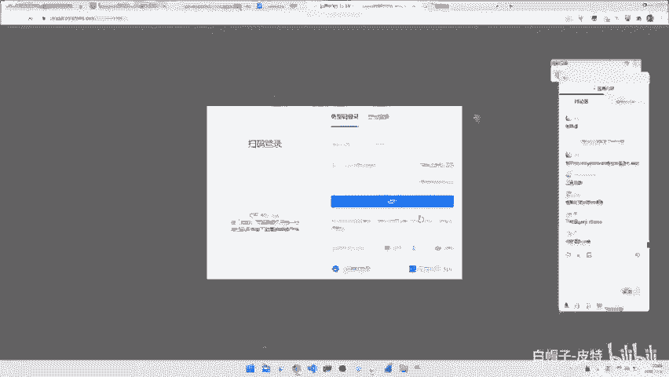

对于编程语言的学习，在CTF中应注重实践：
*   掌握Python的基本语法和常用库（如`PIL`用于图像处理）即可。
*   关键在于将语言作为工具，实现解题逻辑。许多库和用法可以在遇到具体题目时现学现用。
*   提升能力的唯一途径是**多练习、多写代码**。通过大量解题来积累经验，达到熟能生巧。

图像处理是Misc中的常见考点，其核心是对像素矩阵的操作。
在Python中，使用PIL库处理图像的基本公式可以概括为：
```python
from PIL import Image
img = Image.open(‘flag.png’)
width, height = img.size
for y in range(height):
    for x in range(width):
        r, g, b = img.getpixel((x, y)) # 获取像素值
        # ... 处理逻辑 ...
        img.putpixel((x, y), (new_r, new_g, new_b)) # 写入新像素值
img.save(‘new_flag.png’)
```
理解并熟练运用`getpixel`和`putpixel`等基本操作，就能解决大部分图像处理问题。

## 总结

本节课中我们一起学习了USB流量的全面分析方法。我们从最常见的键盘鼠标流量入手，介绍了现成工具的使用。接着，我们探讨了面对游戏手柄、打印机等非常见设备流量时的解题思路，强调了对未知协议的分析方法：观察、猜测、搜索、实现。最后，我们强调了编程实战和持续练习在CTF学习中的重要性。掌握这些技能，你将能够应对绝大多数Misc方向的USB流量分析挑战。

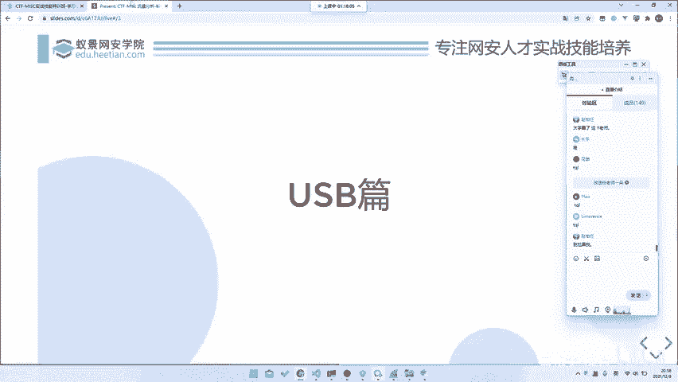

---
**附：资源与工具**
*   本节课涉及的题目Write-up、脚本工具等资料将整理后发布。
*   文中提到的部分工具可在GitHub等平台搜索`UsbPcapKeyExtract`等关键词找到。
*   深入学习建议参与CTF实战训练，在真实题目中巩固技能。