# CTF系列教程：P53：MISC流量分析实战题目 🚀

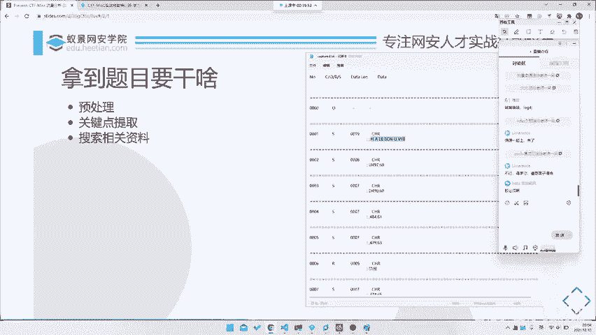

在本节课中，我们将学习如何系统性地分析一道全新的MISC流量分析题目。我们将通过一个具体案例，从拿到题目到最终解出Flag，完整地展示解题的通用步骤和核心思路。

---

## 概述：解题的通用三步法

面对一道陌生的流量分析题，盲目尝试往往效率低下。一个系统性的方法通常包含以下三个核心步骤：
1.  **预处理**：将原始数据转化为易于分析和处理的格式。
2.  **关键点提取**：从处理后的数据中识别出可能包含重要信息的字段或模式。
3.  **信息搜集**：利用提取出的关键信息进行搜索和研究，以理解数据背后的协议或含义。

接下来，我们将通过一道实战题目来详细讲解每一步的具体操作。

---

## 第一步：数据预处理 📁

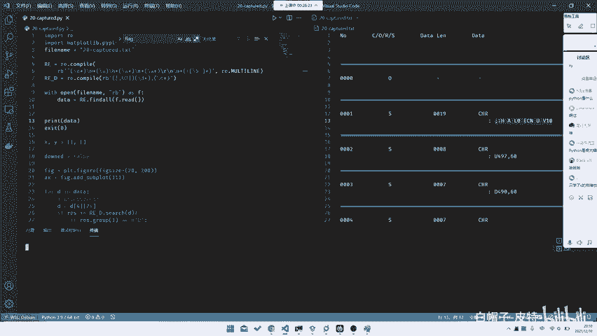

上一节我们概述了解题框架，本节中我们来看看如何对原始数据进行预处理。预处理的目的是将杂乱的原始数据转化为结构清晰、便于程序读取和处理的格式。

我们拿到的题目文件是一个包含大量行的文本文件，其内容片段如下：
```
0000 S 0019 data
: 48 45 4C 4C 4F 20 57 4F 52 4C 44
0001 S 0008 data
: 50 49 4E 47 0D 0A
```

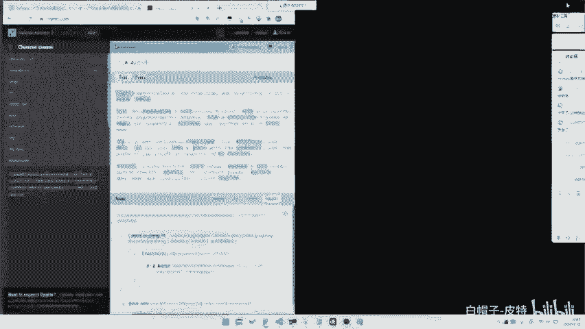

**观察规律**：
*   每段数据以四位数字编号（如 `0000`）开头。
*   跟随一个字母（如 `S`）。
*   然后是一个长度字段（如 `0019`）。
*   接着是 `data` 标识。
*   最后，在下一行以冒号开头，跟随一串十六进制数据。

**目标**：我们需要编写脚本，将这些有规律的数据提取出来，例如整理成每行包含 `编号`、`字母`、`长度`、`数据` 的格式。

以下是实现该提取功能的一个Python脚本示例，它使用正则表达式来匹配和捕获我们需要的字段：

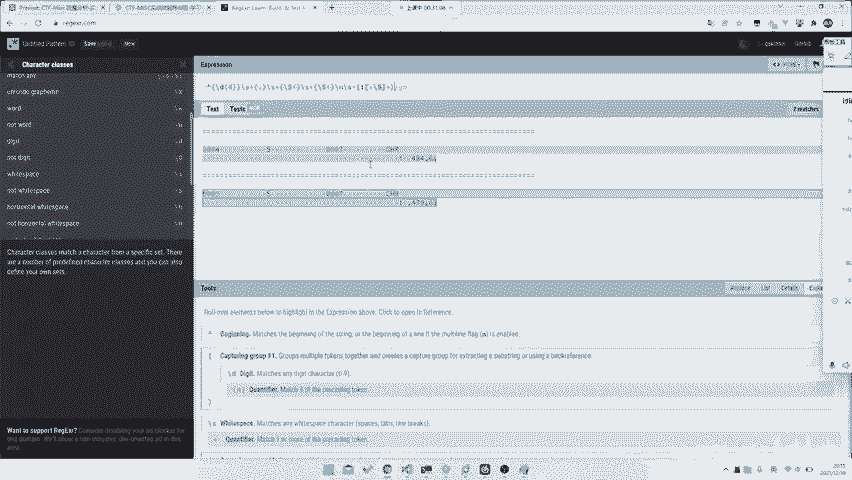

```python
import re

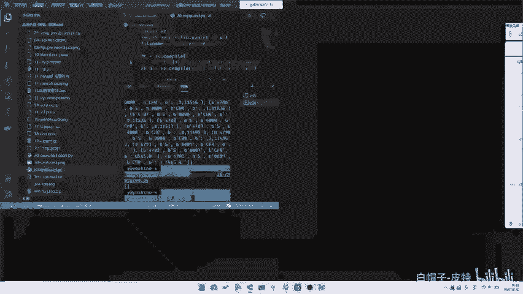

pattern = re.compile(r'^(\d{4})\s+(\w)\s+(\d+|\w+)\s+data\s*\r?\n:\s+((?:[\s\S]*?))$', re.MULTILINE)

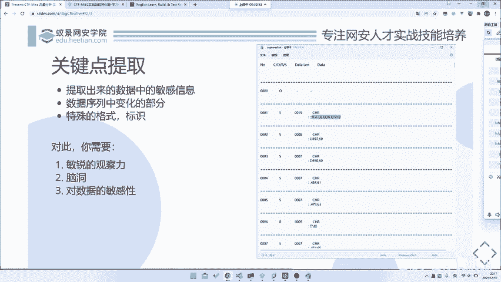

with open('题目文件.txt', 'r') as f:
    content = f.read()

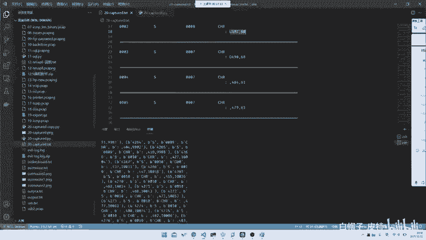

matches = pattern.findall(content)
for match in matches:
    number, letter, length, data = match
    # 这里可以打印或处理提取出的数据
    print(f"编号:{number}, 字母:{letter}, 长度:{length}, 数据:{data}")
```

**所需能力**：
*   **基础的编程能力**：能够使用Python等语言编写简单的数据处理脚本。
*   **正则表达式**：用于高效匹配和提取文本中的特定模式。推荐使用 [regex101.com](https://regex101.com) 等工具在线编写和测试正则表达式。
*   **归纳能力**：能够从数据样本中观察并总结出规律。

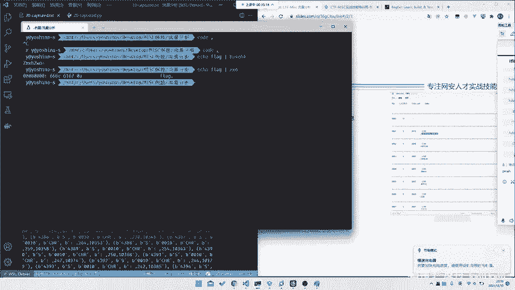

预处理完成后，我们就得到了一个结构化的数据集，为下一步分析打下了基础。

---

## 第二步：关键点提取 🔍

在将数据格式化之后，我们需要从中找出解题的关键线索。并非所有数据都同等重要，我们需要“划重点”。

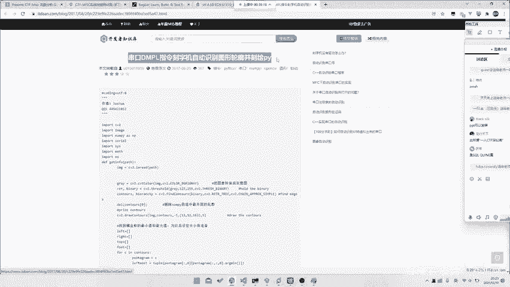

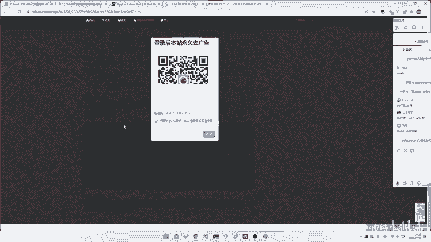

观察我们提取出的结构化数据，例如：
```
编号:0000, 字母:S, 长度:0019, 数据:48 45 4C 4C 4F 20 57 4F 52 4C 44
编号:0001, 字母:S, 长度:0008, 数据:50 49 4E 47 0D 0A
```

**分析变化点**：
1.  `编号` 是顺序递增的，属于序列标识，通常不是核心。
2.  `字母` 字段在样本中似乎都是 `S`，可能表示某种固定状态。
3.  `长度` 字段与后面 `数据` 字段的十六进制字节数相符，是描述性字段。
4.  `数据` 字段内容多变，且为具体的载荷信息，**极有可能是关键所在**。

**进一步观察数据内容**：查看 `数据` 字段，除了常见的十六进制数，开头有时会出现像 `UP,`、`DOWN,` 这样的英文单词。这些**特殊格式的字符串**很可能指示了某种操作指令，是重要的关键特征。

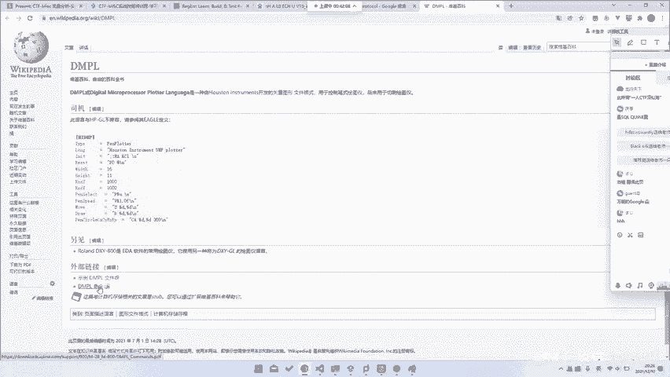

**所需能力**：
*   **敏锐的观察力**：能发现数据中哪些部分恒定，哪些部分变化，变化的模式是什么。
*   **一定的脑洞**：能够将数据特征与可能的现实协议或场景进行联想。
*   **数据敏感性**：对常见编码（如十六进制、Base64）、文件头、协议指令等保持熟悉。

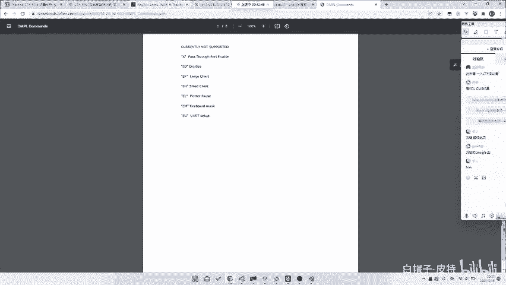

提取出`数据`字段以及其中的`UP`、`DOWN`等关键词后，我们就可以进入下一步，去探寻它们的含义。

---

## 第三步：信息搜集与研究 🌐

提取出关键字符串后，我们面临核心问题：这些数据代表什么？这时就需要借助信息搜集能力，尝试“站在前人的肩膀上”。

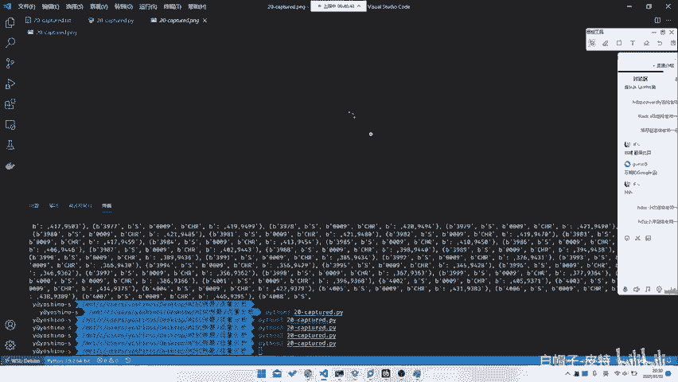

以下是进行信息搜集的步骤：

1.  **尝试搜索**：将提取出的特征字符串（如 `UP,`、`DOWN,` 或数据开头的特定命令）直接放入搜索引擎。
    *   使用中文搜索（如百度）可能结果有限。
    *   尝试使用英文关键词（如 `“UP,DOWN” protocol`）在Google等搜索引擎进行搜索。

2.  **分析搜索结果**：在本案例中，搜索 `UP, DOWN,` 等关键词可能会引导我们发现这与“数控绘图仪”、“刻字机”或“HPGL”等相关。进一步搜索更精确的协议名称，如 `DMPL protocol`，可以找到官方或详细的协议文档。

3.  **查阅文档**：找到协议文档（例如一份描述DMPL语言的PDF）是突破的关键。文档中会解释：
    *   `IN;` 表示初始化（Initialize）。
    *   `PU;` 表示提笔（Pen Up）。
    *   `PD;` 表示落笔（Pen Down）。
    *   `PA x,y;` 表示移动到坐标 (x, y)。


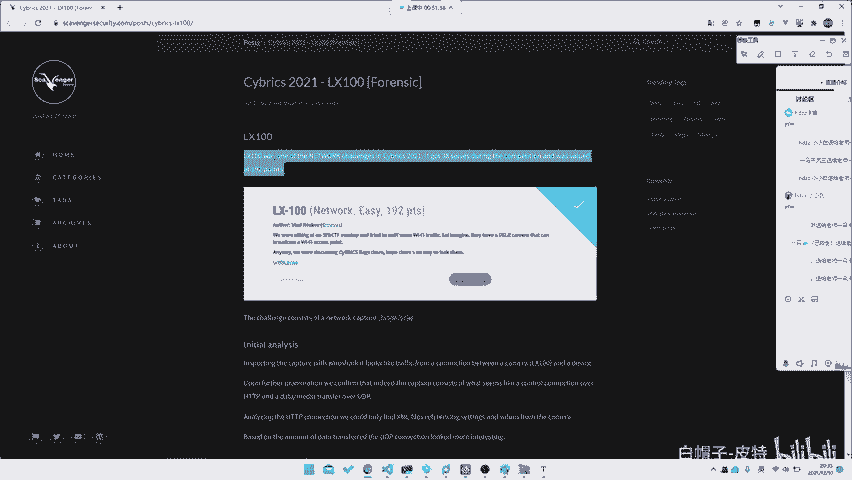

**所需能力**：
*   **搜索技巧**：掌握使用不同关键词、不同搜索引擎、以及站内搜索等方法。
*   **外语能力**：很多技术资料和协议标准是英文的，基础英语阅读能力很重要。
*   **资源积累**：收藏一些常用的技术文档站、论坛或搜索平台。
*   **学习能力**：快速阅读并理解一份新协议文档的核心指令。

通过信息搜集，我们不仅可能直接找到原题或类似题目的解法，更能从根本上理解数据流的含义，从而可以编写脚本还原出图形、文本等最终Flag。

---

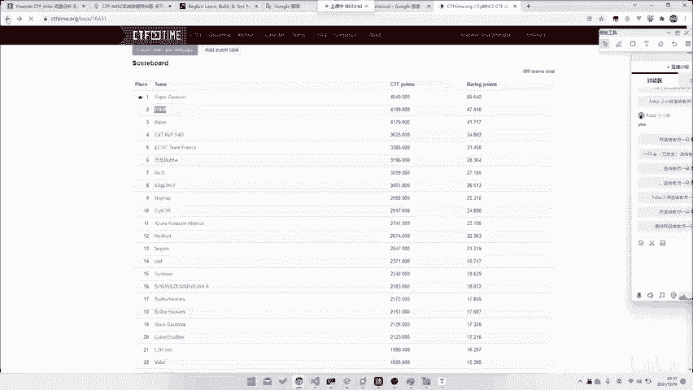

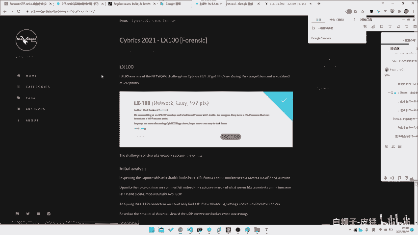

## 实战还原与总结 🏁

在理解了协议（例如DMPL）之后，解题的最后一步就是根据指令还原操作。核心思路是：模拟一个绘图过程。
*   维护当前坐标 `(x, y)` 和笔的状态 `（提笔/落笔）`。
*   解析每一条指令：
    *   遇到 `PU;`，将笔状态设为“提笔”。
    *   遇到 `PD;`，将笔状态设为“落笔”。
    *   遇到 `PA x,y;`，移动到新坐标。如果笔处于“落笔”状态，则在旧坐标和新坐标之间画一条线。
*   将所有画出的线段保存为图像，图像中往往就隐藏着Flag。

**更简单的情况**：有些题目非常直接，例如流量本身就是分割传输的JPEG图片碎片。这时甚至不需要理解复杂协议，只需要：
1.  从流量中提取出所有UDP负载。
2.  根据JPEG文件头 (`FF D8`) 和文件尾 (`FF D9`) 进行拼接。
3.  在拼接出的图片中直接找到Flag。

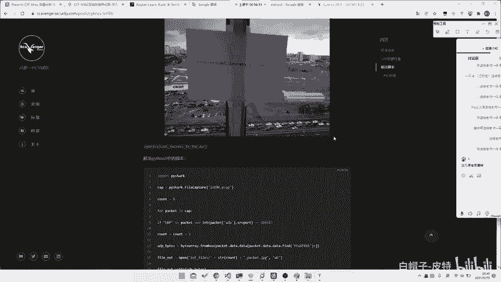

**MISC能力的核心**：
1.  **强大的学习与适应能力**：能快速掌握从未接触过的协议或数据格式。
2.  **发散的思维与联想能力（脑洞）**：能将数据特征与各种可能的场景联系。
3.  **高效的信息搜集能力**：善于利用网络资源寻找线索和文档。

---

## 课程总结

本节课中，我们一起学习并实践了MISC流量分析题目的通用解题流程：
1.  **预处理**：通过观察规律、编写脚本（如使用正则表达式），将原始杂乱数据转化为结构化格式。
2.  **关键点提取**：从结构化数据中识别出核心的变化字段和特殊格式字符串。
3.  **信息搜集与研究**：利用关键词进行搜索，查找协议文档，从根本上理解数据含义。
4.  **最终还原**：根据理解的含义编写还原脚本（如绘图脚本、文件拼接脚本），得到Flag。


记住，刷题的目的不仅是解出答案，更重要的是在每次练习中**总结和固化**有效的解题思路与搜索方法，逐步形成自己的方法论，这样才能在面对全新的挑战时游刃有余。