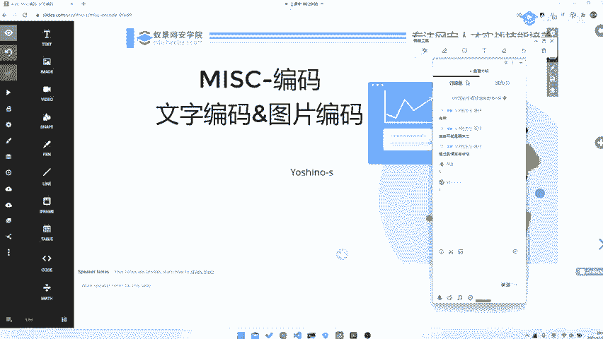
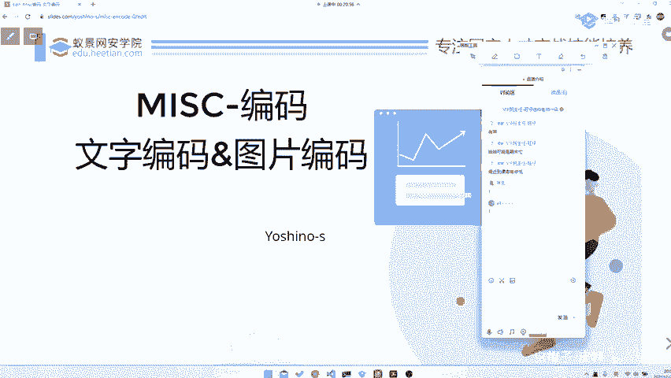

# CTF入门教程：P54：misc 文本编码（序言福利） 🎯

在本节课中，我们将要学习CTF杂项（misc）类别中一个非常基础且重要的部分——文本编码。我们将从原理出发，了解常见的文字与图片编码方式，并尝试从出题人的角度思考问题，帮助你建立更深入的理解。

## 课程简介与风格

上一节我们介绍了课程的整体安排，本节中我们来看看编码部分的具体内容。

今天开始，我们正式进入misc中编码的详细讲解部分。本节课主要讲解编码里比较基础的部分，即文字编码和图片编码。

我不知道你们之前是否上过我的课。我此前开过公开课，也在特训营上过两节课。可能有同学已经上过。对于没有上过的同学，我介绍一下我的上课习惯。

我上课可能会注重让大家了解编码或这类题型背后的原理。因为我目前比赛参与相对较少，出题较多。所以我会从出题人的思路讲解如何设计题目。这有助于你从源头剖析一道题是如何被出出来以及如何被解答的。

我认为，比起纯粹讲解工具使用或套路性的东西，这种方式能带来更多思考。当然，套路性的知识也有必要讲解，因为没有它们你无法解题。但比起纯讲套路，分享我做题后的思考与总结更为重要。这部分思考是关键。

大家如果有反馈，可以直接在聊天区发送，我都能看到。现在我们直接开始。

## 互动小游戏

在进入正题前，我们先玩一个小游戏，测试一下大家的基础编码能力。

这是一个我的电话号码，你们可以尝试破解它。如果能破解出来，给大家5分钟时间。我手机放在边上，等待大家发短信或打电话。第一个发短信的同学可以加我微信，获得10元红包。

手机放边上了，等待来电。大家可以先尝试一下，解不出来也没关系。如果你能直接解出来，我相信你具备了一定的基础编码能力。

各位同学要学会看懂手写字符。说不定哪天你会看到一页纸密密麻麻写了256位哈希值需要你手动抄录，这也是一种能力。

好了，我们收到了第一条短信。请这位同学将你的微信号再发给我，稍后我给你发10元红包。游戏结束，恭喜这位同学。这位同学水平应该挺高，可能已经了解了很多内容。现在我们开始正式讲解。

## 本节总结

本节课中，我们一起学习了课程的开篇，明确了misc编码部分的学习方向，并通过一个小游戏预热，测试了基础能力。我们强调了从原理和出题人角度理解题目的重要性，这将是后续学习的核心思路。