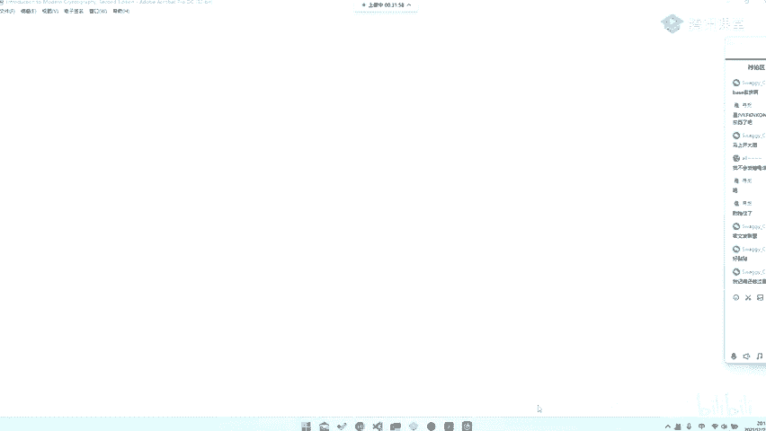
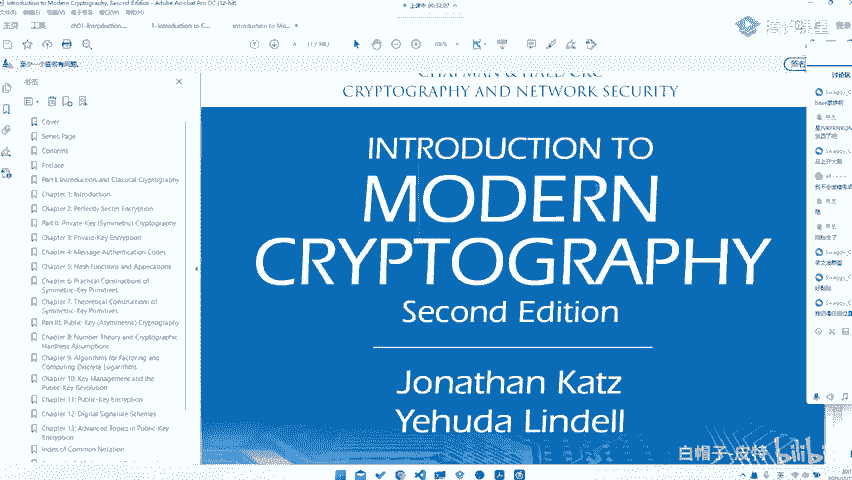
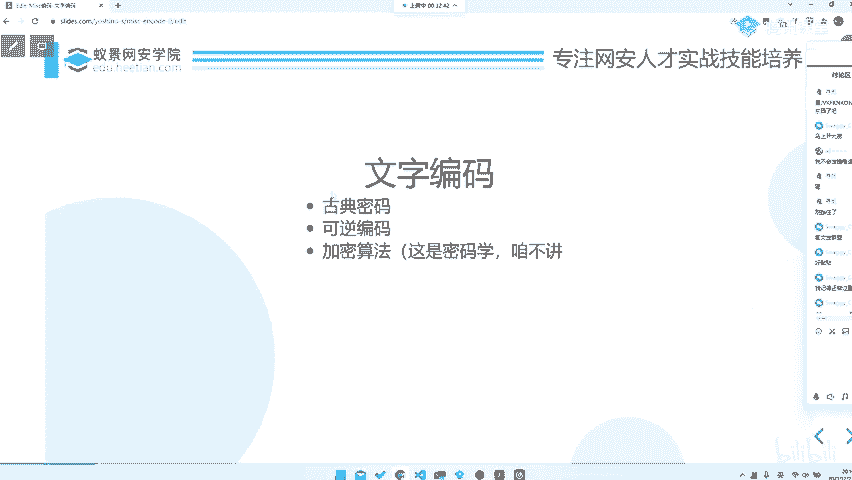

# CTF入门教程：P55：misc文字编码类型

在本节课中，我们将要学习CTF杂项（Misc）题目中一个非常基础且重要的概念：文字编码。我们将了解什么是编码，它在CTF中如何体现，以及如何分析和解决这类问题。

## 什么是文本编码？

上一节我们介绍了CTF-Misc题目的基本概念，本节中我们来看看什么是文本编码。

编码的定义很规范，但对我们而言，文本编码通俗来讲，就是将一种文本转换为另一种文本，或者将一种信息格式通过文本的形式表达出来。

例如，下图展示了一种编码形式（虽然你可能看不懂具体内容）。它可能涉及安全多方计算中的混淆电路或不经意传输协议，其本质是将信息进行编码、发送和计算，最终得到多方计算的结果。这就是编码的一种体现。

在CTF-Misc中，我们所说的文本编码，主要关注以下三个部分。

## CTF-Misc中的文本编码

我相信大家之前看过或听过很多入门介绍。我在这里讲解这些内容，是为了给大家一个根本性的概念，理解什么是最基本、最本源的东西。这有助于大家更好地理解题目。

其最基本的东西就是**文字**。我们可以在文字上做各种手脚：
*   例如进行替换。
*   例如更换一种编码形式。
*   例如考虑文字在电脑中的储存形式——**二进制**。

例如，英文字母对应**ASCII码**，中文字母对应**UTF-8**（也可能有GBK、GB2312等）。但归根结底，它们都是二进制数据。只不过是在二进制层面进行信息上的编码与解码，然后最终表达输出。

我们最需要关心的部分，正是在**二进制层面**或**信息层面**的编码与解码。文字的表现形式只是其外在的体现。因此，我们需要剖析其表面，看到文字背后的本质。这就像“看山是山，看水是水；看山不是山，看水不是水；看山还是山，看水还是水”的境界，看到文字背后的东西，才算真正炉火纯青。

## 文字编码的主要分类

文字编码主要分为以下几类：

以下是文字编码的常见类型：

1.  **古典密码**：通常指密码学中那些纯粹的古典密码。
2.  **可逆的编码**：例如Base64、URL编码等。
3.  **加密算法**：例如AES、RSA等现代加密算法。

如果你想深入学习加密算法，可以参阅《Introduction to Modern Cryptography》等密码学教材。但在CTF-Misc的文字编码题目中，我们主要关注前两部分，即**古典密码**和**可逆编码**。当然，编码里可能还有其他类型。

图片编码也与此类似，包含古典密码的常见套路，以及基于古典密码开发的新方法。

## 总结

本节课中，我们一起学习了CTF-Misc中的文字编码类型。我们理解了编码的本质是信息的转换与表达，在CTF中需要关注文字背后的二进制与信息层面。我们还将文字编码主要分为古典密码、可逆编码和现代加密算法三类，并指出在解题时需重点关注前两类。掌握这些基础知识，是解决更复杂编码题目的第一步。